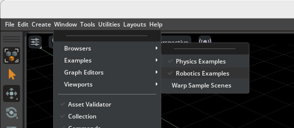

# Hello World

## Learning Objectives

After completing this tutorial, you will have learned:

- How to create a World and Scene defined by the Core API
- How to add a rigid body to the Stage and simulate it using Python in NVIDIA Isaac Sim
- The differences between Extension Workflow and Standalone Workflow

## Getting Started

### Prerequisites

- This tutorial requires intermediate-level knowledge of Python and asynchronous programming.
- Before starting, download and install [Visual Studio Code](https://code.visualstudio.com/download).
- Before starting, review the [Quick Tutorials](https://docs.isaacsim.omniverse.nvidia.com/5.1.0/introduction/quickstart_index.html#isaac-sim-intro-quickstart-series).

### Workflow

Isaac Sim can be used as a building block in larger solutions or on its own. Because of this, there are multiple ways to achieve the same goal. These different approaches are called "Workflows."

??? info "Details on the 3 Workflows (click to expand)"

    | Workflow | Key Features | Recommended Use |
    |---|---|---|
    | **GUI** | Visual, intuitive tools | World building, robot assembly, sensor attachment, visual programming with OmniGraphs |
    | **Extension** | Async execution, hot-reload, adaptive physics stepping | Testing Python snippets, interactive GUI development, real-time responsive applications |
    | **Standalone** | Full timing control of physics/rendering, headless execution | Large-scale RL training, systematic world generation |

    - **GUI Workflow**: Build simulation environments using only the GUI, without writing code.
    - **Extension Workflow**: Run Python scripts as extensions inside Isaac Sim. Hot-reload (instant reflection on save) enables high development efficiency.
    - **Standalone Workflow**: Launch Isaac Sim directly from a Python script. Provides full control over physics and rendering timing.

The following tutorials primarily use the **Extension Workflow**, but objects and settings created through the Extension Workflow can also be configured via the GUI, and scripts can be rewritten for the Standalone Workflow.

### Opening the Hello World Sample

First, open the Hello World sample.

1. Activate **Windows > Examples > Robotics Examples** to open the Robotics Examples tab.<br>
   

2. Click **Robotics Examples > General > Hello World**.<br>
   

3. Verify that the Hello World sample extension window appears in the workspace.<br>
   

4. Click the **Open Source Code** button to launch the editable source code in Visual Studio Code.<br>
   

5. Click the **Open Folder** button to open the directory containing the sample files.<br>
   

This folder contains the following 3 files:

- `hello_world.py` — Application logic
- `hello_world_extension.py` — Application UI elements
- `__init__.py`

### Testing the Sample

Let's try loading the Hello World sample.

1. Click the **LOAD** button to load the world.<br>
   

2. To clear the loaded world and return to the initial state, click **File > New From Stage Template > Empty** to create a new stage, then click **Don't Save** at the save confirmation.<br>
   
   

3. Click the **LOAD** button to reload the world.

4. Click the **Open Source Code** button, open `hello_world.py`, and press **Ctrl+S** to hot-reload. The Hello World window will disappear from the workspace (because the extension restarted).<br>
   

5. Reopen the Robotics Examples menu and click the **LOAD** button.

Now let's extend the Hello World sample step by step.

## Code Overview

From here, we will incrementally extend the code in `hello_world.py`. First, let's understand the basic structure of the sample.

This example inherits from `BaseSample`. `BaseSample` is a boilerplate class that handles the basic setup of robotics extension applications, providing the following features:

1. Load the world with corresponding assets via button clicks
2. Clear the world when a new stage is created
3. Reset objects in the world to their default states
4. Handle hot-reload

**World** is the core class for interacting with the simulator in a modular way. It manages callbacks, physics stepping, scene resets, and more.

**Scene** is an instance held within World that manages simulation assets in the USD Stage. It provides a simplified API for adding, manipulating, inspecting, and resetting assets.

```python linenums="1" hl_lines="1 12-14"
from isaacsim.examples.interactive.base_sample import BaseSample # Robotics extension app boilerplate

class HelloWorld(BaseSample):
    def __init__(self) -> None:
        super().__init__()
        return

    # Called to set up assets in the scene for the first time
    # Not called after hot-reload; only when loading the world from an EMPTY stage
    def setup_scene(self):
        # World is defined in BaseSample and accessible everywhere EXCEPT __init__
        world = self.get_world()
        world.scene.add_default_ground_plane() # Add a default ground plane to the scene
        return
```

## Singleton World

World is a singleton. This means only one World can exist while NVIDIA Isaac Sim is running. The following code shows how to retrieve the current World instance across different files and extensions.

```python linenums="1" hl_lines="2 9"
from isaacsim.examples.interactive.base_sample import BaseSample
from isaacsim.core.api import World # Import the World class directly

class HelloWorld(BaseSample):
    def __init__(self) -> None:
        super().__init__()
        return

    def setup_scene(self):
        world = World.instance() # Get the singleton instance
        world.scene.add_default_ground_plane()
        return
```

## Adding to the Scene

Use the Python API to add a cube as a rigid body to the scene.

```python linenums="1" hl_lines="3 13-20"
from isaacsim.examples.interactive.base_sample import BaseSample
import numpy as np
from isaacsim.core.api.objects import DynamicCuboid # Class for creating dynamic cubes

class HelloWorld(BaseSample):
    def __init__(self) -> None:
        super().__init__()
        return

    def setup_scene(self):
        world = self.get_world()
        world.scene.add_default_ground_plane()
        fancy_cube = world.scene.add(
            DynamicCuboid(
                prim_path="/World/random_cube", # Path in the USD Stage
                name="fancy_cube",              # Unique name to retrieve the object later
                position=np.array([0, 0, 1.0]), # Position (default unit: meters)
                scale=np.array([0.5015, 0.5015, 0.5015]), # Scale (numpy array)
                color=np.array([0, 0, 1.0]),    # RGB (range 0-1)
            ))
        return
```

Save the code and verify the simulation:

1. Press **Ctrl+S** to save the code and hot-reload Isaac Sim.
2. Reopen the Hello World sample extension window.
3. Click **File > New From Stage Template > Empty** to create a new world, then click **LOAD**. This is required whenever changes are made to `setup_scene`.
4. Press the **PLAY** button to start the dynamic cube simulation and observe it falling.


!!! note "Note"
    Every time you edit code, press **Ctrl+S** to save and hot-reload Isaac Sim.

## Inspecting Object Properties

Next, let's print the cube's world coordinates and velocity.

Here we introduce a new method, `setup_post_load`. The differences from `setup_scene` are:

| Method | When Called | Purpose |
|---|---|---|
| `setup_scene` | Only on first load from an empty stage | Place assets |
| `setup_post_load` | Every time the **LOAD** button is pressed | Initialization after physics handles become active |

`setup_post_load` is called after one physics simulation step, so it can retrieve physical properties such as position and velocity.

```python linenums="1" hl_lines="23-33"
from isaacsim.examples.interactive.base_sample import BaseSample
import numpy as np
from isaacsim.core.api.objects import DynamicCuboid

class HelloWorld(BaseSample):
    def __init__(self) -> None:
        super().__init__()
        return

    def setup_scene(self):
        world = self.get_world()
        world.scene.add_default_ground_plane()
        fancy_cube = world.scene.add(
            DynamicCuboid(
                prim_path="/World/random_cube",
                name="fancy_cube",
                position=np.array([0, 0, 1.0]),
                scale=np.array([0.5015, 0.5015, 0.5015]),
                color=np.array([0, 0, 1.0]),
            ))
        return

    # Called every time after the LOAD button is pressed (after setup_scene + 1 physics step)
    # Physics handles are active, so physical properties can be retrieved
    async def setup_post_load(self):
        self._world = self.get_world()
        self._cube = self._world.scene.get_object("fancy_cube") # Retrieve object by name
        position, orientation = self._cube.get_world_pose()
        linear_velocity = self._cube.get_linear_velocity()
        # Printed to the terminal
        print("Cube position is : " + str(position))
        print("Cube's orientation is : " + str(orientation))
        print("Cube's linear velocity is : " + str(linear_velocity))
        return
```

## Continuous Inspection of Object Properties During Simulation

Print the cube's pose and velocity on every physics step during simulation.

As mentioned in the [Workflow](#workflow) section, in the **Extension Workflow**, the application runs asynchronously and you cannot directly control physics step timing. However, you can register **physics callbacks** to execute custom logic before each physics step.

```python linenums="1" hl_lines="26 29-37"
from isaacsim.examples.interactive.base_sample import BaseSample
import numpy as np
from isaacsim.core.api.objects import DynamicCuboid

class HelloWorld(BaseSample):
    def __init__(self) -> None:
        super().__init__()
        return

    def setup_scene(self):
        world = self.get_world()
        world.scene.add_default_ground_plane()
        fancy_cube = world.scene.add(
            DynamicCuboid(
                prim_path="/World/random_cube",
                name="fancy_cube",
                position=np.array([0, 0, 1.0]),
                scale=np.array([0.5015, 0.5015, 0.5015]),
                color=np.array([0, 0, 1.0]),
            ))
        return

    async def setup_post_load(self):
        self._world = self.get_world()
        self._cube = self._world.scene.get_object("fancy_cube")
        self._world.add_physics_callback("sim_step", callback_fn=self.print_cube_info) # Callback names must be unique
        return

    # Physics callback called before each physics step
    # The step_size argument is required (time width of physics step)
    def print_cube_info(self, step_size):
        position, orientation = self._cube.get_world_pose()
        linear_velocity = self._cube.get_linear_velocity()
        # Printed to the terminal
        print("Cube position is : " + str(position))
        print("Cube's orientation is : " + str(orientation))
        print("Cube's linear velocity is : " + str(linear_velocity))
```

## Resetting the World

To return objects to their initial state during simulation, use the **RESET** button. Processing needed after a reset can be handled via the `setup_pre_reset` and `setup_post_reset` callbacks.

!!! tip "Tip"
    Calling `world.reset()` returns all objects to the initial state set in `setup_scene`. In the Standalone Workflow, calling `world.reset()` after adding assets properly initializes physics handles.

## Converting to a Standalone Application

!!! note "Note"
    On Windows, use `python.bat` instead of `python.sh`.

As mentioned in the [Workflow](#workflow) section, the **Standalone Workflow** launches Isaac Sim directly from Python, giving you full control over physics and rendering timing.

Create a new `my_application.py` file with the following code:

```python linenums="1" hl_lines="1-4 20-22 30-32 34"
# Launch Isaac Sim before any other imports (required for Standalone)
# The first two lines of any Standalone application must follow this pattern
from isaacsim import SimulationApp
simulation_app = SimulationApp({"headless": False}) # Can also run with headless=True (no GUI)

from isaacsim.core.api import World
from isaacsim.core.api.objects import DynamicCuboid
import numpy as np

world = World()
world.scene.add_default_ground_plane()
fancy_cube = world.scene.add(
    DynamicCuboid(
        prim_path="/World/random_cube",
        name="fancy_cube",
        position=np.array([0, 0, 1.0]),
        scale=np.array([0.5015, 0.5015, 0.5015]),
        color=np.array([0, 0, 1.0]),
    ))
# Call reset after adding assets to properly initialize physics handles
# Must be called before querying articulation properties
world.reset()
for i in range(500):
    position, orientation = fancy_cube.get_world_pose()
    linear_velocity = fancy_cube.get_linear_velocity()
    # Printed to the terminal
    print("Cube position is : " + str(position))
    print("Cube's orientation is : " + str(orientation))
    print("Cube's linear velocity is : " + str(linear_velocity))
    # In Standalone, you control when physics and rendering happen
    # Unlike Extension, everything runs synchronously
    world.step(render=True) # Execute 1 physics step + 1 rendering step

simulation_app.close() # Close Isaac Sim
```

Run the script with the following command:

```bash
./python.sh ./exts/isaacsim.examples.interactive/isaacsim/examples/interactive/user_examples/my_application.py
```

## Summary

This tutorial covered the following topics:

1. Overview of the **World** and **Scene** classes
2. Adding content to the Scene with Python
3. Initialization with `setup_post_load` and retrieving physical properties
4. Adding physics callbacks
5. Converting to a Standalone application

## Next Steps

Proceed to the next tutorial, "Hello Robot," to learn how to add a robot to the simulation.

!!! note "Note"
    The following tutorials primarily use the Extension Workflow for development. However, based on what you learned in this tutorial, converting to other Workflows follows the same approach.
