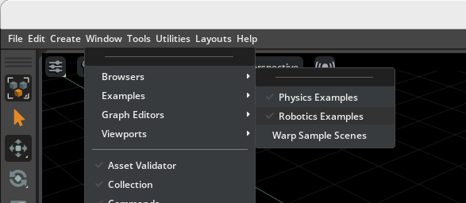
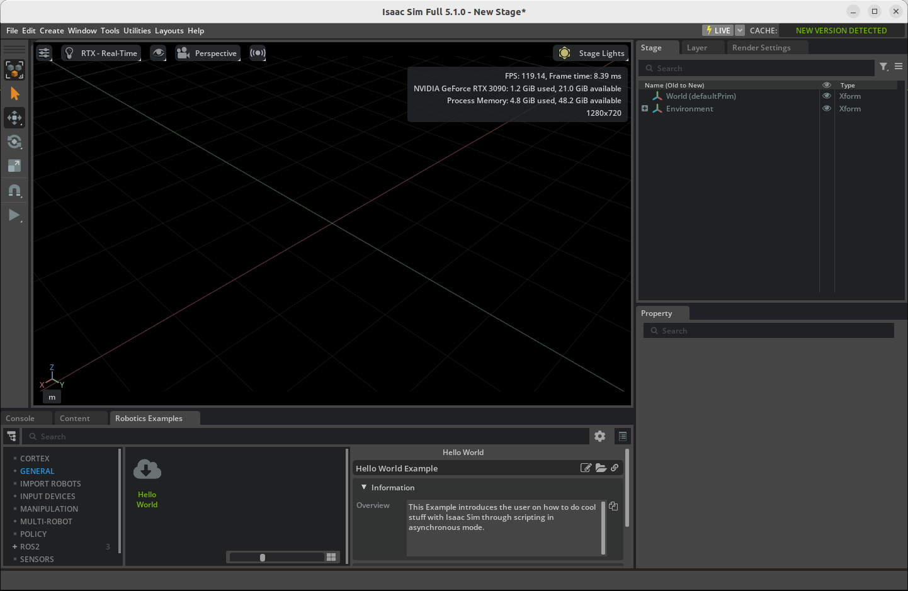
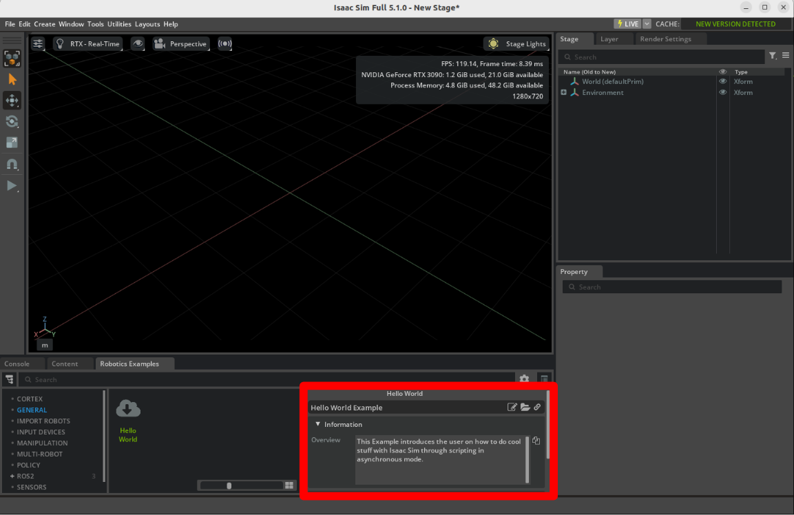
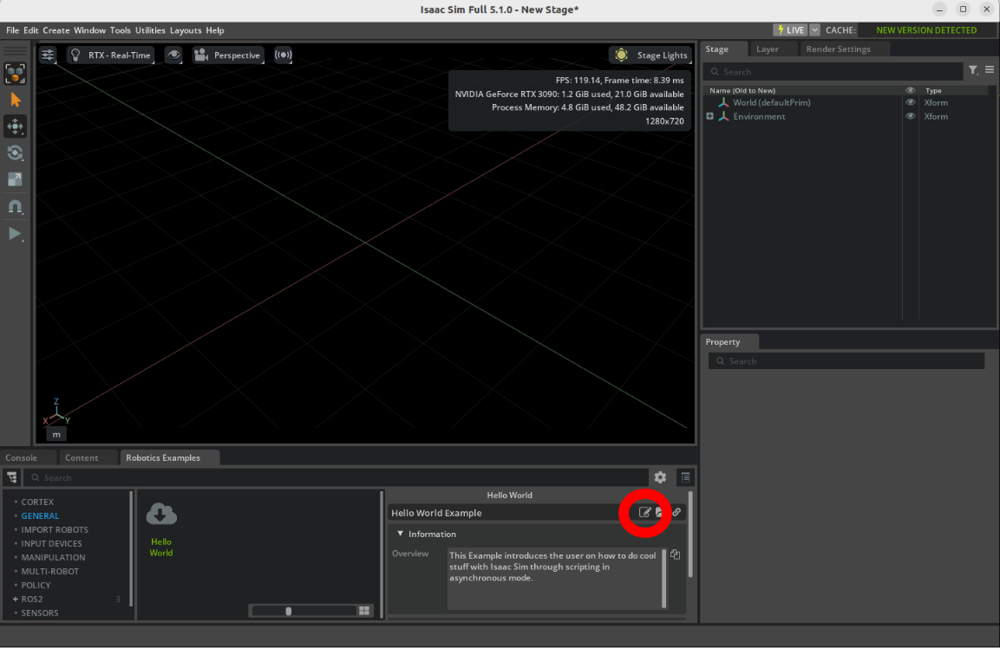
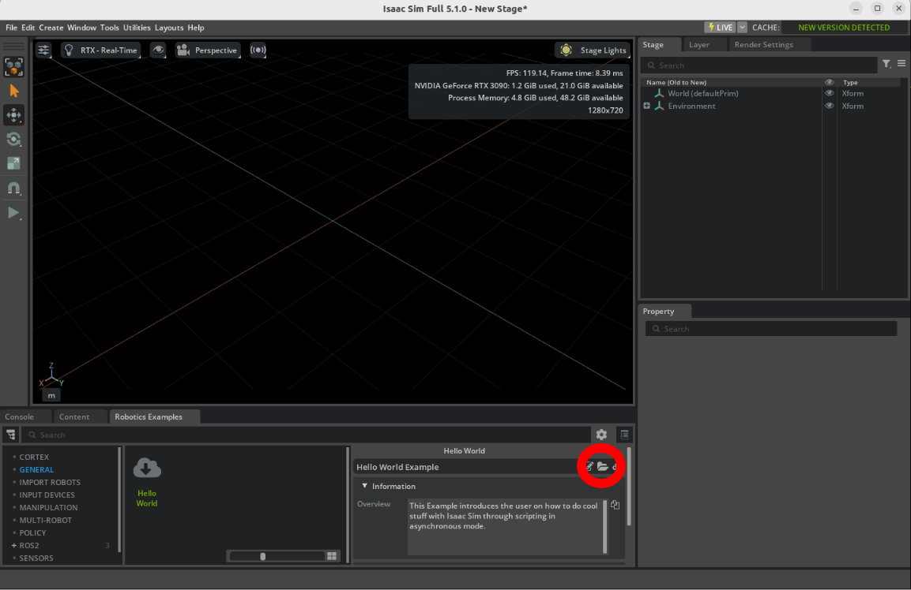
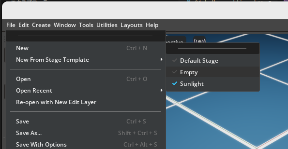
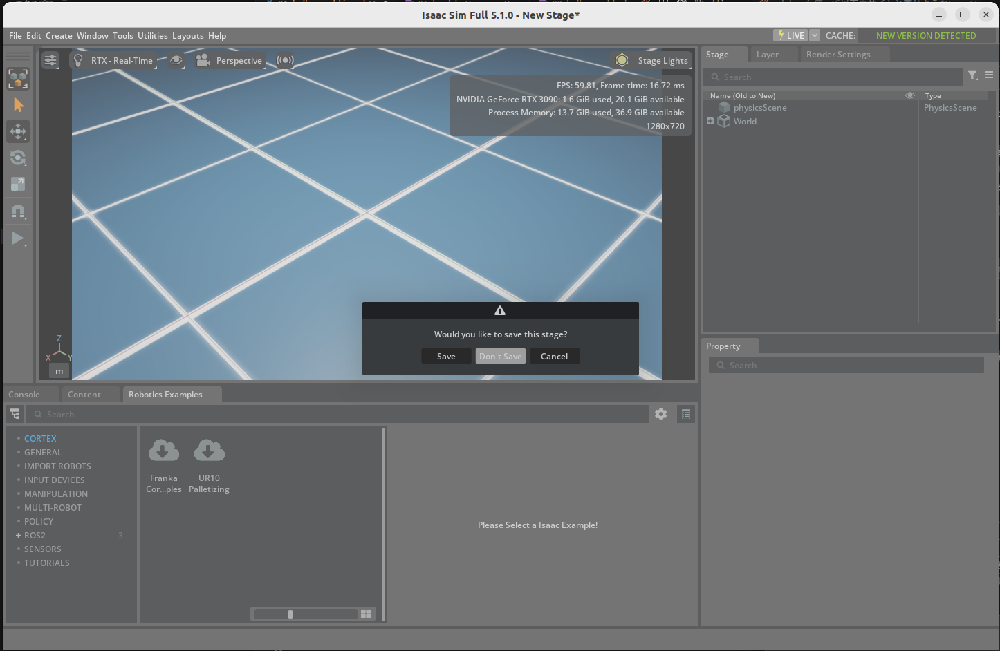
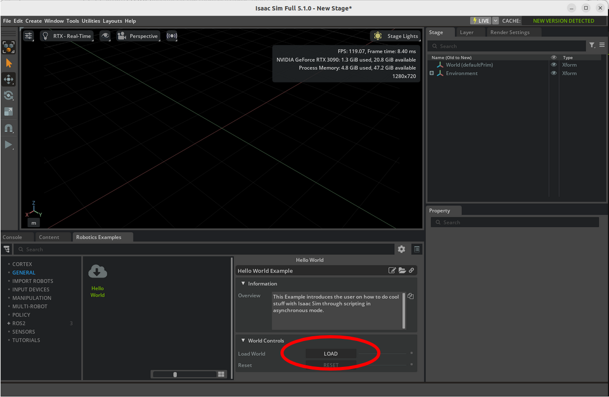

# Hello World

## Learning Objectives

After completing this tutorial, you will have learned:

- How to use the Core API (experimental) to manipulate the USD stage
- How to add a rigid body to the Stage and simulate it using Python in NVIDIA Isaac Sim
- The differences between Extension Workflow and Standalone Workflow

!!! note "USD Basics: Stage and Prim"
    Scenes in Isaac Sim are managed in the **USD (Universal Scene Description)** format. Let's start by learning the following two terms, which appear frequently throughout the tutorials.

    - **Stage** … The container that represents the entire scene. The tree shown in the editor's Stage panel is the content of the current stage.
    - **Prim** … An individual object placed on the stage (a node in the tree). Robots, cubes, lights, cameras, and so on are all prims, each uniquely identified by a **path** such as `/World/fancy_cube`.

## Getting Started

### Prerequisites

- This tutorial requires intermediate-level knowledge of Python and asynchronous programming.
- Before starting, download and install [Visual Studio Code](https://code.visualstudio.com/download).
- Before starting, review the [Quick Tutorials](https://docs.isaacsim.omniverse.nvidia.com/latest/introduction/quickstart_index.html#isaac-sim-intro-quickstart-series).

!!! note "The Core API overhaul in Isaac Sim 6.0"
    In Isaac Sim 6.0, the legacy `isaacsim.core.api` (the World / Scene based API) is **deprecated**, and the Core API tutorials have been rewritten to use `isaacsim.core.experimental.*` and `isaacsim.core.simulation_manager`. This page follows the rewritten content.

### Workflow

Isaac Sim is a building block of larger solutions, but it can also be used on its own. Because of this, there are multiple ways to achieve the same goal. These different approaches are called "Workflows".

??? info "Details of the three Workflows (click to expand)"

    | Workflow | Key characteristics | Recommended use |
    |---|---|---|
    | **GUI** | Visual, intuitive tools | World building, robot assembly, sensor mounting, visual programming with OmniGraphs |
    | **Extension** | Asynchronous execution, hot reloading, adaptive physics stepping | Testing Python snippets, building interactive GUIs, applications requiring real-time responsiveness |
    | **Standalone** | Control over physics/rendering timing, headless execution | Large-scale reinforcement learning training, systematic world generation |

    - **GUI Workflow**: Build simulation environments using only GUI operations, without writing code.
    - **Extension Workflow**: Run Python scripts as extensions inside Isaac Sim. Hot reloading (changes applied on save) makes development efficient.
    - **Standalone Workflow**: Launch Isaac Sim directly from a Python script. You have full control over the timing of physics and rendering.

The following tutorials mainly use the **Extension Workflow**, but the objects and settings created in the Extension Workflow can also be created via the GUI, and scripts can be rewritten for the Standalone Workflow.

### Opening the Hello World Example

First, open the Hello World example.

1. Activate **Windows > Examples > Robotics Examples** to open the Robotics Examples tab.<br>
   

2. Click **Robotics Examples > General > Hello World**.<br>
   

3. Verify that the window for the Hello World example extension is visible in the workspace.<br>
   

4. Click the **Open Source Code** button to launch the source code for editing in Visual Studio Code.<br>
   

5. Click the **Open Folder** button to open the directory containing the example files.<br>
   

This folder contains the following three files:

- `hello_world.py` — the logic of the application
- `hello_world_extension.py` — the UI elements of the application
- `__init__.py`

### Verifying the Example Works

Let's try loading the Hello World example.

1. Click **File > New From Stage Template > Empty** to create a new stage, and click **Don't Save** when prompted to save the current stage.<br>
   
   

2. Click the **LOAD** button to load the World.<br>
   

3. Click the **Open Source Code** button, open `hello_world.py`, and press **Ctrl+S** to hot-reload. The Hello World window disappears from the workspace (because the extension was restarted).<br>
   

4. Open the Robotics Examples menu again and click the **LOAD** button.

Now you can begin adding to this Hello World example.

## Code Overview

From here, we extend the code in `hello_world.py` step by step. First, let's review the basic structure of the example.

This example inherits from `BaseSample`, a boilerplate class that sets up the basics of a robotics extension application. It provides the following functionality:

1. Loading assets into the stage using a button
2. Clearing the stage when a new stage is created
3. Resetting objects to their default states
4. Handling hot reloading

First, import the required packages:

```python linenums="1"
import isaacsim.core.experimental.utils.stage as stage_utils
from isaacsim.examples.base.base_sample_experimental import BaseSample
from isaacsim.storage.native import get_assets_root_path
```

In `setup_scene`, use `stage_utils.add_reference_to_stage()` to add the ground plane asset directly to the stage:

```python linenums="1"
    # This function is called to setup the assets in the scene for the first time
    def setup_scene(self):
        # Add ground plane directly to the stage
        ground_plane = stage_utils.add_reference_to_stage(
            usd_path=get_assets_root_path() + "/Isaac/Environments/Grid/default_environment.usd",
            path="/World/ground",
        )
```

The complete code is as follows:

```python linenums="1" hl_lines="2-4 14-20"
# -- Import Isaac sim packages -- #
import isaacsim.core.experimental.utils.stage as stage_utils
from isaacsim.examples.base.base_sample_experimental import BaseSample
from isaacsim.storage.native import get_assets_root_path

# -- End of import Isaac sim packages -- #


class HelloWorld(BaseSample):
    def __init__(self) -> None:
        super().__init__()

    # -- Set up scene -- #
    # This function is called to setup the assets in the scene for the first time
    def setup_scene(self):
        # Add ground plane directly to the stage
        ground_plane = stage_utils.add_reference_to_stage(
            usd_path=get_assets_root_path() + "/Isaac/Environments/Grid/default_environment.usd",
            path="/World/ground",
        )

    # -- End of set up scene -- #
```

## Key Concepts

There are three key concepts to understand when working with the Core API (experimental):

| Concept | Description |
|---|---|
| **Stage Utilities** | The `stage_utils` module provides functions for directly manipulating the USD stage, such as adding references, creating prims, and managing stage hierarchy |
| **Prim Classes** | Prim wrapper classes like `RigidPrim`, `GeomPrim`, and `Articulation` give you direct control over USD prims with physics capabilities |
| **SimulationManager** | For callbacks and simulation events, the `SimulationManager` class provides methods to register and deregister callbacks for various simulation events |

## Adding to the Scene

Use the Python API to add a cube as a rigid body to the scene. With the Core APIs, you **create the geometry first, then apply collision and rigid body properties**.

Import the required packages:

```python linenums="1"
import isaacsim.core.experimental.utils.stage as stage_utils
import numpy as np
from isaacsim.core.experimental.materials import PreviewSurfaceMaterial
from isaacsim.core.experimental.objects import Cube
from isaacsim.core.experimental.prims import GeomPrim, RigidPrim
from isaacsim.examples.base.base_sample_experimental import BaseSample
from isaacsim.storage.native import get_assets_root_path
```

The code for adding a cube is as follows:

```python linenums="1"
        # Create a blue visual material for the cube
        visual_material = PreviewSurfaceMaterial("/World/Materials/blue")
        visual_material.set_input_values("diffuseColor", [0.0, 0.0, 1.0])

        # Create the cube geometry
        self._cube_shape = Cube(
            paths="/World/fancy_cube",
            positions=np.array([[0.0, 0.0, 1.0]]),  # Starting position 1m above ground
            sizes=[1.0],
            scales=np.array([[0.5015, 0.5015, 0.5015]]),  # Scale the cube
            reset_xform_op_properties=True,
        )

        # Apply collision APIs to enable physics collision
        GeomPrim(paths=self._cube_shape.paths, apply_collision_apis=True)

        # Make it a rigid body (dynamic object that responds to physics)
        self._cube = RigidPrim(paths=self._cube_shape.paths)

        # Apply the blue material
        self._cube_shape.apply_visual_materials(visual_material)
```

The complete code is as follows:

```python linenums="1" hl_lines="2-8 24-45"
# -- Import Isaac sim packages -- #
import isaacsim.core.experimental.utils.stage as stage_utils
import numpy as np
from isaacsim.core.experimental.materials import PreviewSurfaceMaterial
from isaacsim.core.experimental.objects import Cube
from isaacsim.core.experimental.prims import GeomPrim, RigidPrim
from isaacsim.examples.base.base_sample_experimental import BaseSample
from isaacsim.storage.native import get_assets_root_path

# -- End of import Isaac sim packages -- #


class HelloWorld(BaseSample):
    def __init__(self) -> None:
        super().__init__()

    def setup_scene(self):
        # Add ground plane
        ground_plane = stage_utils.add_reference_to_stage(
            usd_path=get_assets_root_path() + "/Isaac/Environments/Grid/default_environment.usd",
            path="/World/ground",
        )

        # -- Creating a cube and apply materials -- #
        # Create a blue visual material for the cube
        visual_material = PreviewSurfaceMaterial("/World/Materials/blue")
        visual_material.set_input_values("diffuseColor", [0.0, 0.0, 1.0])

        # Create the cube geometry
        self._cube_shape = Cube(
            paths="/World/fancy_cube",
            positions=np.array([[0.0, 0.0, 1.0]]),  # Starting position 1m above ground
            sizes=[1.0],
            scales=np.array([[0.5015, 0.5015, 0.5015]]),  # Scale the cube
            reset_xform_op_properties=True,
        )

        # Apply collision APIs to enable physics collision
        GeomPrim(paths=self._cube_shape.paths, apply_collision_apis=True)

        # Make it a rigid body (dynamic object that responds to physics)
        self._cube = RigidPrim(paths=self._cube_shape.paths)

        # Apply the blue material
        self._cube_shape.apply_visual_materials(visual_material)
        # -- End of creating a cube and apply materials -- #
```

Save the code and check the simulation:

1. Press **Ctrl+S** to save the code and hot-reload Isaac Sim.
2. Open the Hello World example extension window again.
3. Click the **LOAD** button.
4. See the dynamic cube falling as the simulation starts automatically.


!!! note "Note"
    Every time you edit the code, press **Ctrl+S** to save and hot-reload Isaac Sim.

### Understanding the Prim Classes

The experimental API uses a layered approach to create physics-enabled objects:

| Class | Role |
|---|---|
| `Cube` (or other shape classes) | Creates the visual geometry on the USD stage |
| `GeomPrim` | Wraps the geometry and can apply collision APIs for physics interactions |
| `RigidPrim` | Adds rigid body dynamics, making the object respond to gravity and forces |

This modular approach gives you fine-grained control — you can create static colliders (`GeomPrim` without `RigidPrim`) or fully dynamic objects (with both).

## Inspecting Object Properties

Next, let's print the world pose and velocity of the cube.

Here a new method, `setup_post_load`, appears. The differences from `setup_scene` are:

| Method | When it is called | Purpose |
|---|---|---|
| `setup_scene` | Only on first load from an empty stage | Placing assets |
| `setup_post_load` | Every time after pressing the **LOAD** button | Initialization after physics handles become valid |

`setup_post_load` is called after both `setup_scene` and one physics time step have finished, so you can retrieve physical properties such as positions and velocities.

!!! note "What are physics handles?"
    A **physics handle** is an internal reference created by the physics engine (PhysX) for reading and writing the simulated object. Simply placing a prim on the stage does not create the physics-engine-side entity; it is initialized when physics stepping starts. Only after the physics handles become valid can you access positions, velocities, joint angles (articulation: properties of jointed structures), and so on.

The property query part is written as follows:

```python linenums="1"
        # Query cube properties using RigidPrim methods
        positions, orientations = self._cube.get_world_poses()
        # get_velocities() returns a tuple: (linear_velocities, angular_velocities)
        linear_velocities, angular_velocities = self._cube.get_velocities()

        # Convert from warp arrays to numpy for printing
        # Note: experimental APIs return batched results (even for single objects)
        print("Cube position is : " + str(positions.numpy()[0]))
        print("Cube's orientation is : " + str(orientations.numpy()[0]))
        print("Cube's linear velocity is : " + str(linear_velocities.numpy()[0]))
```

!!! note "Warp arrays and batched results"
    The experimental APIs return batched results as **warp arrays** (a GPU-capable array type). Use `.numpy()` to convert them to numpy arrays, and index with `[0]` to get the first (and only) element when working with a single object.

The complete code is as follows:

```python linenums="1" hl_lines="39-53"
import isaacsim.core.experimental.utils.stage as stage_utils
import numpy as np
from isaacsim.core.experimental.materials import PreviewSurfaceMaterial
from isaacsim.core.experimental.objects import Cube
from isaacsim.core.experimental.prims import GeomPrim, RigidPrim
from isaacsim.examples.base.base_sample_experimental import BaseSample
from isaacsim.storage.native import get_assets_root_path


class HelloWorld(BaseSample):
    def __init__(self) -> None:
        super().__init__()

    def setup_scene(self):
        # Add ground plane
        ground_plane = stage_utils.add_reference_to_stage(
            usd_path=get_assets_root_path() + "/Isaac/Environments/Grid/default_environment.usd",
            path="/World/ground",
        )

        # Create a blue visual material for the cube
        visual_material = PreviewSurfaceMaterial("/World/Materials/blue")
        visual_material.set_input_values("diffuseColor", [0.0, 0.0, 1.0])

        # Create the cube geometry
        self._cube_shape = Cube(
            paths="/World/fancy_cube",
            positions=np.array([[0.0, 0.0, 1.0]]),
            sizes=[1.0],
            scales=np.array([[0.5015, 0.5015, 0.5015]]),
            reset_xform_op_properties=True,
        )

        # Apply collision and rigid body
        GeomPrim(paths=self._cube_shape.paths, apply_collision_apis=True)
        self._cube = RigidPrim(paths=self._cube_shape.paths)
        self._cube_shape.apply_visual_materials(visual_material)

    # This function is called after load button is pressed
    # It's called once, after both setup_scene and one physics time step has finished
    # to propagate physics handles needed to retrieve physical properties
    async def setup_post_load(self):
        # -- Begin query properties -- #
        # Query cube properties using RigidPrim methods
        positions, orientations = self._cube.get_world_poses()
        # get_velocities() returns a tuple: (linear_velocities, angular_velocities)
        linear_velocities, angular_velocities = self._cube.get_velocities()

        # Convert from warp arrays to numpy for printing
        # Note: experimental APIs return batched results (even for single objects)
        print("Cube position is : " + str(positions.numpy()[0]))
        print("Cube's orientation is : " + str(orientations.numpy()[0]))
        print("Cube's linear velocity is : " + str(linear_velocities.numpy()[0]))
        # -- End of query properties -- #
```

## Continuously Inspecting Object Properties during Simulation

Print the pose and velocity of the cube at every physics step executed.

As mentioned in [Workflow](#workflow), in the **Extension Workflow** the application runs asynchronously and you can't control when to step physics. However, you can register **physics callbacks** to ensure certain things happen before or after certain events. Use `SimulationManager` to register callbacks.

First, import `SimulationManager`:

```python linenums="1"
from isaacsim.core.simulation_manager import SimulationManager
```

Add a physics callback using the `SimulationManager`:

```python linenums="1"
        # Register a physics callback using SimulationManager
        from isaacsim.core.simulation_manager.impl.isaac_events import IsaacEvents

        self._physics_callback_id = SimulationManager.register_callback(
            self.print_cube_info, IsaacEvents.POST_PHYSICS_STEP
        )
```

Deregister the callback during clean up:

```python linenums="1"
        # Clean up callback when the extension is unloaded
        if self._physics_callback_id is not None:
            SimulationManager.deregister_callback(self._physics_callback_id)
            self._physics_callback_id = None
```

The complete code is as follows:

```python linenums="1" hl_lines="7-10 18 46-52 55-63 65-71"
import isaacsim.core.experimental.utils.stage as stage_utils
import numpy as np
from isaacsim.core.experimental.materials import PreviewSurfaceMaterial
from isaacsim.core.experimental.objects import Cube
from isaacsim.core.experimental.prims import GeomPrim, RigidPrim

# -- Begin loading SimulationManager -- #
from isaacsim.core.simulation_manager import SimulationManager

# -- End of loading SimulationManager -- #
from isaacsim.examples.base.base_sample_experimental import BaseSample
from isaacsim.storage.native import get_assets_root_path


class HelloWorld(BaseSample):
    def __init__(self) -> None:
        super().__init__()
        self._physics_callback_id = None

    def setup_scene(self):
        # Add ground plane
        ground_plane = stage_utils.add_reference_to_stage(
            usd_path=get_assets_root_path() + "/Isaac/Environments/Grid/default_environment.usd",
            path="/World/ground",
        )

        # Create a blue visual material for the cube
        visual_material = PreviewSurfaceMaterial("/World/Materials/blue")
        visual_material.set_input_values("diffuseColor", [0.0, 0.0, 1.0])

        # Create the cube geometry
        self._cube_shape = Cube(
            paths="/World/fancy_cube",
            positions=np.array([[0.0, 0.0, 1.0]]),
            sizes=[1.0],
            scales=np.array([[0.5015, 0.5015, 0.5015]]),
            reset_xform_op_properties=True,
        )

        # Apply collision and rigid body
        GeomPrim(paths=self._cube_shape.paths, apply_collision_apis=True)
        self._cube = RigidPrim(paths=self._cube_shape.paths)
        self._cube_shape.apply_visual_materials(visual_material)

    async def setup_post_load(self):
        # -- Begin registering callback -- #
        # Register a physics callback using SimulationManager
        from isaacsim.core.simulation_manager.impl.isaac_events import IsaacEvents

        self._physics_callback_id = SimulationManager.register_callback(
            self.print_cube_info, IsaacEvents.POST_PHYSICS_STEP
        )
        # -- End of registering callback -- #

    # Physics callback function - called after each physics step
    # Takes dt (delta time) and context as arguments
    def print_cube_info(self, dt, context):
        positions, orientations = self._cube.get_world_poses()
        linear_velocities, angular_velocities = self._cube.get_velocities()

        print("Cube position is : " + str(positions.numpy()[0]))
        print("Cube's orientation is : " + str(orientations.numpy()[0]))
        print("Cube's linear velocity is : " + str(linear_velocities.numpy()[0]))

    def physics_cleanup(self):
        # -- Begin deregistering callback -- #
        # Clean up callback when the extension is unloaded
        if self._physics_callback_id is not None:
            SimulationManager.deregister_callback(self._physics_callback_id)
            self._physics_callback_id = None
        # -- End of deregistering callback -- #
```

!!! note "Register and deregister callbacks as a pair"
    `SimulationManager.register_callback()` returns a registration ID. So that callbacks are not left behind when the extension is unloaded or the simulation stops, the standard pattern is to call `deregister_callback()` in `physics_cleanup`.

## Resetting the World

To return objects to their initial state during simulation, use the **RESET** button. Any re-initialization needed after a reset can be done in the `setup_pre_reset` and `setup_post_reset` callbacks.

## Converting the Example to a Standalone Application

!!! note "Note"
    On Windows, use `python.bat` instead of `python.sh`.

As mentioned in [Workflow](#workflow), in the **Standalone Workflow** the robotics application is started when launched from Python right away.

Standalone scripts must be run with the Python interpreter bundled with Isaac Sim (`python.sh`), located directly under the Isaac Sim installation directory.

You can place the script anywhere, but putting it in the same `user_examples` directory as the Hello World example keeps things organized:

```
<Isaac Sim installation directory>/
├── python.sh                    # Python interpreter bundled with Isaac Sim
└── exts/
    └── isaacsim.examples.interactive/
        └── isaacsim/examples/interactive/
            └── user_examples/
                └── my_application.py   # ← create here
```

!!! tip "Tip"
    `python.sh` (`python.bat` on Windows) is a dedicated Python environment containing all the dependencies Isaac Sim needs. Running the script with a system-installed Python will fail with missing modules.

Create a new `my_application.py` file in the directory above and add the following code:

```python linenums="1" hl_lines="1-5 41-43 46-48 58 60"
# Launch Isaac Sim before any other imports
# Default first two lines in any standalone application
from isaacsim import SimulationApp

simulation_app = SimulationApp({"headless": False})  # we can also run as headless

# Now import Isaac Sim modules
import isaacsim.core.experimental.utils.stage as stage_utils
import numpy as np
import omni.timeline
from isaacsim.core.experimental.materials import PreviewSurfaceMaterial
from isaacsim.core.experimental.objects import Cube
from isaacsim.core.experimental.prims import GeomPrim, RigidPrim
from isaacsim.core.simulation_manager import SimulationManager
from isaacsim.storage.native import get_assets_root_path

# Add ground plane
ground_plane = stage_utils.add_reference_to_stage(
    usd_path=get_assets_root_path() + "/Isaac/Environments/Grid/default_environment.usd",
    path="/World/ground",
)

# Create a blue visual material for the cube
visual_material = PreviewSurfaceMaterial("/World/Materials/blue")
visual_material.set_input_values("diffuseColor", [0.0, 0.0, 1.0])

# Create the cube geometry
cube_shape = Cube(
    paths="/World/fancy_cube",
    positions=np.array([[0.0, 0.0, 1.0]]),
    sizes=[1.0],
    scales=np.array([[0.5, 0.5, 0.5]]),
    reset_xform_op_properties=True,
)

# Apply collision and rigid body
GeomPrim(paths=cube_shape.paths, apply_collision_apis=True)
cube = RigidPrim(paths=cube_shape.paths)
cube_shape.apply_visual_materials(visual_material)

# Start the timeline (physics simulation)
omni.timeline.get_timeline_interface().play()
simulation_app.update()

# Run the simulation loop
for i in range(50):
    # Only query when physics is actively simulating
    if SimulationManager.is_simulating():
        positions, orientations = cube.get_world_poses()
        linear_velocities, angular_velocities = cube.get_velocities()

        # Will be shown on terminal
        print("Cube position is : " + str(positions.numpy()[0]))
        print("Cube's orientation is : " + str(orientations.numpy()[0]))
        print("Cube's linear velocity is : " + str(linear_velocities.numpy()[0]))

    # Step the app (physics + rendering)
    simulation_app.update()

simulation_app.close()  # close Isaac Sim
```

Move to the Isaac Sim installation directory and run the script with the following command:

```bash
cd <Isaac Sim installation directory>
./python.sh ./exts/isaacsim.examples.interactive/isaacsim/examples/interactive/user_examples/my_application.py
```

## Summary

This tutorial covered the following topics:

1. Overview of the **Core APIs** (experimental) for direct stage manipulation
2. **Adding assets to the stage** with `stage_utils`
3. **Creating dynamic objects** with `Cube`, `GeomPrim`, and `RigidPrim`
4. Registering physics callbacks with **SimulationManager**
5. **Accessing dynamic properties** of objects using prim wrapper methods
6. Converting to a Standalone application

## Next Steps

Continue to the next tutorial, [Hello Robot](02_hello_robot.md), to learn how to add a robot to the simulation.

!!! note "Note"
    The next tutorial mainly uses the Extension Workflow for development. However, based on what you covered in this tutorial, converting to the other workflows follows similar steps.
