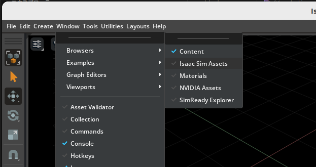

# Hello Robot

## Learning Objectives

After completing this tutorial, you will have learned:

- How to load robot assets from the Nucleus server into the scene
- How to wrap a robot prim with the `Articulation` class and access it via high-level APIs
- How to move a robot by sending velocity commands to its joints with `set_dof_velocity_targets()`
- How to apply actions continuously during simulation using `SimulationManager` physics callbacks
- How to control specific joints by name or index

## Getting Started

### Prerequisites

- Completed [Tutorial 1: Hello World](01_hello_world.md)
- An Omniverse Nucleus server with the `/Isaac` folder is configured

!!! note "What is the Nucleus server?"
    **Nucleus** is Omniverse's asset distribution and sharing server. Official assets used by Isaac Sim, such as robots and environments (under the `/Isaac` folder), are loaded via Nucleus. If you set up Isaac Sim with the standard installation procedure, no additional configuration is needed—just specify the asset path (e.g., `.../Isaac/Robots/...`).

### Estimated Time

Approximately 10–15 minutes

### Preparing the Source Code

In this tutorial, you continue editing `hello_world.py` from the Hello World example. If you are continuing from the previous tutorial, proceed as is. If you are resuming on another day, open the source code with the following steps.

1. Activate **Windows > Examples > Robotics Examples** to open the Robotics Examples tab.
2. Click **Robotics Examples > General > Hello World**.
3. Click the **Open Source Code** button to open `hello_world.py` in Visual Studio Code.

For detailed steps, see the ["Opening the Hello World Example" section of Hello World](01_hello_world.md#opening-the-hello-world-example).

## Adding a Robot to the Scene

In the previous tutorial we added a cube to the scene; this time we add a robot. Here we use NVIDIA's **Jetbot** (a two-wheeled differential drive robot).

??? info "How to add a robot via the GUI (click to expand)"
    You can also add robots to the scene by drag-and-drop from the Isaac Sim Assets browser, without writing any Python code.

    1. Click **Window > Browsers > Isaac Sim Assets** to enable the Isaac Sim Assets window.<br>
       

        !!! warning "Note on first launch"
            When you open the Isaac Sim Assets window for the first time, asset data is downloaded, so it may take a while to display. Depending on your network environment, it can take several minutes or more.

    2. Type "Jetbot" in the search bar and drag-and-drop the displayed Jetbot asset into the viewport.<br>
       

    This method is convenient for quickly placing robots, but learning the Python API approach allows you to add and control robots dynamically from your programs. The following explains the Python API approach.

### Adding a Robot with the Python API

Robot assets are stored on the Omniverse Nucleus server. Use `get_assets_root_path()` to get the asset root path, and `stage_utils.add_reference_to_stage()` to load the asset into the USD Stage.

However, `add_reference_to_stage()` alone only places the robot's 3D model and physics properties on the Stage; it does not enable **robot-level control** such as reading joint positions or sending velocity commands. To control the robot you would otherwise have to work directly with low-level USD or PhysX APIs.

Therefore, wrap the loaded robot prim with the `Articulation` class. The `Articulation` class only **references** the existing prim—it does not copy or convert it. It creates a Python object that provides high-level APIs such as `get_dof_positions()` and `set_dof_velocity_targets()` for the same `/World/Fancy_Robot` prim.

| Operation | Role |
|---|---|
| `stage_utils.add_reference_to_stage()` | Creates the robot's prim on the USD Stage |
| `Articulation(path)` | References the existing prim and creates a Python wrapper providing high-level joint control APIs |

First, import the required packages:

```python linenums="1"
import carb
import isaacsim.core.experimental.utils.stage as stage_utils
from isaacsim.core.experimental.prims import Articulation
from isaacsim.examples.base.base_sample_experimental import BaseSample
from isaacsim.storage.native import get_assets_root_path
```

Add the Jetbot to the stage in `setup_scene`:

```python linenums="1"
        # Add the Jetbot robot to the stage
        asset_path = assets_root_path + "/Isaac/Robots/NVIDIA/Jetbot/jetbot.usd"
        stage_utils.add_reference_to_stage(usd_path=asset_path, path="/World/Fancy_Robot")
```

Wrap it with the `Articulation` class in `setup_post_load`:

```python linenums="1"
        # Wrap the Jetbot with the Articulation class for control
        self._jetbot = Articulation("/World/Fancy_Robot")
```

The complete code is as follows:

```python linenums="1" hl_lines="2-6 28-32 34-43"
# -- Begin importing Isaac packages -- #
import carb
import isaacsim.core.experimental.utils.stage as stage_utils
from isaacsim.core.experimental.prims import Articulation
from isaacsim.examples.base.base_sample_experimental import BaseSample
from isaacsim.storage.native import get_assets_root_path

# -- End of importing Isaac packages -- #


class HelloWorld(BaseSample):
    def __init__(self) -> None:
        super().__init__()

    def setup_scene(self):
        # Add ground plane
        ground_plane = stage_utils.add_reference_to_stage(
            usd_path=get_assets_root_path() + "/Isaac/Environments/Grid/default_environment.usd",
            path="/World/ground",
        )

        # Get the assets root path from the Nucleus server
        assets_root_path = get_assets_root_path()
        if assets_root_path is None:
            carb.log_error("Could not find nucleus server with /Isaac folder")
            return

        # -- Begin adding Jetbot -- #
        # Add the Jetbot robot to the stage
        asset_path = assets_root_path + "/Isaac/Robots/NVIDIA/Jetbot/jetbot.usd"
        stage_utils.add_reference_to_stage(usd_path=asset_path, path="/World/Fancy_Robot")
        # -- End of adding Jetbot -- #

    async def setup_post_load(self):
        # -- Begin articulation -- #
        # Wrap the Jetbot with the Articulation class for control
        self._jetbot = Articulation("/World/Fancy_Robot")
        # -- End of articulation -- #

        # Print info about the Jetbot
        print("Number of DOFs: " + str(self._jetbot.num_dofs))
        print("DOF names: " + str(self._jetbot.dof_names))
        print("Joint Positions: " + str(self._jetbot.get_dof_positions().numpy()))
```

!!! info "About References"
    `add_reference_to_stage()` adds the USD file to the Stage as a **Reference**. Because it keeps a link to the original file, if the referenced asset is updated, the change is reflected when the stage is reopened (reloaded). While it is also possible to copy USD contents directly into the Stage, the reference approach is standard for loading robot assets.

Save the code and check the simulation:

1. Press **Ctrl+S** to save the code and hot-reload Isaac Sim.
2. Open the Hello World example extension window again.
3. Create a new world via **File > New From Stage Template > Empty**, then press the **LOAD** button.
4. Verify that the Jetbot appears in the scene and that the number of DOFs and joint names are printed in the terminal.

The scene has loaded, but the robot is not moving yet. The next section walks through how to make the robot move.

### Key Point about Physics Handles

Note that creating the `Articulation` class and querying its properties are done in `setup_post_load`, not `setup_scene`.

!!! warning "Caution"
    Articulation properties (degrees of freedom, joint positions, etc.) cannot be accessed until the physics handles have been initialized. `setup_post_load` is called after one physics time step has completed, so this information can be accessed safely there. Always perform articulation-related processing in or after `setup_post_load`.

## Moving the Robot

Next, apply random velocity commands to the Jetbot's wheel joints to get it moving.

Use the `Articulation` class's `set_dof_velocity_targets()` to send velocity commands to joints. This sets target velocities for the **implicit PD controller** built into the physics engine.

??? info "What is an implicit PD controller? (click to expand)"
    In a real robot, when you specify a "target position" or "target velocity" for a motor, the controller inside the motor driver computes the current (torque) according to the difference between the target and current values, and drives the joint.

    Isaac Sim's physics engine (PhysX) has a similar mechanism built in. When you specify target positions or target velocities, PhysX internally performs **PD control (proportional-derivative control)** and automatically computes the forces needed to track the targets.

    $$
    F = K_p \cdot (x_{\text{target}} - x_{\text{current}}) + K_d \cdot (\dot{x}_{\text{target}} - \dot{x}_{\text{current}})
    $$

    Because this PD controller is built **implicitly** into the physics engine rather than implemented explicitly by the user, it is called an "implicit PD controller".

To send velocity commands at every physics step, use the `SimulationManager` physics callback you learned in Tutorial 1.

Import `SimulationManager`:

```python linenums="1"
from isaacsim.core.simulation_manager import SimulationManager
```

Register the callback:

```python linenums="1"
        # Register a physics callback to send actions every physics step
        from isaacsim.core.simulation_manager.impl.isaac_events import IsaacEvents

        self._physics_callback_id = SimulationManager.register_callback(
            self.send_robot_actions, IsaacEvents.POST_PHYSICS_STEP
        )
```

Define the command function:

```python linenums="1"
    def send_robot_actions(self, dt, context):
        # Apply random velocity targets to the wheel joints
        # Jetbot has 2 DOFs: left_wheel_joint and right_wheel_joint
        random_velocities = 5 * np.random.rand(1, 2)  # Shape: (1, num_dofs)
        self._jetbot.set_dof_velocity_targets(random_velocities)
```

The complete code is as follows:

```python linenums="1" hl_lines="6-9 17 40-47 49-56 58-62"
import carb
import isaacsim.core.experimental.utils.stage as stage_utils
import numpy as np
from isaacsim.core.experimental.prims import Articulation

# -- Begin importing SimulationManager -- #
from isaacsim.core.simulation_manager import SimulationManager

# -- End of importing SimulationManager -- #
from isaacsim.examples.base.base_sample_experimental import BaseSample
from isaacsim.storage.native import get_assets_root_path


class HelloWorld(BaseSample):
    def __init__(self) -> None:
        super().__init__()
        self._physics_callback_id = None

    def setup_scene(self):
        # Add ground plane
        ground_plane = stage_utils.add_reference_to_stage(
            usd_path=get_assets_root_path() + "/Isaac/Environments/Grid/default_environment.usd",
            path="/World/ground",
        )

        # Get the assets root path from the Nucleus server
        assets_root_path = get_assets_root_path()
        if assets_root_path is None:
            carb.log_error("Could not find nucleus server with /Isaac folder")
            return

        # Add the Jetbot robot to the stage
        asset_path = assets_root_path + "/Isaac/Robots/NVIDIA/Jetbot/jetbot.usd"
        stage_utils.add_reference_to_stage(usd_path=asset_path, path="/World/Fancy_Robot")

    async def setup_post_load(self):
        # Wrap the Jetbot with the Articulation class for control
        self._jetbot = Articulation("/World/Fancy_Robot")

        # -- Begin registering callback -- #
        # Register a physics callback to send actions every physics step
        from isaacsim.core.simulation_manager.impl.isaac_events import IsaacEvents

        self._physics_callback_id = SimulationManager.register_callback(
            self.send_robot_actions, IsaacEvents.POST_PHYSICS_STEP
        )
        # -- End of registering callback -- #

    # -- Begin sending actions -- #
    def send_robot_actions(self, dt, context):
        # Apply random velocity targets to the wheel joints
        # Jetbot has 2 DOFs: left_wheel_joint and right_wheel_joint
        random_velocities = 5 * np.random.rand(1, 2)  # Shape: (1, num_dofs)
        self._jetbot.set_dof_velocity_targets(random_velocities)

    # -- End of sending actions -- #

    def physics_cleanup(self):
        # Clean up callback when the extension is unloaded
        if self._physics_callback_id is not None:
            SimulationManager.deregister_callback(self._physics_callback_id)
            self._physics_callback_id = None
```

!!! note "Array shape for velocity commands"
    Since the experimental API assumes batched processing, the shape of the array passed to `set_dof_velocity_targets()` is `(number of objects, number of DOFs)`. For a single Jetbot, pass a `(1, 2)` array (left and right wheels).

Save the code and check the simulation:

1. Press **Ctrl+S** to save the code and hot-reload Isaac Sim.
2. Create a new world via **File > New From Stage Template > Empty**, then press the **LOAD** button.
3. Watch the Jetbot move around with random velocities.


Because random velocities (in the 0–5 range) are applied to the left and right wheels at every step, the Jetbot moves erratically.

## Exercises

Try the following exercises to deepen your understanding of robot control.

**Exercise 1: Move backwards** — Make the Jetbot move backwards.

??? tip "Hint (click to expand)"
    Use negative wheel velocities.

**Exercise 2: Turn right** — Make the Jetbot turn to the right.

??? tip "Hint (click to expand)"
    Apply different velocities to each wheel (faster on the left wheel, slower on the right).

**Exercise 3: Stop after 5 seconds** — Make the Jetbot stop 5 seconds after the simulation starts.

??? tip "Hint (click to expand)"
    Accumulate the callback argument `dt` at every step to compute elapsed time, and stop with a conditional branch.

## Controlling Specific Joints

You can also control specific joints individually by their names or indices. Let's see how to get the wheel joint indices and apply velocities only to specific joints.

Get the wheel joint indices:

```python linenums="1"
        # Print available DOF names
        print("Available DOFs:", self._jetbot.dof_names)

        # Get indices for specific wheel joints
        self._wheel_indices = self._jetbot.get_dof_indices(["left_wheel_joint", "right_wheel_joint"]).numpy()
        print("Wheel indices:", self._wheel_indices)
```

Set wheel velocities using the indices:

```python linenums="1"
        # Apply velocity targets to specific DOF indices
        wheel_velocities = np.array([[10.0, 10.0]])  # Both wheels same speed = forward
        self._jetbot.set_dof_velocity_targets(wheel_velocities, dof_indices=self._wheel_indices)
```

The complete code is as follows:

```python linenums="1" hl_lines="31-38 48-52"
import carb
import isaacsim.core.experimental.utils.stage as stage_utils
import numpy as np
from isaacsim.core.experimental.prims import Articulation
from isaacsim.core.simulation_manager import SimulationManager
from isaacsim.examples.base.base_sample_experimental import BaseSample
from isaacsim.storage.native import get_assets_root_path


class HelloWorld(BaseSample):
    def __init__(self) -> None:
        super().__init__()
        self._physics_callback_id = None

    def setup_scene(self):
        # Add ground plane
        ground_plane = stage_utils.add_reference_to_stage(
            usd_path=get_assets_root_path() + "/Isaac/Environments/Grid/default_environment.usd",
            path="/World/ground",
        )

        # Add the Jetbot robot to the stage
        assets_root_path = get_assets_root_path()
        asset_path = assets_root_path + "/Isaac/Robots/NVIDIA/Jetbot/jetbot.usd"
        stage_utils.add_reference_to_stage(usd_path=asset_path, path="/World/Fancy_Robot")

    async def setup_post_load(self):
        # Wrap the Jetbot with the Articulation class
        self._jetbot = Articulation("/World/Fancy_Robot")

        # -- Begin getting indices -- #
        # Print available DOF names
        print("Available DOFs:", self._jetbot.dof_names)

        # Get indices for specific wheel joints
        self._wheel_indices = self._jetbot.get_dof_indices(["left_wheel_joint", "right_wheel_joint"]).numpy()
        print("Wheel indices:", self._wheel_indices)
        # -- End of getting indices -- #

        # Register physics callback
        from isaacsim.core.simulation_manager.impl.isaac_events import IsaacEvents

        self._physics_callback_id = SimulationManager.register_callback(
            self.send_robot_actions, IsaacEvents.POST_PHYSICS_STEP
        )

    def send_robot_actions(self, dt, context):
        # -- Begin setting wheel velocity -- #
        # Apply velocity targets to specific DOF indices
        wheel_velocities = np.array([[10.0, 10.0]])  # Both wheels same speed = forward
        self._jetbot.set_dof_velocity_targets(wheel_velocities, dof_indices=self._wheel_indices)
        # -- End of setting wheel velocity -- #

    def physics_cleanup(self):
        if self._physics_callback_id is not None:
            SimulationManager.deregister_callback(self._physics_callback_id)
            self._physics_callback_id = None
```

For a robot like the Jetbot where all joints are controlled, specifying indices is not strictly necessary, but this approach is useful when you want to control only a subset of joints on a robot with many joints (such as a manipulator).

## Summary

This tutorial covered the following topics:

1. **Adding a robot to the stage** with `stage_utils.add_reference_to_stage()`
2. Wrapping a robot prim with the **Articulation class** and accessing it via high-level APIs
3. **Velocity control** with `set_dof_velocity_targets()`
4. Registering physics callbacks with **SimulationManager**
5. **Controlling specific joints** by name or index

## Next Steps

Continue to the next tutorial, [Adding a Controller](03_adding_a_controller.md), to learn how to add a controller to the robot for more advanced behavior.

!!! note "Next step in the official tutorial series"
    "Adding a Controller" was removed from the official Isaac Sim 6.0 documentation; this site retains it as its own guide based on the 5.1.0 content. In the official tutorial series, the next tutorial is [Adding a Manipulator Robot](04_adding_a_manipulator_robot.md).

!!! tip "Further Learning"
    Isaac Sim also provides extensions for wheeled robots and manipulators (such as `isaacsim.robot.experimental.wheeled_robots` and `isaacsim.robot.experimental.manipulators.examples`). See the standalone examples located at `standalone_examples/api/isaacsim.robot.experimental.manipulators/franka` and `standalone_examples/api/isaacsim.robot.experimental.manipulators/universal_robots/`.
