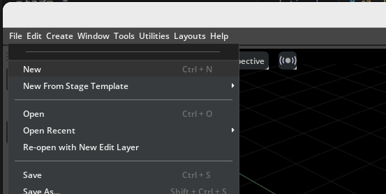
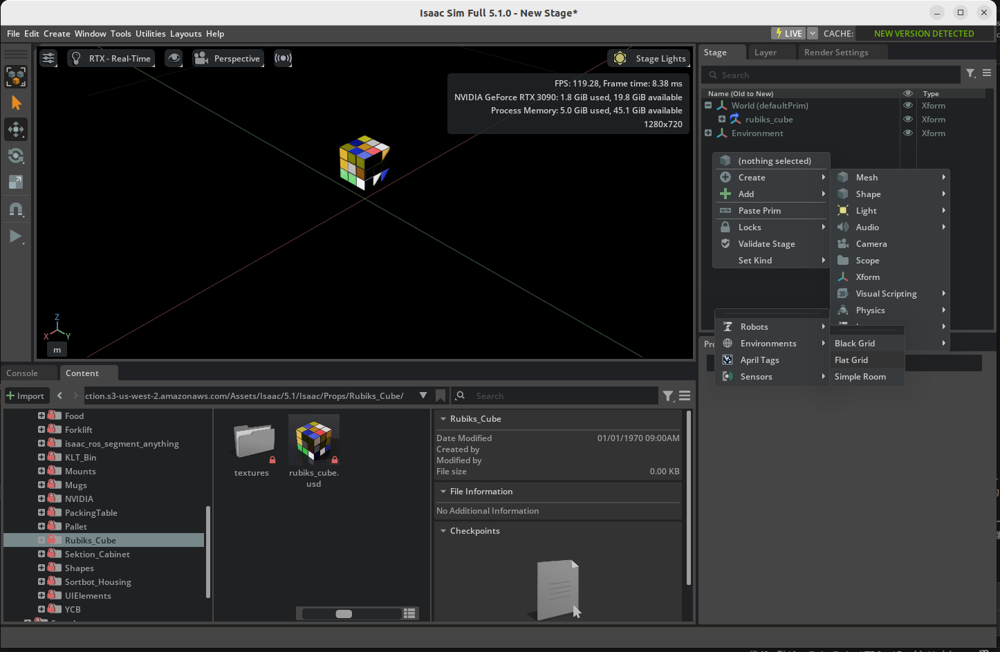
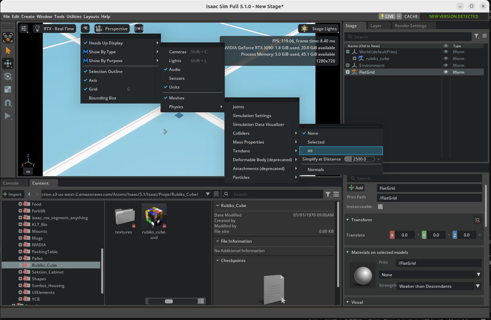

# 属性の追加

## 学習目標

このチュートリアルを修了すると、以下の内容を習得できます:

- シーンにオブジェクト（Props）を追加する方法
- 剛体属性（Rigid Body）の設定方法
- コリジョン（衝突判定）属性の設定方法
- 質量（Mass）の設定方法
- コリジョン形状の可視化とカスタマイズ
- 物理マテリアル（反発係数・摩擦係数）の適用方法

## はじめに

### 前提条件

- [チュートリアル 1: Hello World](01_hello_world.md) を完了していること

### 所要時間

約 10〜15 分

### 概要

これまでのチュートリアルでは Python API を使ってシーンにオブジェクトやロボットを追加してきました。ここでは視点を変えて、**GUI 操作**でオブジェクトをシーンに追加し、物理シミュレーションに必要な属性を段階的に設定していきます。

Isaac Sim で物理シミュレーションに参加するオブジェクトには、以下の属性を適切に設定する必要があります：

| 属性 | 役割 |
|---|---|
| **Rigid Body** | 重力や外力の影響を受ける物理オブジェクトとして登録 |
| **Collider** | 他のオブジェクトとの衝突判定を有効化 |
| **Mass** | 質量・密度・慣性の設定 |
| **Physics Material** | 反発係数（弾性）や摩擦係数の設定 |

!!! note "注釈"
    Python API で `DynamicCuboid` などを使った場合は、これらの属性が内部で自動的に設定されています。GUI 操作では、各属性を手動で追加する必要があります。

## ルービックキューブの追加

まず、新しいステージを作成してオブジェクトを配置します。

1. **File > New** をクリックして新しいステージを作成します。 
   

2. Content Browser で **Isaac Sim > Props > Rubiks_Cube > rubiks_cube.usd** に移動し、USD ファイルをビューポートにドラッグ＆ドロップします。 
   

3. ルービックキューブを左クリックして選択し、Properties パネルで **Translate** を `(0, 0, 0.1)` に設定します。

4. ステージ上で右クリックし、**Create > Isaac > Environment > Flat Grid** を選択して地面を作成します。 
   

5. **PLAY** ボタンを押してシミュレーションを開始します。

    **結果:** ルービックキューブは落下しません。まだ **Rigid Body** 属性が設定されていないため、物理演算の対象になっていません。

6. **STOP** ボタンを押してシミュレーションを停止します。

## 物理属性の設定

### 剛体属性（Rigid Body）の追加

1. ステージ上でXformのルービックキューブを右クリックし、**Add > Physics > Rigid Body** を選択します。 
   

!!! warning "注意"
    以降の手順でビューポート上のルーピックキューブをクリックして選択されるMeshのルーピックキューブに属性を付与すると、うまくいかなくなるので注意すること。

2. **PLAY** ボタンを押します。

    **結果:** ルービックキューブは落下しますが、**地面をすり抜けてしまいます**。Rigid Body を追加したことで重力の影響を受けるようになりましたが、衝突判定がないため地面との接触を検出できません。

    

3. **STOP** ボタンを押します。

### コリジョン属性の追加

1. ステージ上でXformのルービックキューブを右クリックし、**Add > Physics > Collider Presets** を選択します。

2. **PLAY** ボタンを押します。

    **結果:** ルービックキューブが地面の上に着地するようになりました。コリジョン属性が追加されたことで、衝突判定が有効になりました。

    

3. **STOP** ボタンを押します。

### 質量（Mass）の追加

1. ステージ上でXformのルービックキューブを右クリックし、**Add > Physics > Mass** を選択します。

2. Properties パネルで **Mass** セクションまでスクロールし、**Mass** を `0.1`（100グラム）に設定します。

!!! note "質量の設定について"
    Mass を `0` に設定した場合、シミュレーション実行時にオブジェクトの体積に基づいて質量が自動計算されます（密度が指定されていない場合は `1000 kg/m³` が仮定されます）。質量のほかに、**Density**（密度）、**Center of Mass**（重心）、**Diagonal Inertia**（対角慣性）、**Principal Axes**（主軸）も設定できます。

### コリジョン形状の可視化

コリジョン形状は通常は見えませんが、デバッグ用に可視化できます。

1. ビューポート左上の **Eye アイコン**を右クリックし、**Show By Type > Physics > Colliders > All** を選択します。
   

    **結果:** シーン内のすべてのオブジェクトのコリジョン形状が表示されます。

    - 地面（静的オブジェクト）のコリジョンは **ピンク色** で表示されます
    - ルービックキューブ（動的オブジェクト）のコリジョンは **緑色** で表示されます

    

!!! tip "コリジョンの近似タイプ"
    コリジョン形状の近似方法は変更できます。`World/rubiks_cube/RubikCube` メッシュを選択し、**Physics/Collider** セクションの **Approximation** タブで異なる近似タイプを選択できます。

### コリジョン形状のカスタマイズ

デフォルトのコリジョン形状（メッシュ近似）をよりシンプルな球体に置き換えて、転がる動作をシミュレートしてみます。

1. `World/rubiks_cube/RubikCube` メッシュを左クリックし、**Physics/Collider** セクションで **×** ボタンを押して既存のコリジョンを削除します。

2. ステージ上でXformのルービックキューブを右クリックして、**Create > Shape > Sphere** を選択してスフィア形状を追加します。
   RubikCubeのXformのツリーの配下にSphereメッシュがあることを確認してください。配下に生成できていない場合、適宜Sphereメッシュをドラッグ&ドロップで移動させる必要があります。
   

3. **Geometry** セクションで **Radius** を `0.07` に設定します（キューブに合うサイズ）。

4. 作成したスフィアを選択し、**Add > Physics > Collider Presets** を追加します。

5. ステージのスフィアの横にある Eye アイコンのチェックを外して、スフィアの表示を非表示にします。

6. 地面（FlatGrid）を選択し、Properties パネルの Transform セクション右の **Toggle Offset Mode** アイコンをクリックして、**Rotation** を `(10, 0, 0)` に設定します（地面を 10 度傾けます）。
   

7. **PLAY** ボタンを押します。

    **結果:** ルービックキューブが坂を転がっていきます。スフィアコリジョンにより、直方体ではなく球体として物理シミュレーションが行われています。

    

8. **STOP** ボタンを押します。

### 物理マテリアルの追加

反発係数（Restitution）を設定して、オブジェクトが弾む動作を実現します。

1. ステージ上でXformのルービックキューブを左クリックし、Properties パネルで **Translate** を `(0, 0, 1)` に変更します（高い位置から落とすため）。

2. ステージ上でXformのルービックキューブを右クリックし、**Create > Physics > Physics Material** を選択します。ポップアップではRigid Body Materialにチェックを入れてOKを選択します。作成されたマテリアルを `World/rubiks_cube/Looks` フォルダにドラッグ＆ドロップします。
   

3. Properties パネルで **Physics Material** セクションまでスクロールし、**Restitution** を `1` に設定します（完全弾性衝突）。

4. 先ほど作成したスフィアコリジョンを選択し、**Physics/Physics material on selected Material** セクションで `/World/rubiks_cube/Looks/PhysicsMaterial` を選択して物理マテリアルを適用します。

5. **PLAY** ボタンを押します。

    **結果:** ルービックキューブが地面に落下し、バウンドします。Restitution（反発係数）を 1 に設定したため、ほぼエネルギーを失わずに跳ね返ります。

    

6. **STOP** ボタンを押します。

!!! note "摩擦係数の設定"
    物理マテリアルでは反発係数のほかに、**Static Friction**（静止摩擦係数）と **Dynamic Friction**（動摩擦係数）も設定できます。

!!! tip "完成版アセット"
    このチュートリアルの完成版アセットは、Content Browser の **Isaac Sim > Samples > Rigging > RubiksCube > rubiks_cube.usd** で確認できます。

## 発展：複雑なコリジョン形状の構築

実際のロボティクスアプリケーションでは、複雑な形状のオブジェクトに対して正確なコリジョンが必要になることがあります。このような場合、複数の基本形状（球、シリンダー、ボックスなど）を組み合わせて近似するアプローチが一般的です。

上の図はベアリングのコリジョン形状の例です。シリンダーと矩形を組み合わせて、複雑な形状を近似しています。

## まとめ

このチュートリアルでは以下のトピックを扱いました：

1. シーンへの**オブジェクトの追加**
2. **Rigid Body**、**Collider**、**Mass** による物理属性の設定
3. コリジョン形状の**可視化とカスタマイズ**
4. **物理マテリアル**（反発係数・摩擦係数）の適用

!!! note "Python API との関係"
    このチュートリアルで GUI から手動設定した属性は、Python API の `DynamicCuboid`、`FixedCuboid`、`DynamicSphere` などのクラスを使うと自動的に設定されます。GUI 操作で物理属性の仕組みを理解しておくことで、Python API 使用時にも各パラメータの意味が把握しやすくなります。

## 次のステップ

次のチュートリアル「[データロギング](08_data_logging.md)」に進み、シミュレーションデータの記録と再生の方法を学びましょう。
