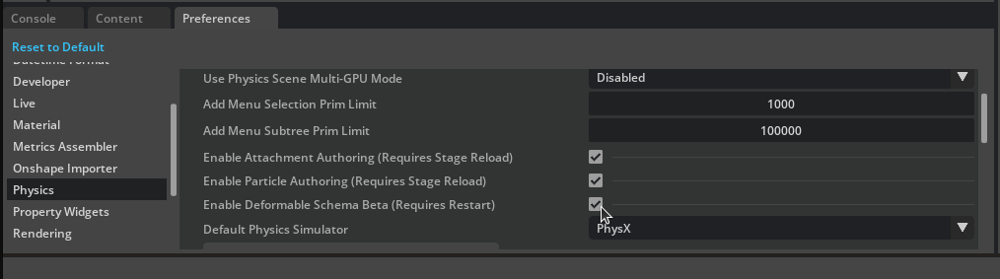
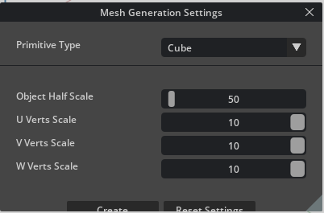
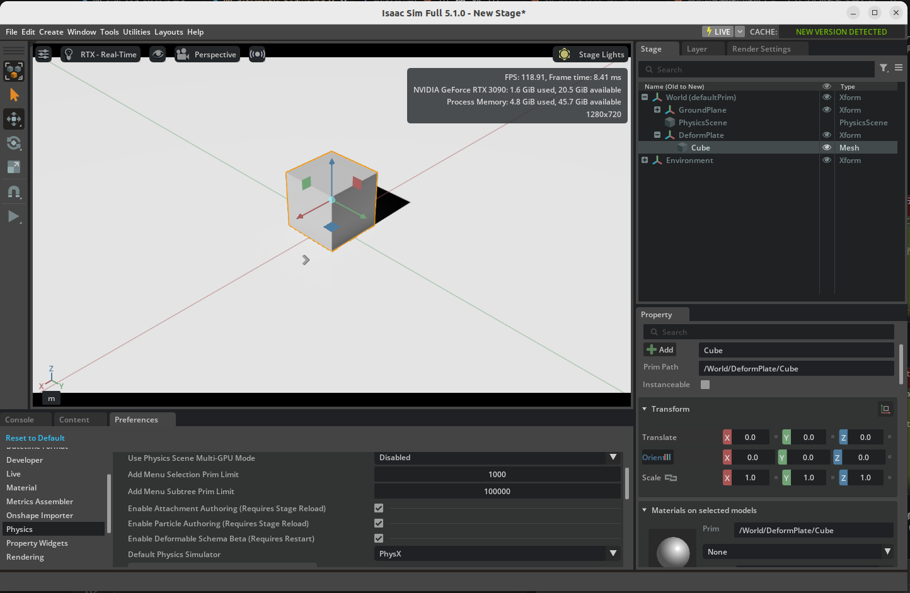
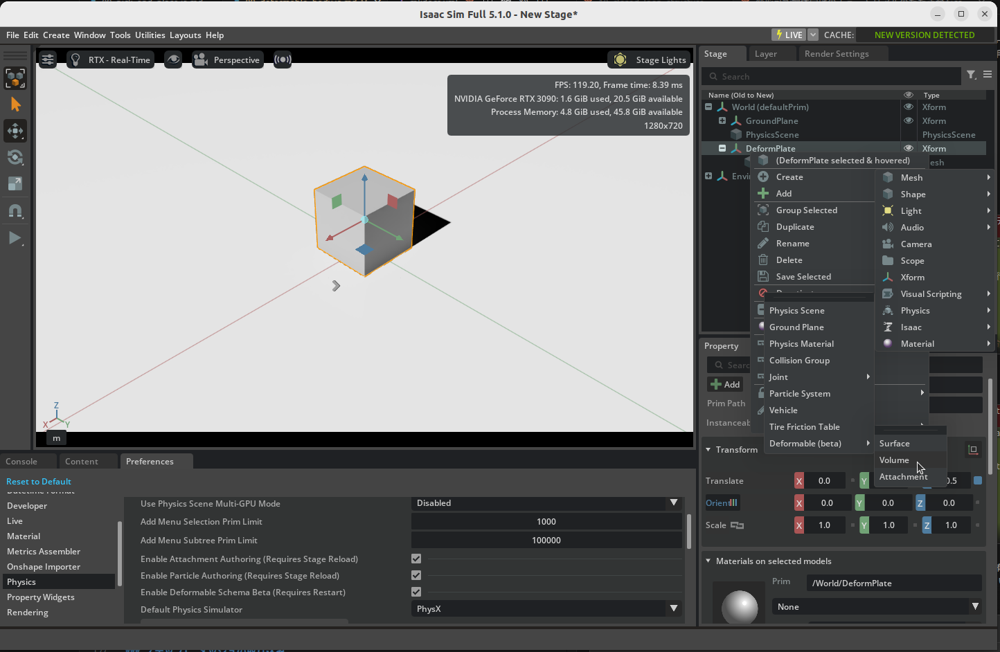
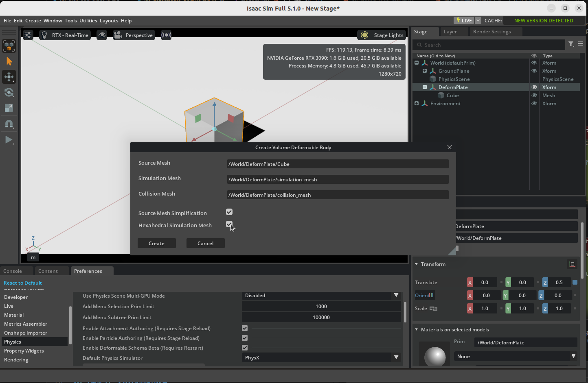
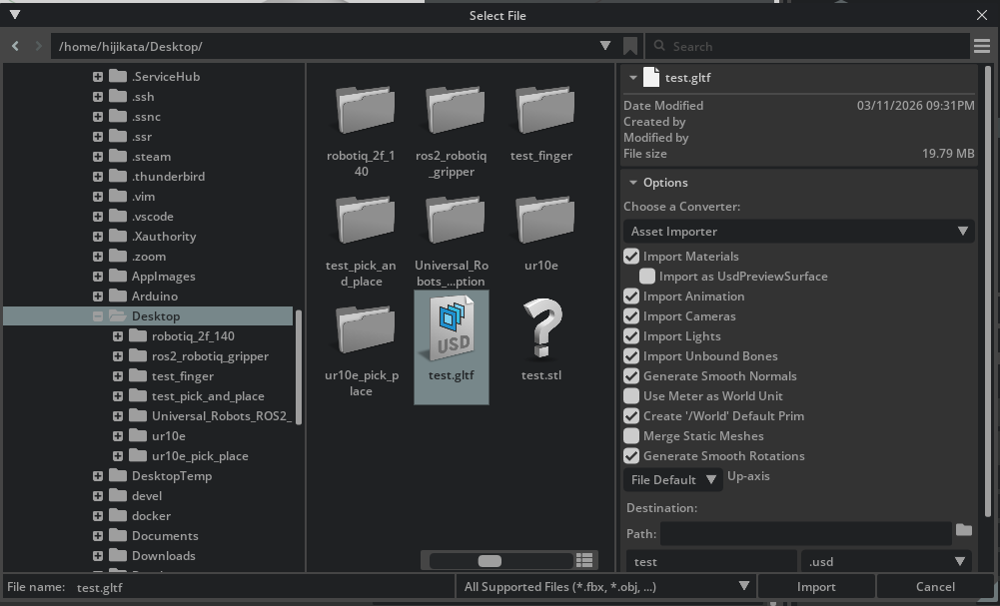
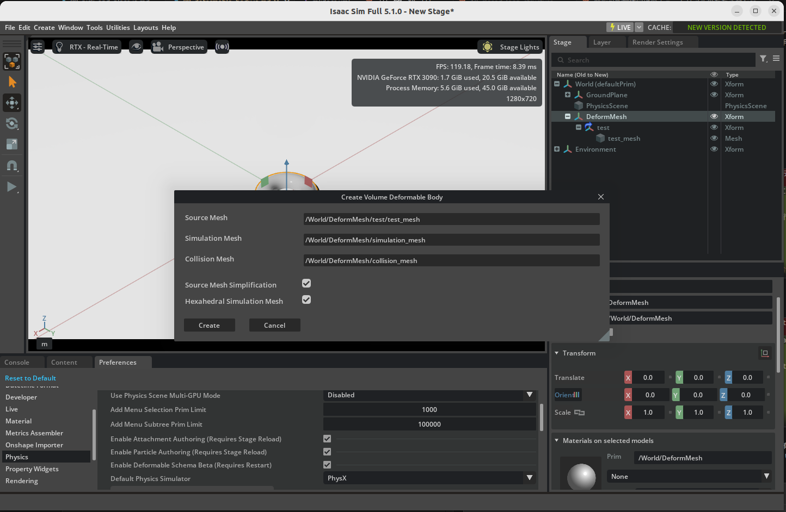
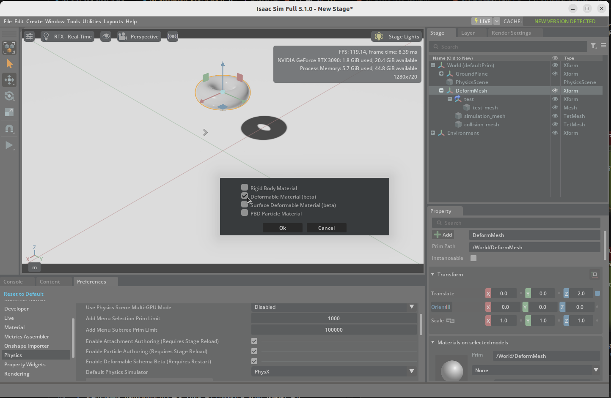
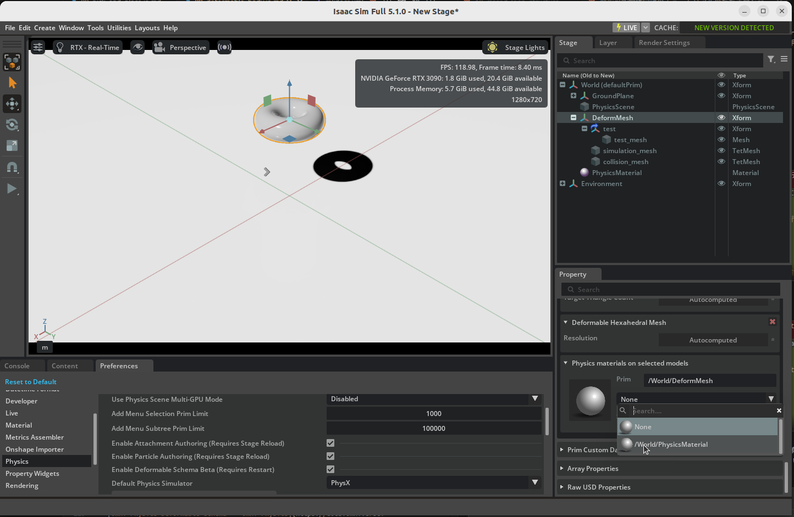

# 変形可能物体（Deformable Body）

## 学習目標

このチュートリアルを修了すると、以下の内容を習得できます:

- Isaac Sim で Deformable Body（Beta）機能を有効化する方法
- プリミティブメッシュから変形可能物体（Volume Deformable）を作成する方法
- 外部メッシュ（STL/OBJ 等）を取り込んで変形可能物体を作成する方法
- Volume Deformable と Surface Deformable の使い分け
- Deformable Body Material（物理マテリアル）の作成と適用方法

## はじめに

### 前提条件

- [チュートリアル 7: 属性の追加](07_adding_props.md) を完了していること

### 所要時間

約 15〜20 分

### 概要

これまでのチュートリアルでは **剛体（Rigid Body）** を扱ってきました。剛体はどれだけ力を加えても形状が変化しない物体です。一方、現実世界にはスポンジ、布、ゴム製品など、力を加えると変形する物体が数多く存在します。

Isaac Sim では **Deformable Body（Beta）** 機能を使って、このような **変形可能物体** をシミュレーションできます。変形可能物体には大きく2種類あります：

| 種類 | 説明 | 適用例 |
|---|---|---|
| **Volume Deformable** | 厚みのある閉じた形状（watertight）の物体 | スポンジ、ゴムブロック、臓器モデルなど |
| **Surface Deformable** | 薄い膜や表面のみの物体 | 布、紙、薄いシートなど |

!!! note "Beta 機能について"
    Deformable Body は Beta 機能です。将来のバージョンで仕様が変更される可能性があります。

## 事前準備：Deformable 機能の有効化

Deformable Body を使うには、まず Isaac Sim の設定で機能を有効化する必要があります。この操作は最初に1回だけ行えば、以降は不要です。

1. 上部メニューから **Edit > Preferences** を開きます。

2. **Physics > General** セクションで、**Enable Deformable schema Beta (Requires Restart)** をオンにします。

    

3. Isaac Sim を **再起動** します。

!!! tip "変形メッシュの可視化（推奨）"
    変形可能物体を扱う際は、シミュレーションメッシュとコリジョンメッシュを可視化しておくと、メッシュの密度が適切かどうかを確認できます。ビューポートの **Eye アイコン** をクリックし、**Show By Type > Physics > Deformables (beta) > All** を選択してください。

## ステージの準備

新しいステージを作成し、物理シミュレーションの準備をします。

1. **File > New** で新しいステージを作成します。

2. 上部メニューから **Create > Physics > Ground Plane** を選択して、地面（Ground Plane）を追加します。

3. **Create > Physics > Physics Scene** を選択し、物理シーンを追加します（テンプレートによっては既に含まれている場合があります）。

4. Stage ウィンドウで作成された **PhysicsScene** を選択し、Properties パネルで以下の設定を行います：

    - **Enable GPU Dynamics** をオンにする
    - **Broadphase Type** を `GPU` に設定する

!!! warning "GPU 設定は必須"
    Deformable Body は PhysX の GPU パイプラインで処理されるため、GPU Dynamics が無効の場合はシミュレーションが正しく動作しません。必ず上記の設定を行ってください。

## パターン1：プリミティブメッシュから変形可能物体を作る

最も基本的な方法として、Isaac Sim のプリミティブメッシュ（Cube）を使って変形可能物体を作成します。

### ステップ1：Xform とメッシュの作成

まず、変形可能物体のルートとなる Xform と、十分に分割されたメッシュを作成します。

1. Stage ウィンドウで右クリックし、**Create > Xform** を選択します。名前を `DeformPlate` に変更します（例：`/World/DeformPlate`）。

2. 上部メニューから **Create > Mesh > Settings** を選択し、Mesh Settings ダイアログを開きます。

3. **Primitive Type** を `Cube` に設定します。

4. **U/V/W Verts Scale** の値を増やします（例：`10`〜`30` 程度）。

    

    !!! warning "メッシュの分割数について"
        分割数が少なすぎると変形が視覚的に確認できません。最初は 10〜30 程度から試してみてください。Ctrl + 左クリックで値を微調整できます。

5. **Create** ボタンを押してメッシュを生成します。

6. 生成されたメッシュを **`/World/DeformPlate` の子にドラッグ＆ドロップ** してネストします。

    

### ステップ2：Volume Deformable の適用

作成したメッシュに対して、変形可能物体の物理属性を付与します。

7. ルート Xform（`/World/DeformPlate`）を選択します。

8. 右クリックし、**Create > Physics > Deformable (beta) > Volume** を選択します。

    

9. ダイアログが表示されます。必要に応じて **Hexahedral Simulation Mesh** をオンにします（別のシミュレーションメッシュを生成して安定性を向上させたい場合）。

    

10. **Create** ボタンを押します。

### ステップ3：動作確認

11. `/World/DeformPlate` を選択し、Properties パネルで **Translate** の Z 値を `1.0`〜`2.0` 程度に設定して持ち上げます。

12. **PLAY** ボタンを押してシミュレーションを開始します。

    **結果：** 変形可能物体が地面に落下し、衝突時に変形する様子を確認できます。

    

13. **STOP** ボタンを押してシミュレーションを停止します。

## パターン2：外部メッシュから変形可能物体を作る

STL/OBJ/FBX 等の外部メッシュファイルを使って、任意の形状の変形可能物体を作成できます。

### ステップ1：メッシュの取り込み

外部メッシュを Isaac Sim で使うには、まず USD 形式に変換する必要があります。

1. 上部メニューから **File > Import** を選択し、CAD Converter を使ってメッシュファイルを取り込みます。以降の画像や動画では[サンプルファイル](test_mesh/test.gltf)を使用しています。

    

    !!! note "スケールの確認"
        STL ファイルは単位情報を持たないことが多いため、取り込み後は必ずスケール（メートル換算）を確認してください。

### ステップ2：Deformable の種類を選択して適用

取り込んだメッシュの形状に応じて、Volume Deformable または Surface Deformable を選択します。

#### 厚みのある閉じた形状の場合 → Volume Deformable

メッシュが閉じた立体形状（watertight）の場合は、Volume Deformable を使用します。

2. Stage ウィンドウで右クリックし、**Create > Xform** を選択します（例：`/World/DeformMesh`）。

3. 取り込んだメッシュを **Xform の子にドラッグ＆ドロップ** してネストします。

4. Xform を選択し、右クリックから **Create > Physics > Deformable (beta) > Volume** を選択します。

5. 必要に応じて、ダイアログの **Source Mesh** に対象のメッシュを指定します。

    

    !!! tip "Source Mesh について"
        レンダリング用メッシュとは別に、シミュレーションメッシュの生成元となる Source Mesh を指定できます。Source Mesh は Deformable サブツリーの外にあるメッシュも指定可能です。

6. **Create** ボタンを押します。

7. Z 方向に持ち上げて **PLAY** ボタンを押し、動作を確認します。

    

#### 薄い膜や表面のみの場合 → Surface Deformable

メッシュが閉じていない薄板や膜状の形状の場合は、Surface Deformable を使用します。

- Xform を選択し、右クリックから **Create > Physics > Deformable (beta) > Surface** を選択します。

### トラブルシューティング

変形が見えない、またはシミュレーションが不安定な場合は、以下の点を確認してください：

- **入力メッシュの解像度が不足している**：メッシュの頂点数が少なすぎると、変形しても見た目に反映されません。メッシュの分割数を増やしてください。
- **シミュレーションメッシュとコリジョンメッシュの解像度の不一致**：両者の解像度が極端に異なると、収束問題が発生しやすくなります。

## Deformable Body Material の設定

変形可能物体の物理的な性質（硬さ、弾性など）は、**Deformable Body Material** を作成して割り当てることで制御します。

### ステップ1：Physics Material の作成

1. 上部メニューから **Create > Physics > Physics Material** を選択します。

2. 表示されるダイアログで **Deformable Body Material** を選択し、**OK** をクリックします。

    

### ステップ2：パラメータの設定

作成した物理マテリアルの Properties パネルで、以下のパラメータを調整します：

| パラメータ | 説明 |
|---|---|
| **Young's Modulus**（ヤング率） | 物体の硬さを決定します。値が大きいほど硬くなります |
| **Poisson's Ratio**（ポアソン比） | 物体を引っ張った際の横方向の収縮率です（通常 0〜0.5） |
| **Density**（密度） | 物体の質量密度（kg/m³） |
| **Dynamic Friction**（動摩擦係数） | 物体が動いている際の摩擦の強さ |

!!! tip "パラメータの使い分け"
    シミュレーションメッシュには密度・ヤング率・ポアソン比が、コリジョンメッシュには摩擦係数が主に影響します。

### ステップ3：マテリアルの割り当て

3. 変形可能物体（Deformable のルート Xform または関連する Prim）を選択します。

4. Properties パネルの **Physics Materials on Selected …** セクションから、作成した Deformable Body Material を選択して割り当てます。

    

5. **PLAY** ボタンを押し、動作を確認します。

    

## まとめ

このチュートリアルでは以下のトピックを扱いました：

1. **Deformable Body（Beta）機能の有効化**
2. プリミティブメッシュからの **Volume Deformable の作成**
3. 外部メッシュの取り込みと **Volume / Surface Deformable の使い分け**
4. **Deformable Body Material** による物理パラメータの設定と割り当て

!!! note "剛体との違い"
    剛体（Rigid Body）は形状が変化しないため計算が効率的ですが、変形可能物体はメッシュの各頂点を個別に計算するため、計算コストが高くなります。シミュレーションの目的に応じて、剛体と変形可能物体を使い分けてください。

## 参考リンク

- [Deformable Visual Authoring (Beta) — Omni Physics](https://docs.omniverse.nvidia.com/kit/docs/omni_physics/107.3/dev_guide/deformables_beta/deformable_authoring.html)
- [Omni Physics Deformable Schema — Omni Physics](https://docs.omniverse.nvidia.com/kit/docs/omni_physics/107.3/dev_guide/deformables_beta/omniphysics_deformable_schema.html)
- [Physics Simulation Fundamentals — Isaac Sim Documentation](https://docs.isaacsim.omniverse.nvidia.com/5.1.0/physics/simulation_fundamentals.html)
