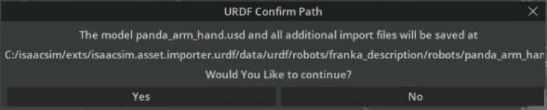
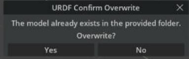
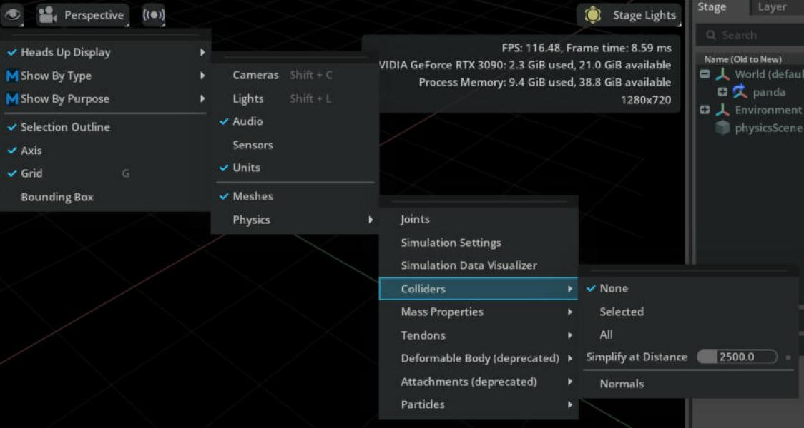
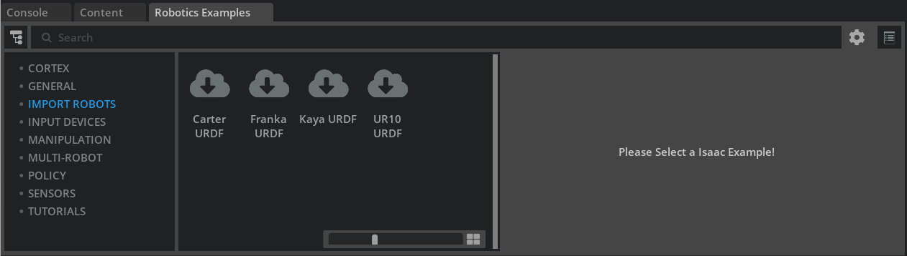

# Import URDF

## Learning Objectives

After completing this tutorial, you will have learned:

- How to import URDF files into Isaac Sim and convert them to USD
- How to configure import settings (base type, density, joint drives, colliders)
- How to visualize and inspect collision meshes
- The import workflow using the built-in samples (Robotics Examples)
- How to import URDF programmatically with Python scripts
- How to import URDF (XACRO) from a ROS 2 node

## Getting Started

### Prerequisites

- Complete the Quick Tutorials (basic operations) in Isaac Sim.
- The Python scripting section uses the Hello World sample from [Core API Tutorial 1: Hello World](../core_api/01_hello_world.md).

### Estimated Time

Approximately 10-15 minutes.

### Overview

In this tutorial, you will learn how to import URDF files into Isaac Sim and convert them to USD. Four methods are covered in order:

1. **Direct import via the GUI** — the basic, menu-only way to load a URDF
2. **Import from built-in samples** — experience the workflow with the Robotics Examples
3. **Import with Python scripting** — a programmatic method suited for pipelines
4. **Import from a ROS 2 node** — integrate with existing ROS 2 workflows (Linux only)

!!! note "What is URDF / why conversion is needed"
    URDF (Unified Robot Description Format) is the standard robot description format used in ROS. It describes a robot's links (rigid bodies), joints, masses, and collision shapes in XML.

    Isaac Sim, on the other hand, handles scenes and robots in **USD (Universal Scene Description)**. To use a URDF robot in Isaac Sim, a one-way **conversion (import)** from URDF to USD is required. The original URDF file is never modified.

    The reverse conversion (USD → URDF) is covered in the [next tutorial](02_export_urdf.md).

## Step 1: Direct Import via the GUI

Here we import the Franka Panda URDF (`panda_arm_hand.urdf`) that ships with the URDF importer extension.

### 1-1. Enable the Extension

The URDF importer (`isaacsim.asset.importer.urdf`) is normally loaded automatically when Isaac Sim starts. If it is not loaded, open **Window > Extensions**, search for `isaacsim.asset.importer.urdf`, and enable it.


### 1-2. Locate the Sample URDF

`panda_arm_hand.urdf` ships with the URDF importer extension itself. You can find it as follows:

1. Search for `isaacsim.asset.importer.urdf` in **Window > Extensions**.
2. Click the folder icon next to **AUTOLOAD** to open the extension's installation folder.
3. `panda_arm_hand.urdf` is in `/data/urdf/robots/franka_description/robots`. Copy this path.

### 1-3. Select the File

Open **File > Import**, paste the copied path into the navigation bar of the file-selection dialog, and select `panda_arm_hand.urdf`.


### 1-4. Configure the Import Settings

When you select a URDF file, an **Options** pane (import settings) appears on the right side of the file-selection dialog. The settings are grouped into Model / Links / Joints & Drives / Colliders sections. For the Franka (a fixed-base manipulator), configure as follows:

| Section | Setting | Value here | Description |
|---|---|---|---|
| Model | **USD Output** | keep default | Destination of the converted USD file. The default (`Same as Imported Model(Default)`) is the same directory as the URDF |
| Links | **Moveable Base / Static Base** | Static Base | Whether the base is fixed (manipulator = fixed, mobile robot = moveable). Static Base is preselected for the Franka |
| Links | **Default Density** | keep default (`0.0`) | Density applied to links without mass. `0.0` uses the default value |
| Joints & Drives | **Natural Frequency** | larger than default | Responsiveness of the joint drives. Choose Stiffness or Natural Frequency under **Joint Configuration**, then set per-joint values in the table. Larger values reduce oscillation during motion |
| Colliders | **Allow Self-Collision** | on | Enable collision detection between the robot's own links |

All other settings can be left at their defaults.

!!! warning "Write permission for the output directory"
    The output directory used at import time **must be writable**. Since the default output location is the same directory as the URDF file, change **USD Output** to a writable location when importing a URDF that lives in a read-only place, such as the extension's bundled samples.

!!! note "What is Natural Frequency"
    Joint drives in Isaac Sim are driven by PD control (Stiffness / Damping). Instead of specifying these directly, the URDF importer lets you specify responsiveness through an abstracted parameter, the **natural frequency**. Larger values make the joint track its target more quickly and suppress oscillation during motion. However, setting the value too high can cause the simulation to become **numerically unstable**, causing joints or rigid bodies to jitter or fly off unexpectedly. If this occurs, try reducing the simulation timestep in the Physics Scene settings or lowering the value.

    The relationship between Stiffness / Damping and Natural Frequency, and how to retune after import, are covered in [Robot Setup Tutorial 11: Tuning Joint Drive Gains](../robot_setup/11_joint_tuning.md).

### 1-5. Run the Import

Click the **Import** button. A **URDF Confirm Path** dialog appears showing where the converted USD file will be saved. Click **Yes** to run the import; the robot is added to the stage.



If you have imported to the same location before, a **URDF Confirm Overwrite** dialog appears next. Click **Yes** if overwriting is fine.



!!! warning "The confirmation dialog may hide behind other windows"
    Depending on the environment, this confirmation dialog can open **behind the file-selection window or the Extensions window**. While it is open, the entire main window stops responding to clicks and appears frozen. If Isaac Sim becomes unresponsive after you click Import, drag the front windows aside (or close them) and answer **Yes / No** on the hidden dialog.


!!! note "Importing a mobile (wheeled) robot"
    For robots that move on wheels, change the settings as follows:

    - Select **Moveable Base**
    - Set the drive type to **Velocity** for velocity-controlled joints (wheels) and **Position** for position-controlled joints (steering)
    - Set **Joint Drive Strength** to the required level. This value is imported as the joint's **Damping** (Stiffness is always 0 for Velocity drives)

!!! note "Importing torque-controlled robots (e.g. quadrupeds)"
    For robots whose legs are torque-controlled directly:

    - Select **Moveable Base**
    - Set the drive type to **None** for torque-controlled joints (legs) and **Position** or **Velocity** for the others
    - For **None** drive joints, Stiffness / Damping have no effect and are imported as 0

## Step 2: Visualizing Collision Meshes

Not every rigid body has collision properties, and collision meshes are typically simplified compared to the visual meshes. It is good practice to visually confirm after import that collisions are set up as intended.

To visualize collision meshes in the viewport:

1. Click the **eye icon** at the top left of the viewport.
2. Hover over **Show By Type**.
3. Hover over **Physics**.
4. Hover over **Colliders**.
5. Select **All** (the three choices are None / Selected / All).



Collision meshes are overlaid as wireframes (pink to green lines).

!!! note "If the wireframes do not appear"
    Depending on the environment and asset, wireframes may not appear immediately after selecting **All**. Try moving the viewport camera, getting closer to the prim, or playing the simulation once to refresh the display.


## Step 3: Import from Built-in Samples

Isaac Sim ships with samples that walk through the whole flow from import to drive configuration and simulation.

Enable **Window > Examples > Robotics Examples** and a **Robotics Examples** tab appears in the dock at the bottom of the screen. The **IMPORT ROBOTS** section in the sidebar provides four examples:

- Carter URDF (mobile robot; the official docs call it "Nova Carter URDF", but the actual UI label is "Carter URDF")
- Franka URDF (manipulator)
- Kaya URDF (mobile robot)
- UR10 URDF (manipulator)

!!! note "Wait for materials to load"
    Materials in these samples can take a while to load. Check the progress indicator at the bottom right of the UI.



The import settings and post-import setup differ per sample, but the usage is common to all:

1. In the **Robotics Examples** tab, click **IMPORT ROBOTS > (robot name) URDF** to open the example panel on the right.
2. The **LOAD** button in the **Load Robot** row of the **Command Panel** — imports the URDF into the stage and adds a ground plane, light, and physics scene.
3. The **CONFIGURE** button in the **Configure Drives** row — sets Stiffness / Damping for each joint drive.
4. The **pencil icon (Open Source Code)** at the top right of the panel — shows how this sequence is implemented with the Python API.
5. The **PLAY** button in the left toolbar — starts the simulation.
6. The **MOVE** button in the **Move to Pose** row — moves the robot to its home (rest) pose.


## Step 4: Import with Python Scripting

Everything done in the Import window can also be done from a Python script. Here we import a URDF programmatically and hook the imported robot into the **FollowTarget** task (a target-following task) from the `isaacsim.robot.manipulators.examples.franka` extension.

### 4-1. Open the Hello World Sample

1. Click **Window > Examples > Robotics Examples** in the menu bar.
2. In the **Robotics Examples** tab at the bottom, select **GENERAL > Hello World**.
3. Confirm that the Hello World panel (Information / World Controls) is shown.
4. Click the **pencil icon (Open Source Code)** at the top right of the panel to open the source code in Visual Studio Code.

### 4-2. Edit the Code

Rewrite `hello_world.py` as follows:

```python
from isaacsim.examples.interactive.base_sample import BaseSample
from isaacsim.core.utils.extensions import get_extension_path_from_name
from isaacsim.asset.importer.urdf import _urdf
from isaacsim.robot.manipulators.examples.franka.controllers.rmpflow_controller import RMPFlowController
from isaacsim.robot.manipulators.examples.franka.tasks import FollowTarget
import omni.kit.commands
import omni.usd

class HelloWorld(BaseSample):
    def __init__(self) -> None:
        super().__init__()
        return

    def setup_scene(self):
        # Get the world object and set up the simulation environment
        world = self.get_world()

        # Add a default ground plane for the robot to stand on
        world.scene.add_default_ground_plane()

        # Acquire the interface of the extension that parses/imports URDF
        urdf_interface = _urdf.acquire_urdf_interface()

        # URDF import settings
        import_config = _urdf.ImportConfig()
        import_config.convex_decomp = False      # Disable convex decomposition (keep it simple)
        import_config.fix_base = True            # Fix the base to the ground
        import_config.make_default_prim = True   # Make the robot the default prim
        import_config.self_collision = False     # Disable self-collision (for performance)
        import_config.distance_scale = 1         # Distance scale
        import_config.density = 0.0              # Density (0 uses the default)

        # Get the path of the URDF file bundled with the extension
        extension_path = get_extension_path_from_name("isaacsim.asset.importer.urdf")
        root_path = extension_path + "/data/urdf/robots/franka_description/robots"
        file_name = "panda_arm_hand.urdf"

        # Parse the URDF file and build the robot model
        result, robot_model = omni.kit.commands.execute(
            "URDFParseFile",
            urdf_path="{}/{}".format(root_path, file_name),
            import_config=import_config
        )

        # Set drive parameters (Stiffness / Damping) for every joint
        for joint in robot_model.joints:
            robot_model.joints[joint].drive.strength = 1047.19751
            robot_model.joints[joint].drive.damping = 52.35988

        # Import the robot model into the current stage and get its prim path
        result, prim_path = omni.kit.commands.execute(
            "URDFImportRobot",
            urdf_robot=robot_model,
            import_config=import_config,
        )

        # (Optional) import into a separate stage and reference it from the current stage.
        # Useful to get textures loaded correctly for textured assets.
        # dest_path = "/path/to/dest.usd"
        # result, prim_path = omni.kit.commands.execute(
        #     "URDFParseAndImportFile",
        #     urdf_path="{}/{}".format(root_path, file_name),
        #     import_config=import_config,
        #     dest_path=dest_path
        # )
        # prim_path = omni.usd.get_stage_next_free_path(
        #     self.world.scene.stage, str(current_stage.GetDefaultPrim().GetPath()) + prim_path, False
        # )
        # robot_prim = self.world.scene.stage.OverridePrim(prim_path)
        # robot_prim.GetReferences().AddReference(dest_path)

        # Create a target-following task using the imported robot
        my_task = FollowTarget(
            name="follow_target_task",
            franka_prim_path=prim_path,          # Prim path of the robot in the scene
            franka_robot_name="fancy_franka",    # Name of the robot instance
            target_name="target"                 # Name of the target to follow
        )

        # Add the task to the simulation world
        world.add_task(my_task)
        return

    async def setup_post_load(self):
        # Post-load setup (controller initialization, etc.)
        self._world = self.get_world()
        self._franka = self._world.scene.get_object("fancy_franka")

        # Initialize the RMPFlow controller
        self._controller = RMPFlowController(
            name="target_follower_controller",
            robot_articulation=self._franka
        )

        # Register a callback invoked at every physics step
        self._world.add_physics_callback("sim_step", callback_fn=self.physics_step)
        await self._world.play_async()
        return

    async def setup_post_reset(self):
        # Reset the controller to its initial state on reset
        self._controller.reset()
        await self._world.play_async()
        return

    def physics_step(self, step_size):
        # Every step, compute and apply an action that follows the target pose
        world = self.get_world()
        observations = world.get_observations()

        actions = self._controller.forward(
            target_end_effector_position=observations["target"]["position"],
            target_end_effector_orientation=observations["target"]["orientation"]
        )

        self._franka.apply_action(actions)
        return
```

### 4-3. Run

1. Save the code with **Ctrl+S**; Isaac Sim hot-reloads it (saving from an editor other than VS Code triggers the reload just as well).
2. Create a new stage with **File > New From Stage Template > Empty**. If a save prompt appears, click **Don't Save**.
3. Open the Hello World sample from the menu again.
4. Click the **LOAD** button in **World Controls**. The ground, the Franka, and the target are loaded and the simulation starts. Move the target prim (cube) on the stage and the robot's end effector follows it.


### 4-4. Code Highlights

**Main ImportConfig settings**

| Setting | Type | Description |
|---|---|---|
| `convex_decomp` | bool | Whether to convex-decompose collision meshes. `False` if a simple convex hull is enough |
| `fix_base` | bool | Whether to fix the base link to the ground (world). Equivalent to Static Base in the GUI |
| `make_default_prim` | bool | Whether to make the imported robot the stage's default prim |
| `self_collision` | bool | Whether to enable self-collision |
| `distance_scale` | float | Distance scale factor (usually 1) |
| `density` | float | Density applied to links without mass. 0 uses the default |

**Commands used for the import**

| Command | Role |
|---|---|
| `URDFParseFile` | Parses the URDF and builds the robot model (`robot_model`). Joint drives etc. can be adjusted before import |
| `URDFImportRobot` | Imports the robot model into the current stage |
| `URDFParseAndImportFile` | Parses and imports in one go. With `dest_path`, outputs to a separate USD file referenced from the current stage (for textured assets) |

!!! note "The meaning of the drive values 1047.19751 / 52.35988"
    These seemingly arbitrary values are **degree-based values converted to radians**. Stiffness 1047.19751 corresponds to 60000 in degree units, and Damping 52.35988 to 3000 in degree units (60000 × π/180 ≈ 1047.19751). Note that drive parameters of revolute joints must be specified in radians.

## Step 5: Import from a ROS 2 Node

Importing URDF via a ROS 2 node connects Isaac Sim directly to existing ROS 2 workflows. Because it reads the robot description published by `robot_state_publisher`, a major advantage is that **XACRO files** (a ROS description format that generates URDF using macros and parameters) **can also be imported indirectly without explicitly converting them to URDF**.

!!! warning "Supported platforms"
    This feature is supported **only on Isaac Sim on Linux** (it may work in other Omniverse applications, but is not guaranteed to behave as expected).

### Prerequisites

- ROS 2 (e.g. Humble) is installed
- A ROS 2 workspace containing a robot description package (e.g. [Universal Robots ROS 2 Description](https://github.com/UniversalRobots/Universal_Robots_ROS2_Description))

### Procedure

**Terminal 1** — launch the node that publishes the robot description:

```bash
source /opt/ros/humble/setup.bash
# also source your workspace's setup.bash
ros2 launch ur_description view_ur.launch.py ur_type:=ur10e
```

**Terminal 2** — check the name of the running node:

```bash
source /opt/ros/humble/setup.bash
ros2 node list
# e.g. /robot_state_publisher is listed
```

**Terminal 3** — start Isaac Sim and import:

1. Source the ROS 2 environment, then start Isaac Sim.
2. Enable the `isaacsim.ros2.urdf` extension.
3. Open the **File > Import from ROS 2 URDF Node** menu.
4. Enter the node name (e.g. `robot_state_publisher`) in the text box.
5. Specify the output directory.
6. Click **Import**.

### Advanced: Switch Robots and Re-import

1. Stop the publisher in Terminal 1 and relaunch it with another robot (e.g. `ros2 launch ur_description view_ur.launch.py ur_type:=ur3`).
2. Click the **Refresh** button in Isaac Sim.
3. Change the output directory and click **Import**.

## Post-Import Adjustments

A robot is usable in simulation as soon as it is imported into the stage, but you can make further changes to the imported asset:

- Add sensors (cameras, IMU, LiDAR, ...)
- Change materials
- Update joint drives and other settings to stabilize the simulation

Robots are treated as **articulations** in the simulation. For articulation tuning, see the official Articulation Stability Guide as well as [Robot Setup Tutorial 11: Tuning Joint Drive Gains](../robot_setup/11_joint_tuning.md).

## Summary

This tutorial covered the following topics:

1. **Direct URDF import** via the GUI and the meaning of each setting
2. Visualizing and inspecting **collision meshes**
3. The import workflow with the **built-in samples** (Robotics Examples)
4. Import with **Python scripting** and integration into a task
5. Import from a **ROS 2 node** (XACRO supported)

### Further Learning

For all import settings, see the official [URDF Importer Extension](https://docs.isaacsim.omniverse.nvidia.com/5.1.0/robot_setup/ext_isaacsim_asset_importer_urdf.html) documentation.

## Next Steps

- [Tutorial 2: Export URDF](02_export_urdf.md) - Learn the reverse conversion, from USD to URDF.
