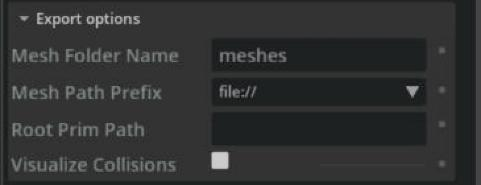

# Export URDF

## Learning Objectives

After completing this tutorial, you will have learned:

- How to export a USD robot to URDF format
- How to configure the export options (mesh folder name, mesh path prefix, root prim path)
- How USD collision APIs and visibility map to URDF visual / collision meshes
- The limitations of the exporter
- How to verify the exported result

## Getting Started

### Prerequisites

- Complete the Quick Tutorials (basic operations) in Isaac Sim.
- Completing [Tutorial 1: Import URDF](01_import_urdf.md) first makes the verification (re-import) step easier to follow.

### Estimated Time

Approximately 10-20 minutes.

### Overview

In this tutorial, you will learn how to convert a USD robot to URDF using the **USD to URDF Exporter** extension. The flow is:

1. **Enable the exporter** — enable the extension to add the menu entry
2. **Export the Franka robot** — output a URDF file and meshes from USD
3. **Verify the result** — check with an online URDF viewer or by re-importing
4. **Export options** — control the mesh destination and path format
5. **Collision / visibility mapping experiment** — see how USD settings are reflected in the URDF

!!! note "Why USD → URDF conversion has constraints"
    USD is a far more expressive format than URDF. Every robot describable in URDF can be described in USD, but the converse does not hold (URDF cannot express closed-loop structures or arbitrary geometry hierarchies, for example). Because there is no one-to-one correspondence between USD and URDF, the USD → URDF conversion imposes several assumptions and constraints. See the "Limitations" section at the end of this page.

## Step 1: Enable the Exporter

1. Open **Window > Extensions** and type `urdf` in the search bar.
2. Click the toggle of the **Isaac Sim USD to URDF Exporter** (`isaacsim.asset.exporter.urdf`) extension to enable it.

Once enabled, **File > Export to URDF** is added to the menu. Selecting it opens an export dialog titled **Export As ...** with an **Export options** pane on the right:

## Step 2: Export the Franka Robot

1. Open the Franka robot USD. It is located at `/Isaac/Robots/FrankaRobotics/FrankaPanda/franka.usd` under the Isaac Sim assets root (reachable from the Isaac Sim assets in the Content browser).
2. Once the USD has finished loading, open **File > Export to URDF**. A file-selection dialog appears.
3. Specify the output folder and file name.
4. Click **Export**.

!!! warning "Export from a stage that opens the robot USD directly"
    Export from a stage where the robot USD is opened directly via **File > Open**. In a stage right after **File > Import** (URDF import), the robot is added as a **reference** to an external USD, and exporting it as-is produces an almost empty URDF with a single link even when Root Prim Path is set (confirmed on Isaac Sim 5.1.0). Re-open the USD file generated by the import, then export — the output will be correct.

Open the output folder and confirm that the following were generated:

- `franka.urdf` — the URDF file itself
- `meshes` directory — the robot's mesh files (`.obj`)

## Step 3: Verify the Exported Result

You can check whether the exported URDF is correct in two ways:

1. **Re-import into Isaac Sim** — convert the URDF back to USD following [Tutorial 1: Import URDF](01_import_urdf.md) and confirm the structure is preserved.
2. **Check with an online URDF viewer** — drag and drop **the entire output directory** onto the [URDF Viewer Example](https://gkjohnson.github.io/urdf-loaders/javascript/example/bundle/index.html) site to display the URDF in the browser and move each joint with sliders.

## Step 4: Export Options

### Mesh Folder Name

The name of the folder where meshes (`.obj` files) are saved. The default is `meshes`, created in the same directory as the URDF file.

### Mesh Path Prefix

Choose one of three path formats used to reference mesh files inside the URDF:

| Prefix | Format | Use case |
|---|---|---|
| `file://` | Absolute paths (default) | Local checking. Note that paths break when moved to another environment |
| `package://` | ROS package paths | Use this when consuming the URDF as a ROS / ROS 2 package |
| `./` | Relative paths | Distributing the URDF and meshes together in the same folder layout |

!!! note "When using package://"
    If you choose `package://`, specify the package name in the **Package Name** field. If left empty, the URDF file name is used as the package name.

### Root Prim Path

When exporting from a robot-only asset file, the default prim becomes the root prim and no value is needed. When exporting from a **scene** containing many non-robot objects, specify which prim represents the robot (e.g. `/World/robot_name`) to export only the robot.

!!! warning "Exporting from a scene without Root Prim Path"
    If the stage contains prims other than the robot and you click **Export** without setting Root Prim Path, the export does not run: only a brief error toast appears at the bottom left and the dialog stays open. The error is easy to miss.

## Step 5: Understanding the Collision / Visibility Mapping

In URDF, it is common to define two kinds of meshes separately for a single link:

- **Visual mesh** (`<visual>`) — detailed geometry for appearance
- **Collision mesh** (`<collision>`) — simplified geometry for collision computation

USD has no such visual/collision distinction. Instead, adding the **PhysicsCollisionAPI** to a prim makes it a collision object for the physics engine, and each prim can be toggled **visible / invisible**. The USD to URDF Exporter generates URDF visual / collision meshes from the combination of these two attributes:

| PhysicsCollisionAPI | Visibility | URDF output |
|---|---|---|
| absent | visible | visual mesh only |
| present | visible | visual mesh + collision mesh |
| present | invisible | collision mesh only |

Let's confirm this mapping with the following experiment.

### 5-1. Add a Sphere to the Franka

1. Open the Franka USD (`/Isaac/Robots/FrankaRobotics/FrankaPanda/franka.usd`).
2. In the Stage panel, right-click the `panda_hand` Xform prim and choose **Create > Mesh > Sphere** from the context menu.
3. Select the added Sphere mesh prim and set its scale x, y, z all to `0.3` in the Properties panel.

    !!! note "If you created it from the menu-bar Create menu"
        When created via the menu bar's **Create > Mesh > Sphere**, the sphere is not created as a child of the selected prim; it is created at the stage root (e.g. `/World/Sphere`) even with a prim selected. In that case, drag and drop the Sphere onto `panda_hand` in the Stage panel to reparent it.

4. Confirm the hand now has a sphere attached, like this:

    

### 5-2. No Collision API, Visible → Visual Mesh Only

1. Export the stage in this state following the same procedure as Step 2 (the USD itself does not need to be saved).
2. Drag the output directory onto the [URDF Viewer Example](https://gkjohnson.github.io/urdf-loaders/javascript/example/bundle/index.html) to display it.

    

3. Enable the viewer's **Show Collision** option; all collision meshes are highlighted in gold.
4. Confirm the **sphere is not highlighted in gold** — in the URDF, the sphere is a visual mesh and not a collision mesh.

### 5-3. Collision API, Visible → Visual + Collision

1. Back in the Franka USD, add a collision API to the sphere. Select the Sphere prim and choose **Physics > Colliders Preset** from the **+Add** button in the Properties panel.
2. Export the stage to URDF again and drag the output directory onto the viewer (you may need to reload the viewer page before loading the new URDF).

    

3. Enable **Show Collision** and confirm that **this time the sphere is highlighted in gold**. The sphere is now both a visual mesh and a collision mesh in the URDF.

### 5-4. Collision API, Invisible → Collision Mesh Only

1. Back in the Franka USD, disable the "eye" icon next to the Sphere prim in the Stage panel to make the sphere invisible.

    

2. Export again and check in the viewer. The sphere is not shown at first, but enabling **Show Collision** shows the sphere in gold. The sphere is exported only as a collision mesh, not a visual mesh.

    

!!! warning "The behavior in 5-4 may not reproduce on all versions"
    Testing on Isaac Sim 5.1.0 (USD to URDF Exporter 1.3.4) on Windows, exporting with the sphere invisible (visibility = invisible) still produced the sphere **as a visual mesh as well** — it did not become collision-only (5-2 and 5-3 reproduced as described). This section follows the official documentation, but behavior may vary between exporter versions. After exporting, we recommend checking the `<visual>` / `<collision>` entries of the generated URDF directly.

!!! note "To export collision meshes correctly"
    For a link's collision mesh to be exported to URDF correctly (as collision-only), the prim must **have a collision API and be set to invisible**.

    Conversely, to also output all collision-API prims as visual meshes regardless of visibility, enable the **Visualize Collisions** checkbox in the **Export options** of the export dialog.

## Limitations

For a USD robot to be exportable to URDF, all of the following constraints must be satisfied. Violations result in errors:

- The kinematic structure must be a **tree** (no closed loops)
- Sphere geometry must have uniform scale on all axes
- Cylinder geometry must have uniform scale on the radial axes (the axes other than height)
- Both joint body frames must be at the same position and orientation
- The joint's **Body 0** must be the parent link and **Body 1** the child link
- Joint prims must be `prismatic`, `revolute`, or `fixed`
- Link prims must be `Xform`
- Sensor prims must be `Camera` or `IsaacImuSensor`
- Geometry prims must be `Cube`, `Sphere`, `Cylinder`, or `Mesh`
- Geometry prims must be **leaves** of the kinematic tree

!!! warning "Watch out for body-name overwrites"
    Depending on the robot structure, some body names may get overwritten while multiple frames are merged. After exporting, inspect the generated URDF and verify the structure is as intended.

## Summary

This tutorial covered the following topics:

1. Enabling the **USD to URDF Exporter** and the export procedure
2. Verifying the result with the **URDF viewer** and by re-importing
3. **Export options** (mesh folder name, path prefix, root prim path)
4. The rules mapping USD **collision APIs and visibility** to URDF visual / collision meshes
5. The exporter's **limitations**

### Further Learning

For the remaining options, see the official USD to URDF Exporter Extension documentation.

## Next Steps

- [Tutorial 3: Import MJCF](03_import_mjcf.md) - Learn how to import MuJoCo (MJCF) models.
