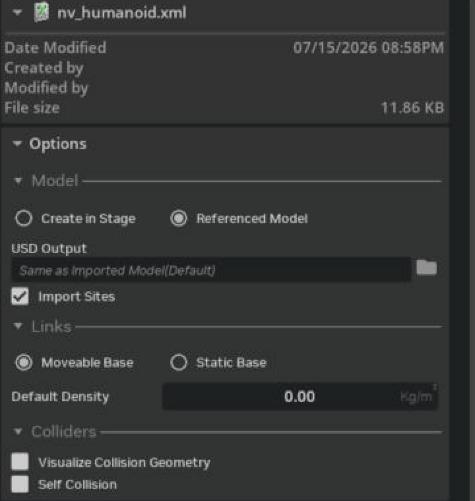

# Import MJCF

## Learning Objectives

After completing this tutorial, you will have learned:

- How to import MJCF (MuJoCo XML) models into Isaac Sim and convert them to USD
- The interactive import procedure via the GUI
- The programmatic import procedure with Python scripting
- Guidelines for tuning the articulation after import

## Getting Started

### Prerequisites

- Complete the Quick Tutorials (basic operations) in Isaac Sim.

### Estimated Time

Approximately 5-10 minutes.

### Overview

In this tutorial, you will learn how to import MJCF model files into Isaac Sim and convert them to USD. Two methods are covered: interactive import via the GUI, and Python import using the Script Editor.

!!! note "What is MJCF"
    MJCF (MuJoCo XML Format) is the model description format used by the physics simulator **MuJoCo**. Like URDF, it describes a robot's bodies (rigid bodies) and joints in XML, but it is more expressive than URDF, supporting closed-loop structures and actuator/sensor definitions. Since reinforcement-learning research has produced many model assets for MuJoCo, importing MJCF directly lets you bring those assets straight into Isaac Sim.

## Step 1: Import via the GUI

Here we import the humanoid model (`nv_humanoid.xml`) that ships with the MJCF importer extension.

### 1-1. Check the Extension

The MJCF importer (`isaacsim.asset.importer.mjcf`) is normally loaded automatically when Isaac Sim starts and is available via **File > Import**. If MJCF files do not appear among the import formats in the file-selection dialog, open **Window > Extensions** and enable `isaacsim.asset.importer.mjcf`.

### 1-2. Locate the Sample MJCF

`nv_humanoid.xml` ships with the MJCF importer extension itself. You can find it as follows:

1. Search for `isaacsim.asset.importer.mjcf` in **Window > Extensions**.
2. Click the folder icon next to **AUTOLOAD** to open the extension's installation folder.
3. `nv_humanoid.xml` is in `/data/mjcf`.

### 1-3. Select the File and Import

1. Open the file-selection dialog via **File > Import** and select `nv_humanoid.xml`.
2. When you select the file, an **Options** pane appears on the right side of the dialog. Adjust as needed (the defaults are fine). The main items are **Model** (USD Output / Import Sites), **Links** (Moveable Base / Static Base, Default Density), and **Colliders** (Visualize Collision Geometry / Self Collision). For details on each option, see the Import Options section of the official MJCF Importer Extension documentation.

    

3. Click the **Import** button. As with URDF import, a **confirmation dialog showing where the converted USD will be saved** appears. Click **Yes** and the robot is added to the stage.

!!! warning "The confirmation dialog may hide behind other windows"
    As with [URDF import](01_import_urdf.md), this confirmation dialog can open hidden behind other windows, making the app look frozen. If Isaac Sim stops responding after you click Import, move the front windows aside and answer the hidden dialog.

    

## Step 2: Import with Python Scripting

The same operation can be done from a Python script. Here we import the ant model (`nv_ant.xml`) bundled with the extension.

1. Open the Script Editor via **Window > Script Editor**.
2. Copy the following code into the Script Editor:

```python
import omni.kit.commands
from pxr import UsdLux, Sdf, Gf, UsdPhysics, PhysicsSchemaTools

# Create a new stage
omni.usd.get_context().new_stage()

# Create the import config
status, import_config = omni.kit.commands.execute("MJCFCreateImportConfig")
import_config.set_fix_base(False)            # Do not fix the base (let it move freely)
import_config.set_make_default_prim(False)   # Do not make it the default prim

# Get the extension's installation path
ext_manager = omni.kit.app.get_app().get_extension_manager()
ext_id = ext_manager.get_enabled_extension_id("isaacsim.asset.importer.mjcf")
extension_path = ext_manager.get_extension_path(ext_id)

# Import the MJCF
omni.kit.commands.execute(
    "MJCFCreateAsset",
    mjcf_path=extension_path + "/data/mjcf/nv_ant.xml",
    import_config=import_config,
    prim_path="/ant"
)

# Get a handle to the stage
stage = omni.usd.get_context().get_stage()

# Create a physics scene
scene = UsdPhysics.Scene.Define(stage, Sdf.Path("/physicsScene"))

# Set gravity
scene.CreateGravityDirectionAttr().Set(Gf.Vec3f(0.0, 0.0, -1.0))
scene.CreateGravityMagnitudeAttr().Set(981.0)

# Add a light
distantLight = UsdLux.DistantLight.Define(stage, Sdf.Path("/DistantLight"))
distantLight.CreateIntensityAttr(500)
```

3. Click **Run** (Ctrl + Enter) and the ant robot is imported.

### Code Highlights

| Command / setting | Description |
|---|---|
| `MJCFCreateImportConfig` | Creates the import configuration object |
| `set_fix_base(bool)` | Whether to fix the base link to the world. `False` for walking robots |
| `set_make_default_prim(bool)` | Whether to make the imported robot the stage's default prim |
| `MJCFCreateAsset` | Parses the MJCF and imports it at the path given by `prim_path` |

!!! warning "The gravity magnitude 981.0 depends on the stage units"
    The official sample's `CreateGravityMagnitudeAttr().Set(981.0)` assumes the stage's **distance unit is centimeters** (981 cm/s² = 9.81 m/s²). If the stage unit is meters (the default in recent Isaac Sim), specify `9.81` instead. Gravity 100× too strong causes unnatural behavior such as the robot being slammed into the ground.

!!! note "There is no ground, so the robot falls"
    This sample sets up a physics scene and gravity but **does not create a ground plane**. If you play the simulation as-is, the robot keeps falling. To check the behavior, add a ground via **Create > Physics > Ground Plane** before playing.

## Post-Import Adjustments

A robot is usable in simulation as soon as it is imported into the stage. You can further improve simulation stability by adding sensors, changing materials, and updating joint drives and other settings.

Robots are treated as **articulations** in the simulation. For articulation tuning, see the official Articulation Stability Guide as well as [Robot Setup Tutorial 11: Tuning Joint Drive Gains](../robot_setup/11_joint_tuning.md).

## Summary

This tutorial covered the following topics:

1. Importing an MJCF file via the **GUI** (humanoid example)
2. Importing with **Python scripting** (ant example) and setting up the physics scene
3. Guidelines for **articulation tuning** after import

### Further Learning

For details on the import options, see the official MJCF Importer Extension documentation.

## Next Steps

- [Tutorial 4: Importing General 3D Models](04_general_3d_model_importer.md) - Learn how to import general 3D models such as OBJ / FBX and add physics properties.
