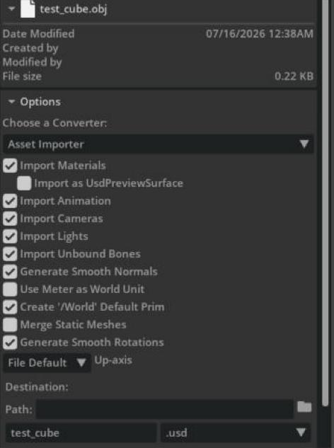

# Importing General 3D Models

## Learning Objectives

After completing this tutorial, you will have learned:

- How to import general 3D model files such as OBJ / FBX into Isaac Sim and convert them to USD
- How units, scale, and up-axis are handled during import
- How to add physics properties (Rigid Body / Collider) to an imported model and use it in simulation

## Getting Started

### Prerequisites

- Familiarity with basic Isaac Sim operations
- Experience with the **File > Import** workflow (e.g. from [Tutorial 1: Import URDF](01_import_urdf.md))

### Estimated Time

Approximately 5-10 minutes.

### Overview

Besides robot description formats (URDF / MJCF), Isaac Sim can import common 3D model formats such as OBJ, FBX, and glTF. This is the most general import path, used when you want to place obstacles, furniture, props, and other objects in a scene.

In this tutorial, using an OBJ file as the example, we walk through the whole flow: import → unit and scale adjustment → physics properties → simulation.

!!! note "About ShapeNet and other 3D model datasets"
    Isaac Sim used to have a dedicated importer extension for the ShapeNet database (`omni.isaac.shapenet`), but it has been **deprecated and removed**. Models from ShapeNet and other datasets can be imported with the procedure on this page (the standard file import).

## Step 1: Prepare a Model File

Prepare the 3D model file you want to import (`.obj`, `.fbx`, etc.). For the OBJ format, the `.obj` file itself usually comes as a set with a material file (`.mtl`) and texture images. Place the whole set of files in the same folder.

## Step 2: Import via File > Import

1. Open **File > Import** and select the model file (e.g. `.obj`).
2. When you select the file, the **Options** pane on the right side of the dialog shows the **Asset Importer** conversion options:

    

    | Key option | Description |
    |---|---|
    | **Import Materials** | Whether to import materials (.mtl / textures) |
    | **Use Meter as World Unit** | Whether to treat the model's units as meters |
    | **Create '/World' Default Prim** | Whether to create `/World` as the default prim |
    | **Up-axis** | The model's up axis (defaults to the file's setting) |
    | **Destination (Path)** | Output location of the converted USD. Same folder as the model if empty |

3. Click **Import**. The model is converted to USD and added to the stage.

!!! note "How the import works"
    This import **generates a converted USD file** in the same folder as the original file (or at the location specified by Destination), and a prim is added to the current stage as a reference to that USD (more precisely, a **payload**: similar to a normal Reference, but a referencing mechanism whose loading can be deferred and unloaded until needed). The original model file is never modified.

!!! tip "Watch out for units and scale"
    If the stage and model units differ, a "Mismatched units found ..." notification appears and `unitsResolve` corrections (scale and rotation) are added to the prim automatically. Also, models distributed in datasets are often saved in normalized units (around size 1) and do not match real-world dimensions. After importing, adjust **Transform > Scale** in the Property panel to match the actual object size.

## Step 3: Add Physics Properties

A freshly imported model is a visual-only object and does not respond to physics simulation. To use it in simulation:

1. Select the model prim and apply **Physics > Rigid Body with Colliders Preset** from the **+Add** button in the Property panel (the model becomes a "dynamic rigid body" that falls under gravity and collides with other objects).
2. To use the model as a static obstacle, apply only **Physics > Colliders Preset** instead.
3. After applying, confirm that **Rigid Body** and **Collider** sections have been added to the Property panel. Set the mass and physics material (friction coefficients, etc.) as needed.

## Step 4: Verify in Simulation

1. If the scene has no ground, add one with **Create > Physics > Ground Plane**.
2. Start the simulation with the **PLAY** button and confirm the model lands and comes to rest on the ground.

See [Core API Tutorial 7: Adding Props](../core_api/07_adding_props.md) for details on configuring physics properties.

## Summary

This tutorial covered the following topics:

1. Importing general 3D models (OBJ, etc.) via **File > Import** and the Asset Importer options
2. Automatic **unit/scale** correction and matching real-world dimensions
3. Adding physics properties with **Rigid Body with Colliders Preset / Colliders Preset**
4. Verifying in simulation with a **Ground Plane** added

This completes the Importer/Exporter tutorial series.

## Next Steps

- Return to the [Import & Export tutorial index](index.md)
- Learn how to rig and tune imported robots in the [Robot Setup tutorials](../robot_setup/index.md)
