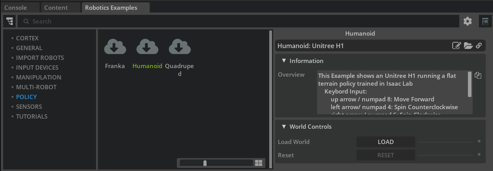
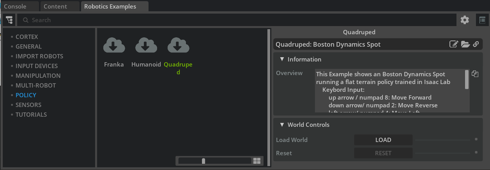

# Deploying Policies in Isaac Sim

## Learning Objectives

After completing this tutorial, you will know:

- How to run the **H1 (humanoid) / Spot (quadruped)** flat-terrain locomotion policy demos
- The **training and export** workflow for policies in Isaac Lab
- How to read the **environment parameter files (`env.yaml` / `agent.yaml`)** that Isaac Lab generates
- The structure of the **Policy Controller class** that drives a robot with a policy
- How to convert **position outputs to torque controls** (actuator networks)
- The **debugging procedure** for when a policy does not work
- The entry point to **Sim-to-Real** deployment

## Getting Started

### Prerequisites

- Familiarity with basic Isaac Sim usage and Python scripting ([Core API tutorials](../core_api/index.md))
- Understanding the basics of articulations and joint drives ([Robot Setup Tutorial 13: Rig a Legged Robot](../robot_setup/13_rig_legged_robot.md)) will make this tutorial easier to follow
- Running the demos (Step 1) and reading the definition files can be done with **Isaac Sim alone**. Complete the [Isaac Lab Setup](00_setup.md) only if you want to run the training / export of Step 2 yourself

### Estimated Time

About 20–30 minutes

### Overview

This tutorial walks through the process of **deploying a policy trained in Isaac Lab into Isaac Sim**, following the samples and robot definition files.

There are many situations where you want to run a trained policy in Isaac Sim. For example:

- You want the robot to perform complex locomotion
- You want to combine the policy with other stacks such as navigation or localization and test them together in simulation
- You want to use the policy through an existing interface such as the ROS 2 bridge

!!! note "Division of roles between Isaac Lab and Isaac Sim"
    **Isaac Lab** is a robot learning framework built on top of Isaac Sim, providing APIs and sample environments for reinforcement and imitation learning. A **policy** here means a trained neural network (control policy) that takes observations (joint positions, velocities, commands, ...) as input and outputs actions (such as target positions for each joint). The typical workflow is:

    1. Train a policy in **Isaac Lab** using thousands of parallel environments
    2. Export the trained policy as TorchScript (a `.pt` file)
    3. Load the policy in **Isaac Sim** and run inference to drive a single robot ← the scope of this tutorial

    The crucial point is to **reproduce the training-time environment configuration (joint order, gains, observation scales, ...) exactly on the inference side**. If these disagree, the robot will not walk properly. The debugging section of this tutorial is essentially a guide to finding such mismatches.

## Step 1: Try the Demos

Let's first experience the finished result. Enable **Window > Examples > Robotics Examples** and open the **Robotics Examples** tab at the bottom of the screen.

### 1-1. Unitree H1 Humanoid Example

1. Create an empty stage (**File > New From Stage Template > Empty**).
2. Open **Robotics Examples > POLICY > Humanoid**.
    
3. Press **LOAD** to load the scene.

In this example, the **H1 Flat Terrain Policy** trained in Isaac Lab controls the humanoid's locomotion.


You can drive it with the keyboard:

| Action | Key |
|---|---|
| Move forward | ↑ / NUM 8 |
| Turn left | ← / NUM 4 |
| Turn right | → / NUM 6 |

### 1-2. Boston Dynamics Spot Quadruped Example

1. Create an empty stage.
2. Open **Robotics Examples > POLICY > Quadruped**.
    
3. Press **LOAD** to load the scene.

In this example, the **Spot Flat Terrain Policy** controls the quadruped's locomotion.


| Action | Key |
|---|---|
| Move forward | ↑ / NUM 8 |
| Move backward | ↓ / NUM 2 |
| Move left | ← / NUM 4 |
| Move right | → / NUM 6 |
| Turn left | N / NUM 7 |
| Turn right | M / NUM 9 |

!!! note "Standalone examples and policy files"
    For the standalone (non-UI) workflow and for the policy files used by these examples, see the official documentation of the `isaacsim.robot.policy.examples` extension.

## Step 2: Training and Exporting in Isaac Lab

### 2-1. Training

The first step toward deploying a policy is training it in Isaac Lab. For training existing or custom tasks, see the [Isaac Lab tutorials](https://isaac-sim.github.io/IsaacLab/main/source/tutorials/03_envs/run_rl_training.html).

The task names of the policies used in the demos above are:

- Unitree H1: `Isaac-Velocity-Flat-H1-v0`
- Boston Dynamics Spot: `Isaac-Velocity-Flat-Spot-v0`

For example, the command to train the H1 flat-terrain policy with Isaac Lab 2.0 is:

```bash
./isaaclab.sh -p scripts/reinforcement_learning/rsl_rl/train.py --task Isaac-Velocity-Flat-H1-v0 --headless
```

### 2-2. Export

A policy trained with RSL-RL can be exported by running `scripts/reinforcement_learning/rsl_rl/play.py` in the Isaac Lab workspace.

```bash
./isaaclab.sh -p scripts/reinforcement_learning/rsl_rl/play.py --task Isaac-Velocity-Flat-H1-v0 --num_envs 32
```

!!! note "Where and when the export happens"
    The export runs once, **right at startup of `play.py`** (immediately after the checkpoint is loaded). The robot walking that follows is just policy playback and has nothing to do with the export — by the time the window opens, the export is already done, so you can simply close it.

    The files are generated **not** next to `play.py`, but alongside the loaded checkpoint, under the `logs` folder in the root of the IsaacLab repository. For the H1 flat-terrain task:

    ```
    logs/rsl_rl/h1_flat/<training run timestamp>/exported/
    ├── policy.pt      (TorchScript format)
    └── policy.onnx    (ONNX format)
    ```

!!! note "Policies trained with other frameworks"
    Inference is also possible with policies trained by other reinforcement learning frameworks, or with mid-training snapshots, but additional data such as the neural network structure may be required. Follow the documentation of the framework you are using.

    The pre-trained policy files used in the demos can be downloaded from the Policy Example extension page of the official documentation.

## Step 3: Reading the Environment Parameter Files

When you run training, two YAML files are generated together with the trained policy, under the `logs/rsl_rl/<experiment name>/<timestamp>/params/` folder (`logs/rsl_rl/h1_flat/<timestamp>/params/` for the H1 flat-terrain task):

- **`agent.yaml`** — describes the neural network parameters
- **`env.yaml`** — describes the environment and robot configuration. **This is the most important file: it is the "ground truth" you match the Isaac Sim side against at deployment time**

Below we look at each section, using excerpts from the `env.yaml` of `Isaac-Velocity-Flat-H1-v0`.

!!! note "The contents of env.yaml change with the Isaac Lab version"
    The excerpts below are based on an `env.yaml` generated with the Isaac Lab available at the time of writing (main branch, matching Isaac Sim 5.1.0). The official tutorial shows excerpts from an older version, featuring the `omni.isaac.lab.*` namespace (renamed to `isaaclab.*` in Isaac Lab 2.0) and the now-removed `disable_contact_processing` / `use_gpu_pipeline` keys. Even if the keys and their order in your generated file differ slightly, the points to check (dt, gravity, gains, scales, ...) remain the same.

### 3-1. Simulation Settings (sim)

```yaml
sim:
  physics_prim_path: /physicsScene
  device: cuda:0
  dt: 0.005
  render_interval: 4
  gravity: !!python/tuple
  - 0.0
  - 0.0
  - -9.81
  enable_scene_query_support: false
  use_fabric: true
```

This is followed by the `physx:` (solver settings), `physics_material:` (ground friction, etc.), and `render:` subsections.

This policy was trained assuming the physics simulation runs at **dt = 0.005 s (200 Hz)** with gravity of 9.81 m/s² pointing down. The Physics Scene at the deployment target must match this.

### 3-2. Robot Initial State (scene: robot: init_state)

Describes the robot's initial position, orientation, and velocity, plus the default position and velocity of each joint:

```yaml
init_state:
  pos: !!python/tuple
  - 0.0
  - 0.0
  - 1.05
  rot: !!python/tuple
  - 1.0
  - 0.0
  - 0.0
  - 0.0
  lin_vel: !!python/tuple
  - 0.0
  - 0.0
  - 0.0
  ang_vel: !!python/tuple
  - 0.0
  - 0.0
  - 0.0
  joint_pos:
    .*_hip_yaw: 0.0
    .*_hip_roll: 0.0
    .*_hip_pitch: -0.28
    .*_knee: 0.79
    .*_ankle: -0.52
    torso: 0.0
    .*_shoulder_pitch: 0.28
    .*_shoulder_roll: 0.0
    .*_shoulder_yaw: 0.0
    .*_elbow: 0.52
  joint_vel:
    .*: 0.0
```

!!! note "Notation like `.*_hip_yaw`"
    Joint names are specified as **regular expressions**. `.*_knee` matches both `left_knee` and `right_knee`. The default joint positions are used as the reference values (offsets) for the policy's observations and actions, so getting even one of them wrong on the deployment side distorts the gait (see the debugging section below).

### 3-3. Actuators (actuators)

Describes the physical characteristics of each joint (effort limit, velocity limit, stiffness, damping):

```yaml
actuators:
  legs:
    class_type: isaaclab.actuators.actuator_pd:ImplicitActuator
    joint_names_expr:
    - .*_hip_yaw
    - .*_hip_roll
    - .*_hip_pitch
    - .*_knee
    - torso
    effort_limit: null
    velocity_limit: null
    effort_limit_sim: 300
    velocity_limit_sim: null
    stiffness:
      .*_hip_yaw: 150.0
      .*_hip_roll: 150.0
      .*_hip_pitch: 200.0
      .*_knee: 200.0
      torso: 200.0
    damping:
      .*_hip_yaw: 5.0
      .*_hip_roll: 5.0
      .*_hip_pitch: 5.0
      .*_knee: 5.0
      torso: 5.0
```

Match the joint drives (stiffness / damping) of the robot on the deployment side to these values.

!!! note "Keys with the `_sim` suffix, such as `effort_limit_sim`"
    In current Isaac Lab, the effort and velocity limits applied to the simulation are expressed by the `effort_limit_sim` / `velocity_limit_sim` keys (corresponding to `effort_limit: 300` in older excerpts). A `null` key means the default value from the robot definition is used as-is.

### 3-4. Observations (observations)

Describes the composition of the policy's inputs (observations) and the scale, clip, and noise applied to them:

```yaml
observations:
  policy:
    concatenate_terms: true
    concatenate_dim: -1
    enable_corruption: true
    history_length: null
    flatten_history_dim: true
    base_lin_vel:
      func: isaaclab.envs.mdp.observations:base_lin_vel
      params: {}
      modifiers: null
      noise:
        func: isaaclab.utils.noise.noise_model:uniform_noise
        operation: add
        n_min: -0.1
        n_max: 0.1
      clip: null
      scale: null
      history_length: 0
      flatten_history_dim: true
```

After `base_lin_vel`, the observation terms `base_ang_vel`, `projected_gravity`, `velocity_commands`, `joint_pos`, `joint_vel`, and `actions` follow in the same format. This ordering corresponds to the layout of the observation tensor assembled in Step 4.

### 3-5. Actions (actions)

Describes the type of the policy's outputs (actions) and the scale and offset applied to them:

```yaml
actions:
  joint_pos:
    class_type: isaaclab.envs.mdp.actions.joint_actions:JointPositionAction
    asset_name: robot
    debug_vis: false
    clip: null
    joint_names:
    - .*
    scale: 0.5
    offset: 0.0
    preserve_order: false
    use_default_offset: true
```

In this example, the target joint position is the policy output multiplied by **scale 0.5**, with the default joint position added as an offset.

### 3-6. Commands (commands)

Describes the type and allowed ranges of the commands given to the policy (in this example, reference velocities):

```yaml
commands:
  base_velocity:
    class_type: isaaclab.envs.mdp.commands.velocity_command:UniformVelocityCommand
    resampling_time_range: !!python/tuple
    - 10.0
    - 10.0
    debug_vis: true
    asset_name: robot
    heading_command: true
    heading_control_stiffness: 0.5
    rel_standing_envs: 0.02
    rel_heading_envs: 1.0
    ranges:
      lin_vel_x: !!python/tuple
      - 0.0
      - 1.0
      lin_vel_y: !!python/tuple
      - 0.0
      - 0.0
      ang_vel_z: !!python/tuple
      - -1.0
      - 1.0
      heading: !!python/tuple
      - -3.141592653589793
      - 3.141592653589793
```

The policy was trained with forward velocities in the range 0–1 m/s and turning velocities in the range -1–1 rad/s (with the lateral velocity `lin_vel_y` fixed at 0), so there is no guarantee it behaves correctly if you command values outside these ranges at deployment time.

## Step 4: Structure of the Policy Controller Class

The demo robots are controlled by a **robot definition class (Policy Controller)**. This class is responsible for defining the robot prim, loading the policy, matching the robot configuration to the policy, assembling the observation tensor, and applying the policy's outputs to the robot. Let's look at the main methods in order.

| Method | Role |
|---|---|
| Constructor | Spawns the robot USD and creates the Articulation object used for control |
| `load_policy` | Loads the policy file and the corresponding environment file (`env.yaml`) |
| `initialize` | Called once after the simulation starts. Configures the control mode (effort/torque commands vs. position commands), joint gains, maximum effort and velocity, and the articulation root to match the policy |
| `_set_articulation_prop` | Parses the articulation root properties and applies them to the robot |
| `_compute_observation` | Assembles the observation tensor (must be overridden in a subclass) |
| `_compute_action` | Runs policy inference on the observation to obtain the action |
| `forward` | Called every physics step; generates and applies the control action (must be overridden in a subclass) |

### 4-1. Assembling the Observation Tensor (_compute_observation)

Build the observation tensor exactly in the format the policy expects. The following is the example for the H1 flat-terrain policy (observation dimension 69):

```python
obs = torch.zeros(69, device=torch.device(str(self.robot._device)))
# Base linear velocity
obs[:3] = lin_vel_b.squeeze()
# Base angular velocity
obs[3:6] = ang_vel_b.squeeze()
# Gravity vector (in body frame)
obs[6:9] = gravity_b.squeeze()
# Commands (forward velocity, lateral velocity, yaw rate)
obs[9:12] = command
# Joint states (offsets from default positions and velocities)
current_joint_pos = wp.to_torch(self.robot.get_dof_positions())
current_joint_vel = wp.to_torch(self.robot.get_dof_velocities())
obs[12:31] = current_joint_pos - self.default_pos
obs[31:50] = current_joint_vel - self.default_vel
# Previous action
obs[50:69] = self._previous_action
```

!!! note "The 6.0 samples are Warp + PyTorch based"
    The policy samples in Isaac Sim 6.0 (`isaacsim.robot.policy.examples`) were rewritten to use the `isaacsim.core.experimental` Articulation API. Robot states are returned as [Warp](https://nvidia.github.io/warp/) (NVIDIA's GPU computing library) arrays, so observations and actions are assembled by converting to and from PyTorch tensors with `wp.to_torch()` / `wp.from_torch()`. This is the main difference from the NumPy-based 5.x code.

!!! warning "Don't forget the observation scales"
    Remember to multiply each observation term by the observation scale specified in `env.yaml`.

### 4-2. Generating the Control Action (forward)

Called every physics step; turns the policy's output into commands for the robot:

```python
if self._policy_counter % self._decimation == 0:
    obs = self._compute_observation(command)
    self.action = self._compute_action(obs)
    self._previous_action = self.action.clone()
    self.robot.set_dof_position_targets(positions=wp.from_torch(self.default_pos + (self.action * self._action_scale)))

self._policy_counter += 1
```

!!! note "Decimation and action scale"
    - Policy inference does not need to run every step. Skip steps according to the **decimation** parameter in `env.yaml` (e.g. physics at 200 Hz with inference at 50 Hz means decimation = 4).
    - Remember to multiply the policy output by the **action scale** specified in `env.yaml`.

!!! warning "Do not set joint positions directly"
    For position-based control, do not use the functions that set joint positions directly (`set_joint_position()` in the old API, `set_dof_positions()` in the experimental API). They **teleport** the joints to the target positions and are not a physical drive. Always set the joint drive **targets** with `set_dof_position_targets()` (`apply_action()` in the old API).

## Step 5: Converting Position Outputs to Torque Controls

Some robots require torque as the control input. If the policy outputs positions, a position-to-torque conversion is needed. There are several ways to do this; here we show an example using an **actuator network** (a neural network that mimics the response of the real actuator).

The actuator network class is defined in `source/extensions/isaacsim.robot.policy.examples/isaacsim/robot/policy/examples/utils/actuator_network.py`. The actuator network file for the ANYmal robot is available in the Content browser under **SAMPLES > POLICY > ANYMAL_POLICIES**.

### 5-1. Loading the Actuator Network

In `initialize` of the ANYmal Flat Terrain Policy class, the policy file is loaded into an LSTM-based SEA (Series Elastic Actuator) network (`LstmSeaNetwork`):

```python
def initialize(self, physics_sim_view=None) -> None:
    """
    Initialize the articulation and set the drive mode
    """
    super().initialize(physics_sim_view=physics_sim_view, control_mode="effort")

    # Actuator network
    assets_root_path = get_assets_root_path()
    file_content = omni.client.read_file(
        assets_root_path + "/Isaac/IsaacLab/ActuatorNets/ANYbotics/anydrive_3_lstm_jit.pt"
    )[2]
    file = io.BytesIO(memoryview(file_content).tobytes())
    self._actuator_network = LstmSeaNetwork()
    self._actuator_network.setup(file, self.default_pos)
    self._actuator_network.reset()
```

### 5-2. Running the Actuator Network

In `advance` (the per-step processing), the positions output by the locomotion policy are fed into the actuator network, and the resulting torques are applied to the robot:

```python
current_joint_pos = self.get_joint_positions()
current_joint_vel = self.get_joint_velocities()

joint_torques, _ = self._actuator_network.compute_torques(
    current_joint_pos, current_joint_vel, self._action_scale * self.action
)

self.set_joint_efforts(joint_torques)
```

## Step 6: Debugging Tips

Robots rarely work on the first try. When things don't work, check the following in order.

### 6-1. Verify the Policy Itself

First, confirm that the policy works correctly inside Isaac Lab by [playing the trained agent in Isaac Lab](https://isaac-sim.github.io/IsaacLab/main/source/tutorials/03_envs/run_rl_training.html#playing-the-trained-agent). Use the `play.py` matching your workflow and the correct task name.

### 6-2. Verify the Joint Order

If it works in Isaac Lab, the next suspect is the **joint order**. The policy's observations and actions depend on the joint ordering, so the joint names and order must **match exactly** between the asset used in Isaac Sim and the asset used for training in Isaac Lab.

You can check the joint order with this snippet:

```python
# Open the target USD and PLAY the simulation before running this
# Change the path to the robot you want to inspect
prim = Articulation(paths="/World/Robot")
print(str(prim.dof_names))
```

Print `dof_names` on both the Isaac Sim side and the Isaac Lab side, and compare that the names and order match.

In the example below, the ordering of the control commands sent to ANYmal is wrong, so the robot falls over:


### 6-3. Verify the Default Joint Positions

If the joint order matches, check that the default joint positions are set correctly. If these are wrong, the joints will not go to the right positions.

In the example below, the ankle joint configuration is wrong, and H1 "moonwalks" on tiptoe:


### 6-4. Verify the Joint Properties

If the joints move too much or too little, suspect the joint properties (stiffness / damping / effort limits, etc.):

```python
# Open the target USD and PLAY the simulation before running this
# Change the path to the robot you want to inspect
prim = Articulation(paths="/World/Robot")
print("DOF names:", prim.dof_names)
print("DOF types:", prim.dof_types)
print("DOF limits:", prim.get_dof_limits())
print("DOF gains (stiffness, damping):", prim.get_dof_gains())
print("DOF max efforts:", prim.get_dof_max_efforts())
print("DOF max velocities:", prim.get_dof_max_velocities())
print("DOF drive types:", prim.get_dof_drive_types())
print("DOF friction:", prim.get_dof_friction_properties())
print("DOF armatures:", prim.get_dof_armatures())
```

Compare the output with the actuators section of `env.yaml`.

If stiffness / damping are too high, the motion becomes stiff and suppressed (overdamped, so the joints don't follow the policy's commands):


If they are too low, the robot moves too much (e.g. shaking arms):


### 6-5. Verify the Simulation Environment

If the robot side matches perfectly and it still doesn't work, check the simulation parameters.

**Physics Scene time step**: Set the Physics Scene's **Time Steps Per Second (Hz)** to the **inverse** of `dt` in `env.yaml` (dt = 0.005 → 200 Hz). Also make the contents of the `physx` section of `env.yaml` match the Physics Scene properties.

In the example below, the controller expects 500 Hz but the time step is set to 60 Hz, so the robot cannot walk properly:


### 6-6. Verify the Observation and Action Tensors

Finally, check the observation and action tensors:

- Is the tensor structure (dimensions, ordering) correct?
- Is the data you put into the tensor itself correct?
- Are the correct scale factors applied to inputs and outputs?
- Is the policy output in the input format and order the articulation expects?

## Sim-to-Real Deployment

At this point, the robot and policy work correctly in Isaac Sim, and you can test them combined with the rest of your stack. The next step is deployment to a real robot. As a worked example, see the NVIDIA blog article on deploying a reinforcement learning policy to Spot: [Closing the Sim-to-Real Gap: Training Spot Quadruped Locomotion with NVIDIA Isaac Lab](https://developer.nvidia.com/blog/closing-the-sim-to-real-gap-training-spot-quadruped-locomotion-with-nvidia-isaac-lab/).

Running a policy through ROS 2 is covered in [ROS 2 Tutorial 16: Running an RL Policy through ROS 2](../ros/16_rl_controller.md).

## Summary

This tutorial covered the following topics:

1. Running the **H1 / Spot locomotion policy demos**
2. The **training and export** commands in Isaac Lab
3. Reading each section of **`env.yaml`** (sim / init_state / actuators / observations / actions / commands)
4. The structure of the **Policy Controller class** (assembling observations and applying actions)
5. **Position-to-torque conversion** (actuator networks)
6. The **debugging playbook**: joint order, default positions, gains, and time step

## Next Steps

- [Tutorial 2: Getting Started with Cloner](02_cloner.md) - Learn the Cloner interface for duplicating environments in parallel, an essential ingredient of reinforcement learning.
