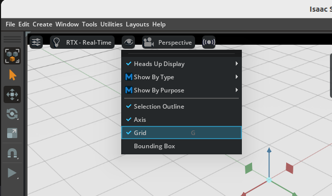

# Stage Setup

## Learning Objectives

After completing this tutorial, you will have learned:

- How to check and configure stage properties (axis orientation, units, rotation order)
- How to create a Physics Scene and configure gravity and broadphase settings
- How to add a ground plane
- How to add and adjust lighting

## Getting Started

### Prerequisites

- Isaac Sim is installed and can be launched

### Estimated Time

Approximately 10-15 minutes.

### Overview

In this tutorial, you will learn how to set up a virtual environment for physics simulation. You will configure stage properties, create a Physics Scene, and add a ground plane and lighting through GUI operations.

## Setting Up Stage Properties

1. Open **Edit > Preferences** from the menu bar and review the Stage settings.

    - **Up Axis**: Z (default) 
      The default in Isaac Sim is the Z axis. If you used a program with a different up axis when creating assets, the assets will be imported in a rotated state.
    - **Stage Units**: Meters (default) 
      Isaac Sim prior to 2022.1 used centimeters as the stage unit, but the current default is meters. Note that the default unit for Omniverse Kit is still centimeters. If USD units appear to be off by a factor of 100, keep this in mind.
    - **Rotation Order**: ZYX (default) 
      By default, rotations are applied in Z → Y → X order.

    

## Creating the Physics Scene

1. Select **Create > Physics > Physics Scene** from the menu bar.

2. In the Properties panel, review and configure the following:

    - **Gravity**: Verify the default gravity settings
    - **Enable GPU Dynamics**: Disable for efficiency
    - **Broadphase Type**: Set to MBP

    

## Adding a Ground Plane

1. Select **Create > Physics > Ground Plane** from the menu bar.

2. Click the  at the top of the viewport and enable the Grid display from the menu that appears to visually confirm the ground position.

    

## Adding Lighting

A new Stage comes with a **defaultLight** pre-placed by default. Without it, nothing would be visible. This **defaultLight** is a child element of the **Environment** Xform in the stage, and can be found in the context tree under the **Stage** tab in the upper right.

To create an additional spotlight:

1. To check light reflections, add a ground plane if one doesn't already exist. You can add one from the menu bar via **Create > Physics > Ground Plane**.
2. Select **Create > Light > Sphere Light** from the menu bar.
3. Position the light on the stage.
    - In the **Stage** tab in the upper right, select the newly created light in the context tree.
    - In the **Property** tab below, use the **Translate** tool in the **Transform** section to move it to a position above the ground plane (e.g., (0, 0, 1)).
    - In the **Property** tab's **Transform** section, use the **Orient** tool to set the rotation to (0, 60, 0).
4. Modify the light's color, brightness, and range properties:
    - In the **Property** tab, click the color bar under **Main > Color** and select a color. For example: light green (RGB: 0.5, 1.0, 0.5).
    - In the same **Property** tab, set **Main > Intensity** to **1e6** and **Main > Radius** to **0.05**.
    - In the **Shaping** section, set the cone angle to 45 degrees and cone softness to 0.05.
5. To make the new spotlight more visible, reduce the intensity of the **defaultLight**. Open its **Property** tab and set **Main > Intensity** to **300**.

    

## Summary

This tutorial covered the following topics:

1. Checking and configuring **stage properties**
2. Creating a **Physics Scene** and configuring physics engine settings
3. Adding a **ground plane**
4. Adding and adjusting **lighting**

## Next Steps

Proceed to the next tutorial, "[Assemble a Simple Robot](02_assemble_robot.md)", to learn how to build a robot using primitive shapes.
