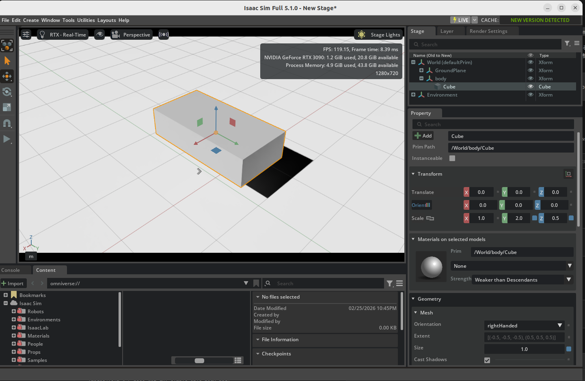
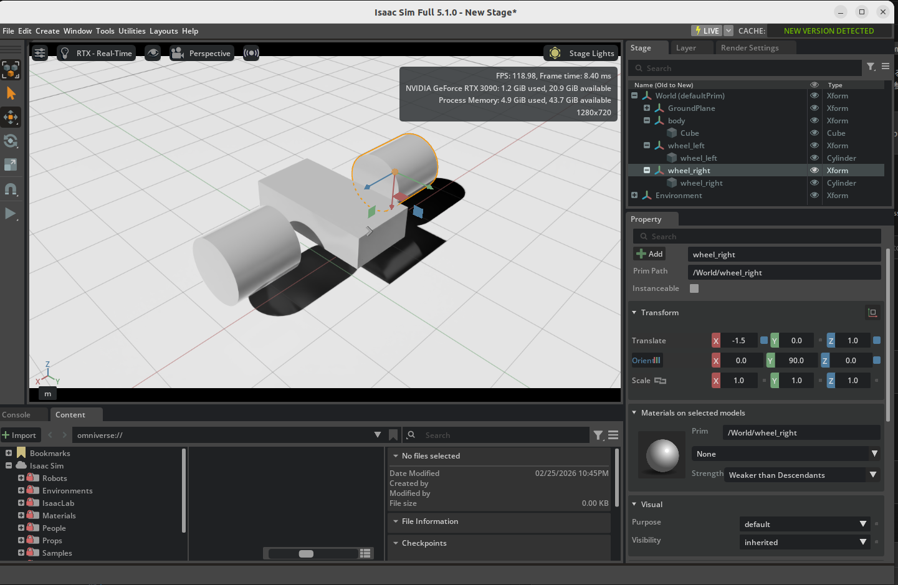
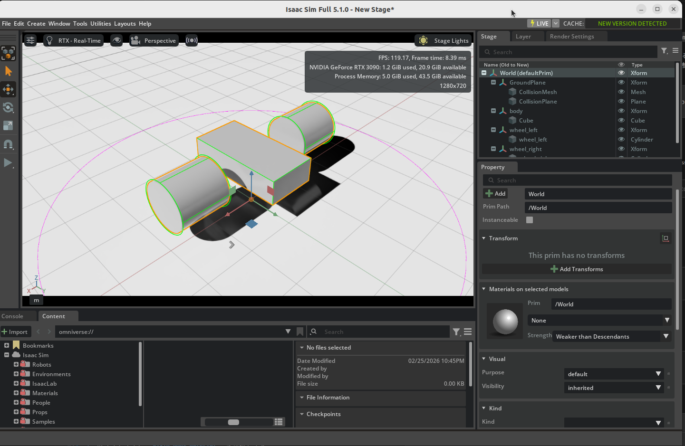

# シンプルなロボットの組み立て

## 学習目標

このチュートリアルを修了すると、以下の内容を習得できます：

- ステージへの基本形状の追加と操作
- オブジェクトへの物理プロパティの有効化
- コリジョンプロパティの確認
- 摩擦などの物理プロパティの編集
- 色や反射率などのマテリアルプロパティの編集

## はじめに

### 前提条件

- [チュートリアル 1: ステージのセットアップ](01_stage_setup.md) を完了していること

### 所要時間

約 15〜20 分

### 概要

このチュートリアルでは、GUI 操作でプリミティブ形状（キューブ、シリンダー）を使い、シンプルな二輪ロボットの基本構造を組み立てます。ロボットのボディと2つの車輪を作成し、物理プロパティの設定、コリジョンメッシュの確認、マテリアルの適用を学びます。

## 準備

1. メニューバーの**File > New** から新しい**Stage**を作成してください。
2. メニューバーの**Create > Physics > Ground Plane**でグラウンドプレーンを生成してください。

## シーンへのオブジェクト追加

### ロボットボディの作成

1. ステージ上で右クリックし、**Create > Xform** を選択します。
2. 作成された Xform を右クリックして **Rename** を選び、**body** にリネームします。
3. Property パネルの **Transform > Translate** で位置を **(0, 0, 1)** に設定します。
4. メニューバーの **Create > Shape > Cube** をクリックしてキューブを作成します。
5. Property パネルの **Transform > Translate** で位置を **(0, 0, 1)** に設定します。
6. Property パネルの **Transform > Scale** で **(2, 1, 0.5)** に設定します。
7. キューブを **body** Xform の中にドラッグ＆ドロップして子要素にします。

   

### 車輪の作成

1. ステージ上で右クリックし、**Create > Xform** を選択します。Property パネルで **Translate** を **(0, 1.5, 1)**、**Orient** を **(90, 0, 0)** に設定します。
2. **wheel_left** にリネームします。
3. ステージ上の**wheel_left**を右クリックして、 **Create > Shape > Cylinder** をクリックしてシリンダーを作成します。
4. Property パネルの **Geometry** セクションまでスクロールします。
5. **Radius** を **0.5**、**Height** を **1.0** に変更します。
7. シリンダーを **wheel_left** にリネームします。
8. **wheel_left** Xform を右クリックして **Duplicate** を選択します。
9. 複製された車輪の **Translate** の y 値を **-1.5** に移動します。
10. 複製された Xform を **wheel_right** にリネームします。
11. 複製されたシリンダーも **wheel_right** にリネームします。

    

## 物理プロパティの追加

### Rigid Body の適用

1. キューブと2つのシリンダーを **Ctrl+Shift** キーまたは **Shift** キーを使って全て選択します。
2. **Property** タブの **+ Add** ボタンをクリックします。
3. **Physics > Rigid Body with Colliders Preset** を選択します。
4. **Play** ボタンを押して、オブジェクトが地面に落下することを確認します。

!!! note "Rigid Body with Colliders Preset について"
    「Rigid Body with Colliders Preset」を選択すると、**Rigid Body API**（重力やシミュレーション上の動き）と **Collision API**（衝突判定）の両方が自動的に適用されます。

### コリジョンメッシュの確認

1. ビューポート上部のをクリックします。
2. **Show By Type > Physics > Colliders > All** を選択します。
3. Collision API が適用された静的オブジェクト（今回はグラウンドプレーン）の周りに紫色のアウトラインが表示されます。動的オブジェクト（今回はキューブと2つのシリンダー）には緑色のアウトラインが表示されます。

    

### 摩擦・反発パラメータの追加

1. メニューバーの **Create > Physics > Physics Material** をクリックします。
2. ポップアップで **Rigid Body Material** を選択します。
3. Property タブで摩擦係数（friction coefficients）や反発係数（restitution）などのパラメータを調整します。
4. ステージツリーでオブジェクトを選択します。
5. **Property** タブ内の **Materials on Selected Model** を見つけます。
6. ドロップダウンメニューから作成したマテリアルを選択して割り当てます。

    

## 外観マテリアルの設定

### ビジュアルマテリアルの作成と割り当て

1. メニューバーの **Create > Materials > OmniPBR** をクリックする動作を3セット行って、3つのマテリアルを作成します。
2. 作成されたマテリアルを右クリックして、それぞれ **ground** と **body** 、 **wheel** にリネームします。
3. 作成した**body**マテリアルを選択して、**Property** タブの**Material and Shader / Albedo** のセクションで **base color** を**RGB: (0.1, 1.0, 0.1)**変更します。
4. 反射率（reflectivity）、粗さ（roughness）などのプロパティも必要に応じて調整します。
5. 作成した**wheel**マテリアルを選択して、**Property** タブの**Material and Shader / Albedo** のセクションで **base color** を**RGB: (0.1, 0.1, 1.0)**変更します。
6. 反射率（reflectivity）、粗さ（roughness）などのプロパティも必要に応じて調整します。
7. **GroundPlane** Xfromを選択し、**Property** タブの **Materials on selected models** から**ground**マテリアルを割り当てます。
8. **body** Xfromを選択し、**Property** タブの **Materials on selected models** から**body**マテリアルを割り当てます。
9. **wheel_left** Xfromを選択し、**Property** タブの **Materials on selected models** から**wheel**マテリアルを割り当てます。
9. **wheel_right** Xfromを選択し、**Property** タブの **Materials on selected models** から**wheel**マテリアルを割り当てます。
10. 対応するロボットパーツに色の変更が反映されることを確認します。

    

## まとめ

このチュートリアルでは以下のトピックを扱いました：

1. **プリミティブ形状**（Cube、Cylinder）を使ったロボット構造の構築
2. **Rigid Body with Colliders Preset** による物理プロパティの設定
3. **コリジョンメッシュ**の可視化と確認
4. **Physics Material** による摩擦・反発係数の設定
5. **OmniPBR マテリアル**による外観の設定

!!! tip "参考アセット"
    完成したロボットは、画面右下のContentタブの**Samples > Rigging > MockRobot** フォルダ内の `mock_robot_no_joints` アセットと同様のものになります。

## 次のステップ

次のチュートリアル「[基本ロボットのアーティキュレーション](03_articulate_robot.md)」に進み、ジョイントとアーティキュレーションの設定方法を学びましょう。
