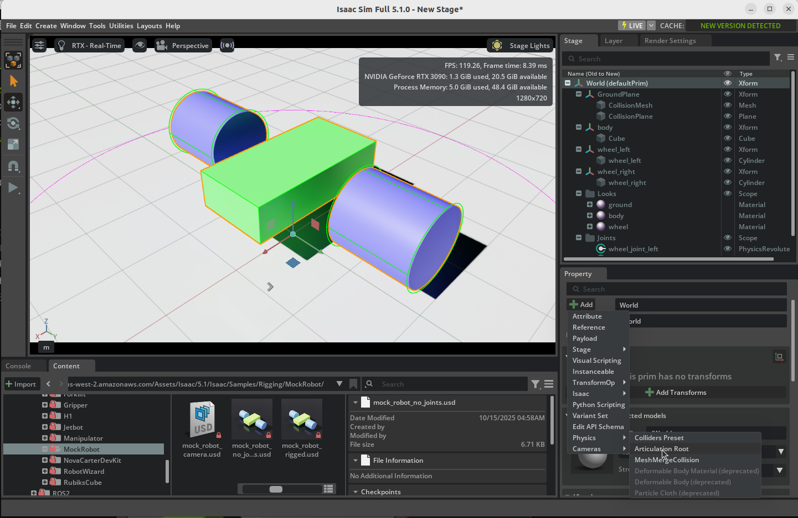

# 基本ロボットのアーティキュレーション

## 学習目標

このチュートリアルを修了すると、以下の内容を習得できます：

- ステージツリーの階層構造を整理する方法
- リジッドボディ間にジョイント（関節）を作成する方法
- ジョイントドライブ（駆動プロパティ）の設定方法
- アーティキュレーションの追加による効率的な物理シミュレーションの構築
- Articulation Velocity Controller を使ったロボットの動作制御

## はじめに

### 前提条件

- [チュートリアル 2: シンプルなロボットの組み立て](02_assemble_robot.md) を完了していること

!!! tip "チェックポイントアセットからの開始"
    前回のチュートリアルを完了していない場合は、画面右下の **Content** タブから **Samples > Rigging > MockRobot** フォルダ内の `mock_robot_no_joints` アセットをロードすることで、このチュートリアルから開始できます。ロード時は **File（参照ではなくファイルとして）** で開いてください。このチュートリアルではアセットに直接変更を加えるため、参照ではなくファイルとして開く必要があります。

### 所要時間

約 15〜20 分

### 概要

このチュートリアルでは、前回組み立てたロボットのボディと車輪を**ジョイント（関節）**で接続し、**アーティキュレーション**を設定して動くロボットに仕上げます。最後に**速度コントローラ**を追加して、シミュレーション中にロボットを制御する方法も学びます。

## ジョイントの追加

ジョイント（関節）は、2つのリジッドボディを物理的に接続するための仕組みです。ここでは車輪の回転を実現する **Revolute Joint（回転ジョイント）** を使います。

### ジョイント用 Scope の作成

まず、ジョイントを整理して格納するための Scope を作成します。

1. ステージツリー上の**World** （`mock_robot_no_joints` アセットでは**mock_robot**） を右クリックし、**Create > Scope** を選択します。
2. 作成された Scope を **Joints** にリネームします。

### 左車輪のジョイント作成

1. ステージツリーで **body** Xformを選択し、次に **Ctrl** キーを押しながら **wheel_left** Xformを選択します。

    !!! note "選択順序が重要です"
        最初に選択したオブジェクトが **Body 0**（親：固定側）、2番目に選択したオブジェクトが **Body 1**（子：回転側）になります。必ずボディを先に、車輪を後に選択してください。

2. 右クリックして **Create > Physics > Joints > Revolute Joint** を選択します。
3. ステージツリーに追加された **RevoluteJoint** を右クリックして **Rename** を選び、**wheel_joint_left** にリネームします。
4. **Property** タブで以下を確認します：
    - **Body 0**: body Xformのパスが設定されていること
    - **Body 1**: wheel_left Xformのパスが設定されていること

### ジョイントの回転軸の設定

車輪が正しい方向に回転するように、ジョイントの軸を設定します。ボディとシリンダーの間には 90 度の変換差があるため、Local Rotation を調整する必要があります。

1. **wheel_joint_left** を選択した状態で **Property** タブを確認します。
2. **Local Rotation 0** を以下のように設定します：
    - **X**: `0.0`、**Y**: `0.0`、**Z**: `0.0`
3. **Local Rotation 1** を以下のように設定します：
    - **X**: `-90.0`、**Y**: `0.0`、**Z**: `0.0`
4. **Axis** を **Y** に変更します。

### 右車輪のジョイント作成

左車輪と同じ手順で右車輪のジョイントも作成します。

1. ステージツリーで **body** Xformを選択し、**Ctrl** キーを押しながら **wheel_right** Xformを選択します。
2. 右クリックして **Create > Physics > Joints > Revolute Joint** を選択します。
3. **wheel_joint_right** にリネームします。
4. 左車輪と同様に **Local Rotation** と **Axis** を設定します。

### ジョイントの整理

1. 作成した **wheel_joint_left** と **wheel_joint_right** を、先ほど作成した **Joints** Scope 内にドラッグ＆ドロップして整理します。

    

## ジョイントドライブの追加

ジョイントドライブは、ジョイントに駆動力を与えるための設定です。ここでは車輪を**角速度（回転速度）** で制御するドライブを追加します。

1. ステージツリーで **wheel_joint_left** と **wheel_joint_right** を **Ctrl** キーを押しながら両方選択します。
2. **Property** タブの **+ Add** ボタンをクリックします。
3. **Physics > Angular Drive** を選択します。
4. 追加された **Angular Drive** セクションで、以下のパラメータを設定します：
    - **Damping**: `1e4`（10000）
    - **Target Velocity**: `200`（deg/s）

!!! note "Damping と Stiffness の違い"
    - **Damping（減衰）** を設定すると **速度制御** になります。目標速度に向かって駆動力が働きます。
    - **Stiffness（剛性）** を設定すると **位置制御** になります。目標角度に向かって駆動力が働きます。
    - 車輪のように連続回転させたい場合は **Damping** を使い、Stiffness は `0` のままにします。

## アーティキュレーションの追加

**アーティキュレーション（Articulation）** は、複数のリジッドボディとジョイントをひとまとまりのロボットとして扱うための仕組みです。これを設定することで、シミュレーションの精度と性能が大幅に向上します。

1. ステージツリーで **World** （`mock_robot_no_joints` アセットでは**mock_robot**）（ロボット全体の親 Xform）を選択します。
2. **Property** タブの **+ Add** ボタンをクリックします。
3. **Physics > Articulation Root** を選択します。

!!! note "Articulation Root の効果"
    Articulation Root を設定すると、接続されたリジッドボディとジョイントが効率的なアーティキュレーション構造に変換されます。これにより以下のメリットがあります：

    - **シミュレーション精度の向上**: ジョイントエラーが少なくなります
    - **質量比の改善**: 大きな質量比のロボットでも安定したシミュレーションが可能になります
    - **計算効率の向上**: 物理演算がより効率的に処理されます

## コントローラの追加

最後に、シミュレーション中にロボットの動きを制御するための **Velocity Controller** を追加します。

### コントローラ用 Scope の作成

1. ステージツリーの **World** （`mock_robot_no_joints` アセットでは**mock_robot**）  を右クリックし、**Create > Scope** を選択します。
2. 作成された Scope を **Graphs** にリネームします。

### Velocity Controller の追加

1. メニューバーの **Tools > Robotics > Omnigraph Controllers > Joint Velocity** を選択します。
2. ダイアログが表示されたら、以下を設定します：
    - **Robot Prim**: **+ Add** をクリックし、Articulation Root API を持つ Prim（**World** （`mock_robot_no_joints` アセットでは**mock_robot**））を選択します。
    - **Graph Path**: `/World/Graphs/Velocity_Controller` （`mock_robot_no_joints` アセットでは`mock_robot/Graphs/Velocity_Controller`）と入力します。
3. **OK** をクリックしてコントローラを作成します。

### シミュレーションでのテスト

1. **Play** ボタンを押してシミュレーションを開始します。
2. ステージツリーで **Graphs > velocity_controller** 内の **JointCommandArray** を選択します。
3. **Property** タブに表示される **input0** と **input1** の値を変更して、左右の車輪の速度を個別に制御できることを確認します。

!!! warning "単位に注意"
    コントローラは **ラジアン（rad/s）** を使用しますが、USD のドライブプロパティでは角度が **度（degrees）** で表示されます。速度やポジションの値を設定する際はこの違いに注意してください。

## まとめ

このチュートリアルでは以下のトピックを扱いました：

1. **Scope** を使ったステージツリーの階層整理
2. **Revolute Joint（回転ジョイント）** によるボディと車輪の接続
3. **Angular Drive** による角速度制御の設定
4. **Articulation Root** の追加によるシミュレーション精度・性能の向上
5. **Velocity Controller** を使ったロボットの動作制御

!!! tip "参考アセット"
    完成したロボットは、画面右下の Content タブの **Samples > Rigging > MockRobot** フォルダ内の `mock_robot_rigged` アセットと同様のものになります。

## 次のステップ

次のチュートリアル「[カメラとセンサーの追加](04_camera_sensors.md)」に進み、ロボットにカメラセンサーを取り付ける方法を学びましょう。
