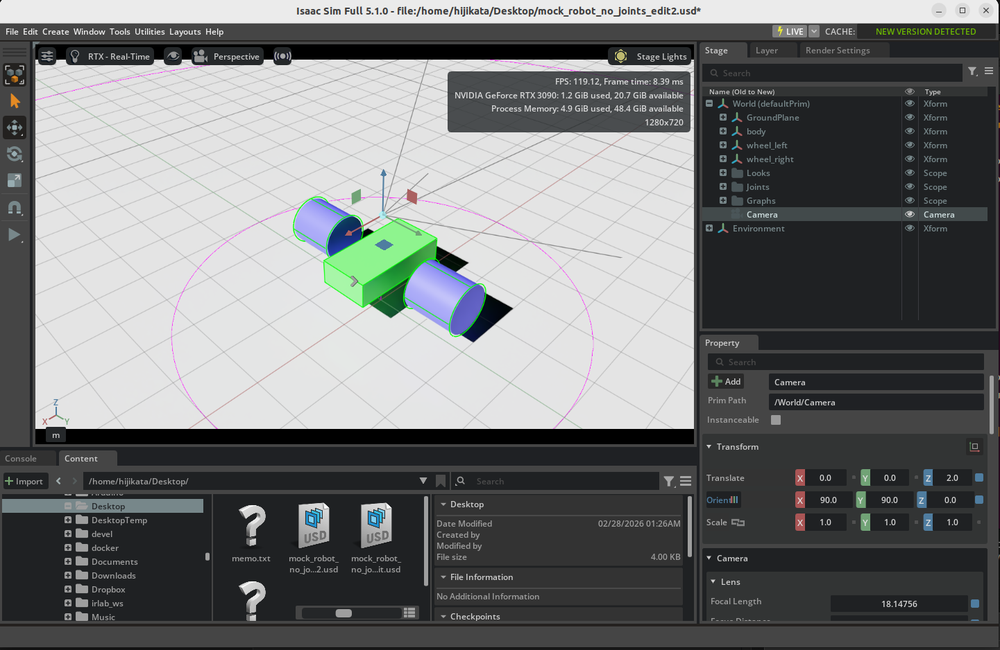
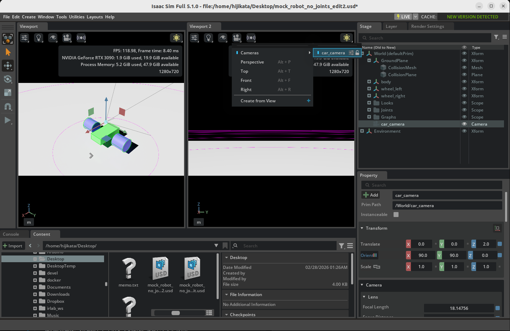
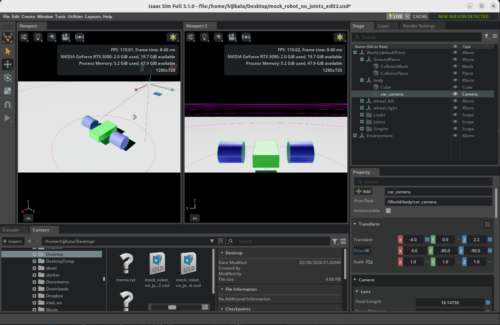

# Add Camera and Sensors

## Learning Objectives

After completing this tutorial, you will have learned:

- How to add a camera to the stage
- How to inspect camera output using Camera Inspector
- How to attach a camera to robot geometry
- How to display camera feed in dual viewports

## Getting Started

### Prerequisites

- Complete [Tutorial 3: Articulate a Basic Robot](03_articulate_robot.md) before starting this tutorial.

!!! tip "Starting from a Checkpoint Asset"
    If you have not completed the previous tutorial, you can start from this tutorial by loading the `mock_robot_rigged` asset from the **Samples > Rigging > MockRobot** folder in the **Content** tab at the bottom right of the screen. When loading, open it as a **File (not as a reference)**.

### Estimated Time

Approximately 10-15 minutes.

### Overview

In this tutorial, you will learn how to create camera sensors in Isaac Sim and attach them to a robot. The camera attachment process introduced here can also be applied when attaching other sensors (such as LiDAR).

## Adding a Camera

### Creating a Camera

1. Select **Create > Camera** from the menu bar to create a camera.
2. A **Camera** is added to the stage tree, and a wireframe indicating the camera's Field of View is displayed in the viewport.
3. To make the wireframe easier to see, change the **Translate** of the added **Camera** to `(0, 0, 2.0)` in the **Property** tab.

!!! note "Displaying the Camera Icon"
    By default, the camera icon is hidden. To display it, click the  at the top of the viewport and select **Show By Type > Cameras**.

!!! tip "Creating a Camera from the Current View"
    Position the viewport camera to the desired angle and location, then select **Camera > Create from View** from the **Camera** button dropdown at the top left of the viewport. This creates a camera from the current viewport perspective, which is more intuitive than manually setting transforms. 
    

### Camera Properties

When you select the **Camera**, you can view and edit the following properties in the **Property** tab:

| Property | Description |
|---|---|
| **Focal Length** | Focal length (mm). Larger values produce telephoto effects, smaller values produce wide-angle effects |
| **Focus Distance** | Focus distance. Used when autofocus is disabled |
| **fStop** | Aperture value. Affects depth of field |
| **Clipping Range** | Rendering distance range (Near / Far). Objects outside this range are not rendered |

## Inspecting Camera Output

You can use the **Camera Inspector** extension to inspect camera video output in real time.

1. Select **Tools > Sensors > Camera Inspector** from the menu bar.
2. The Camera Inspector window opens.
3. Select the camera you want to inspect (**Camera**) from the dropdown at the top of the window.
4. Check the **Camera State** to verify that the camera position and orientation are correct.
5. Click the **CREATE VIEWPORT** button to generate a new viewport window and inspect the camera output.

    

## Attaching the Camera to the Robot

### Renaming the Camera

1. Right-click **Camera** in the stage tree, select **Rename**, and rename it to **car_camera**.

### Setting Up Dual Viewports

Open a second viewport to simultaneously view the robot's appearance and camera feed.

1. Select **Window > Viewports > Viewport 2** from the menu bar.
2. A second viewport is added to the screen.
3. Click the **Camera** button at the top left of the added viewport (Viewport 2) and select **car_camera** from the dropdown.
4. The car_camera perspective feed is displayed in Viewport 2.

### Setting Up Camera Parent-Child Relationship

Attach the camera to the robot body so that it follows the robot's movement.

1. Drag and drop **car_camera** into the robot's **body** Xform in the stage tree.
2. car_camera becomes a child element of body and will move in sync with the robot.

### Adjusting Camera Transform

Adjust the position and orientation so that the camera faces the front of the robot.

1. Select **car_camera** in the stage tree.
2. Set the following values in **Transform** in the **Property** tab:
    - **Translate**: **(-6, 0, 2.2)**
    - **Orient**: **(0, -80, -90)**
    - **Scale**: **(1, 1, 1)**
3. Verify that the camera position and orientation are correct in both viewports.

!!! warning "Caution: Viewport Interaction Changes Camera Properties"
    Performing mouse operations (pan, rotate, etc.) in the viewport displaying the car_camera view will directly change the camera's transform. Be careful with mouse operations in Viewport 2 while inspecting the camera feed.

### Testing in Simulation

1. Press **Play** to start the simulation.
2. In Viewport 1 (main viewport) you can observe the robot's appearance, while Viewport 2 shows the car_camera feed in real time.
3. Use the Velocity Controller configured in the previous tutorial to move the robot and verify that the camera feed follows the robot's movement.

!!! tip "Best Practice"
    Rather than moving the camera directly, place it as a child element of the robot body with the correct offset. This prevents accidental position changes and provides stable camera feed during simulation.

## Summary

This tutorial covered the following topics:

1. Adding a **camera** to the stage and inspecting basic properties
2. Real-time inspection of camera output using **Camera Inspector**
3. Setting up **dual viewports** for multi-angle display
4. **Attaching a camera** to the robot body (parent-child relationship)
5. **Adjusting transforms** for camera position and orientation

## Next Steps

Proceed to the next tutorial, "[Rig a Mobile Robot](05_rig_mobile_robot.md)", to learn how to convert a real robot asset into a fully articulated mobile robot.
