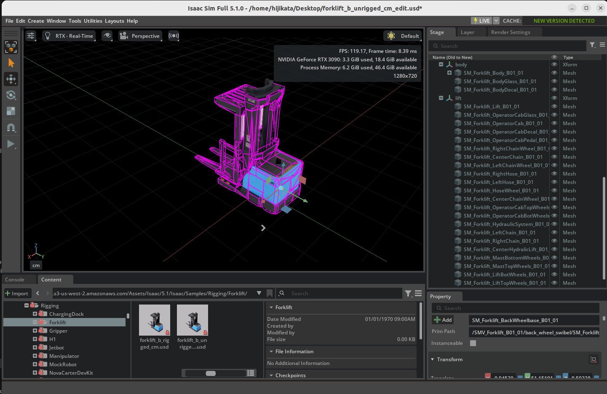
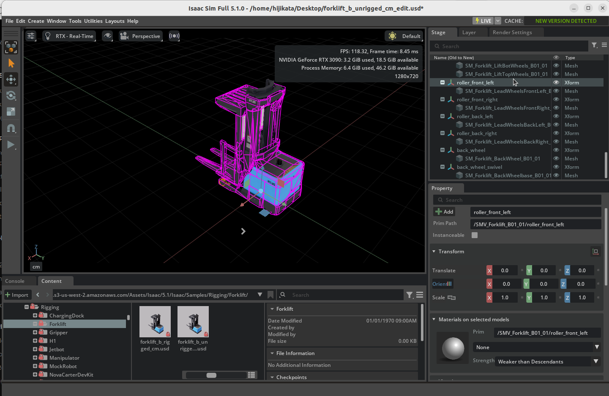

# モバイルロボットのリギング

## 学習目標

このチュートリアルを修了すると、以下の内容を習得できます：

- ロボットアセットのジョイント構成の分析方法
- USD 階層の整理と Xform によるグループ化
- コリジョン近似の割り当て（Convex Decomposition、シリンダーなど）
- Prismatic Joint（直動ジョイント）/ Revolute Joint（回転ジョイント）の追加とドライブ設定
- アーティキュレーションの追加
- アセットの単位変換

## はじめに

### 前提条件

- [チュートリアル 3: 基本ロボットのアーティキュレーション](03_articulate_robot.md) を完了していること

### 所要時間

約 30 分

### 概要

**リギング（Rigging）** とは、3Dモデルにジョイント（関節）やコリジョン（衝突判定）、物理プロパティなどを設定し、シミュレーション上で動かせる状態にする作業のことです。元々は3DCG・アニメーション分野の用語ですが、Isaac Sim では物理シミュレーション用のロボットモデルを構築する工程全般を指します。

このチュートリアルでは、**リギングされていない（＝ジョイントや物理プロパティが未設定の）フォークリフトの USD アセット**を、完全にアーティキュレーションされたモバイルロボットに変換します。チュートリアル 2〜3 で学んだ基本（Rigid Body、コリジョン、ジョイント、アーティキュレーション）を、実際のロボットアセットに適用する実践的な内容です。

### 使用するアセット

Isaac Sim に同梱されているフォークリフトアセットを使用します。画面右下の **Content** タブから以下のパスでアクセスできます：

| アセット | パス | 用途 |
|---|---|---|
| **リギングなし（作業用）** | `Samples > Rigging > Forklift > forklift_b_unrigged_cm` | このチュートリアルで編集するアセット |
| **リギング済み（参考用）** | `Samples > Rigging > Forklift > forklift_b_rigged_cm` | 完成形の参考アセット |

!!! note "アセットのロード方法"
    アセットをロードする際は、**File（参照ではなくファイルとして）** で開いてください。このチュートリアルではアセットに直接変更を加えるため、参照ではなくファイルとして開く必要があります。

## ステップ 1：ジョイントの特定

リギングを始める前に、フォークリフトにどのようなジョイント（関節）が必要かを分析します。

このフォークリフトには **7つの自由度（Degree of Freedom）** があります：

| パーツ | ジョイントの種類 | 駆動 | 説明 |
|---|---|---|---|
| 前輪ローラー × 4 | Revolute Joint（回転） | 非駆動 | 地面との接触で自由に回転するローラー |
| フォーク | Prismatic Joint（直動） | 駆動 | フォークの上下移動 |
| 後輪 | Revolute Joint（回転） | 駆動 | 走行用の車輪回転 |
| 後輪スイベル | Revolute Joint（回転） | 駆動 | 操舵用のピボット回転 |


## ステップ 2：USD 階層の整理

ジョイントを追加する前に、メッシュを論理的なグループにまとめる必要があります。Xform を作成して関連するメッシュを整理します。

### ボディとリフトの整理

1. ステージツリーのルート Xform（**SMV_Forklift_B01_01**）上で右クリックし、**Create > Xform** を2つ作成します。
2. それぞれ **body** と **lift** にリネームします。
3. フォークリフトのボディ（車体）に該当するメッシュを **body** Xform の中にドラッグ＆ドロップします。
4. フォーク（リフト）に該当するメッシュを **lift** Xform の中にドラッグ＆ドロップします。



### 車輪の整理

車輪用の Xform を作成する際、**ジョイントの回転中心を正しく配置する**ために、Xform の原点を車輪メッシュの実際の位置に合わせる必要があります。

#### 1. 車輪用 Xform の作成

ルート Xform（**SMV_Forklift_B01_01**）を右クリックし、**Create > Xform** で以下の6つの Xform を作成してリネームします：

- **roller_front_left**、**roller_front_right**、**roller_back_left**、**roller_back_right**
- **back_wheel**（走行用の車輪）
- **back_wheel_swivel**（操舵用のスイベル部分）

#### 2. Xform のトランスフォーム設定

各 Xform の **Translate** を、対応するメッシュの回転中心に合わせて設定します。

メッシュを選択して **Property** タブを見ると、**Translate** の他に **Translate:pivot** という値が表示されていることがあります。

!!! note "Translate:pivot とは"
    **Translate:pivot** は、回転やスケールの**中心点（ピボット）**を指定するための USD のトランスフォーム操作です。通常、回転やスケールはオブジェクトのローカル原点 `(0, 0, 0)` を中心に行われますが、DCC ツール（Blender、Maya など）からエクスポートされた3Dモデルでは、メッシュのジオメトリ原点が回転中心と一致しないことがあります。その場合、正しい回転中心を指定するために **Translate:pivot** が設定されます。

    つまり、メッシュの**実際の回転中心の位置**は、**Translate + Translate:pivot** の合計値になります。

ジョイントの回転軸は Xform の原点に配置されるため、各 Xform の **Translate** にはメッシュの **Translate** と **Translate:pivot** の**合計値**を設定する必要があります。以下の表にまとめています：

| Xform 名 | 対応メッシュ | Translate の設定値 |
|---|---|---|
| **roller_front_left** | 前輪ローラー左メッシュ | (49.90, -91.01, 7.83) |
| **roller_front_right** | 前輪ローラー右メッシュ | (-49.90, -91.01, 7.83) |
| **roller_back_left** | 後輪ローラー左メッシュ | (49.90, -71.75, 7.83) |
| **roller_back_right** | 後輪ローラー右メッシュ | (-49.90, -71.75, 7.83) |
| **back_wheel** | 後輪メッシュ | (0.76, 57.99, 15.80) |
| **back_wheel_swivel** | 後輪スイベルメッシュ | (-7.87, 57.75, 35.57) |

!!! note "Translate:pivot の確認方法"
    メッシュを選択し、**Property** タブの **Transform** セクションを確認します。**Translate** の下に **Translate:pivot** が表示されています。この2つの値を各軸（X, Y, Z）ごとに足し合わせた値を、Xform の **Translate** に設定してください。

!!! tip "Script Editor で自動計算する"
    手動で計算する代わりに、**Window > Script Editor** で以下のスクリプトを実行すると、各メッシュの正しい Xform 位置を自動で算出できます：

    ```python
    from pxr import UsdGeom, Gf

    stage = omni.usd.get_context().get_stage()

    # 対象メッシュのパスを列挙（実際のパスに置き換えてください）
    mesh_paths = [
        "/SMV_Forklift_B01_01/SM_Forklift_LeadWheelsFrontLeft_B01_01",
        "/SMV_Forklift_B01_01/SM_Forklift_LeadWheelsFrontRight_B01_01",
        "/SMV_Forklift_B01_01/SM_Forklift_LeadWheelsBackLeft_B01_01",
        "/SMV_Forklift_B01_01/SM_Forklift_LeadWheelsBackRight_B01_01",
        "/SMV_Forklift_B01_01/SM_Forklift_BackWheel_B01_01",
        "/SMV_Forklift_B01_01/SM_Forklift_BackWheelbase_B01_01",
    ]

    for path in mesh_paths:
        prim = stage.GetPrimAtPath(path)
        xformable = UsdGeom.Xformable(prim)
        translate = Gf.Vec3d(0, 0, 0)
        pivot = Gf.Vec3d(0, 0, 0)

        for op in xformable.GetOrderedXformOps():
            if op.GetOpName() == "xformOp:translate":
                translate = Gf.Vec3d(op.Get())
            elif op.GetOpName() == "xformOp:translate:pivot":
                pivot = Gf.Vec3d(op.Get())

        result = translate + pivot
        print(f"{path.split('/')[-1]}: Xform Translate = {result}")
    ```

    出力された値をそのまま各 Xform の **Translate** に設定できます。

#### 3. メッシュを Xform の配下に移動

対応する各メッシュを、それぞれの Xform の中にドラッグ＆ドロップします。

!!! note "メッシュの Translate の調整"
    メッシュを Xform の配下に移動した後、メッシュの **Translate** を **-Translate:pivot** の値（Translate:pivot の符号を反転した値）に設定してください。これにより、メッシュの見た目の位置は変わらず、Xform の原点がジョイントの回転中心に正しく配置されます。直前のXform のトランスフォーム設定でXformが正しく設定できていれば、メッシュの **Translate** が **-Translate:pivot** の値（Translate:pivot の符号を反転した値）とほぼ同じになっているはずです。

!!! tip "リギング済みアセットで値を確認"
    設定値に迷った場合は、`forklift_b_rigged_cm`（リギング済み）アセットを開いて、各 Xform のトランスフォーム値を確認・比較できます。



### Rigid Body の適用

1. 作成した各 Xform（**body**、**lift**、4つのローラー、**back_wheel**、**back_wheel_swivel**）をすべて選択します。
2. **Property** タブの **+ Add** ボタンから **Physics > Rigid Body** を適用します。


## ステップ 3：コリジョンメッシュの割り当て

各パーツに物理シミュレーション用のコリジョン（衝突判定）メッシュを割り当てます。

!!! note "提供アセットのコリジョンについて"
    提供されているフォークリフトアセットには既にコリジョンプロパティが設定されています。ここではコリジョン近似の種類と設定方法を学びます。

### ボディ・リフトのコリジョン

複雑な形状のメッシュには **Convex Decomposition（凸分割）** 近似を使用します。

1. ボディまたはリフトのメッシュを選択します（以下の図では**SM_Forklift_Lift_B01_01**）。
2. 右クリックして **Add > Physics > Collider Preset** を選択します。
3. **Property** タブの **Collision** セクションで、**Approximation** を **Convex Decomposition** に変更します。

デフォルト(Convex Hull)の場合


Convex Decomposition（凸分割）の場合


### 車輪のコリジョン

車輪には**シリンダー近似**を使用します。メッシュに直接コリジョンを付けるのではなく、専用のシリンダープリミティブを配置します。

#### 前輪ローラーの場合

1. 各ローラー Xform の直下にシリンダーメッシュを作成します（**Create > Shape > Cylinder**）。
2. シリンダーの **Property** タブで以下を設定します：
    - **Scale**: **(0.16, 0.16, 0.08)**
    - **Orient**: Y 軸を **90** 度回転
    - **Translate**: すべて **0** に設定
3. シリンダーに **Collider** を追加します。

#### 後輪の場合

1. **back_wheel** Xform の直下にシリンダーメッシュを作成します。
2. シリンダーの **Property** タブで以下を設定します：
    - **Scale**: **(0.3, 0.3, 0.1)**
    - **Orient**: Y 軸を **90** 度回転
    - **Translate**: すべて **0** に設定
3. シリンダーに **Collider** を追加します。


## ステップ 4：ジョイントとドライブの追加

### フォーク用の Prismatic Joint（直動ジョイント）

フォークの上下移動を実現するために Prismatic Joint を追加します。

1. ステージツリーで **body** を選択し、次に **Ctrl** キーを押しながら **lift** を選択します。

    !!! note "選択順序"
        回転ジョイントと同様に、最初に選択した **body** が **Body 0**（親：固定側）、2番目の **lift** が **Body 1**（子：移動側）になります。

2. 右クリックして **Create > Physics > Joints > Prismatic Joint** を選択します。
3. **Property** タブで以下を設定します：
    - **Axis**: **Z**（上下方向）
    - **Lower Limit**: **-15**
    - **Upper Limit**: **200**
4. **+ Add** から **Physics > Linear Drive** を追加し、以下を設定します：
    - **Target Position**: **-15**
    - **Damping**: **10000**
    - **Stiffness**: **100000**
5. ジョイントを **lift_joint** にリネームし、整理用の Scope 内に配置します。


### 前輪ローラー用の Revolute Joint（回転ジョイント）

前輪ローラーは非駆動（ドライブなし）の回転ジョイントです。

1. ステージツリーで **body** を選択し、次に **Ctrl** キーを押しながらローラー Xform（例：**roller_front_left**）を選択します。
2. 右クリックして **Create > Physics > Joints > Revolute Joint** を選択します。
3. **Property** タブで **Axis** を **X** に設定します。
4. 同様の手順を残り3つのローラー（**roller_front_right**、**roller_back_left**、**roller_back_right**）にも繰り返します。
5. 作成したジョイントを **roller_joints** Scope 内に整理します。

### 後輪用の Revolute Joint

後輪は2つのジョイントが必要です：走行用の回転と操舵用のスイベルです。

#### 走行用ジョイント（back_wheel_swivel ↔ back_wheel）

1. ステージツリーで **back_wheel_swivel** を選択し、**Ctrl** キーを押しながら **back_wheel** を選択します。
2. **Create > Physics > Joints > Revolute Joint** を選択します。
3. **+ Add** から **Physics > Angular Drive** を追加し、以下を設定します：
    - **Damping**: **10000**
    - **Stiffness**: **100**

#### 操舵用ジョイント（body ↔ back_wheel_swivel）

1. ステージツリーで **body** を選択し、**Ctrl** キーを押しながら **back_wheel_swivel** を選択します。
2. **Create > Physics > Joints > Revolute Joint** を選択します。
3. **Property** タブで以下を設定します：
    - **Axis**: **Z**（垂直方向に旋回）
    - **Lower Limit**: **-60**（度）
    - **Upper Limit**: **60**（度）
4. **+ Add** から **Physics > Angular Drive** を追加し、以下を設定します：
    - **Damping**: **100**
    - **Stiffness**: **100000**
5. 作成したジョイントを **back_wheel_joints** Scope 内に整理します。


## ステップ 5：アーティキュレーションの追加

すべてのジョイントを単一の物理ソルバーチェーンとして扱うために、アーティキュレーションルートを設定します。

1. ステージツリーのルート Xform（**SMV_Forklift_B01_01**）を右クリックします。
2. **Add > Physics > Articulation Root** を選択します。選択できないときはデフォルトでArticulation Rootが設定されている可能性があります。
3. **Property** タブで **Self Collision** のチェックボックスを**無効**にします。

!!! note "Self Collision の無効化"
    隣接するパーツ間でコリジョンメッシュが重なっている場合、自己衝突が発生してシミュレーションが不安定になることがあります。これを防ぐために Self Collision を無効にします。

!!! tip "Articulation Root の配置場所"
    モバイルロボットの場合、Articulation Root はロボット全体のルート Xform（シャーシ / ベース）に配置します。ロボットアームの場合は、固定ジョイントに配置するのがベストプラクティスです。

## ステップ 6：アセット単位の変換

提供されているフォークリフトアセットは**センチメートル**単位で作成されています。Isaac Sim のデフォルトの Stage は**メートル**単位のため、単位変換が必要です。

!!! note "自動単位変換"
    メートル単位の Stage にセンチメートル単位のアセットを追加すると、Isaac Sim の **Metrics Assembler** 拡張機能が自動的にスケールを変換します。手動での変換は通常不要です。

## シミュレーションでのテスト

リギングが正しく行われたかテストします。

1. 後輪のジョイント（走行用）を選択し、**Angular Drive** の **Target Velocity** を **-200** に設定します。
2. **Play** ボタンを押してシミュレーションを開始します。
3. フォークリフトが前進することを確認します。


!!! warning "シミュレーション時にロボットが「爆発」する場合"
    シミュレーション開始時にロボットのパーツが飛び散る場合は、接続されたパーツ間でコリジョンメッシュが重なり合っている（貫通している）可能性があります。コリジョンメッシュの形状とサイズを確認し、パーツ間で干渉が起きないように調整してください。

## まとめ

このチュートリアルでは以下のトピックを扱いました：

1. ロボットアセットの**ジョイント構成**（7自由度）の分析
2. **Xform** を使った USD 階層の整理とメッシュのグループ化
3. **Convex Decomposition** と**シリンダー近似**によるコリジョンメッシュの割り当て
4. **Prismatic Joint** と **Revolute Joint** の追加、**Linear Drive** と **Angular Drive** の設定
5. **Articulation Root** の追加と Self Collision の設定
6. **Metrics Assembler** によるアセット**単位変換**への対応

!!! tip "参考アセット"
    完成したフォークリフトは、**Content** タブの **Samples > Rigging > Forklift** フォルダ内の `forklift_b_rigged_cm` アセットと比較して確認できます。

## 次のステップ

次のチュートリアル「[マニピュレータのセットアップ](06_setup_manipulator.md)」に進み、URDF からロボットアームをインポートしてグリッパーを接続する方法を学びましょう。
