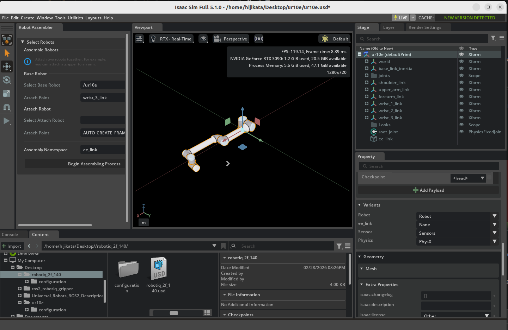

# Setup a Manipulator

## Learning Objectives

After completing this tutorial, you will have learned:

- How to import the UR10e robot arm from a URDF file
- How to import the Robotiq 2F-140 gripper from a URDF file
- How to connect the robot arm and gripper manually via GUI
- How to use the Robot Assembler for automated connection

## Getting Started

### Prerequisites

- Complete [Tutorial 5: Rig a Mobile Robot](05_rig_mobile_robot.md) before starting this tutorial
- Python 3 and `pip` (used to install the `xacro` package)
- `git` installed

### Estimated Time

Approximately 30 minutes

### Overview

In this tutorial, you will import the **UR10e robot arm** and **Robotiq 2F-140 gripper** from URDF files and connect them as a single articulation. You will learn two connection methods: **manual connection via GUI** and **automated connection using the Robot Assembler**.

### Two Methods for URDF Import

Isaac Sim provides two ways to import URDF files:

| Method | Extension Name | Requires ROS 2 | Description |
|---|---|---|---|
| **Direct URDF Importer** | `isaacsim.asset.importer.urdf` | No | Import URDF files directly from the file system |
| **ROS 2 URDF Importer** | `isaacsim.ros2.urdf` | Yes | Fetch URDF from a ROS 2 node and import |

This tutorial uses the **Direct URDF Importer**, which does not require ROS 2.

!!! note "If you want to use the ROS 2 URDF Importer"
    If you have ROS 2 installed, you can also import via **File > Import from ROS 2 URDF Node**. In that case, publish the URDF with `ros2 launch ur_description view_ur.launch.py ur_type:=ur10e` and specify the node name `robot_state_publisher` in Isaac Sim. See the [official documentation](https://docs.isaacsim.omniverse.nvidia.com/5.1.0/robot_setup_tutorials/tutorial_import_assemble_manipulator.html) for details.

### Reference Assets

Sample assets bundled with Isaac Sim can be used as references. Access them from the **Content** tab at the bottom right of the screen:

| Asset | Path | Purpose |
|---|---|---|
| **import_manipulator folder** | `Samples > Rigging > Manipulator > import_manipulator` | Reference URDF files and completed USD files |
| **UR10e (completed)** | `import_manipulator/ur10e/ur/ur.usd` | UR10e reference asset |
| **Manual connection (completed)** | `import_manipulator/ur10e/ur/ur_gripper_manual.usd` | Completed GUI manual connection example |
| **Robot Assembler (completed)** | `import_manipulator/ur10e/ur/ur_gripper.usd` | Completed Robot Assembler connection example |

!!! tip "Using bundled URDF files"
    URDF files are also bundled in the Isaac Sim installation directory. If you want to skip the XACRO conversion steps, you can use these files directly:

    - **UR10e URDF**: `<Isaac Sim install path>/exts/isaacsim.robot_motion.motion_generation/motion_policy_configs/universal_robots/ur10e/ur10e.urdf`
    - **UR10e + Robotiq combined URDF**: `<Isaac Sim install path>/standalone_examples/api/isaacsim.robot.manipulators/ur10e/rmpflow/ur10e.urdf` (robot arm and gripper pre-assembled)

## Step 1: Prepare URDF Files

In this step, you will obtain XACRO files for the UR10e robot arm and Robotiq 2F-140 gripper from GitHub ROS packages, and convert them into URDF files that Isaac Sim can import.

!!! note "Relationship between XACRO and URDF"
    **XACRO** (XML Macro) is a macro language for writing URDF files efficiently. It supports parameterization and file splitting, and is widely adopted in ROS robot packages. Since Isaac Sim's URDF Importer cannot read XACRO files directly, they must be converted to URDF beforehand.

### 1-1. Install xacro

The `xacro` package is required for converting XACRO to URDF. It can be installed via `pip` even without a ROS 2 installation:

```bash
pip install xacro pyyaml
```

### 1-2. Generate UR10e URDF

#### Clone the Repository

Clone the official Universal Robots ROS 2 Description package:

```bash
git clone https://github.com/UniversalRobots/Universal_Robots_ROS2_Description.git
cd Universal_Robots_ROS2_Description
```

#### Replace Package Paths

The `$(find ur_description)` in the XACRO files uses ROS's package search mechanism. Since ROS 2 is not installed, replace it with the absolute path to the cloned repository:

```bash
# Replace $(find ur_description) with the repository's absolute path
sed -i "s|\$(find ur_description)|$(pwd)|g" urdf/ur.urdf.xacro urdf/ur_macro.xacro
```

!!! note "What is \$(find package_name)?"
    `$(find package_name)` is a syntax used in ROS XACRO files that expands to the install path of the specified ROS package. When using XACRO outside a ROS environment, you need to manually replace it with the actual path.

#### Convert XACRO to URDF

```bash
xacro urdf/ur.urdf.xacro ur_type:=ur10e name:=ur10e > urdf/ur10e.urdf
```

#### Replace Mesh Paths

The mesh paths in the generated URDF file use the `package://ur_description/...` format. Convert them to relative paths so that Isaac Sim's URDF Importer can locate the meshes correctly:

```bash
sed -i 's|package://ur_description/|../|g' urdf/ur10e.urdf
```

After conversion, mesh paths will look like this:

```xml
<!-- Before -->
<mesh filename="package://ur_description/meshes/ur10e/visual/base.dae"/>

<!-- After -->
<mesh filename="../meshes/ur10e/visual/base.dae"/>
```

!!! tip "Verify the conversion"
    To confirm that `urdf/ur10e.urdf` was generated correctly, check the mesh paths with:

    ```bash
    grep 'mesh filename' urdf/ur10e.urdf
    ```

    All paths should start with `../meshes/ur10e/...`.

### 1-3. Generate Robotiq 2F-140 URDF

#### Clone the Repository

Clone the ROS 2 Robotiq gripper package provided by PickNikRobotics:

```bash
cd ..  # Return to the parent directory of Universal_Robots_ROS2_Description
git clone https://github.com/PickNikRobotics/ros2_robotiq_gripper.git
cd ros2_robotiq_gripper/robotiq_description
```

#### Replace Package Paths

Similar to UR10e, replace `$(find robotiq_description)` with the repository's absolute path:

```bash
sed -i "s|\$(find robotiq_description)|$(pwd)|g" urdf/robotiq_2f_140_gripper.urdf.xacro urdf/robotiq_2f_140_macro.urdf.xacro
```

#### Convert XACRO to URDF

Specify `include_ros2_control:=false` to omit the ROS 2 control interface definitions, which are not needed in Isaac Sim:

```bash
xacro urdf/robotiq_2f_140_gripper.urdf.xacro include_ros2_control:=false > urdf/robotiq_2f_140.urdf
```

#### Replace Mesh Paths

```bash
sed -i 's|package://robotiq_description/|../|g' urdf/robotiq_2f_140.urdf
```

!!! tip "Pre-converted URDF reference file"
    If you have trouble with the path changes, a pre-converted URDF file is available in Isaac Sim's Content browser at `import_manipulator/robotiq_2f_140_urdf/urdf/robotiq_2f_140.urdf`.

## Step 2: Import into Isaac Sim

Import the URDF files generated in Step 1 into Isaac Sim.

### 2-1. Import UR10e

1. From the Isaac Sim menu, select **File > Import**.
2. In the file selection dialog, select the `Universal_Robots_ROS2_Description/urdf/ur10e.urdf` file generated in Step 1.
3. The **URDF Importer** dialog will appear.
4. Set the **Output Directory** to your desired save location (e.g., `~/Desktop`).
5. In the **Joint Configuration** section, configure the following:
    - Select **Natural Frequency** as the configuration method
    - Set the **Natural Frequency** to **300** for all joints

    !!! note "What is Natural Frequency?"
        Natural Frequency controls the stiffness of joints. Higher values result in stiffer joints. A value of 300 is appropriate for the UR10e joints.

6. Click **Import** to execute the import.
7. Verify that a `ur10e` directory has been generated at the **Output Directory** location, containing `ur10e.usd`.


### 2-2. Import Robotiq 2F-140

1. From the Isaac Sim menu, select **File > New** to open a new stage.
2. Select **File > Import** and choose `ros2_robotiq_gripper/robotiq_description/urdf/robotiq_2f_140.urdf`.
3. Set the **Output Directory** to your desired save location (e.g., `~/Desktop`).
4. In the **Joint Configuration** section, verify and configure the following:
    - Confirm that the **Ignore Mimic** checkbox is **unchecked** (default)
    - Select **Natural Frequency** as the configuration method
    - Set the **Natural Frequency** to **300** for **finger_joint**
    - Set the **Natural Frequency** to **2500** for all other joints

    !!! note "Automatic Mimic Joint Recognition"
        The Direct URDF Importer automatically reads `<mimic>` tags from the URDF. Mimic joints (joints that follow finger_joint) will have their Target Type automatically set to **"Mimic"**. Reference Joint and gear ratio settings are automatically extracted from the URDF, so no manual configuration is needed.

    !!! note "What are Mimic Joints?"
        Mimic joints are joints that move in sync with a reference joint (in this case, finger_joint). They enable the gripper's multiple finger links to open and close in coordination.

5. Click **Import** to execute the import.


### Reference: Robotiq 2F-140 Joint Structure

The imported gripper has the following joint structure:

| Joint Name | Type | Mimic | Role |
|---|---|---|---|
| finger_joint | revolute | — | Main finger joint (driven) |
| left_inner_knuckle_joint | revolute | finger_joint × -1 | Left inner knuckle |
| left_inner_finger_joint | revolute | finger_joint × 1 | Left inner finger |
| right_outer_knuckle_joint | revolute | finger_joint × -1 | Right outer knuckle |
| right_inner_knuckle_joint | revolute | finger_joint × -1 | Right inner knuckle |
| right_inner_finger_joint | revolute | finger_joint × 1 | Right inner finger |

## Step 3: Connect UR10e and Robotiq 2F-140

This is the main part of the tutorial. You will connect the two imported robots as a single articulation. Two methods are presented below; choose either one.

### Option 1: Manual GUI Connection

This method manually connects the gripper to the robot arm's end effector via GUI. Recommended if you want a deeper understanding of the mechanism.

#### 3-1-1. Load USD Files

1. Open the UR10e USD file (`ur10e.usd`) in Isaac Sim.
2. Drag and drop `robotiq_2f_140.usd` into the stage from the Content browser or file explorer.

#### 3-1-2. Position the Gripper

1. Select the added `robotiq_2f_140` prim in the Stage tree.
2. Rename it to **ee_link** (right-click > Rename).
3. In the **Property** tab, set the following transforms:
    - **Translate**: `(1.18425, 0.2907, 0.06085)`
    - **Orient**: `(-90, 0, -90)`

    !!! note "About the transform values"
        These values are calculated so that the gripper is correctly positioned at the tip of the UR10e wrist link (wrist_3_link).

#### 3-1-3. Remove the Articulation Root

The gripper was imported as an independent articulation, but it needs to be integrated into the UR10e articulation. Therefore, remove the articulation root from the gripper side.

1. Select `ee_link/root_joint` in the Stage tree.
2. Find the **Physics Articulation Root** section in the **Property** tab.
3. Remove the Articulation Root.

#### 3-1-4. Connect the Joint

1. Continue with the **Property** tab of `ee_link/root_joint`.
2. In the **Joints** section, set **Body0** to `/ur10e/wrist_3_link`.

    This creates a fixed connection between the gripper's root joint and the UR10e wrist link.

#### 3-1-5. Update Robot Schema

Add the gripper's links and joints to the UR10e robot definition.

1. Select the `ur10e` prim in the Stage tree.
2. In the **Property** tab under **IsaacRobotAPI**, set the following:
    - Add `/ur10e/ee_link` to the **isaac:physics:robotjoints** field
    - Add `/ur10e/ee_link` to the **isaac:physics:robotLinks** field


### Option 2: Robot Assembler Connection

This method uses the Robot Assembler tool for automated connection. It is more efficient and also provides end effector variant management.

#### 3-2-1. Load USD Files

1. Open the UR10e USD file (`ur10e.usd`) in Isaac Sim.
2. Drag and drop `robotiq_2f_140.usd` into the stage from the Content browser or file explorer.
3. Rename the added `robotiq_2f_140` prim to **ee_link** in the Stage tree.

#### 3-2-2. Open Robot Assembler

From the Isaac Sim menu, open **Tools > Robotics > Asset Editors > Robot Assembler**.

#### 3-2-3. Configure Assembly

Set the following in the Robot Assembler panel:

| Setting | Value | Description |
|---|---|---|
| **Base Robot > Select Base Robot** | `/ur10e` | The base robot arm |
| **Base Robot > Attach Point** | `wrist_3_link` | Connection point (wrist link) |
| **Attach Robot > Select Attach Robot** | `/ur10e/ee_link` | The gripper to connect |
| **Attach Robot > Attach Point** | `robotiq_arg2f_base_link` | Gripper's base link |
| **Assembly Namespace** | `ee_link` | Namespace specification |


#### 3-2-4. Execute Assembly

1. Click **Begin Assembling Process** to start the assembly process.
2. Adjust the gripper orientation: click the **Z +90** button to rotate the gripper 90 degrees around the Z axis.
3. Click **Assemble and Simulate** to test the connection in simulation.
4. If everything looks correct, click **End Simulation And Finish** to complete the assembly.


#### 3-2-5. Verify Variant Functionality

When connected via the Robot Assembler, end effector variant (switching) functionality is automatically configured. This allows you to easily toggle the gripper on and off during simulation.

1. Select the `ur10e` prim in the Stage tree.
2. Check the **Variants** section in the **Property** tab:
    - Select **None** next to **ee_link** → the gripper becomes hidden<br>
      
    - Select **robotiq_2f_140** next to **ee_link** → the gripper becomes visible<br>
      

!!! tip "Using the variant feature"
    The variant feature allows you to easily switch between different end effectors (grippers, suction pads, tools, etc.) for comparative testing.

## Step 4: Verify Operation

After the connection is complete, verify the operation in simulation.

1. Press the **Play** button to start simulation.
2. Verify that the robot arm and gripper operate as a single unit.
3. Confirm that the gripper does not detach from the robot arm or exhibit unnatural movement.
4. Save the asset by going to **File > Save As**.


!!! warning "Simulation Notes"
    - If the robot "explodes" (parts fly apart), it may be caused by collision mesh interference.
    - Verify that the articulation root is configured correctly (for manual connection, ensure that the gripper's articulation root has been removed).

## Summary

This tutorial covered the following topics:

1. **Obtaining XACRO from GitHub ROS packages and converting to URDF**: replacing `$(find ...)` and `package://` paths, conversion using the `xacro` command
2. **Importing into Isaac Sim using the Direct URDF Importer** (no ROS 2 required)
3. **Manual GUI connection**: transform settings, articulation root removal, joint connection, schema update
4. **Automated connection via Robot Assembler**: attach point settings, orientation adjustment, variant management

!!! tip "Reference assets"
    Completed assets can be found in the Content browser under `Samples > Rigging > Manipulator > import_manipulator`. The manual connection version is `ur_gripper_manual.usd`, and the Robot Assembler version is `ur_gripper.usd`.

## Next Steps

Proceed to the next tutorial, "[Configure a Manipulator](07_configure_manipulator.md)", to learn how to tune physics properties and joint drive gains.
