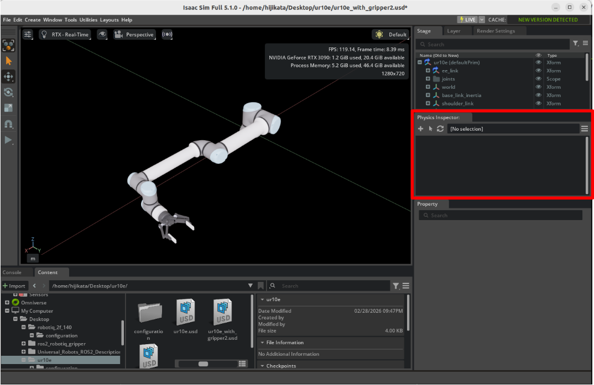
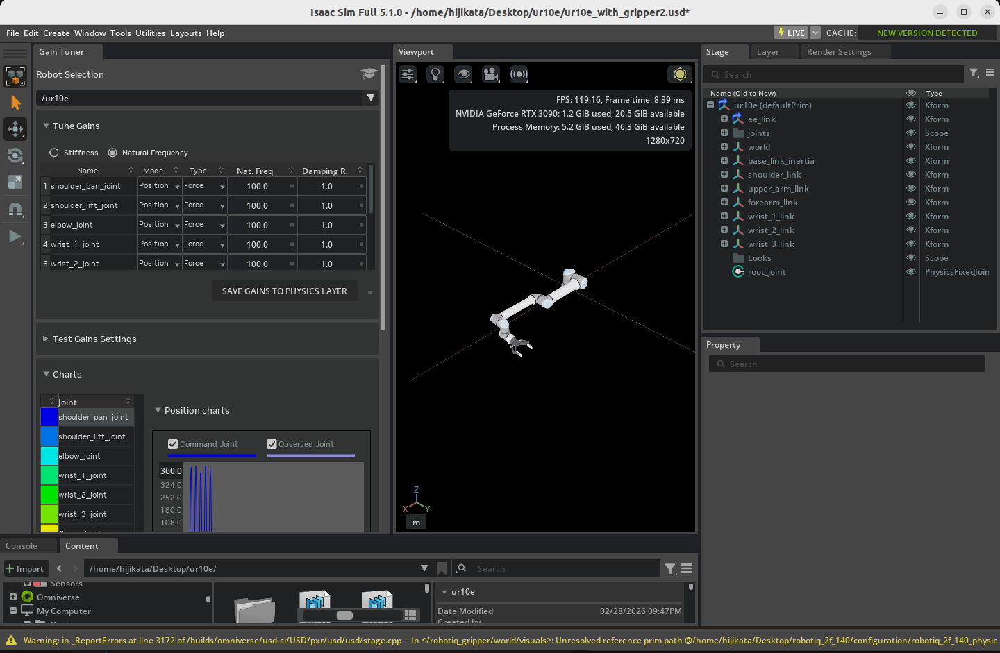

# Configure a Manipulator

## Learning Objectives

After completing this tutorial, you will have learned:

- How to adjust articulation solver settings
- How to create and apply physics materials (friction)
- How to set joint effort limits (Max Force)
- How to inspect articulations using Physics Inspector
- How to tune joint drive gains using Gain Tuner

## Getting Started

### Prerequisites

- Complete [Tutorial 6: Setup a Manipulator](06_setup_manipulator.md) before starting this tutorial.

### Estimated Time

Approximately 30 minutes.

### Overview

In the previous tutorial, we imported the UR10e robot arm and Robotiq 2F-140 gripper and connected them as a single articulation. However, the default settings are not sufficient for simulation accuracy and stability.

In this tutorial, we will adjust the following physics parameters to enable stable manipulation tasks (grasping, carrying objects, etc.):

- **Solver iteration counts**: Improve simulation accuracy
- **Friction coefficients**: Ensure the gripper can firmly grasp objects
- **Joint effort limits**: Configure appropriate gripping force
- **Joint gains**: Optimize target position tracking

### Assets Used

We will use the assets created in Tutorial 6. If you have not completed it yet, you can use the sample assets included with Isaac Sim. Access them from the **Content** tab at the bottom-right of the screen:

| Asset | Path | Purpose |
|---|---|---|
| **UR10e + Gripper (connected)** | `Samples > Rigging > Manipulator > import_manipulator > ur10e > ur > ur_gripper.usd` | Completed asset from Tutorial 6 |
| **Fully configured (reference)** | `Samples > Rigging > Manipulator > configure_manipulator > ur10e > ur > ur_gripper.usd` | Completed asset for this tutorial (reference) |

## Step 1: Adjust the Articulation

In manipulation tasks, numerous joints and mimic joints work in coordination, so the default solver settings may lack sufficient accuracy. In this step, we will adjust solver iteration counts and sleep conditions to improve simulation accuracy and stability.

### 1-1. Open the UR10e Physics Layer

If you imported from URDF in Tutorial 6, a **Physics Layer** file with a `_physics` suffix (e.g., `ur10e_physics.usd`) was generated in the UR10e asset folder. Open this file in Isaac Sim.

!!! warning "Why do you need to open the Physics Layer directly?"
    USD is a file format with a layered structure. When importing from URDF, the robot asset is split into a **main layer** (visuals and hierarchy) and a **Physics Layer** (physics properties and joint drives).

    When you modify parameters through Isaac Sim's GUI (Property panel), the changes are written to the **currently open layer**. If you open the top-level USD file (such as `ur_gripper.usd`) and modify physics parameters, the changes will be written to the top-level layer and will not be reflected in the Physics Layer.

    To save physics settings in the correct location, you must **open the target Physics Layer file directly** before making changes.

### 1-2. Enable and Configure the Articulation

1. Select the `ur10e/root_joint` prim in the **Stage** panel.

2. In the **Property** panel, locate the **Physics > Articulation Root** section.

3. Verify that the **Articulation Enabled** checkbox is checked (it is on by default).

4. Set the following parameters:

    | Parameter | Default | Value | Description |
    |---|---|---|---|
    | **Solver Position Iterations Count** | 32 | **64** | Number of solver iterations for position. Higher values improve joint constraint accuracy |
    | **Solver Velocity Iterations Count** | 1 | **4** | Number of solver iterations for velocity. Higher values improve velocity control accuracy |
    | **Sleep Threshold** | 0.005 | **0.00005** | Kinetic energy threshold below which the robot enters sleep state |
    | **Stabilization Threshold** | 0.001 | **0.00001** | Threshold at which stabilization processing is applied |

    

5. Save the changes with **Ctrl + S**.

!!! note "Parameter Details"
    - **Solver Position/Velocity Iterations Count**: Increasing iteration counts improves simulation accuracy but also increases computational cost. Robots with many degrees of freedom like the UR10e + gripper, or robots with mimic joints, require higher iteration counts.
    - **Sleep Threshold / Stabilization Threshold**: Sleep is a feature that pauses simulation for objects with sufficiently small motion to reduce computational load. In manipulation tasks, even subtle movements are important, so we lower the thresholds to prevent the robot from entering sleep mode.

## Step 2: Add Physics Materials

Without friction on the gripper fingertips, objects will slip and fall even when grasped. In this step, we will create a physics material (friction coefficients) and apply it to the gripper fingertips.

### 2-1. Open the Robotiq 2F-140 Physics Layer

Close the UR10e Physics Layer opened in Step 1, and open the Robotiq 2F-140 gripper's Physics Layer. Open the file with the `_physics` suffix (e.g., `robotiq_2f_140_physics.usd`) in the gripper's asset folder.

If using the Isaac Sim bundled asset, open `Samples > Rigging > Manipulator > import_manipulator > robotiq_2f_140 > configuration > robotiq_2f_140_physics.usd`.

### 2-2. Create a Physics Material

1. Right-click the `robotiq_gripper` (or `robotiq_arg2f_140_model` for the bundled asset) prim in the **Stage** panel.

2. Select **Create > Physics > Physics Material > Rigid Body Material**.

3. Move the created `PhysicsMaterial` prim to the **Looks** folder:
    - Drag and drop `PhysicsMaterial` into the `robotiq_arg2f_140_model/Looks` folder.

4. Rename the material to **finger** (right-click > Rename).

### 2-3. Configure Friction Coefficients

1. Select the created `finger` material.

2. Set the following friction coefficients in the **Property** panel:

    | Parameter | Value | Description |
    |---|---|---|
    | **Static Friction** | **1.0** | Static friction coefficient. Friction force before the object starts moving |
    | **Dynamic Friction** | **1.0** | Dynamic friction coefficient. Friction force while the object is sliding |

!!! note "About Friction Coefficient Values"
    A friction coefficient of 1.0 represents high friction similar to rubber. Gripper fingertips require high friction — objects cannot be held with low values. Adjust within the range of 0.5 to 2.0 depending on your task.

### 2-4. Apply the Material to the Gripper Fingertips

Apply the created friction material to the left and right fingertip colliders of the gripper.

1. Select the `colliders/left_inner_finger/mesh_1/box` prim in the **Stage** panel.

2. Locate the **Physics > Physics materials on selected models** section in the **Property** panel.

3. Select the material created earlier: `/World/robotiq_arg2f_140_model/Looks/finger`.

4. Similarly, apply the same material to `colliders/right_inner_finger/mesh_1/box`.

5. Save the changes with **Ctrl + S**.

## Step 3: Configure Joint Effort Limits

The gripper's finger_joint is the main joint that controls the gripper's open/close motion. In this step, we will set the maximum force (torque) that this joint can exert.

Continue working in the Robotiq 2F-140 Physics Layer opened in Step 2.

1. Select the `robotiq_gripper/joints/finger_joint` (or `robotiq_arg2f_140_model/joints/finger_joint` for the bundled asset) prim in the **Stage** panel.

2. Locate **Max Force** in the **Drive > Angular** section of the **Property** panel.

3. Set **Max Force** to **200**.

    | Parameter | Value | Description |
    |---|---|---|
    | **Max Force** | **200** | Maximum torque (N·m) that finger_joint can exert |

4. Save the changes with **Ctrl + S**.

!!! warning "About Max Force Values"
    Set the Max Force value according to the actual robot's torque specifications. Extremely high values may cause unstable behavior such as objects being penetrated. In such cases, increasing the physics simulation step frequency (reducing the time step) can help improve stability.

## Step 4: Inspect the Robot Articulation

Use the Physics Inspector tool to verify that the settings from the previous steps have been applied correctly.

### 4-1. Open the Asset

Open the top-level UR10e asset created in Tutorial 6 (e.g., `ur_gripper.usd`). This file references the Physics Layers modified in Steps 1–3, so the changes are automatically reflected.

If using the Isaac Sim bundled asset, open `Samples > Rigging > Manipulator > configure_manipulator > ur10e > ur > ur_gripper.usd`.

### 4-2. Launch Physics Inspector

1. From the Isaac Sim menu, select **Tools > Physics > Physics Inspector**.

2. The Physics Inspector window will appear.

### 4-3. Verify the Articulation

1. Select the UR10e articulation (`ur10e` prim) in the **Stage** panel.

2. Click the **circular refresh icon**  in the Physics Inspector window to load the articulation information.

3. Drag the **blue sliders** for each joint to change the target position. Verify that the DOF (degrees of freedom) positions track the targets.

    

4. Close the Physics Inspector window when verification is complete.

!!! warning "Physics Inspector Caveats"
    Physics Inspector partially initializes `omni.physx`. As a result, running a simulation after using Physics Inspector may cause unexpected behavior. We recommend reloading the stage after closing Physics Inspector before running a simulation.

## Step 5: Tune Gains with Gain Tuner

Finally, we will adjust the gains (control parameters) for each joint. Gains are important parameters that determine how quickly and accurately joints reach their target positions.

!!! note "What Are Gains?"
    Gains are parameters for **PD control** (Proportional-Derivative control) of joints.

    - **Stiffness (P gain)**: Determines how strongly the joint tries to return to its target position when displaced.
    - **Damping (D gain)**: Determines the strength of the force that suppresses joint oscillations.

    If these values are not properly set, the robot may fail to reach its target position or may oscillate.

### 5-1. Launch Gain Tuner

1. From the Isaac Sim menu, select **Tools > Robotics > Asset Editors > Gain Tuner**.

2. The Gain Tuner window will appear.

### 5-2. Select the Robot

1. From the **Robot Selection** dropdown, select the **ur10e** articulation.

2. All robot joints will be displayed in a list.

### 5-3. Adjust Gains

In the **Tune Gains** panel, adjust the joint gains. Switch from **Stiffness** (default) to **Natural Frequency** mode to set gains using **Natural Frequency** and **Damping Ratio**.

The following critical damping configuration is recommended:

| Parameter | Recommended Value | Description |
|---|---|---|
| **Nat. Freq.** | **100.0** | Natural frequency. Controls response speed |
| **Damping Ratio** | **1.0** | Damping ratio. 1.0 achieves critical damping (fastest response without oscillation) |

!!! note "What Is Critical Damping?"
    A state where Damping Ratio = 1.0 is called **critical damping**. This is the state that reaches the target position the fastest without oscillation. A Damping Ratio below 1.0 causes oscillation (overshoot), while above 1.0 results in slower response.

### 5-4. Test the Gains

Test the configured gains in the **Test Gains Settings** panel. With the simulation running (press the **Play** button), click the **RUN TEST** button to test each joint's motion.

### 5-5. Gain Tuning Tips

If gain tuning is not working as expected, refer to the following guidelines:

| Symptom | Solution |
|---|---|
| Does not reach target position (undershoot) | Slightly increase **Nat. Freq.** |
| Oscillates past target position (overshoot) | Decrease **Nat. Freq.** or increase **Damping Ratio** |
| Movement is too slow | Increase **Nat. Freq.** |
| Gain effects are hard to observe | Disable gravity during testing to make gain effects easier to see |

!!! tip "Effective Testing Methods"
    - Test joint groups that are expected to move together (e.g., all gripper joints) as a group.
    - Adjust the Maximum Speed for slowly-moving joints.
    - Use the **Sequence** dropdown to customize the joint testing order.

## Summary

This tutorial covered the following topics:

1. **Articulation solver settings**: Adjusted iteration counts and sleep thresholds to improve simulation accuracy for multi-DOF robots
2. **Physics materials (friction)**: Applied high-friction materials to gripper fingertips to stabilize object grasping
3. **Joint effort limits**: Set Max Force for finger_joint to ensure appropriate gripping force
4. **Articulation inspection with Physics Inspector**: Visually verified joint target tracking
5. **Joint gain tuning with Gain Tuner**: Optimized PD gains using Natural Frequency and Damping Ratio

!!! tip "Reference Asset"
    The fully configured asset can be found in the Content browser at `Samples > Rigging > Manipulator > configure_manipulator > ur10e > ur > ur_gripper.usd`.

## Next Steps

Proceed to the next tutorial, "[Generate Robot Configuration File](08_generate_robot_config.md)", to learn how to generate configuration files for kinematics solvers.
