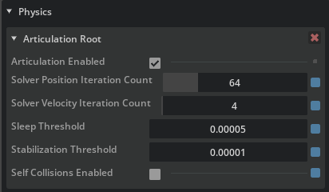
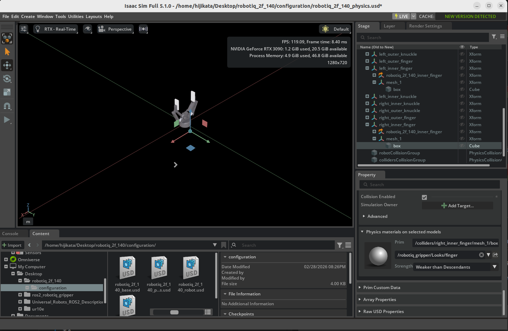
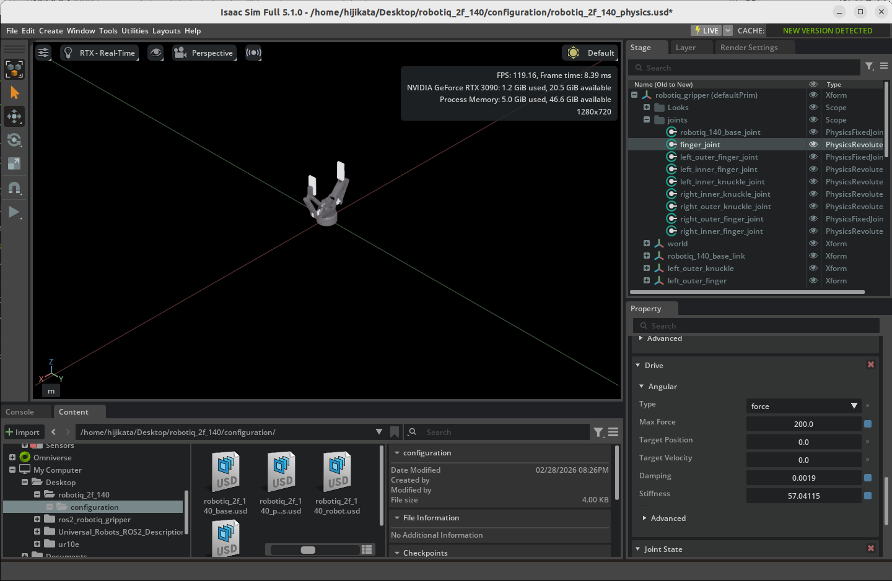
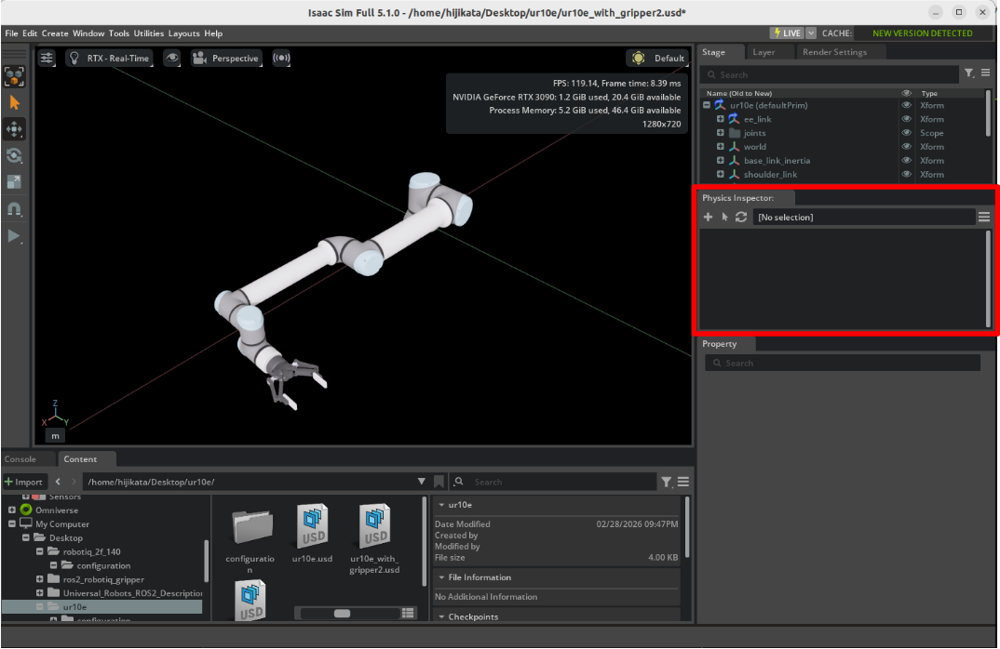

# マニピュレータの設定

## 学習目標

このチュートリアルを修了すると、以下の内容を習得できます：

- アーティキュレーションのソルバー設定の調整方法
- 物理マテリアル（摩擦係数）の作成と適用方法
- ジョイントの力制限（Max Force）の設定方法
- Physics Inspector を使ったアーティキュレーションの検査方法
- Gain Tuner を使ったジョイントゲインの調整方法

## はじめに

### 前提条件

- [チュートリアル 6: マニピュレータのセットアップ](06_setup_manipulator.md) を完了していること

### 所要時間

約 30 分

### 概要

前回のチュートリアルでは、UR10e ロボットアームと Robotiq 2F-140 グリッパーをインポートし、単一のアーティキュレーションとして接続しました。しかし、このままではシミュレーションの精度や安定性が十分ではありません。

このチュートリアルでは、マニピュレーションタスク（物体を掴む・運ぶなどの作業）を安定して行えるよう、以下の物理パラメータを調整します：

- **ソルバーの反復回数**：シミュレーションの精度を向上
- **摩擦係数**：グリッパーが物体をしっかり掴めるように設定
- **ジョイントの力制限**：グリッパーが適切な力で閉じるように設定
- **ジョイントゲイン**：目標位置への追従性を最適化

!!! note "URDF インポートで自動適用されるスキーマ"
    [チュートリアル 6](06_setup_manipulator.md) で URDF からロボットをインポートした際、Isaac Sim の URDF インポーターは **Robot Schema**（`IsaacRobotAPI`、`IsaacLinkAPI`、`IsaacJointAPI` など）を自動的にプリムに適用しています。Robot Schema は、各種 Asset Editor 系ツール（**Gain Tuner**、**Grasp Editor**、**XRDF Editor** など）がロボットを認識・操作するために参照するメタデータです。

    本ステップで設定する **Articulation Root API** とは別物ですが、URDF 経由でインポートしている限り、Robot Schema は意識せずとも適用されているため追加の操作は不要です。後続の[チュートリアル 11](11_joint_tuning.md) で Gain Tuner を使う際にこの仕組みが効いてきます。

    Robot Schema の概念や、URDF を経由せず手動でリギングしたロボットへの適用方法については、[チュートリアル 5a: Robot Schema の適用](05a_apply_robot_schema.md) を参照してください。

### 使用するアセット

チュートリアル 6 で作成したアセットを使用します。まだ完了していない場合は、Isaac Sim に同梱されているサンプルアセットを代わりに使用できます。画面左下の **Content** タブから以下のパスでアクセスできます：

| アセット | パス | 用途 |
|---|---|---|
| **UR10e + グリッパー（接続済み）** | `Samples > Rigging > Manipulator > configure_manipulator > ur10e > ur_gripper > ur.usda` | チュートリアル 6 の完成アセット（このチュートリアルの開始点） |
| **設定済み完成版** | `Samples > Rigging > Manipulator > configure_manipulator > ur10e > ur_set_physx > ur.usda` | このチュートリアルの完成アセット（参考用） |

!!! tip "プリビルトアセットの利用"
    プリビルトアセットを使う場合は、アクセスしやすいようにローカルマシンにダウンロードしてから開くことが公式に推奨されています。

## ステップ 1：アーティキュレーションの調整

マニピュレーションタスクでは、多数のジョイントと Mimic ジョイントが連動して動くため、デフォルトのソルバー設定では精度が不足することがあります。このステップでは、ソルバーの反復回数やスリープ条件を調整して、シミュレーションの精度と安定性を向上させます。

### 1-1. PhysX レイヤーをサブレイヤーとして挿入する

Isaac Sim 6.0 のアセットは、[アセット構造ガイドライン](https://docs.isaacsim.omniverse.nvidia.com/latest/robot_setup/asset_structure.html)に従い、**インターフェースファイル**（`ur.usda`）と**ペイロードレイヤー**（`payloads/Physics/physx.usda` など）に分かれています。PhysX 固有の設定は `physx.usda` レイヤーに保存します。

1. インターフェースファイル `ur.usda` を開き、画面右上の **Layer** タブを選択します。
2. Layer パネル下部の **Insert Sublayer** アイコン（レイヤーが重なったオレンジ矢印のアイコン）をクリックします。
3. ファイルダイアログで `<アセットの場所>/Manipulator/configure_manipulator/ur10e/ur_gripper/payloads/Physics/` に移動し、`physx.usda` を選択して **Open** をクリックしてサブレイヤーとして挿入します。
4. `physx.usda` レイヤーを左クリックした後、右クリックして **Set Authoring Layer** を選択します。これ以降の変更はすべて `physx.usda` レイヤーに保存されます。

!!! warning "なぜ Authoring Layer を切り替えるのか"
    USD はレイヤー構造を持つファイル形式です。Isaac Sim の GUI（Property パネル）でパラメータを変更すると、その変更は**現在の Authoring Layer** に書き込まれます。切り替えずに変更すると、PhysX 設定がルートレイヤー側に書き込まれてしまい、物理設定レイヤーに反映されません。

### 1-2. アーティキュレーションの作成と設定

1. **Stage** パネルで `ur/Geometry/World` プリムを選択します。

2. **Property** パネルの **Physics > Articulation** セクションを確認します。**Articulation(PhysX)** がない場合は、**+ Add > Physics > Articulation(PhysX)** で新規作成します。

3. 以下のパラメータを設定します：

    | パラメータ | デフォルト値 | 設定値 | 説明 |
    |---|---|---|---|
    | **Solver Position Iterations Count** | 32 | **64** | 位置に関するソルバーの反復回数。高い値ほどジョイント拘束の精度が向上 |
    | **Solver Velocity Iterations Count** | 1 | **4** | 速度に関するソルバーの反復回数。高い値ほど速度制御の精度が向上 |
    | **Sleep Threshold** | 0.005 | **0.00005** | この値以下の運動エネルギーでロボットがスリープ状態に入る閾値 |
    | **Stabilization Threshold** | 0.001 | **0.00001** | スタビライゼーション（安定化処理）が適用される閾値 |

    

4. Layer パネルの `physx.usda`（Authoring Layer）ラベルの横にある**青いファイルアイコン**をクリックして、変更を `physx.usda` レイヤーに保存します。

5. `physx.usda` レイヤーに Articulation(PhysX) プリムが作成され、プロパティが正しく設定されていることを確認します：

    ```usda
    over "Geometry"
    {
        over "world" (
            prepend apiSchemas = ["PhysxArticulationAPI"]
        )
        {
            float physxArticulation:sleepThreshold = 0.00005
            int physxArticulation:solverPositionIterationCount = 64
            int physxArticulation:solverVelocityIterationCount = 4
            float physxArticulation:stabilizationThreshold = 0.00001
        }
    }
    ```

!!! note "パラメータの補足"
    - **Solver Position/Velocity Iterations Count**: 反復回数を増やすとシミュレーションの精度が向上しますが、計算コストも増加します。UR10e + グリッパーのような多自由度ロボットや Mimic ジョイントを持つロボットでは、高い反復回数が必要です。
    - **Sleep Threshold / Stabilization Threshold**: スリープとは、運動が十分に小さくなったときにシミュレーションを一時停止して計算負荷を減らす機能です。マニピュレーションタスクでは微小な動きも重要なため、閾値を下げてスリープに入りにくくします。


## ステップ 2：物理マテリアルの追加

グリッパーの指先に摩擦を設定しないと、物体を掴んでも滑り落ちてしまいます。このステップでは、物理マテリアル（摩擦係数）を作成してグリッパーの指先に適用します。

### 2-1. Robotiq 2F-140 の Physics Layer を開く

ステップ 1 で開いた UR10e のステージを閉じ、Robotiq 2F-140 グリッパーの Physics Layer を開きます。グリッパーのアセットフォルダ内の `_physics` サフィックスが付いたファイル（例：`robotiq_2f_140_physics.usd`）を開いてください。

Isaac Sim 同梱アセットを使用する場合は `Samples > Rigging > Manipulator > import_manipulator > robotiq_2f_140 > configuration > robotiq_2f_140_physics.usd` です。

### 2-2. 物理マテリアルの作成

1. **Stage** パネルで `robotiq_gripper`(既存のアセットの場合`robotiq_arg2f_140_model`) プリムを右クリックします。

2. **Create > Physics > Physics Material > Rigid Body Material** を選択します。

3. マテリアル名を **finger** にリネームします（右クリック > Rename）。

    !!! note "Isaac Sim 6.0 での手順変更"
        5.1 までの公式手順にあった「PhysicsMaterial を `Looks` フォルダに移動する」ステップは 6.0 で削除されました。作成した場所のままで問題ありません。

### 2-3. 摩擦係数の設定

1. 作成した `finger` マテリアルを選択します。

2. **Property** パネルで以下の摩擦係数を設定します：

    | パラメータ | 設定値 | 説明 |
    |---|---|---|
    | **Static Friction** | **1.0** | 静止摩擦係数。物体が動き出す前の摩擦力 |
    | **Dynamic Friction** | **1.0** | 動摩擦係数。物体が滑っているときの摩擦力 |

!!! note "摩擦係数の値について"
    摩擦係数 1.0 はゴムのような高摩擦を表します。グリッパーの指先には高い摩擦が必要で、低い値では物体を保持できません。タスクに応じて 0.5〜2.0 の範囲で調整してください。

### 2-4. グリッパーの指先にマテリアルを適用

作成した摩擦マテリアルを、グリッパーの左右の指先コリジョンに適用します。

1. **Stage** パネルで `colliders/left_inner_finger/mesh_1/box` プリムを選択します。

2. **Property** パネルの **Physics > Physics materials on selected models** セクションを見つけます。

3. マテリアルとして、先ほど作成した `finger` マテリアルを選択します。

4. 同様に、`colliders/right_inner_finger/mesh_1/box` にも同じマテリアルを適用します。

5. **Ctrl + S** で変更を保存します。



## ステップ 3：ジョイント力制限の設定

グリッパーの finger_joint はグリッパーの開閉を制御するメインジョイントです。このジョイントが発揮できる最大の力（トルク）を設定します。

引き続きステップ 2 で開いた Robotiq 2F-140 の Physics Layer で作業します。

1. **Stage** パネルで `robotiq_gripper/joints/finger_joint` (既存のアセットの場合`robotiq_arg2f_140_model/joints/finger_joint`) プリムを選択します。

2. **Property** パネルの **Drive > Angular** セクションで **Max Force** を見つけます。

3. **Max Force** を **200** に設定します。

    | パラメータ | 設定値 | 説明 |
    |---|---|---|
    | **Max Force** | **200** | finger_joint が発揮できる最大トルク（N·m） |

4. **Ctrl + S** で変更を保存します。



!!! warning "Max Force の値について"
    Max Force の値は、実際のロボットのトルク仕様に合わせて設定してください。極端に大きい値を設定すると、物体を貫通するなどの不安定な挙動が発生する場合があります。その場合は、物理シミュレーションのステップ頻度を上げる（タイムステップを小さくする）ことで改善できます。

## ステップ 4：アーティキュレーションの検査

ここまでの設定が正しく適用されているかを、Physics Inspector ツールを使って確認します。

### 4-1. アセットを開く

チュートリアル 6 で作成したトップレベルの UR10e アセット（`ur.usda` など）を開きます。このファイルはステップ 1〜3 で変更した物理レイヤーを参照しているため、変更が自動的に反映されています。

Isaac Sim 同梱のアセットを使用する場合は、`Samples > Rigging > Manipulator > configure_manipulator > ur10e > ur_set_physx > ur.usda` を開いてください。

### 4-2. Physics Inspector の起動

1. Isaac Sim のメニューから **Tools > Physics > Physics Inspector** を選択します。

2. Physics Inspector ウィンドウが表示されます。



### 4-3. アーティキュレーションの確認

1. **Stage** パネルで UR10e のアーティキュレーション（`ur10e` プリム）を選択します。

2. Physics Inspector ウィンドウ内の**円形のリフレッシュアイコン**をクリックして、アーティキュレーション情報を読み込みます。

3. 各ジョイントの**青いスライダー**をドラッグして、ターゲット位置を変更します。DOF（自由度）の位置がターゲットに追従して変化することを確認します。

    

4. 確認が完了したら、Physics Inspector ウィンドウを閉じます。

!!! warning "Physics Inspector の注意点"
    Physics Inspector は `omni.physx` を部分的に初期化します。そのため、Physics Inspector を使用した後にシミュレーションを実行すると、通常と異なる挙動が発生する可能性があります。Physics Inspector を閉じた後は、ステージを再読み込みしてからシミュレーションを行うことをおすすめします。

## ステップ 5：Gain Tuner によるゲイン調整

最後に、各ジョイントのゲイン（制御パラメータ）を調整します。ゲインはジョイントが目標位置にどれだけ速く・正確に到達するかを決定する重要なパラメータです。

!!! note "公式チュートリアルでの位置づけ"
    Isaac Sim 6.0 の公式ドキュメントでは、Gain Tuner によるゲイン設定は[チュートリアル 6](06_setup_manipulator.md)（インポート直後）に移動しました。本ページでは復習を兼ねて手順を残しています。より体系的なチューニング手法は[チュートリアル 11](11_joint_tuning.md)で扱います。

!!! note "ゲインとは"
    ゲインとは、ジョイントの**PD 制御**（比例-微分制御）のパラメータです。

    - **Stiffness（剛性 / P ゲイン）**: ジョイントが目標位置からずれたときに、どれだけ強い力で目標位置に戻そうとするかを決定します。
    - **Damping（減衰 / D ゲイン）**: ジョイントの振動を抑制する力の強さを決定します。

    これらの値が適切でないと、ロボットが目標位置に到達できなかったり、振動したりします。

### 5-1. Gain Tuner の起動

1. Isaac Sim のメニューから **Tools > Robotics > Asset Editors > Gain Tuner** を選択します。

2. Gain Tuner ウィンドウが表示されます。

### 5-2. ロボットの選択

1. **Robot Selection** ドロップダウンから **ur10e** アーティキュレーションを選択します。

2. ロボットの全ジョイントが一覧で表示されます。

### 5-3. ゲインの調整

**Tune Gains** パネルで、ジョイントゲインを調整します。**Stiffness**（デフォルト）から**Natural Frequency**に切り替えることで、Gain Tuner では **Natural Frequency（固有振動数）** と **Damping Ratio（減衰比）** を使ってゲインを設定できます。

以下のクリティカルダンピング設定が推奨値です：

| パラメータ | 推奨値 | 説明 |
|---|---|---|
| **Nat. Freq.** | **100.0** | 固有振動数。応答の速さを制御 |
| **Damping Ratio** | **1.0** | 減衰比。1.0 でクリティカルダンピング（振動なしで最速応答） |

!!! note "クリティカルダンピングとは"
    Damping Ratio = 1.0 の状態を**クリティカルダンピング（臨界減衰）**と呼びます。これは振動せずに最も速く目標位置に到達する状態です。Damping Ratio が 1.0 未満だと振動（オーバーシュート）が発生し、1.0 を超えると応答が遅くなります。


### 5-4. ゲインのテスト

**Test Gains Settings** パネルで、設定したゲインの動作をテストできます。**Play**ボタンでシミュレーションを実行している状態で、**RUN TEST**ボタンを押すことで各軸の動作をテストできます。


### 5-5. ゲイン調整のコツ

ゲインの調整がうまくいかない場合は、以下のガイドラインを参考にしてください：

| 症状 | 対処法 |
|---|---|
| 目標位置に到達しない（アンダーシュート） | **Nat. Freq.** を少し増やす |
| 目標位置を超えて振動する（オーバーシュート） | **Nat. Freq.** を減らすか、**Damping Ratio** を増やす |
| 動きが遅すぎる | **Nat. Freq.** を増やす |
| ゲインの効果が分かりにくい | 重力を無効にしてテストすると、ゲインの効果を確認しやすくなります |

!!! tip "効果的なテスト方法"
    - 一緒に動くことが想定されるジョイントグループ（例：グリッパーの全ジョイント）をまとめてテストしましょう。
    - ゆっくり動くジョイントには、最大速度（Maximum Speed）を調整してください。
    - **Sequence** ドロップダウンでテストするジョイントの順序をカスタマイズできます。

## まとめ

このチュートリアルでは以下のトピックを扱いました：

1. **アーティキュレーションのソルバー設定**：反復回数やスリープ閾値を調整して、多自由度ロボットのシミュレーション精度を向上
2. **物理マテリアル（摩擦係数）の設定**：グリッパーの指先に高摩擦マテリアルを適用して、物体の把持を安定化
3. **ジョイント力制限の設定**：finger_joint の Max Force を設定して、適切なグリッピング力を確保
4. **Physics Inspector によるアーティキュレーション検査**：ジョイントのターゲット追従をビジュアルに確認
5. **Gain Tuner によるジョイントゲイン調整**：Natural Frequency と Damping Ratio を使った PD ゲインの最適化

!!! tip "参考アセット"
    設定済みの完成アセットは、Content ブラウザの `Samples > Rigging > Manipulator > configure_manipulator > ur10e > ur_set_physx > ur.usda` で確認できます。

## 次のステップ

次のチュートリアル「[ロボット設定ファイルの生成](08_generate_robot_config.md)」に進み、キネマティクスソルバー用の設定ファイルを生成する方法を学びましょう。
