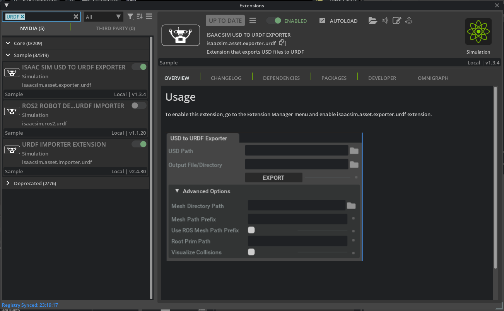
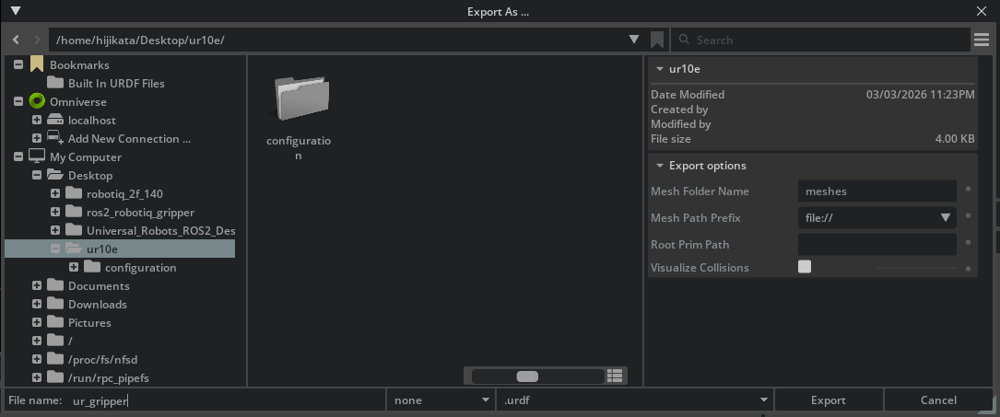
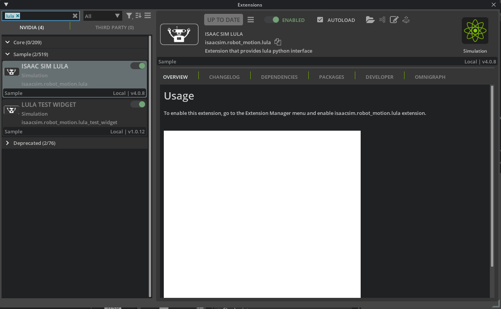
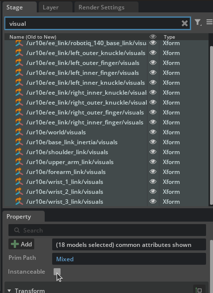
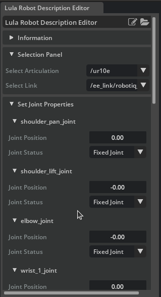
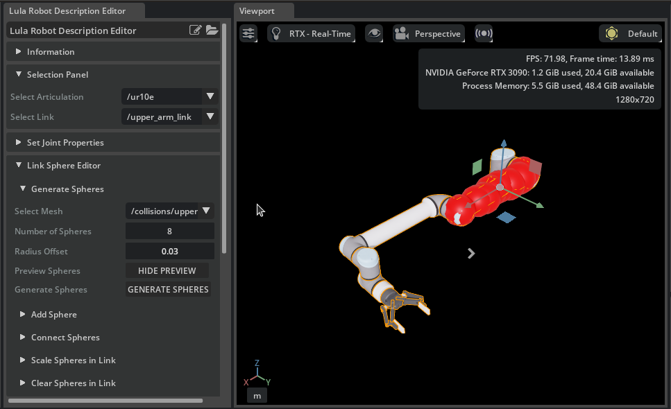
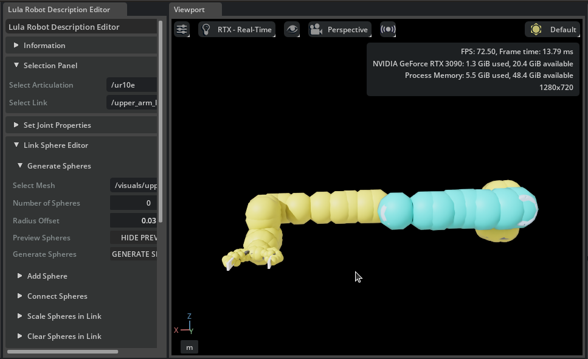

# Generate Robot Configuration File

## Learning Objectives

After completing this tutorial, you will have learned:

- How to generate URDF files using the USD to URDF Exporter
- How to use the Lula Robot Description Editor
- How to generate and tune collision spheres
- How to export Lula robot description files (YAML)
- How to export cuMotion XRDF files

## Getting Started

### Prerequisites

- Complete [Tutorial 7: Configure a Manipulator](07_configure_manipulator.md) before starting this tutorial.

### Estimated Time

Approximately 30 minutes.

### Overview

In the previous tutorials, we imported the UR10e robot arm and Robotiq 2F-140 gripper and adjusted their physics parameters. However, to move the robot autonomously, **kinematics solvers** (such as RMPFlow and cuMotion) are required, and these solvers need **configuration files** that describe the robot's structure and collision information.

In this tutorial, we will generate configuration files using two tools:

- **USD to URDF Exporter**: Generates a URDF file from a USD asset
- **Lula Robot Description Editor**: Generates collision spheres and exports robot description files (YAML / XRDF)

!!! note "What are the configuration files used for?"
    The generated configuration files are used by motion planning tools such as **RMPFlow**, **cuMotion**, and **Lula kinematics solvers**. They will be put to practical use in the next tutorial (Pick and Place Example).

### Assets Used

We will use the assets created in Tutorial 7. If you have not completed it yet, you can use the sample assets included with Isaac Sim. Access them from the **Content** tab at the bottom-right of the screen:

| Asset | Path | Purpose |
|---|---|---|
| **Configured asset** | `Samples > Rigging > Manipulator > configure_manipulator > ur10e > ur > ur_gripper.usd` | Completed asset from Tutorial 7 |
| **Lula-ready asset** | `Samples > Rigging > Manipulator > configure_manipulator > ur10e > ur > ur_gripper_lula.usd` | Asset with Instantiable disabled (used in Step 2) |

## Step 1: Generate the Robot URDF

First, we generate a URDF file from the USD asset. The URDF is required as input for the Lula Robot Description Editor.

### 1-1. Enable the USD to URDF Exporter Extension

1. From the Isaac Sim menu, select **Window > Extensions**.

2. Type "**URDF**" in the search bar.

3. Locate **Isaac Sim USD to URDF Exporter Extension**.

    !!! tip "If the extension is not found"
        If the extension does not appear in the search results, remove the "**@feature**" filter on the right side of the search bar.

4. Click the **ENABLE** toggle to enable it.

5. Check the **AUTOLOAD** checkbox (this will automatically load the extension when Isaac Sim starts in future sessions).

### 1-2. Export the URDF File

1. Open the `ur_gripper.usd` asset created in Tutorial 7 (if using the bundled Isaac Sim asset, open `Samples > Rigging > Manipulator > configure_manipulator > ur10e > ur > ur_gripper.usd`).

2. From the Isaac Sim menu, select **File > Export URDF**.

3. Set the file name to `ur_gripper` at the bottom of the export dialog.

4. In the **Export Options** section at the bottom of the dialog, configure the following items:

    | Setting | Default Value | Description |
    |---|---|---|
    | **Mesh Folder Name** | `meshes` | Name of the mesh folder created at the export destination. Also used for mesh reference paths within the URDF |
    | **Mesh Path Prefix** | `file://` | Path prefix for referencing mesh files within the URDF file. Choose from `file://` (absolute path URI), `package://` (ROS package path), or `./` (relative path) |
    | **Package Name** | (empty) | Only shown when `package://` is selected for **Mesh Path Prefix**. Specify the ROS package name (e.g., `ur_gripper_description`) |
    | **Root Prim Path** | (empty) | Root prim path of the robot to export. If empty, the stage's default prim is used |
    | **Visualize Collisions** | Off | When enabled, collision meshes that have their visibility disabled will also be included in the URDF export |

    !!! tip "Choosing a Mesh Path Prefix"
        - **`file://`** (default): References mesh files using absolute path URIs. Suitable for local use.
        - **`package://`**: References meshes using the ROS package path format. Select this when using the robot in a ROS environment. When selected, the **Package Name** field will appear for you to enter the ROS package name.
        - **`./`**: References meshes using relative paths. Convenient when moving the URDF file and mesh folder together.

5. Click **Export** to execute the export.

    

## Step 2: Prepare the Lula Robot Description Editor

### 2-1. Enable the Lula Extension

1. From the Isaac Sim menu, select **Window > Extensions**.

2. Type "**Lula**" in the search bar.

3. Locate **Isaac Sim Lula Extension**.

    !!! tip "If the extension is not found"
        If the extension does not appear in the search results, remove the "**@feature**" filter on the right side of the search bar.

4. Click the **ENABLE** toggle to enable it.

5. Check the **AUTOLOAD** checkbox.

### 2-2. Prepare the Asset (Disable Instantiable Meshes)

The Lula Robot Description Editor does not support **Instantiable meshes**. Meshes imported from URDF may have Instantiable enabled, so it must be disabled beforehand.

1. If not already open, open the `ur_gripper.usd` asset.

2. In the **Stage** panel, select all `visuals` (visual meshes) and `collisions` (collision meshes) prims on the robot.

    !!! tip "Efficient selection method"
        Use the search feature in the Stage panel to search for `visuals` or `collisions` to quickly locate the target prims.

3. In the **Property** panel, uncheck the **Instantiable** field.

    

    !!! tip "Can't find the Instantiable field?"
        The selected meshes may include a mix of prims with Instantiable enabled and disabled. Select carefully to avoid mixing them.

4. Save the changes with **Ctrl + S**.

!!! note "Using the pre-prepared asset"
    An asset with this step already completed is included with Isaac Sim. You can skip this step by opening `Samples > Rigging > Manipulator > configure_manipulator > ur10e > ur > ur_gripper_lula.usd` from the Content browser.

## Step 3: Configure Joints

### 3-1. Start Simulation and Launch the Lula Robot Description Editor

The Lula Robot Description Editor must be used while the simulation is running.

1. Click the **Play** button on the toolbar to start the simulation.

2. From the Isaac Sim menu, select **Tools > Robotics > Lula Robot Description Editor**.

3. The Lula Robot Description Editor window will appear.

### 3-2. Select the Articulation

1. In the **Selection Panel** of the Lula Robot Description Editor, select the **ur10e** articulation.

2. All joints of the robot will be displayed in a list.

### 3-3. Set Joint Status

In the **Set Joint Properties** section, set the **Joint Status** for each joint. This setting determines which joints the kinematics solver will control.

**UR10e joints** (6-axis robot arm):

| Joint Name | Joint Status | Description |
|---|---|---|
| shoulder_pan_joint | **Active Joint** | Controlled by the solver |
| shoulder_lift_joint | **Active Joint** | Controlled by the solver |
| elbow_joint | **Active Joint** | Controlled by the solver |
| wrist_1_joint | **Active Joint** | Controlled by the solver |
| wrist_2_joint | **Active Joint** | Controlled by the solver |
| wrist_3_joint | **Active Joint** | Controlled by the solver |

**Robotiq 2F-140 gripper joints** (all):

| Joint Name | Joint Status | Description |
|---|---|---|
| (all gripper joints) | **Fixed Joint** | Not controlled by the solver |

!!! note "Why set gripper joints to Fixed?"
    The gripper and arm are typically controlled separately. The kinematics solver's configuration space (cspace) only needs to include the arm joints. Including gripper joints would add unnecessary computation and could cause the gripper to move during collision checking.

!!! warning "Joint initial values"
    The default joint values in `cspace_to_urdf_rules` must match the initial pose of the manipulator in the USD. If they do not match, reset the joints during task initialization.

!!! warning "Do not stop the simulation"
    The simulation is also required for the next step (generating collision spheres). Do not close the Lula Robot Description Editor or stop the simulation.

## Step 4: Generate Collision Spheres

Collision spheres approximate the shape of each robot link using spheres, enabling the kinematics solver to quickly detect collisions with obstacles. Multiple spheres are placed on each link to cover its shape.

### 4-1. Collision Sphere Generation Procedure

Repeat the following procedure for **each robot link**. Here we use `upper_arm_link` as an example.

1. Open the **Link Sphere editor** section in the Lula Robot Description Editor.

2. From the **Selection Panel / Select link** dropdown, select the link to generate collision spheres for (e.g., `upper_arm_link`).

3. From the **Generate Spheres / Select Mesh** dropdown, select the corresponding mesh (e.g., `/collisions/upperarm/mesh`).

4. Set the following parameters:

    | Parameter | Recommended Value | Description |
    |---|---|---|
    | **Radius Offset** | **0.03** | Radius offset for the spheres (margin from the mesh surface) |
    | **Number of Spheres** | **8** | Number of spheres to generate |

    

5. Click the **Generate Spheres** button.

6. Red spheres will appear on the link. Once generation is complete, the spheres will turn cyan.

7. If needed, you can drag the spheres to adjust their positions.

8. Repeat this procedure for all robot links (both arm links and gripper links). Completed spheres on unselected links are displayed in yellow. For fine details near the end-effector, it is recommended to use a smaller **Radius Offset** such as **0.01**.

### 4-2. Tips for Tuning Collision Spheres

The quality of collision spheres has a significant impact on motion planning performance. Use the following guidelines:

| Guideline | Description |
|---|---|
| **Size balance** | Spheres should be large enough to cover the link shape, but not too large. Oversized spheres cause the solver to detect collisions where there are none, preventing it from finding valid paths |
| **Quantity vs. accuracy trade-off** | Increasing the number of spheres improves the accuracy of the link shape approximation, but increases solver computation cost. Balance accuracy with performance |
| **Mesh selection** | Typically, generate spheres on collision meshes. If the visual mesh provides a more accurate approximation of the link shape, use that instead |
| **Long links** | For long links, generate spheres at both ends first, then use **Add Spheres** to distribute them evenly in between |
| **Size adjustment** | If automatically generated spheres are not the right size, use the **Scale Spheres in Link** feature to scale them up or down |
| **Non-watertight meshes** | Automatic sphere generation only works on watertight triangle meshes. For non-watertight meshes, add and adjust spheres manually |

!!! warning "Do not stop the simulation"
    The simulation is still required for the next step. Do not stop the simulation or save the file.

## Step 5: Export Configuration Files

### 5-1. Export the Lula Robot Description File (YAML)

1. Expand the **Export To File** section at the bottom of the Lula Robot Description Editor.

2. Expand **Export to Lula Robot Description File**.

3. Click the file icon and set the filename to `ur10e.yaml`.

4. Click **Save** to execute the export.

    

!!! note "Contents of the exported file"
    The Lula robot description file (YAML) contains the joint configuration, configuration space definition, and collision sphere positions and sizes. This file is used by RMPFlow and Lula kinematics solvers.

### 5-2. Export the cuMotion XRDF File (Optional)

If you plan to use cuMotion, also export an XRDF file.

1. In the **Export To File** section, expand **Export to cuMotion XRDF**.

2. Click the file icon and set the filename to `ur10e.xrdf`.

3. Click **Save** to execute the export.

    

!!! note "What is XRDF?"
    XRDF (Extended Robot Description Format) is a robot description format used by cuMotion (CUDA-accelerated motion planning). It is required for GPU-accelerated high-speed motion planning.

### 5-3. Stop the Simulation

Once all exports are complete, click the **Stop** button on the toolbar to stop the simulation.

## Summary

This tutorial covered the following topics:

1. Generating a URDF file with the **USD to URDF Exporter**
2. Setting up the **Lula Robot Description Editor** and preparing the asset (disabling Instantiable)
3. **Configuring joint status**: Setting arm joints to Active and gripper joints to Fixed
4. **Generating collision spheres**: Placing and adjusting spheres for each link
5. Exporting the **Lula robot description file (YAML)**
6. Exporting the **cuMotion XRDF file** (optional)

!!! tip "Reference Documentation"
    - [Lula Robot Description and XRDF Editor (official documentation)](https://docs.isaacsim.omniverse.nvidia.com/latest/robot_setup/ext_isaacsim_robot_description_lula.html)
    - [USD to URDF Exporter Extension (official documentation)](https://docs.isaacsim.omniverse.nvidia.com/latest/robot_setup/ext_isaacsim_asset_exporter_urdf.html)

## Next Steps

Proceed to the next tutorial, "[Pick and Place Example](09_pick_and_place.md)", to learn how to use the generated configuration files with kinematics solvers and RMPFlow to perform manipulation tasks.
