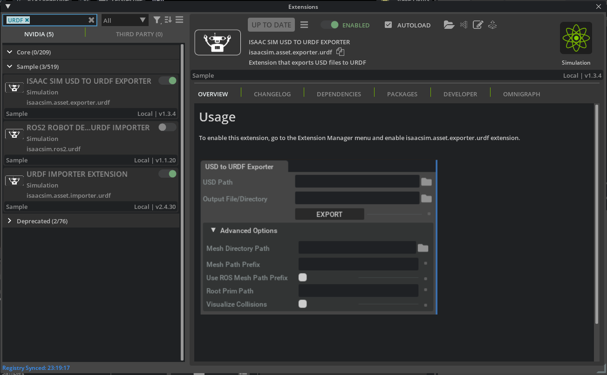
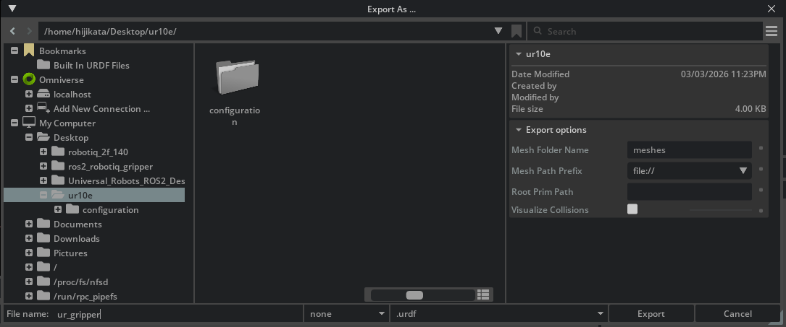
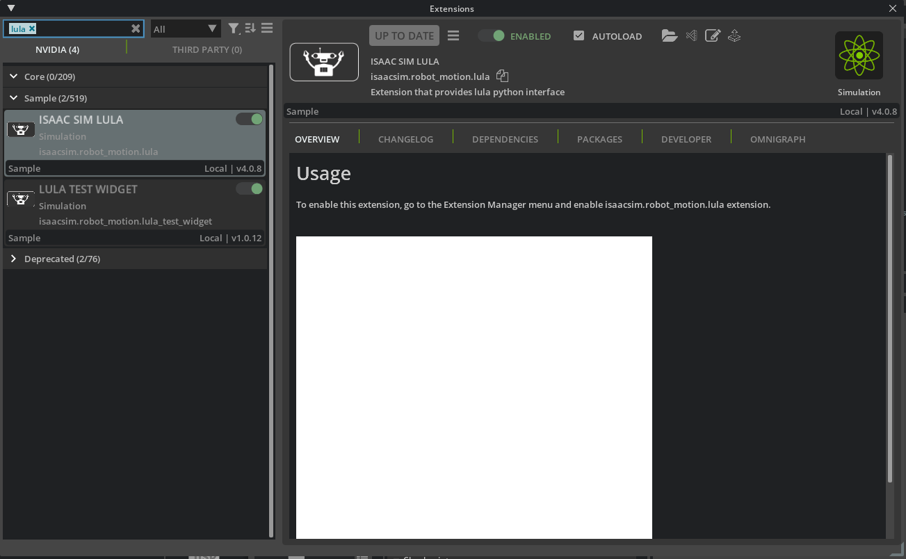
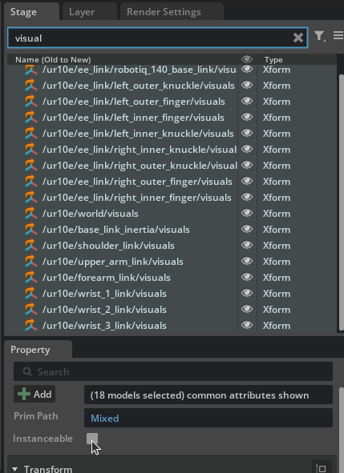
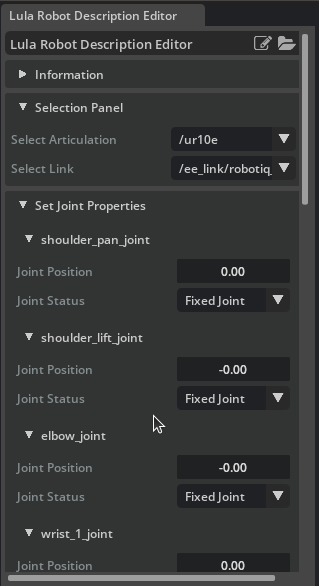
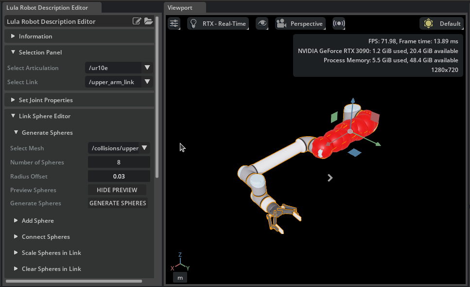
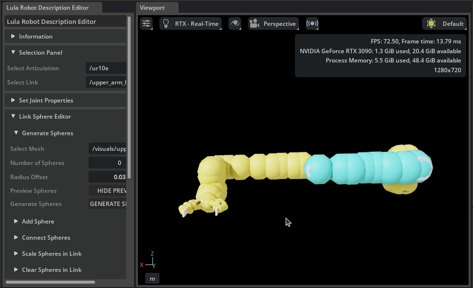

# Generate Robot Configuration File

## Learning Objectives

After completing this tutorial, you will have learned:

- How to generate URDF files using the USD to URDF Exporter
- How to use the Robot Description Editor (cuMotion/Lula Robot Description Editor)
- How to generate and tune collision spheres
- How to export cuMotion XRDF files
- How to add a tool frame (tool_frames) and assemble the robot configuration directory

## Getting Started

### Prerequisites

- Complete [Tutorial 7: Configure a Manipulator](07_configure_manipulator.md) before starting this tutorial.

### Estimated Time

Approximately 30 minutes.

### Overview

In the previous tutorials, we imported the UR10e robot arm and Robotiq 2F-140 gripper and adjusted their physics parameters. However, to move the robot autonomously, **motion planners** (RMPFlow and cuMotion) are required, and these planners need **configuration files** that describe the robot's structure and collision information.

In this tutorial, we will generate configuration files using two tools:

- **USD to URDF Exporter**: Generates a URDF file from a USD asset
- **Robot Description Editor (cuMotion/Lula Robot Description Editor)**: Generates collision spheres and exports the XRDF file

!!! note "What are the configuration files used for?"
    The generated configuration files are used by motion planning tools such as **cuMotion** (including RMPflow). They will be put to practical use in the next tutorial (Pick and Place Example).

!!! note "Changes in Isaac Sim 6.0"
    Up to 5.1, a Lula robot description file (YAML) was generated and used with the Lula kinematics solver / RMPFlow. In 6.0, the legacy Lula APIs (`isaacsim.robot_motion.lula` / `motion_generation`) are deprecated, and the workflow moved to **loading an XRDF file into cuMotion motion planners**.

### Assets Used

We will use the assets created in Tutorial 7. If you have not completed it yet, you can use the sample assets included with Isaac Sim. Access them from the **Content** tab at the bottom-left of the screen:

| Asset | Path | Purpose |
|---|---|---|
| **Configured asset** | `Samples > Rigging > Manipulator > configure_manipulator > ur10e > ur > ur_gripper.usd` | Completed asset from Tutorial 7 |

!!! note "Retirement of ur_gripper_lula.usd"
    The Instanceable-disabled asset (`ur_gripper_lula.usd`) provided up to 5.1 is no longer referenced by the official 6.0 tutorial. Disable Instanceable yourself by following the procedure in Step 2.

## Step 1: Generate the Robot URDF

First, we generate a URDF file from the USD asset. The URDF is required for cuMotion to load the robot's kinematics.

### 1-1. Enable the USD to URDF Exporter Extension

1. From the Isaac Sim menu, select **Window > Extensions**.

2. Type "**URDF**" in the search bar.

3. Locate **Isaac Sim USD to URDF Exporter Extension**.

    !!! tip "If the extension is not found"
        If the extension does not appear in the search results, remove the "**@feature**" filter on the right side of the search bar.

4. Click the **ENABLE** toggle to enable it.

5. Check the **AUTOLOAD** checkbox (this will automatically load the extension when Isaac Sim starts in future sessions).



### 1-2. Export the URDF File

1. Open the `ur_gripper.usd` asset created in Tutorial 7 (if using the bundled Isaac Sim asset, open `Samples > Rigging > Manipulator > configure_manipulator > ur10e > ur > ur_gripper.usd`).

2. From the Isaac Sim menu, select **File > Export URDF**.

3. Set the file name to `robot.urdf` at the bottom of the export dialog.

    !!! tip "Why name it robot.urdf?"
        `robot.urdf` matches the default `--urdf` value in the pick-and-place tutorial scripts, so you won't need to pass `--urdf` explicitly when running them.

4. In the **Export Options** section at the bottom of the dialog, configure the following items:

    | Setting | Default Value | Description |
    |---|---|---|
    | **Mesh Folder Name** | `meshes` | Name of the mesh folder created at the export destination. Also used for mesh reference paths within the URDF |
    | **Mesh Path Prefix** | `file://` | Path prefix for referencing mesh files within the URDF file. Choose from `file://` (absolute path URI), `package://` (ROS package path), or `./` (relative path) |
    | **Package Name** | (empty) | Only shown when `package://` is selected for **Mesh Path Prefix**. Specify the ROS package name (e.g., `ur_gripper_description`) |
    | **Root Prim Path** | (empty) | Root prim path of the robot to export. If empty, the stage's default prim is used |
    | **Visualize Collisions** | Off | When enabled, collision meshes that have their visibility disabled will also be included in the URDF export |

    !!! tip "Choosing a Mesh Path Prefix"
        - **`file://`** (default): References mesh files using absolute path URIs. Suitable for local use.
        - **`package://`**: References meshes using the ROS package path format. Select this when using the robot in a ROS environment. When selected, the **Package Name** field will appear for you to enter the ROS package name.
        - **`./`**: References meshes using relative paths. Convenient when moving the URDF file and mesh folder together.

5. Click **Export** to execute the export.

    

## Step 2: Prepare the Robot Description Editor

### 2-1. Enable the Robot Description Editor Extension

1. From the Isaac Sim menu, select **Window > Extensions**.

2. Type "**isaacsim.robot_setup.xrdf_editor**" in the search bar.

3. Locate the **cuMotion/Lula Robot Description Editor** extension.

    !!! tip "If the extension is not found"
        If the extension does not appear in the search results, remove the "**@feature**" filter on the right side of the search bar.

4. Click the **ENABLE** toggle to enable it.

5. Check the **AUTOLOAD** checkbox.



### 2-2. Prepare the Asset (Disable Instanceable Meshes)

The Robot Description Editor does not support **Instanceable meshes**. Meshes imported from URDF may have Instanceable enabled, so it must be disabled beforehand.

1. If not already open, open the `ur_gripper.usd` asset.

2. In the **Stage** panel, select all `visuals` (visual meshes) and `collisions` (collision meshes) prims on the robot.

    !!! tip "Efficient selection method"
        Use the search feature in the Stage panel to search for `visuals` or `collisions` to quickly locate the target prims.

3. In the **Property** panel, uncheck the **Instanceable** field.

    

    !!! tip "Can't find the Instanceable field?"
        The selected meshes may include a mix of prims with Instanceable enabled and disabled. Select carefully to avoid mixing them.

4. Save the changes with **Ctrl + S**.

## Step 3: Configure Joints

### 3-1. Start Simulation and Launch the Robot Description Editor

The Robot Description Editor must be used while the simulation is running.

1. Click the **Play** button on the toolbar to start the simulation.

2. From the Isaac Sim menu, select **Tools > Robotics > cuMotion/Lula Robot Description Editor**.

3. The Robot Description Editor window will appear.

### 3-2. Select the Articulation

1. In the **Selection Panel** of the Robot Description Editor, set **Select Articulation** to the prim path of the **ur10e** articulation.

2. All joints of the robot will be displayed in a list.



### 3-3. Set Joint Status

In the **Set Joint Properties** section, set the **Joint Status** for each joint. This setting determines which joints the motion planner will control.

**UR10e joints** (6-axis robot arm):

| Joint Name | Joint Status | Description |
|---|---|---|
| shoulder_pan_joint | **Active Joint** | Directly controlled by cuMotion |
| shoulder_lift_joint | **Active Joint** | Directly controlled by cuMotion |
| elbow_joint | **Active Joint** | Directly controlled by cuMotion |
| wrist_1_joint | **Active Joint** | Directly controlled by cuMotion |
| wrist_2_joint | **Active Joint** | Directly controlled by cuMotion |
| wrist_3_joint | **Active Joint** | Directly controlled by cuMotion |

**Robotiq 2F-140 gripper joints** (all):

| Joint Name | Joint Status | Description |
|---|---|---|
| (all gripper joints) | **Fixed Joint** | cuMotion holds them at the specified default position |


!!! note "Why set gripper joints to Fixed?"
    The gripper and arm are typically controlled separately. The motion planner's configuration space (cspace) only needs to include the arm joints. Including gripper joints would add unnecessary computation and could cause the gripper to move during collision checking.

!!! warning "Joint initial values"
    The default positions of joints set to Fixed Joint are taken directly from the joint positions in the Robot Description Editor at the time of export. They must match the initial pose of the manipulator in the USD. If they do not match, reset the joints during task initialization.

!!! warning "Do not stop the simulation"
    The simulation is also required for the next step (generating collision spheres). Do not close the Robot Description Editor or stop the simulation.

## Step 4: Generate Collision Spheres

Collision spheres approximate the shape of each robot link using spheres, enabling the motion planner to quickly detect collisions with obstacles. Multiple spheres are placed on each link to cover its shape.

### 4-1. Collision Sphere Generation Procedure

Repeat the following procedure for **each robot link**. Here we use `upper_arm_link` as an example.

1. Open the **Link Sphere Editor** section in the Robot Description Editor.

2. From the **Selection Panel / Select link** dropdown, select the link to generate collision spheres for (e.g., `upper_arm_link`).

3. From the **Generate Spheres / Select Mesh** dropdown, select the corresponding mesh (e.g., `/collisions/upperarm/mesh`).

4. Set the following parameters:

    | Parameter | Recommended Value | Description |
    |---|---|---|
    | **Radius Offset** | **0.03** | Radius offset for the spheres (margin from the mesh surface) |
    | **Number of Spheres** | **8** | Number of spheres to generate |

    

5. Click the **Generate Spheres** button.

6. Red spheres will appear on the link. Once generation is complete, the spheres will turn cyan.

7. If needed, you can drag the spheres to adjust their positions.

8. Repeat this procedure for all robot links (both arm links and gripper links). Completed spheres on unselected links are displayed in yellow. For fine details near the end-effector, it is recommended to use a smaller **Radius Offset** such as **0.01**.



The official tutorial suggests the following per-link settings for the ur10e + Robotiq 2F-140 (for links with multiple mesh entries, generate spheres for each mesh and combine them on the same link):

| Select Link | Number of Spheres | Radius Offset | Select Mesh |
|---|---|---|---|
| /shoulder_link | 1 | 0.03 | /collisions/shoulder/mesh |
| /upper_arm_link | 8 | 0.03 | /visuals/upperarm/mesh |
| /forearm_link | 8 | 0.03 | /visuals/forearm/mesh |
| /wrist_1_link | 1 | 0.03 | /visuals/wrist1/mesh |
| /wrist_2_link | 1 | 0.02 | /visuals/wrist3/mesh |
| /wrist_3_link | 1 | 0.02 | /visuals/wrist3/mesh |
| /ee_link/robotiq_arg2f_base_link | 1 | 0.02 | /visuals/robotiq_arg2f_base_link/mesh |
| /ee_link/left_outer_knuckle | 2 | 0.02 | /visuals/robotiq_arg2f_140_outer_knuckle/mesh |
| /ee_link/left_outer_knuckle | 2 | 0.02 | /visuals/robotiq_arg2f_140_outer_finger/mesh |
| /ee_link/left_inner_finger | 2 | 0.02 | /collisions/robotiq_arg2f_140_inner_finger/mesh |
| /ee_link/right_inner_finger | 2 | 0.02 | /collisions/robotiq_arg2f_140_inner_finger/mesh |
| /ee_link/left_inner_knuckle | 2 | 0.02 | /visuals/robotiq_arg2f_140_inner_knuckle/mesh |
| /ee_link/right_inner_knuckle | 2 | 0.02 | /visuals/robotiq_arg2f_140_inner_knuckle/mesh |
| /ee_link/right_outer_knuckle | 2 | 0.02 | /visuals/robotiq_arg2f_140_outer_knuckle/mesh |
| /ee_link/right_outer_knuckle | 2 | 0.02 | /visuals/robotiq_arg2f_140_outer_finger/mesh |

### 4-2. Tips for Tuning Collision Spheres

The quality of collision spheres has a significant impact on motion planning performance. Use the following guidelines:

| Guideline | Description |
|---|---|
| **Size balance** | Spheres should be large enough to cover the link shape, but not too large. Oversized spheres cause the solver to detect collisions where there are none, preventing it from finding valid paths |
| **Quantity vs. accuracy trade-off** | Increasing the number of spheres improves the accuracy of the link shape approximation, but increases solver computation cost. Balance accuracy with performance |
| **Mesh selection** | Typically, generate spheres on collision meshes. If the visual mesh provides a more accurate approximation of the link shape, use that instead |
| **Long links** | For long cylindrical links, generate spheres at both ends first, then use **Connect Spheres** to distribute them evenly in between |
| **Size adjustment** | If automatically generated spheres are not the right size, use the **Scale Spheres in Link** feature to scale them up or down |
| **Non-watertight meshes** | Automatic sphere generation only works on watertight triangle meshes. For non-watertight meshes, add and adjust spheres manually |

!!! warning "Do not stop the simulation"
    The simulation is still required for the next step. Do not stop the simulation or save the file.

## Step 5: Export Configuration Files

### 5-1. Export the cuMotion XRDF File

!!! warning "Do not stop the simulation before exporting"
    Stopping the simulation will discard the settings made so far.

1. Expand **Export To File > Export to cuMotion XRDF** at the bottom of the Robot Description Editor.

2. Click the file icon and set the filename to `robot.xrdf`. Save it to the same directory as the URDF file exported in Step 1.

3. Select the **XRDF version** to export (**2.0** is recommended).

4. Click **Save** to execute the export.

5. Once the export is complete, click the **Stop** button on the toolbar to stop the simulation.

!!! note "What is XRDF?"
    XRDF (Extended Robot Description Format) is a robot description format used by cuMotion (CUDA-accelerated motion planning). It describes the joint configuration, configuration space definition, and collision sphere positions and sizes.

!!! note "Retirement of the Lula YAML export"
    Exporting the Lula robot description file (YAML), which was part of the procedure up to 5.1, was removed from the official 6.0 tutorial along with the deprecation of the Lula APIs.

### 5-2. Add a Tool to the Robot Configuration

cuMotion requires a **tool frame** defined in the XRDF file. The tool frame specifies the end-effector frame for the robot.

1. Open the `robot.xrdf` file in a text editor.

2. Add the following line to the file:

    ```yaml
    tool_frames: ["wrist_3_link"]
    ```

See the [cuMotion Robot Configuration Tutorial (official documentation)](https://docs.isaacsim.omniverse.nvidia.com/latest/cumotion/tutorial_robot_configuration.html) for more information on XRDF files and loading robot configurations into cuMotion.

### 5-3. Assemble the Robot Configuration Directory

The pick-and-place tutorial scripts and the `load_cumotion_robot` API expect all robot configuration files to live in a single directory. After completing the export steps above, your directory should look like this:

```
/path/to/robot/config/
├── robot.urdf
├── robot.xrdf
├── rmp_flow.yaml
└── meshes/
    └── ...
```

Pass this directory to the tutorial scripts with `--xrdf-dir /path/to/robot/config`.

The `rmp_flow.yaml` file configures the RMPflow reactive motion controller. Save the text below in a file named `rmp_flow.yaml` in the same directory as your `robot.urdf` and `robot.xrdf` files:

```yaml
format: rmpflow
api_version: 2.0

joint_limit_buffers: [.01, .01, .01, .01, .01, .01]

rmp_params:
  cspace_target_rmp:
    metric_scalar: 50.
    position_gain: 100.
    damping_gain: 50.
    robust_position_term_thresh: .5
    inertia: 1.
  cspace_trajectory_rmp:
    p_gain: 80.
    d_gain: 10.
    ff_gain: .25
    weight: 50.
  cspace_affine_rmp:
    final_handover_time_std_dev: .25
    weight: 2000.
  joint_limit_rmp:
    metric_scalar: 1000.
    metric_length_scale: .01
    metric_exploder_eps: 1e-3
    metric_velocity_gate_length_scale: .01
    accel_damper_gain: 200.
    accel_potential_gain: 1.
    accel_potential_exploder_length_scale: .1
    accel_potential_exploder_eps: 1e-2
  joint_velocity_cap_rmp:
    max_velocity: 2.15
    velocity_damping_region: 0.5
    damping_gain: 300.
    metric_weight: 100.
  target_rmp:
    accel_p_gain: 80.
    accel_d_gain: 120.
    accel_norm_eps: .075
    metric_alpha_length_scale: .05
    min_metric_alpha: .01
    max_metric_scalar: 10000.
    min_metric_scalar: 2500.
    proximity_metric_boost_scalar: 20.
    proximity_metric_boost_length_scale: .02
    accept_user_weights: false
  axis_target_rmp:
    accel_p_gain: 200.
    accel_d_gain: 40.
    metric_scalar: 10.
    proximity_metric_boost_scalar: 3000.
    proximity_metric_boost_length_scale: .05
    accept_user_weights: false
  collision_rmp:
    damping_gain: 50.
    damping_std_dev: .04
    damping_robustness_eps: 1e-2
    damping_velocity_gate_length_scale: .01
    repulsion_gain: 1000.
    repulsion_std_dev: .01
    metric_modulation_radius: .5
    metric_scalar: 500.
    metric_exploder_std_dev: .02
    metric_exploder_eps: .001
  damping_rmp:
    accel_d_gain: 30.
    metric_scalar: 50.
    inertia: 100.

canonical_resolve:
  max_acceleration_norm: 50.
  projection_tolerance: .01
  verbose: false

body_capsules:
  - name: base_link
    pt1: [0, 0, 0.22]
    pt2: [0, 0, 0]
    radius: .09

body_collision_controllers:
  - name: wrist_2_link
    radius: .04
  - name: wrist_3_link
    radius: .04
```

For a full description of these files and how they are used by cuMotion, see the [Robot Configuration Files section of the cuMotion tutorial (official documentation)](https://docs.isaacsim.omniverse.nvidia.com/latest/cumotion/tutorial_robot_configuration.html).

## Summary

This tutorial covered the following topics:

1. Generating a URDF file (`robot.urdf`) with the **USD to URDF Exporter**
2. Setting up the **Robot Description Editor** and preparing the asset (disabling Instanceable)
3. **Configuring joint status**: Setting arm joints to Active and gripper joints to Fixed
4. **Generating collision spheres**: Placing and adjusting spheres for each link
5. Exporting the **cuMotion XRDF file (`robot.xrdf`)** and adding **tool_frames**
6. **Assembling the robot configuration directory**: consolidating `robot.urdf` / `robot.xrdf` / `rmp_flow.yaml` into a single directory

The resulting XRDF file can be loaded directly into cuMotion motion planners.

!!! tip "Reference Documentation"
    - [Robot Description Editor (official documentation)](https://docs.isaacsim.omniverse.nvidia.com/latest/manipulators/manipulators_robot_description_editor.html)
    - [USD to URDF Exporter (official documentation)](https://docs.isaacsim.omniverse.nvidia.com/latest/importer_exporter/export_urdf.html)
    - [cuMotion Robot Configuration Tutorial (official documentation)](https://docs.isaacsim.omniverse.nvidia.com/latest/cumotion/tutorial_robot_configuration.html)

## Next Steps

Proceed to the next tutorial, "[Pick and Place Example](09_pick_and_place.md)", to learn how to use the generated configuration files to perform manipulation tasks with cuMotion RMPflow and PINK differential IK.
