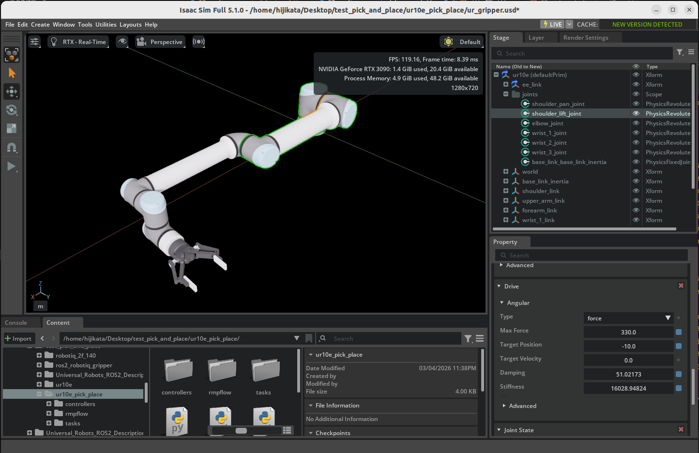
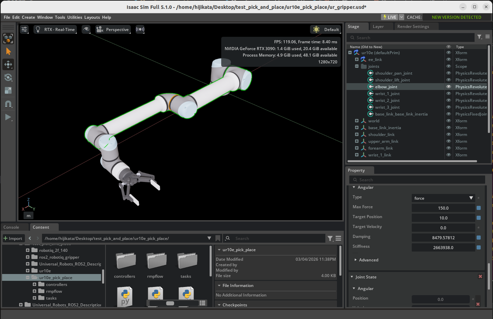
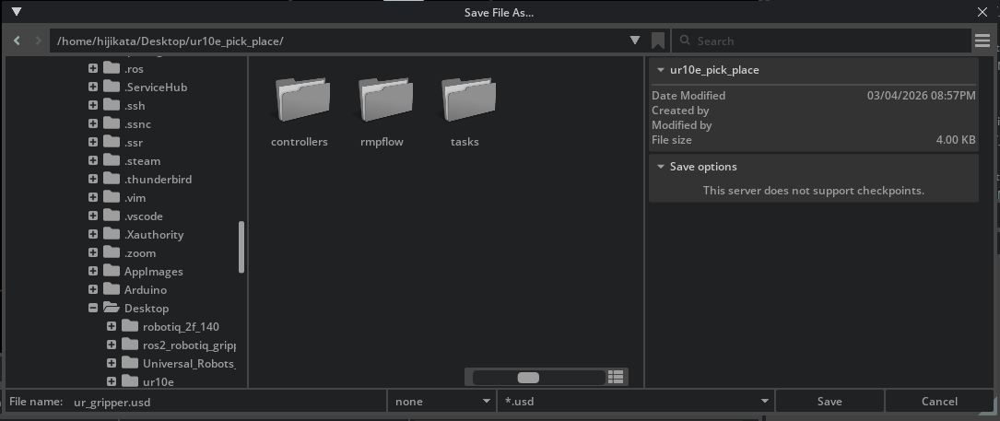

# ピック＆プレースの例

## 学習目標

このチュートリアルを修了すると、以下の内容を習得できます：

- グリッパーの開閉制御の方法
- Lula キネマティクスソルバー（逆運動学）によるターゲット追従
- RMPFlow によるモーション制御の設定と実行
- ピック＆プレースタスクの実装

## はじめに

### 前提条件

- [チュートリアル 8: ロボット設定ファイルの生成](08_generate_robot_config.md) を完了していること
- チュートリアル 7〜8 で作成した以下のファイルが手元にあること：
    - **USD アセット**（`ur_gripper.usd`）— チュートリアル 7 で作成
    - **URDF ファイル**（`ur_gripper.urdf`）— チュートリアル 8 のステップ 1 で生成
    - **Lula ロボット記述ファイル**（`ur10e.yaml`）— チュートリアル 8 のステップ 5 で生成

### 所要時間

約 30〜40 分

### 概要

前回までのチュートリアルでは、UR10e ロボットアームと Robotiq 2F-140 グリッパーをセットアップし、キネマティクスソルバー用の設定ファイル（URDF、ロボット記述 YAML）を生成しました。

このチュートリアルでは、これらの成果物を活用して、**自分のプロジェクトディレクトリ**に Python スクリプトを作成し、ロボットを制御します。以下の 5 つのステップで段階的に進めます：

1. **プロジェクトの準備** — ディレクトリ構成と設定ファイルの配置
2. **グリッパー制御** — グリッパーの開閉を制御する基礎
3. **IK ソルバーによるターゲット追従** — 逆運動学でエンドエフェクタを目標位置に移動
4. **RMPFlow によるターゲット追従** — 障害物回避を含むスムーズなモーション制御
5. **ピック＆プレースタスク** — すべてを組み合わせた物体の把持と配置

!!! tip "同梱サンプルも参考にできます"
    Isaac Sim には、このチュートリアルと同等の完成済みサンプルコードが同梱されています。行き詰まった場合や動作を確認したい場合は、以下のパスのスクリプトを参考にしてください：

    ```
    standalone_examples/api/isaacsim.robot.manipulators/ur10e/
    ```

    実行方法：
    ```bash
    ./python.sh standalone_examples/api/isaacsim.robot.manipulators/ur10e/<スクリプト名>.py
    ```

## ステップ 1：プロジェクトの準備

### 1-1. ディレクトリ構成

任意の場所にプロジェクトディレクトリを作成し、以下の構成でファイルを配置します。ここでは `ur10e_pick_place` というディレクトリ名を例として使用します：

```
ur10e_pick_place/
├── ur_gripper.usd                      # チュートリアル 7 で作成した USD アセットを Save As で配置
├── gripper_control.py                  # ステップ 2 で作成
├── follow_target_example.py            # ステップ 3 で作成
├── follow_target_example_rmpflow.py    # ステップ 4 で作成
├── pick_place_example.py               # ステップ 5 で作成
├── controllers/
│   ├── __init__.py                     # 空ファイル
│   ├── ik_solver.py                    # ステップ 3 で作成
│   ├── rmpflow.py                      # ステップ 4 で作成
│   └── pick_place.py                   # ステップ 5 で作成
├── tasks/
│   ├── __init__.py                     # 空ファイル
│   ├── follow_target.py                # ステップ 3 で作成
│   └── pick_place.py                   # ステップ 5 で作成
└── rmpflow/
    ├── ur10e.yaml                       # チュートリアル 8 で生成（Lula ロボット記述ファイル）したファイルをコピー
    ├── ur_gripper.urdf                   # チュートリアル 8 で生成したファイルをコピー
    └── ur10e_rmpflow_common.yaml       # ステップ 4 で作成
```

### 1-2. USD アセットの配置

チュートリアル 7 で作成した `ur_gripper.usd` は、Physics Layer やメッシュファイルなどを相対パスで参照する構成になっています。そのままコピーすると参照先のファイルが見つからず、ロボットが正しく読み込まれません。

そこで、Isaac Sim の **Save As** 機能を使い、参照パスが正しく解決される新しい USD ファイルとしてプロジェクトディレクトリに保存します：

1. Isaac Sim で `ur_gripper.usd` を開く
2. **Stage** パネルで以下のジョイントの **Target Position** を設定する：

    | ジョイント | Target Position | 説明 |
    |---|---|---|
    | `shoulder_lift_joint` | `-10.0` deg | 肩を少し上向きに傾ける |
    | `elbow_joint` | `10.0` deg | 肘を少し上向きに曲げる |

    

    

    これにより、シミュレーション開始時にロボットの肘が地面方向に曲がっていくことを防ぎます。

3. メニューから **File > Save As...** を選択
4. 保存先をプロジェクトディレクトリ（`ur10e_pick_place/`）に指定し、ファイル名を `ur_gripper.usd` として保存

    

Save As で保存すると、参照先ファイル（Physics Layer など）への相対パスが新しい保存先に合わせて自動的に更新されます。

!!! warning "ファイルを単純にコピーしないでください"
    `ur_gripper.usd` をファイルマネージャやコマンドでコピーすると、内部の相対パス参照が壊れてロボットのプリム階層が読み込まれず、以下のようなエラーが発生します：

    ```
    Pattern '/ur10e' did not match any rigid bodies
    ```

### 1-3. その他のファイルの配置

チュートリアル 8 で作成した以下のファイルをプロジェクトディレクトリにコピーします：

- **`ur10e.yaml`** — Lula Robot Description Editor からエクスポートしたロボット記述ファイル（`rmpflow/` に配置）
- **`ur_gripper.urdf`** — USD to URDF Exporter で生成した URDF ファイル（`rmpflow/` に配置）

=== "Linux"

    ```bash
    mkdir -p ur10e_pick_place/rmpflow
    mkdir -p ur10e_pick_place/controllers
    mkdir -p ur10e_pick_place/tasks
    touch ur10e_pick_place/controllers/__init__.py
    touch ur10e_pick_place/tasks/__init__.py

    # チュートリアル 8 で作成したファイルをコピー（パスは環境に合わせて変更）
    cp /path/to/your/ur10e.yaml ur10e_pick_place/rmpflow/
    cp /path/to/your/ur_gripper.urdf ur10e_pick_place/rmpflow/
    ```

=== "Windows（PowerShell）"

    ```powershell
    New-Item -ItemType Directory -Force ur10e_pick_place\rmpflow
    New-Item -ItemType Directory -Force ur10e_pick_place\controllers
    New-Item -ItemType Directory -Force ur10e_pick_place\tasks
    New-Item -ItemType File -Force ur10e_pick_place\controllers\__init__.py
    New-Item -ItemType File -Force ur10e_pick_place\tasks\__init__.py

    # チュートリアル 8 で作成したファイルをコピー（パスは環境に合わせて変更）
    Copy-Item C:\path\to\your\ur10e.yaml ur10e_pick_place\rmpflow\
    Copy-Item C:\path\to\your\ur_gripper.urdf ur10e_pick_place\rmpflow\
    ```

!!! note "以降のコード例について"
    以降のコード例では、`os.path.dirname(__file__)` を使って現在のスクリプトからの相対パスで `ur_gripper.usd` を参照します。USD アセットをプロジェクトルートに配置しておくことで、パスが固定され環境に依存しなくなります。

### 1-4. スクリプトの実行方法

このチュートリアルのスクリプトは、Isaac Sim の Python 環境で以下のように実行します：

=== "Linux"

    ```bash
    ./python.sh /path/to/ur10e_pick_place/<スクリプト名>.py
    ```

=== "Windows（PowerShell）"

    ```powershell
    .\python.bat C:\path\to\ur10e_pick_place\<スクリプト名>.py
    ```

## ステップ 2：グリッパー制御

最初のステップとして、グリッパーの開閉制御を学びます。これはマニピュレーションタスクの最も基本的な操作です。


### 2-1. スクリプトの作成

`gripper_control.py` を作成します：

```python
from isaacsim import SimulationApp

simulation_app = SimulationApp({"headless": False})

import os

import numpy as np
from isaacsim.core.api import World
from isaacsim.core.utils.stage import add_reference_to_stage
from isaacsim.core.utils.types import ArticulationAction
from isaacsim.robot.manipulators import SingleManipulator
from isaacsim.robot.manipulators.grippers import ParallelGripper

my_world = World(stage_units_in_meters=1.0)

# --- アセットの読み込み ---
asset_path = os.path.join(os.path.dirname(os.path.abspath(__file__)), "ur_gripper.usd")
add_reference_to_stage(usd_path=asset_path, prim_path="/ur10e")

# --- デバッグ: ステージのプリム階層を表示 ---
import omni.usd
stage = omni.usd.get_context().get_stage()
for prim in stage.Traverse():
    print(prim.GetPath())

# --- グリッパーの定義 ---
gripper = ParallelGripper(
    end_effector_prim_path="/ur10e/ee_link/robotiq_140_base_link",
    # 既存アセットを利用する場合
    # end_effector_prim_path="/ur10e/ee_link/robotiq_arg2f_base_link",
    joint_prim_names=["finger_joint"],
    joint_opened_positions=np.array([0]),
    joint_closed_positions=np.array([40]),
    action_deltas=np.array([-40]),
    use_mimic_joints=True,
)

# --- マニピュレータの定義 ---
my_ur10 = my_world.scene.add(
    SingleManipulator(
        prim_path="/ur10e",
        name="ur10_robot",
        end_effector_prim_path="/ur10e/ee_link/robotiq_140_base_link",
        # 既存アセットを利用する場合
        # end_effector_prim_path="/ur10e/ee_link/robotiq_arg2f_base_link",
        gripper=gripper,
    )
)

my_world.scene.add_default_ground_plane()
my_world.reset()

# --- シミュレーションループ ---
i = 0
reset_needed = False
while simulation_app.is_running():
    my_world.step(render=True)
    if my_world.is_stopped() and not reset_needed:
        reset_needed = True
    if my_world.is_playing():
        if reset_needed:
            my_world.reset()
            reset_needed = False
        i += 1
        gripper_positions = my_ur10.gripper.get_joint_positions()
        if i < 400:
            # グリッパーをゆっくり閉じる
            my_ur10.gripper.apply_action(
                ArticulationAction(joint_positions=[gripper_positions[0] + 0.1])
            )
        if i > 400:
            # グリッパーをゆっくり開く
            my_ur10.gripper.apply_action(
                ArticulationAction(joint_positions=[gripper_positions[0] - 0.1])
            )
        if i == 800:
            i = 0

simulation_app.close()
```

### 2-2. コードの解説

#### SimulationApp の初期化

```python
from isaacsim import SimulationApp
simulation_app = SimulationApp({"headless": False})
```

すべての Isaac Sim スタンドアロンスクリプトは `SimulationApp` の初期化から始まります。`headless=False` で GUI を表示します。

!!! warning "インポート順序に注意"
    `SimulationApp` の初期化は、他の Isaac Sim モジュールをインポートする**前**に行う必要があります。これは Isaac Sim のランタイムが `SimulationApp` の初期化時にセットアップされるためです。

#### ParallelGripper の設定

```python
gripper = ParallelGripper(
    end_effector_prim_path="/ur10e/ee_link/robotiq_140_base_link",
    # 既存アセットを利用する場合
    # end_effector_prim_path="/ur10e/ee_link/robotiq_arg2f_base_link",
    joint_prim_names=["finger_joint"],
    joint_opened_positions=np.array([0]),
    joint_closed_positions=np.array([40]),
    action_deltas=np.array([-40]),
    use_mimic_joints=True,
)
```

`ParallelGripper` クラスは平行グリッパー（2本の指が同時に開閉するタイプ）を制御するためのクラスです。

| パラメータ | 値 | 説明 |
|---|---|---|
| `end_effector_prim_path` | `/ur10e/ee_link/robotiq_arg2f_base_link` | エンドエフェクタのプリムパス |
| `joint_prim_names` | `["finger_joint"]` | 制御対象のジョイント名 |
| `joint_opened_positions` | `[0]` | グリッパーが開いた状態のジョイント位置 |
| `joint_closed_positions` | `[40]` | グリッパーが閉じた状態のジョイント位置 |
| `action_deltas` | `[-40]` | 開閉動作時のジョイント位置の変化量 |
| `use_mimic_joints` | `True` | Mimic ジョイントを使用する（片方の指を動かすと反対側も連動） |

!!! note "ジョイント位置の値について"
    `joint_opened_positions=0` と `joint_closed_positions=40` の値は、チュートリアル 7 で設定した Robotiq 2F-140 グリッパーのジョイント可動範囲に基づいています。Physics Inspector で確認した値を使用してください。

#### グリッパーの開閉ループ

```python
i += 1
gripper_positions = my_ur10.gripper.get_joint_positions()
if i < 400:
    my_ur10.gripper.apply_action(
        ArticulationAction(joint_positions=[gripper_positions[0] + 0.1])
    )
if i > 400:
    my_ur10.gripper.apply_action(
        ArticulationAction(joint_positions=[gripper_positions[0] - 0.1])
    )
if i == 800:
    i = 0
```

800 ステップを 1 サイクルとして以下を繰り返します：

- **ステップ 1〜400**: 現在のジョイント位置に `+0.1` ずつ加算してグリッパーを**閉じる**
- **ステップ 401〜800**: 現在のジョイント位置に `-0.1` ずつ減算してグリッパーを**開く**

各ステップでわずかな変化量を適用することで、グリッパーがゆっくりと滑らかに開閉します。

## ステップ 3：Lula キネマティクスソルバーによるターゲット追従

次に、**逆運動学（IK: Inverse Kinematics）** を使って、エンドエフェクタを目標位置に移動させる方法を学びます。


!!! note "逆運動学（IK）とは"
    逆運動学とは、エンドエフェクタの目標位置・姿勢から、各ジョイントの角度を逆算する手法です。「手先をこの位置に持っていきたい」という目標に対して、各関節をどの角度にすればよいかを計算します。

このステップでは 3 つのファイルを作成します：

- `controllers/ik_solver.py` — IK ソルバーコントローラ
- `tasks/follow_target.py` — ターゲット追従タスクの定義
- `follow_target_example.py` — 実行スクリプト

### 3-1. IK ソルバーコントローラの作成

`controllers/ik_solver.py` を作成します。このコントローラは、チュートリアル 8 で生成した設定ファイルを使って逆運動学を解きます。

```python
import os
from typing import Optional

from isaacsim.core.prims import Articulation
from isaacsim.robot_motion.motion_generation import (
    ArticulationKinematicsSolver,
    LulaKinematicsSolver,
)


class KinematicsSolver(ArticulationKinematicsSolver):
    def __init__(
        self,
        robot_articulation: Articulation,
        end_effector_frame_name: Optional[str] = None,
    ) -> None:
        self._kinematics = LulaKinematicsSolver(
            robot_description_path=os.path.join(
                os.path.dirname(__file__), "../rmpflow/ur10e.yaml"
            ),
            urdf_path=os.path.join(
                os.path.dirname(__file__), "../rmpflow/ur_gripper.urdf"
            ),
        )
        if end_effector_frame_name is None:
            end_effector_frame_name = "robotiq_140_base_link"
            # 既存アセットを利用する場合
            # end_effector_frame_name = "ee_link_robotiq_arg2f_base_link"
        ArticulationKinematicsSolver.__init__(
            self, robot_articulation, self._kinematics, end_effector_frame_name
        )
        return
```

ポイント：

- `LulaKinematicsSolver` にステップ 1 で配置した `ur10e.yaml` と `ur_gripper.urdf` のパスを渡します
- `end_effector_frame_name` はエンドエフェクタのフレーム名です。URDF 内のリンク名と一致する必要があります（例：`robotiq_140_base_link`）。URDF のリンク名は USD のプリムパスとは異なる場合があるため、`ur_gripper.urdf` を確認してください

### 3-2. ターゲット追従タスクの作成

`tasks/follow_target.py` を作成します。このタスクは、ロボットとターゲットをシーンに配置し、観測値を提供します。

```python
import os
from typing import Optional

import isaacsim.core.api.tasks as tasks
import numpy as np
from isaacsim.core.utils.stage import add_reference_to_stage
from isaacsim.robot.manipulators.grippers import ParallelGripper
from isaacsim.robot.manipulators.manipulators import SingleManipulator


class FollowTarget(tasks.FollowTarget):
    def __init__(
        self,
        name: str = "ur10e_follow_target",
        target_prim_path: Optional[str] = None,
        target_name: Optional[str] = None,
        target_position: Optional[np.ndarray] = None,
        target_orientation: Optional[np.ndarray] = None,
        offset: Optional[np.ndarray] = None,
    ) -> None:
        tasks.FollowTarget.__init__(
            self,
            name=name,
            target_prim_path=target_prim_path,
            target_name=target_name,
            target_position=target_position,
            target_orientation=target_orientation,
            offset=offset,
        )
        return

    def set_robot(self) -> SingleManipulator:
        # tasks/ の親ディレクトリ（プロジェクトルート）にある ur_gripper.usd を参照
        asset_path = os.path.join(os.path.dirname(__file__), "..", "ur_gripper.usd")
        add_reference_to_stage(usd_path=asset_path, prim_path="/ur10e")

        gripper = ParallelGripper(
            end_effector_prim_path="/ur10e/ee_link/robotiq_140_base_link",
            # 既存アセットを利用する場合
            # end_effector_prim_path="/ur10e/ee_link/robotiq_arg2f_base_link",
            joint_prim_names=["finger_joint"],
            joint_opened_positions=np.array([0]),
            joint_closed_positions=np.array([40]),
            action_deltas=np.array([-40]),
            use_mimic_joints=True,
        )

        manipulator = SingleManipulator(
            prim_path="/ur10e",
            name="ur10_robot",
            end_effector_prim_path="/ur10e/ee_link/robotiq_140_base_link",
            # 既存アセットを利用する場合
            # end_effector_prim_path="/ur10e/ee_link/robotiq_arg2f_base_link",
            gripper=gripper,
        )
        return manipulator
```

ポイント：

- Isaac Sim のベースクラス `tasks.FollowTarget` を継承しています
- `set_robot()` メソッドでロボットの初期化を行います。ベースクラスがこのメソッドを呼び出してロボットをシーンに追加します
- グリッパーの設定はステップ 2 と同じです

### 3-3. ターゲット追従スクリプトの作成

`follow_target_example.py` を作成します：

```python
from isaacsim import SimulationApp

simulation_app = SimulationApp({"headless": False})

import numpy as np
from controllers.ik_solver import KinematicsSolver
from isaacsim.core.api import World
from tasks.follow_target import FollowTarget

my_world = World(stage_units_in_meters=1.0)

# ターゲット追従タスクの初期化（ターゲットの初期位置を指定）
my_task = FollowTarget(
    name="ur10e_follow_target",
    target_position=np.array([0.5, 0, 0.5]),
)
my_world.add_task(my_task)
my_world.reset()

# タスクからロボットとターゲットの情報を取得
task_params = my_world.get_task("ur10e_follow_target").get_params()
target_name = task_params["target_name"]["value"]
ur10e_name = task_params["robot_name"]["value"]
my_ur10e = my_world.scene.get_object(ur10e_name)

# IK ソルバーの初期化
ik_solver = KinematicsSolver(my_ur10e)
articulation_controller = my_ur10e.get_articulation_controller()

# シミュレーションループ
while simulation_app.is_running():
    my_world.step(render=True)
    if my_world.is_playing():
        if my_world.current_time_step_index == 0:
            my_world.reset()

        # ターゲットの位置・姿勢を観測
        observations = my_world.get_observations()

        # IK ソルバーでジョイント角度を計算
        actions, succ = ik_solver.compute_inverse_kinematics(
            target_position=observations[target_name]["position"],
            target_orientation=observations[target_name]["orientation"],
        )

        if succ:
            articulation_controller.apply_action(actions)
        else:
            print("IK did not converge to a solution.  No action is being taken.")

simulation_app.close()
```

#### 処理の流れ

1. **ワールドとタスクの初期化**: `World` を作成し、`FollowTarget` タスクを追加します。ターゲットの初期位置を `[0.5, 0, 0.5]` に設定します。

2. **IK ソルバーの初期化**: `KinematicsSolver` を作成し、ロボットのアーティキュレーションコントローラを取得します。

3. **シミュレーションループ**: 毎ステップで以下を実行します：
    - ターゲットの現在位置・姿勢を観測
    - IK ソルバーで目標位置に到達するためのジョイント角度を計算
    - 計算が成功した場合、ジョイント角度をロボットに適用

!!! tip "シミュレーション中にターゲットを動かす"
    シミュレーションの実行中に、ビューポート上でターゲット（小さなキューブ）をドラッグして移動できます。エンドエフェクタがリアルタイムにターゲットを追従する様子を確認してください。

## ステップ 4：RMPFlow によるターゲット追従

IK ソルバーは目標位置への到達が可能ですが、**障害物の回避**や**関節の制限**を考慮した滑らかなモーション生成は行いません。**RMPFlow（Riemannian Motion Policy Flow）** はこれらを統合的に扱うモーションプランニングフレームワークです。

!!! note "RMPFlow とは"
    RMPFlow は、複数の制御目標（ターゲットへの到達、障害物の回避、関節制限の遵守など）をリーマン幾何学の枠組みで統合するモーションプランニングアルゴリズムです。各目標を独立した「ポリシー」として定義し、それらを自動的に合成して滑らかな動作を生成します。

このステップでは 3 つのファイルを作成します：

- `rmpflow/ur10e_rmpflow_common.yaml` — RMPFlow の設定ファイル
- `controllers/rmpflow.py` — RMPFlow コントローラ
- `follow_target_example_rmpflow.py` — 実行スクリプト

### 4-1. RMPFlow 設定ファイルの作成

`rmpflow/ur10e_rmpflow_common.yaml` を作成します。このファイルは RMPFlow のモーションポリシーの動作パラメータを定義します：

```yaml
joint_limit_buffers: [.01, .01, .01, .01, .01, .01]
rmp_params:
    cspace_target_rmp:
        metric_scalar: 50.
        position_gain: 100.
        damping_gain: 50.
        robust_position_term_thresh: .5
        inertia: 1.
    cspace_trajectory_rmp:
        p_gain: 100.
        d_gain: 10.
        ff_gain: .25
        weight: 50.
    cspace_affine_rmp:
        final_handover_time_std_dev: .25
        weight: 2000.
    joint_limit_rmp:
        metric_scalar: 1000.
        metric_length_scale: .01
        metric_exploder_eps: 1e-3
        metric_velocity_gate_length_scale: .01
        accel_damper_gain: 200.
        accel_potential_gain: 1.
        accel_potential_exploder_length_scale: .1
        accel_potential_exploder_eps: 1e-2
    joint_velocity_cap_rmp:
        max_velocity: 1.
        velocity_damping_region: .3
        damping_gain: 1000.0
        metric_weight: 100.
    target_rmp:
        accel_p_gain: 30.
        accel_d_gain: 85.
        accel_norm_eps: .075
        metric_alpha_length_scale: .05
        min_metric_alpha: .01
        max_metric_scalar: 10000
        min_metric_scalar: 2500
        proximity_metric_boost_scalar: 20.
        proximity_metric_boost_length_scale: .02
        xi_estimator_gate_std_dev: 20000.
        accept_user_weights: false
    axis_target_rmp:
        accel_p_gain: 210.
        accel_d_gain: 60.
        metric_scalar: 10
        proximity_metric_boost_scalar: 3000.
        proximity_metric_boost_length_scale: .08
        xi_estimator_gate_std_dev: 20000.
        accept_user_weights: false
    collision_rmp:
        damping_gain: 50.
        damping_std_dev: .04
        damping_robustness_eps: 1e-2
        damping_velocity_gate_length_scale: .01
        repulsion_gain: 800.
        repulsion_std_dev: .01
        metric_modulation_radius: .5
        metric_scalar: 10000.
        metric_exploder_std_dev: .02
        metric_exploder_eps: .001
    damping_rmp:
        accel_d_gain: 30.
        metric_scalar: 50.
        inertia: 100.
canonical_resolve:
    max_acceleration_norm: 50.
    projection_tolerance: .01
    verbose: false
body_cylinders:
    - name: base
      pt1: [0,0,.10]
      pt2: [0,0,0.]
      radius: .2
body_collision_controllers:
    - name: robotiq_140_base_link
      radius: .05
```

主要パラメータ：

| セクション | 説明 |
|---|---|
| `joint_limit_buffers` | 各ジョイントの関節制限のバッファ値（制限値から少し余裕を持たせる） |
| `cspace_target_rmp` | コンフィギュレーション空間でのターゲット追従に関するゲイン |
| `joint_limit_rmp` | 関節制限を超えないようにする RMP のパラメータ |
| `joint_velocity_cap_rmp` | 関節速度の上限を制御するパラメータ（`max_velocity: 1.`） |
| `target_rmp` | タスク空間（エンドエフェクタ位置）でのターゲット追従パラメータ |
| `collision_rmp` | 障害物回避のためのパラメータ（`repulsion_gain` で反発力を制御） |
| `body_cylinders` | ロボットのベース部分を円柱で近似したコリジョン形状 |
| `body_collision_controllers` | エンドエフェクタのコリジョン半径 |

!!! tip "パラメータの調整"
    多くのパラメータはデフォルト値で十分に動作しますが、ロボットの動きが遅すぎる/速すぎる場合は `target_rmp` の `accel_p_gain` や `accel_d_gain`、`joint_velocity_cap_rmp` の `max_velocity` を調整してみてください。

### 4-2. RMPFlow コントローラの作成

`controllers/rmpflow.py` を作成します：

```python
import os

import isaacsim.robot_motion.motion_generation as mg
from isaacsim.core.prims import Articulation


class RMPFlowController(mg.MotionPolicyController):
    def __init__(
        self,
        name: str,
        robot_articulation: Articulation,
        physics_dt: float = 1.0 / 60.0,
    ) -> None:
        # RMPFlow モーションポリシーの初期化
        self.rmpflow = mg.lula.motion_policies.RmpFlow(
            robot_description_path=os.path.join(
                os.path.dirname(__file__), "../rmpflow/ur10e.yaml"
            ),
            rmpflow_config_path=os.path.join(
                os.path.dirname(__file__), "../rmpflow/ur10e_rmpflow_common.yaml"
            ),
            urdf_path=os.path.join(
                os.path.dirname(__file__), "../rmpflow/ur_gripper.urdf"
            ),
            end_effector_frame_name="robotiq_140_base_link",
            maximum_substep_size=0.00334,
        )

        # アーティキュレーションモーションポリシーでラップ
        self.articulation_rmp = mg.ArticulationMotionPolicy(
            robot_articulation, self.rmpflow, physics_dt
        )

        mg.MotionPolicyController.__init__(
            self, name=name, articulation_motion_policy=self.articulation_rmp
        )

        # ロボットのベースポーズを設定
        self._default_position, self._default_orientation = (
            self._articulation_motion_policy._robot_articulation.get_world_pose()
        )
        self._motion_policy.set_robot_base_pose(
            robot_position=self._default_position,
            robot_orientation=self._default_orientation,
        )
        return

    def reset(self):
        mg.MotionPolicyController.reset(self)
        self._motion_policy.set_robot_base_pose(
            robot_position=self._default_position,
            robot_orientation=self._default_orientation,
        )
```

ポイント：

| 要素 | 説明 |
|---|---|
| `RmpFlow(...)` | チュートリアル 8 で生成した設定ファイルと上で作成した YAML 設定を読み込む |
| `maximum_substep_size` | RMPFlow 内部のサブステップの最大時間幅（秒）。小さい値ほど精度が上がるが計算コストが増加 |
| `ArticulationMotionPolicy` | `RmpFlow` ポリシーをアーティキュレーション（ロボットのジョイント群）に接続するラッパー |
| `set_robot_base_pose(...)` | ロボットのベース位置・姿勢を設定。ロボットが原点以外に配置されている場合に重要 |

### 4-3. RMPFlow ターゲット追従スクリプトの作成

`follow_target_example_rmpflow.py` を作成します：

```python
from isaacsim import SimulationApp

simulation_app = SimulationApp({"headless": False})

import numpy as np
from controllers.rmpflow import RMPFlowController
from isaacsim.core.api import World
from tasks.follow_target import FollowTarget

my_world = World(stage_units_in_meters=1.0)

# ターゲット追従タスクの初期化
my_task = FollowTarget(
    name="ur10e_follow_target",
    target_position=np.array([0.5, 0, 0.5]),
)
my_world.add_task(my_task)
my_world.reset()

task_params = my_world.get_task("ur10e_follow_target").get_params()
target_name = task_params["target_name"]["value"]
ur10e_name = task_params["robot_name"]["value"]
my_ur10e = my_world.scene.get_object(ur10e_name)
articulation_controller = my_ur10e.get_articulation_controller()

# RMPFlow コントローラの初期化
my_controller = RMPFlowController(
    name="target_follower_controller",
    robot_articulation=my_ur10e,
)
my_controller.reset()

# シミュレーションループ
while simulation_app.is_running():
    my_world.step(render=True)
    if my_world.is_playing():
        if my_world.current_time_step_index == 0:
            my_world.reset()
            my_controller.reset()

        observations = my_world.get_observations()

        # RMPFlow でアクションを計算
        actions = my_controller.forward(
            target_end_effector_position=observations[target_name]["position"],
            target_end_effector_orientation=observations[target_name]["orientation"],
        )
        articulation_controller.apply_action(actions)

simulation_app.close()
```

### 4-4. IK ソルバーとの違い

| 項目 | IK ソルバー（ステップ 3） | RMPFlow（ステップ 4） |
|---|---|---|
| **計算方法** | 逆運動学でジョイント角度を直接計算 | モーションポリシーで速度指令を生成 |
| **障害物回避** | なし | あり（`collision_rmp` で設定） |
| **関節制限** | 基本的な制限のみ | バッファ付きの制限（`joint_limit_rmp`） |
| **動作の滑らかさ** | 瞬間的に目標角度に移動 | 滑らかな軌道で目標に到達 |
| **収束失敗** | 解が見つからない場合がある | 常にアクションを出力（到達不能でも安全に停止） |


## ステップ 5：基本的なピック＆プレースタスク

最後に、ここまでのすべてを組み合わせて、物体を掴んで（ピック）別の場所に置く（プレース）タスクを実装します。


このステップでは 3 つのファイルを作成します：

- `controllers/pick_place.py` — ピック＆プレースコントローラ
- `tasks/pick_place.py` — ピック＆プレースタスクの定義
- `pick_place_example.py` — 実行スクリプト

### 5-1. ピック＆プレースコントローラの作成

`controllers/pick_place.py` を作成します。このコントローラは、ステップ 4 で作成した `RMPFlowController` とグリッパー制御を組み合わせて、ピック＆プレースの一連の動作を自動実行します。

```python
import isaacsim.robot.manipulators.controllers as manipulators_controllers
from isaacsim.core.prims import SingleArticulation
from isaacsim.robot.manipulators.grippers import ParallelGripper

from .rmpflow import RMPFlowController


class PickPlaceController(manipulators_controllers.PickPlaceController):
    def __init__(
        self,
        name: str,
        gripper: ParallelGripper,
        robot_articulation: SingleArticulation,
        events_dt=None,
    ) -> None:
        if events_dt is None:
            events_dt = [0.005, 0.002, 1, 0.05, 0.0008, 0.005, 0.0008, 0.1, 0.0008, 0.008]
        manipulators_controllers.PickPlaceController.__init__(
            self,
            name=name,
            cspace_controller=RMPFlowController(
                name=name + "_cspace_controller",
                robot_articulation=robot_articulation,
            ),
            gripper=gripper,
            events_dt=events_dt,
            end_effector_initial_height=0.6,
        )
        return
```

ポイント：

- **`cspace_controller`**: ステップ 4 で作成した `RMPFlowController` をモーション制御エンジンとして使用します
- **`events_dt`**: ピック＆プレースの各フェーズの時間配分を制御する配列です：

| インデックス | フェーズ | 説明 |
|---|---|---|
| 0 | 物体の上方へ移動 | エンドエフェクタをピック位置の上方に移動 |
| 1 | 下降 | ピック位置まで下降 |
| 2 | グリッパーを閉じる | 物体を把持 |
| 3 | 上昇 | 物体を持ち上げる |
| 4 | プレース位置の上方へ移動 | プレース位置の上方に移動 |
| 5 | 下降 | プレース位置まで下降 |
| 6 | グリッパーを開く | 物体を解放 |
| 7〜9 | 退避 | エンドエフェクタを安全な位置に退避 |

- **`end_effector_initial_height`**: エンドエフェクタの初期高さ（0.6 メートル）。移動時にこの高さを維持します

### 5-2. ピック＆プレースタスクの作成

`tasks/pick_place.py` を作成します：

```python
import os
from typing import Optional

import isaacsim.core.api.tasks as tasks
import numpy as np
from isaacsim.core.utils.stage import add_reference_to_stage
from isaacsim.robot.manipulators.grippers import ParallelGripper
from isaacsim.robot.manipulators.manipulators import SingleManipulator


class PickPlace(tasks.PickPlace):
    def __init__(
        self,
        name: str = "ur10e_pick_place",
        cube_initial_position: Optional[np.ndarray] = None,
        cube_initial_orientation: Optional[np.ndarray] = None,
        target_position: Optional[np.ndarray] = None,
        offset: Optional[np.ndarray] = None,
        cube_size: Optional[np.ndarray] = np.array([0.0515, 0.0515, 0.0515]),
    ) -> None:
        tasks.PickPlace.__init__(
            self,
            name=name,
            cube_initial_position=cube_initial_position,
            cube_initial_orientation=cube_initial_orientation,
            target_position=target_position,
            cube_size=cube_size,
            offset=offset,
        )
        return

    def set_robot(self) -> SingleManipulator:
        asset_path = os.path.join(os.path.dirname(__file__), "..", "ur_gripper.usd")
        add_reference_to_stage(usd_path=asset_path, prim_path="/ur10e")

        gripper = ParallelGripper(
            end_effector_prim_path="/ur10e/ee_link/robotiq_140_base_link",
            # 既存アセットを利用する場合
            # end_effector_prim_path="/ur10e/ee_link/robotiq_arg2f_base_link",
            joint_prim_names=["finger_joint"],
            joint_opened_positions=np.array([0]),
            joint_closed_positions=np.array([40]),
            action_deltas=np.array([-40]),
            use_mimic_joints=True,
        )

        manipulator = SingleManipulator(
            prim_path="/ur10e",
            name="ur10_robot",
            end_effector_prim_path="/ur10e/ee_link/robotiq_140_base_link",
            # 既存アセットを利用する場合
            # end_effector_prim_path="/ur10e/ee_link/robotiq_arg2f_base_link",
            gripper=gripper,
            position=np.array([0, 0, 0.5]),
        )
        return manipulator
```

- `cube_size` のデフォルト値は `[0.0515, 0.0515, 0.0515]`（約 5cm の立方体）です
- タスクは自動的にシーンにキューブとターゲット位置のマーカーを配置します

### 5-3. ピック＆プレーススクリプトの作成

`pick_place_example.py` を作成します：

```python
from isaacsim import SimulationApp

simulation_app = SimulationApp({"headless": False})

import numpy as np
from controllers.pick_place import PickPlaceController
from isaacsim.core.api import World
from tasks.pick_place import PickPlace

# ワールドの初期化（物理ステップ 200Hz、レンダリング 10Hz）
my_world = World(
    stage_units_in_meters=1.0,
    physics_dt=1 / 200,
    rendering_dt=20 / 200,
)

# ターゲット位置の設定
target_position = np.array([-0.3, 0.6, 0])
target_position[2] = 0.0515 / 2.0  # キューブの高さの半分を Z 座標に設定

# ピック＆プレースタスクの初期化
my_task = PickPlace(
    name="ur10e_pick_place",
    cube_initial_position=np.array([0.6, 0.3, 0.0515 / 2.0]),
    target_position=target_position,
    cube_size=np.array([0.0515, 0.0515, 0.1]),
)
my_world.add_task(my_task)
my_world.reset()

# ロボットとコントローラの初期化
task_params = my_world.get_task("ur10e_pick_place").get_params()
ur10e_name = task_params["robot_name"]["value"]
my_ur10e = my_world.scene.get_object(ur10e_name)

my_controller = PickPlaceController(
    name="controller",
    robot_articulation=my_ur10e,
    gripper=my_ur10e.gripper,
)
articulation_controller = my_ur10e.get_articulation_controller()

reset_needed = False

# シミュレーションループ
while simulation_app.is_running():
    my_world.step(render=True)
    if my_world.is_playing():
        if reset_needed:
            my_world.reset()
            reset_needed = False
            my_controller.reset()
        if my_world.current_time_step_index == 0:
            my_controller.reset()

        observations = my_world.get_observations()

        # ピック＆プレースコントローラにオブザベーションを渡してアクションを計算
        actions = my_controller.forward(
            picking_position=observations[task_params["cube_name"]["value"]]["position"],
            placing_position=observations[task_params["cube_name"]["value"]]["target_position"],
            current_joint_positions=observations[task_params["robot_name"]["value"]][
                "joint_positions"
            ],
            end_effector_offset=np.array([0, 0, 0.20]),
        )

        if my_controller.is_done():
            print("done picking and placing")

        articulation_controller.apply_action(actions)

    if my_world.is_stopped():
        reset_needed = True

simulation_app.close()
```

### 5-4. 主要パラメータの解説

#### ワールドの設定

```python
my_world = World(
    stage_units_in_meters=1.0,
    physics_dt=1 / 200,
    rendering_dt=20 / 200,
)
```

| パラメータ | 値 | 説明 |
|---|---|---|
| `physics_dt` | `1/200`（5ms） | 物理シミュレーションのタイムステップ。200Hz で物理演算を実行 |
| `rendering_dt` | `20/200`（100ms） | レンダリングのタイムステップ。10Hz でレンダリング |

物理シミュレーションを高頻度（200Hz）で実行しつつ、レンダリングを低頻度（10Hz）に設定することで、シミュレーション精度を保ちながら計算負荷を軽減しています。

#### キューブのサイズ

```python
cube_size=np.array([0.1, 0.0515, 0.1])
```

キューブのサイズを `[X, Y, Z] = [0.1, 0.0515, 0.1]` メートルに設定しています。Y 方向を薄くすることで、グリッパーが把持しやすい形状にしています。

#### エンドエフェクタオフセット

```python
end_effector_offset=np.array([0, 0, 0.20])
```

エンドエフェクタのオフセットは、エンドエフェクタの座標系原点からグリッパーの把持点までのズレを補正するパラメータです。Z 方向に 0.20m のオフセットを設定しています。

!!! warning "end_effector_offset の調整が重要"
    `end_effector_offset` の値はグリッパーの形状やキューブのサイズに依存します。把持がうまくいかない場合は、この値を調整してください。値が大きすぎるとキューブの上方で把持を試み、小さすぎるとグリッパーがキューブに衝突します。

### 5-5. 実行と確認

スクリプトを実行すると、以下の一連の動作が自動的に実行されます：

1. エンドエフェクタがキューブの上方に移動
2. キューブの位置まで下降
3. グリッパーが閉じてキューブを把持
4. キューブを持ち上げる
5. ターゲット位置の上方に移動
6. ターゲット位置まで下降
7. グリッパーが開いてキューブを解放
8. エンドエフェクタが退避

すべての動作が完了すると、コンソールに `done picking and placing` と表示されます。

## 発展：より高度な実装について

このチュートリアルのピック＆プレース実装は基本的なものです。以下の制限があります：

- **物体の位置をシミュレータから直接取得**しているため、実ロボットにはそのまま適用できません
- **キューブの形状に限定**されたタスク設定です

実環境への応用や、より高度なマニピュレーションタスクには、**Isaac Manipulator** のドキュメントを参照してください。Foundation Pose による物体検出と組み合わせた、プロダクションレベルのピック＆プレース実装が提供されています。

## まとめ

このチュートリアルでは以下のトピックを扱いました：

1. **プロジェクトの準備**：自作ディレクトリの構成と設定ファイルの配置
2. **グリッパー制御**：`ParallelGripper` クラスを使ったグリッパーの開閉制御
3. **IK ソルバーによるターゲット追従**：`LulaKinematicsSolver` を使った逆運動学によるエンドエフェクタの位置制御
4. **RMPFlow によるターゲット追従**：障害物回避や関節制限を統合した `RMPFlowController` による滑らかなモーション生成
5. **ピック＆プレースタスク**：RMPFlow とグリッパー制御を組み合わせた物体のマニピュレーション

!!! tip "参考ドキュメント"
    - [Pick and Place Example（公式ドキュメント）](https://docs.isaacsim.omniverse.nvidia.com/5.1.0/robot_setup_tutorials/tutorial_pickplace_example.html)
    - [Motion Generation（公式ドキュメント）](https://docs.isaacsim.omniverse.nvidia.com/latest/robot_setup/ext_isaacsim_robot_motion_motion_generation.html)

## 次のステップ

次のチュートリアル「[閉ループ構造のリギング](10_closed_loop_structures.md)」に進み、高度なロボットリギング技法を学びましょう。
