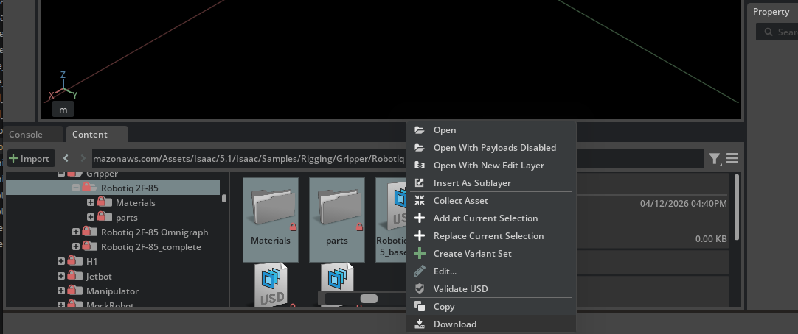
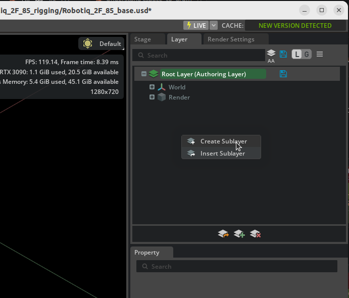
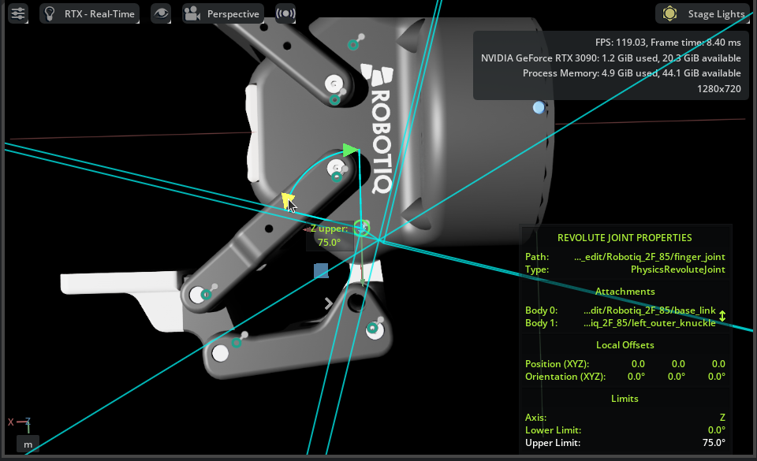
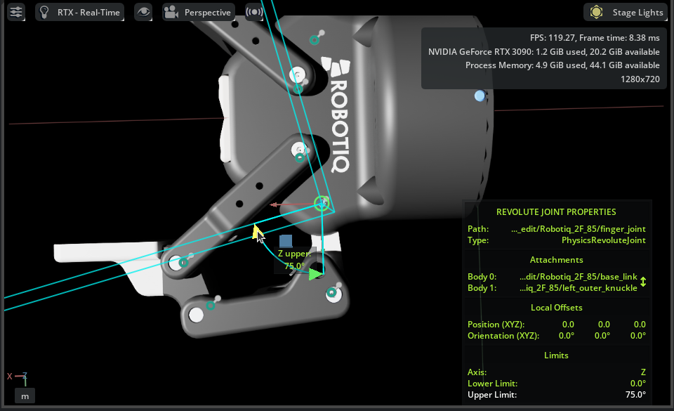
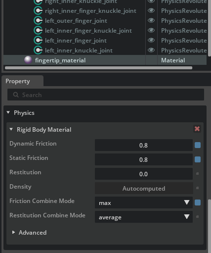
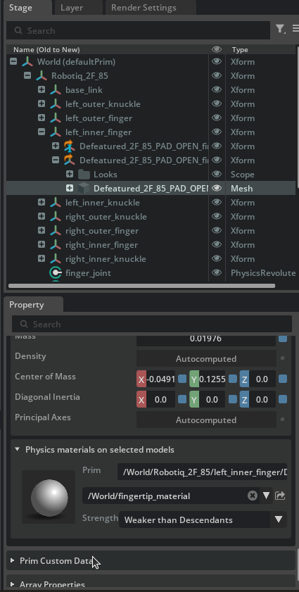
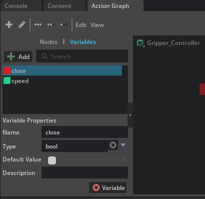
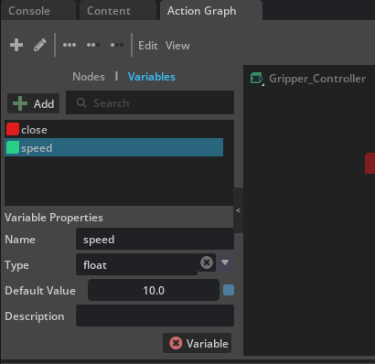
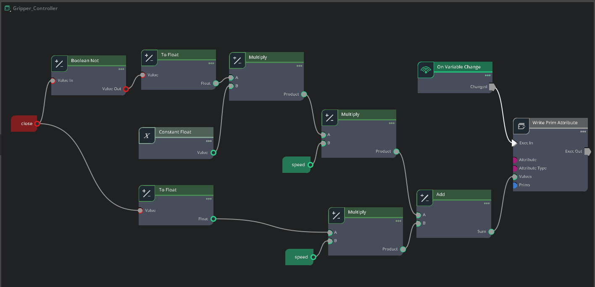

# Rigging Closed-Loop Structures

## Learning Objectives

After completing this tutorial, you will have learned:

- Asset editing workflow using USD layers
- Adjusting joints and creating physics materials
- How to break a closed-loop articulation chain
- Configuring joint drives and mimic joints
- Optimizing collision meshes and self-collision
- Building gripper control with OmniGraph

## Getting Started

### Prerequisites

- Complete [Tutorial 5: Rig a Mobile Robot](05_rig_mobile_robot.md) before starting this tutorial.

### Asset Used

This tutorial uses the pre-imported Robotiq 2F-85 gripper asset bundled with Isaac Sim:

```
Samples/Rigging/Gripper/Robotiq 2F-85
```

### Estimated Time

Approximately 30 minutes.

### Overview

Mechanisms such as robotic grippers often contain structures where links form closed loops. However, articulations (joint chains) in physics simulation must be expressed as a **kinematic tree** (tree structure), and loop structures cannot be handled directly.

In this tutorial, you will use the **Robotiq 2F-85 parallel gripper** to learn how to correctly rig a robot containing closed-loop structures in Isaac Sim. Specifically, you will work through the following steps:

1. **Asset editing using layers** — A non-destructive workflow that preserves the original file
2. **Joint adjustment** — Fixing joint orientations, limits, and setting up friction materials
3. **Breaking the articulation loop** — Converting the closed loop into a tree structure
4. **Building the test environment** — Creating a scene to verify gripper operation
5. **Configuring joint drives and mimic joints** — Adding drive control and mimic linkage to control the gripper fingers
6. **Optimizing collision meshes** — Adjusting collision shapes for grasping
7. **Saving the configuration** — Saving changes to each layer
8. **Gripper control with OmniGraph** — Opening and closing the gripper by toggling a Boolean variable

!!! note "What is a closed-loop structure?"
    A closed-loop structure is a mechanism where links and joints are connected in a ring. For example, the two fingers of a parallel gripper are each connected to the body through multiple links, and they form a closed loop when grasping an object at the tip. In contrast, serial robot arms such as the UR10e are connected in a single chain (open loop) from base to end-effector.

## Step 1: Asset Editing Using Layers

Instead of editing the original USD file directly, you will learn how to edit it non-destructively using **layers**. With this approach, you can make configuration changes while keeping the original asset file untouched, which makes it easier to update or reuse the asset.

!!! note "What are USD layers?"
    USD layers work similarly to layers in Photoshop. By stacking an editing layer on top of a base file, you can add or modify properties without changing the original file at all. If the layer changes are no longer needed, simply removing the layer restores the original state.

### 1-1. Preparing the Working Directory

Since the sample asset is read-only, first copy it to a working folder:

1. Create a working folder in any location (e.g., on the desktop) such as `Robotiq_2F_85_rigging`
2. From the sample asset folder `Samples/Rigging/Gripper/Robotiq 2F-85`, download the `Robotiq_2F_85_base.usd` file along with the `Materials` and `parts` directories into your working folder

    

### 1-2. Layer Workflow Overview

In this step, you will create the following three-file structure:

| File | Role | How to Create |
|---|---|---|
| `Robotiq_2F_85_base.usd` | Base asset (**do not modify**) | Already copied from sample |
| `Robotiq_2F_85_edit.usd` | Layer that records joint adjustments and rigging settings | **Created by user** |
| `Robotiq_2F_85_config.usd` | Configuration file that bundles the above for loading | **Created by user** |

### 1-3. Creating the Edit Layer

Create an edit layer to record rigging settings. Here, you create a new USD file and load the base asset as a sublayer, providing an environment where you can edit without modifying the original file.

1. Create a new stage with **File > New**
2. Save it as `Robotiq_2F_85_edit.usd` in the working folder using **File > Save As**
3. Open the **Layer** tab (if not visible, open it via **Window > Layer**)
4. From the Content Browser or file manager, drag and drop `Robotiq_2F_85_base.usd` onto the **Root Layer** in the **Layer** tab

    

5. Confirm that the gripper from the base asset is displayed in the Stage

This produces a configuration where `_edit.usd` (Root Layer) is layered on top of `_base.usd` (sublayer). All subsequent edits are recorded in `_edit.usd`, leaving the base asset unchanged.

!!! note "Layer ordering"
    USD sublayers are evaluated with **higher layers taking priority**. In this configuration, opinions from the Root Layer (`_edit.usd`) override those from the sublayer (`_base.usd`), so any changes made in `_edit.usd` override values in `_base.usd`.

    On the other hand, properties that are not overridden in the upper layer use the value from the lower layer in the final result. In other words, if you update meshes or materials in `_base.usd`, those updates will automatically be reflected as long as you have not modified the same properties in `_edit.usd`. This is the advantage of the non-destructive editing workflow.

### 1-4. Creating the Configuration File

Next, create a configuration file for building a test scene. In this file, you will place the edited gripper asset into the scene as a **payload**.

1. Create a new stage with **File > New**
2. Save it as `Robotiq_2F_85_config.usd` in the same working folder using **File > Save As**
3. From the Content Browser or file manager, drag and drop `Robotiq_2F_85_edit.usd` onto `/World` in the **Stage** panel
4. Rename the prim added to the Stage panel (with a blue arrow icon) to `Robotiq_2F_85`

    !!! tip "Renaming the prim"
        The added prim's name may default to `Robotiq_2F_85_edit` based on the file name. Rename it to `Robotiq_2F_85` so that it matches the paths used in later steps (such as `/World/Robotiq_2F_85/base_link`).

With this configuration, simply opening `_config.usd` will load the contents of the base asset plus the edit layer as the gripper in the scene.

!!! note "Difference between Payload and Reference"
    There are two methods to add an asset to the Stage: **Payload** and **Reference**.

    | | Payload | Reference |
    |---|---|---|
    | **Stage icon** | Blue arrow | Orange arrow |
    | **How to add** | Drag and drop | Right-click > Add > Reference |
    | **Lazy loading** | Supported (can be unloaded) | Not supported (always loaded) |
    | **Main use** | Assets placed into a scene | Always-required dependency files |

    **Payload** is a mechanism for temporarily unloading unneeded assets to save memory and improve performance when scenes grow large. You can right-click a prim in the Stage panel and select **Unload** to unload that asset. **Reference** is always loaded and cannot be unloaded.

    For placing an asset into a scene as in this case, **Payload** (drag and drop) is the appropriate choice.

!!! tip "Distinction from sublayers"
    USD provides multiple composition methods including sublayers, references, and payloads. This tutorial uses them as follows:

    - **Sublayer** (`_edit.usd` → `_base.usd`): Shares the same prim hierarchy and overrides properties. Suited for **non-destructive asset editing**.
    - **Payload** (`_config.usd` → `_edit.usd`): Places an external asset as an independent prim in the scene. Suited for **scene construction**.

!!! tip "Benefits of layer separation"
    - **`_edit.usd`**: Stores only robot rigging settings (joints, drives, collision, etc.)
    - **`_config.usd`**: Stores test scene elements (ground plane, test objects, etc.)

    This separation allows `_edit.usd` to be reused in other scenes after rigging is complete.

## Step 2: Joint Adjustment

!!! info "Working file: `Robotiq_2F_85_edit.usd`"
    All changes in this step are rigging settings for the gripper asset. Work with `_edit.usd` open.

Joints imported from CAD may have their orientation flipped 180 degrees. Fix these so the simulation operates correctly.

### 2-1. Joint Visualization

To check joint orientations, visualize the joint frames in the viewport:

1. Click the **eye icon** at the top of the viewport
2. Enable **Show By Type > Physics > Joints**

This displays gizmos at each joint's position and rotation axis in the viewport.

!!! note "Reading joint gizmos"
    When joints are visualized, coordinate axis arrows appear at each joint's position. For revolute joints, the orientation of the **rotation axis** (typically a specific axis arrow) indicates the joint's positive direction. This positive direction determines which way the link rotates when the joint angle is positive.

### 2-2. Checking Joint Orientations

Select each joint in the Stage panel and check the gizmo axis orientation displayed in the viewport.

In joints imported from CAD, rotation axes may be flipped 180 degrees. A flipped joint has its positive rotation direction pointing opposite to what is expected.

### 2-3. Fixing Joint Orientations

Fix the orientations of flipped joints:

1. Select the flipped joint in the Stage panel

   Example) finger_joint: you can see it tries to rotate 75 degrees in the opening direction

     

2. In the **Rotation** section of the Properties panel, apply a 180-degree offset to the X axis of both **Rotation 0** and **Rotation 1**
3. Confirm that the gizmo orientation is now correct

   Example) finger_joint: now rotates 75 degrees in the closing direction

     

!!! warning "Joints to fix in this Robotiq 2F-85 asset"
    For this asset, **four joints** require orientation fixes: `finger_joint`, `right_outer_knuckle_joint`, `right_outer_finger_joint`, and `left_outer_finger_joint`. Without fixing these here, the fingers will move opposite to expectations when joint drives are configured in Step 5.

### 2-4. Setting Joint Limits

Set appropriate ranges of motion for each joint (the correct ranges should be set by default):

| Joint | Lower | Upper | Notes |
|---|---|---|---|
| `left_outer_finger_joint` | 0° | 180° | Range of motion of the outer finger link |
| `right_outer_finger_joint` | 0° | 180° | Range of motion of the outer finger link |
| `finger_joint` | 0° | 75° | Main drive joint |
| `right_outer_knuckle_joint` | 0° | 75° | Right outer knuckle |
| Other joints | — | — | No limits (leave default) |

### 2-5. Creating Fingertip Friction Material

To improve the gripper's grasping performance, set up a high-friction material for the fingertips:

1. From the menu, select **Create > Physics > Physics Material**
2. Choose **Rigid Body Material** and rename it to `fingertip_material`
3. Configure the following parameters:

    | Parameter | Value | Description |
    |---|---|---|
    | Static Friction | `0.8` | Static friction coefficient (close to rubber) |
    | Dynamic Friction | `0.8` | Dynamic friction coefficient |
    | Friction Combine Mode | `Max` | Friction combination method (use the larger value) |

    

4. Apply the created material to the meshes of `right_inner_finger` and `left_inner_finger`

    

!!! note "Disabling the Instanceable property"
    When applying the material, if the **Instanceable** property of the Xform is enabled, you may not be able to set the material individually. In that case, disable Instanceable, then apply the material directly to the mesh component.

## Step 3: Breaking the Articulation Loop

!!! info "Working file: `Robotiq_2F_85_edit.usd`"
    Changes in this step are rigging settings for the gripper asset. Continue working in `_edit.usd`.

### 3-1. Understanding the Problem

If you start the simulation in the current state, the following warning appears:


This is because the articulation (joint chain) forms a loop. Articulations in Isaac Sim must be a **kinematic tree** (tree structure), and closed loops cannot be handled as-is.

!!! note "Why loops are a problem"
    The articulation solver in physics simulators is designed assuming a **one-way chain** (tree structure) from the base link to the end effector. With a loop, the solver cannot correctly resolve joint constraints.

### 3-2. Criteria for Selecting a Joint to Break

To resolve the loop, you **exclude** one joint from the articulation. The excluded joint is treated as a Maximal Coordinate Joint and given lower solver priority.

Criteria for selecting the optimal joint:

- A position that **minimizes the articulation chain length**
- A joint that **does not require limits, friction, or drive**
- A joint with **minimal interference with the robot's function**

### 3-3. Steps to Break the Loop

For this Robotiq 2F-85 gripper, the `inner_knuckle_joint` connecting the inner shaft to the body is the optimal candidate.


1. Select `left_inner_knuckle_joint` in the Stage panel
2. In the **Physics** section of the Properties panel, check **Exclude From Articulation**
3. Apply **Exclude From Articulation** to `right_inner_knuckle_joint` in the same way

!!! tip "What is Exclude From Articulation?"
    Enabling this option excludes the joint from the articulation tree. The joint itself still exists physically, but it is processed by the regular joint solver (Maximal Coordinate) instead of the articulation solver. As a result, the loop is resolved and the simulation operates correctly.

Now, when you run the simulation again, the loop-related warning disappears.

## Step 4: Building the Test Environment

!!! info "Working file: `Robotiq_2F_85_config.usd`"
    The test environment (ground, cylinder, movement joints, etc.) consists of test-scene-specific elements. Work with `_config.usd` open.

Build a test scene to verify gripper operation. You will create a structure that allows the gripper to move up/down and forward/backward, then test grasping objects.

### 4-1. Test Environment Composition

The following elements will be added to the scene. They can be built all at once by running the Python script in the next section.

**Movement scaffold (structure to move the gripper up/down and forward/backward)**:

| Element | Role |
|---|---|
| `Xform` (with Rigid Body API) | Intermediate prim (reference for Z-axis prismatic) |
| `Xform_1` (with Rigid Body API) | Prim that holds the gripper (reference for X-axis prismatic) |
| Fixed Joint | Fixes World → `Xform` |
| Prismatic Joint `Joint_Z` (Z axis) | `Xform` → `Xform_1` (vertical movement) |
| Prismatic Joint `Joint_X` (X axis) | `Xform_1` → `base_link` (horizontal movement) |

**Drive parameters for prismatic joints**:

| Parameter | Value | Description |
|---|---|---|
| Maximum Joint Velocity | `5.0` | Maximum joint velocity |
| Joint Limits | `[0, 1]` | Range of motion (meters) |
| Damping | `10,000` | Damping coefficient |
| Stiffness | `10,000` | Stiffness coefficient |

**Scene elements**:

- **Cylinder (grasp target)**: scale `[0.05, 0.05, 0.2]`, position X=0.12, mass 0.10 kg
- **Ground plane**: position Z=-0.1
- **Physics Scene**: GPU Dynamics disabled

### 4-2. Automatic Setup with a Python Script

The above configuration can be built all at once by running the following Python script in the Isaac Sim Script Editor:

```python
from pxr import Usd, UsdGeom, UsdPhysics, PhysxSchema, PhysicsSchemaTools, Gf, Sdf
import omni.usd

stage = omni.usd.get_context().get_stage()

# Create Xform nodes
xform = UsdGeom.Xform.Define(stage, "/World/Xform")
xform_1 = UsdGeom.Xform.Define(stage, "/World/Xform_1")

# Apply Rigid Body API
for node in [xform, xform_1]:
    UsdPhysics.RigidBodyAPI.Apply(node.GetPrim())

# Create the fixed joint
fixed_joint = UsdPhysics.FixedJoint.Define(
    stage, xform.GetPath().AppendChild("fixed_joint")
)
fixed_joint.CreateBody1Rel().SetTargets([str(xform.GetPath())])

# Prismatic joint 1 (Z axis)
prismatic_joint_1 = UsdPhysics.PrismaticJoint.Define(stage, "/World/Joint_Z")
prismatic_joint_1.CreateAxisAttr("Z")
prismatic_joint_1.CreateLowerLimitAttr(0.0)
prismatic_joint_1.CreateUpperLimitAttr(1.0)
prismatic_joint_1.CreateBody0Rel().SetTargets([str(xform.GetPath())])
prismatic_joint_1.CreateBody1Rel().SetTargets([str(xform_1.GetPath())])

# Prismatic joint 2 (X axis)
prismatic_joint_2 = UsdPhysics.PrismaticJoint.Define(stage, "/World/Joint_X")
prismatic_joint_2.CreateAxisAttr("X")
prismatic_joint_2.CreateLowerLimitAttr(0.0)
prismatic_joint_2.CreateUpperLimitAttr(1.0)
prismatic_joint_2.CreateBody0Rel().SetTargets([str(xform_1.GetPath())])
prismatic_joint_2.CreateBody1Rel().SetTargets(["/World/Robotiq_2F_85/Robotiq_2F_85/base_link"])

# Add joint drives
for joint in [prismatic_joint_1, prismatic_joint_2]:
    drive = UsdPhysics.DriveAPI.Apply(joint.GetPrim(), "linear")
    drive.CreateDampingAttr(10000)
    drive.CreateStiffnessAttr(10000)
    px_joint = PhysxSchema.PhysxJointAPI.Get(stage, str(joint.GetPath()))
    px_joint.CreateMaxJointVelocityAttr().Set(5.0)

# Add the ground plane
PhysicsSchemaTools.addGroundPlane(
    stage, "/World/groundPlane", "Z", 100, Gf.Vec3f(0, 0, -0.1), Gf.Vec3f(1.0)
)

# Create the cylinder (grasp target)
result, path = omni.kit.commands.execute("CreateMeshPrimCommand", prim_type="Cylinder")
cylinder_prim = stage.GetPrimAtPath(path)
cylinder_prim.GetAttribute("xformOp:scale").Set((0.05, 0.05, 0.2))
cylinder_prim.GetAttribute("xformOp:translate").Set((0.12, 0, 0))

# Add physics attributes to the cylinder
cylinder_body = UsdPhysics.RigidBodyAPI.Apply(cylinder_prim)
UsdPhysics.CollisionAPI.Apply(cylinder_prim)
massAPI = UsdPhysics.MassAPI.Apply(cylinder_body.GetPrim())
massAPI.CreateMassAttr(0.10)

# Create the Physics Scene
scene = UsdPhysics.Scene.Define(stage, Sdf.Path("/physicsScene"))
physxSceneAPI = PhysxSchema.PhysxSceneAPI.Apply(scene.GetPrim())
physxSceneAPI.CreateEnableGPUDynamicsAttr(False)
```

!!! warning "Errors occur when GPU Dynamics is enabled"
    If **Enable GPU Dynamics** is enabled on the Physics Scene, joint drive `setDriveTarget()` cannot be used and the following error occurs:

    ```
    PhysX error: PxArticulationJointReducedCoordinate::setDriveTarget(): it is illegal to call this method if PxSceneFlag::eENABLE_DIRECT_GPU_API is enabled!
    ```

    The Python script above disables it via `CreateEnableGPUDynamicsAttr(False)`. However, if you built the test environment manually or settings remain from the previous tutorial ([09: Deformable Body](../core_api/09_deformable_body.md)), select the Physics Scene and verify that **Enable GPU Dynamics** is off.

### 4-3. Verifying the Test Scaffold

After running the script, verify that the test scaffold (prismatic joints) operates correctly:

1. Open **Tools > Physics > Physics Inspector** from the menu
2. In the Stage panel, select `Xform`, `Xform_1`, and the gripper prims
3. Start and stop the simulation, then click the **Refresh** button in the Physics Inspector
4. Drag the **Joint_X** Drive Target slider and confirm the gripper moves forward and backward
5. Similarly, verify vertical movement with **Joint_Z**

!!! warning "Fingers rotate freely at this stage"
    At this point, no drives are configured on the gripper fingers, so the fingers rotate freely like a ragdoll. This is expected; you will resolve it in the next step by configuring joint drives and a mimic joint.

## Step 5: Configuring Joint Drives and Mimic Joints

!!! info "Working file: `Robotiq_2F_85_edit.usd`"
    Drives and mimic joints are rigging settings for the gripper asset. Work with `_edit.usd` open.

Configure joint drives and a mimic joint to control the gripper fingers. Because the Robotiq 2F-85 drives both fingers in synchronization with a single motor, **add a drive only to the main drive joint (`finger_joint`) and link the opposite side (`right_outer_knuckle_joint`) using a mimic joint**.

### 5-1. Adding a Drive to the Main Drive Joint

Add an Angular Drive to `finger_joint` and configure it for force control.

1. Select `finger_joint` in the Stage panel
2. In the Properties panel, click **Add > Physics > Angular Drive**
3. Configure the following parameters:

    | Parameter | Value | Description |
    |---|---|---|
    | Stiffness | `0.0` | Disables position control |
    | Damping | `5,000` | Damping for velocity control |
    | Max Force | `180.0` | Maximum grip force (Newtons, based on datasheet) |
    | Max Actuator Velocity | `130` deg/s | Maximum joint velocity (based on datasheet) |

!!! note "Meaning of Stiffness = 0 (force control)"
    Setting `Stiffness = 0` disables position control, leaving only `Damping` for velocity control. This allows the gripper to grasp an object with a constant torque. With position control (Stiffness > 0), excessive force may be generated as the joint tries to reach its target position even after contact.

!!! note "Do not add a drive to `right_outer_knuckle_joint`"
    The opposite finger is configured as a mimic joint in the next section (5-2). Mimic joints automatically inherit the drive characteristics of their reference joint, so an individual drive is not needed (and would in fact cause the drives to interfere).

### 5-2. Linking Both Fingers with a Mimic Joint

Configure `right_outer_knuckle_joint` as a mimic joint that follows the motion of `finger_joint`.

1. Select `right_outer_knuckle_joint` in the Stage panel
2. In the Properties panel, click **Add > Physics > Mimic Joint**
3. Configure the following parameters:

    | Parameter | Value | Description |
    |---|---|---|
    | Gearing | `-1.0` | Coefficient applied to the reference joint's motion |
    | Reference Joint | `finger_joint` | The source joint to follow |

!!! note "What is a mimic joint?"
    A mimic joint automatically follows the motion of a reference joint. Gearing is the coefficient applied to the reference joint's position; specifying `-1.0` causes this joint to rotate -75° when the reference joint rotates +75°. The left and right finger joints of the Robotiq 2F-85 are internally defined with axes pointing in opposite directions, so `-1.0` produces the correct symmetric motion.

### 5-3. Spring to Maintain Finger Parallelism

The Robotiq 2F-85 has a spring mechanism that keeps the fingertips parallel. To reproduce this, add a low-stiffness Angular Drive to the outer finger joints:

1. Select `left_outer_finger_joint` in the Stage panel
2. In the Properties panel, click **Add > Physics > Angular Drive**
3. Configure the following parameters:

    | Parameter | Value | Description |
    |---|---|---|
    | Stiffness | `0.05` | Weak stiffness to maintain parallelism |
    | Damping | `0.0` | No damping |
    | Target Position | `0.0` | Parallel state as the target position |

4. Apply the same configuration to `right_outer_finger_joint`

This setting allows the fingertips to remain parallel while the gripper closes, allowing the fingers to close without resistance until they contact an object.

!!! warning "Use the Drive's Stiffness"
    Be sure to set the **Angular Drive's Stiffness**, not the joint's **Stiffness attribute**. Within an articulation, the joint's own Stiffness attribute is ignored, so stiffness can only take effect through a Drive.

    ```
    [omni.physx.plugin] Stiffness attribute is unsupported for articulation joints and will be ignored
    ```

    If you see a warning like the one above, you have set Stiffness on the joint itself.

!!! warning "Without this setting, the finger links fold inward"
    Without the Drive Stiffness on the outer finger joints, the outer finger links (`outer_finger`) will fold inward and become inverted immediately after the simulation starts, preventing the gripper from closing properly. The Drive's Stiffness functions as a "spring that returns the fingers to a parallel posture."

### 5-4. Verification with Physics Inspector

Verify that the gripper alone operates correctly with the configuration so far:

1. Open **Tools > Physics > Physics Inspector**
2. In the Stage panel, select the gripper articulation root (`/World/Robotiq_2F_85`)
3. Start and stop the simulation, then click the **Refresh** button in the Physics Inspector
4. Use the Drive sliders for `finger_joint` to verify open/close motion:
    - Setting **Target Velocity** to a positive value (e.g., `+1.0`) closes the fingers
    - Setting it to a negative value (e.g., `-1.0`) opens the fingers
    - Confirm that the left and right fingers move in sync due to the mimic joint

!!! tip "Why use Target Velocity"
    Because Step 5-1 set `Stiffness = 0` (force control), `Target Position` is ignored and you specify the drive direction with `Target Velocity`.

### 5-5. Optimizing Physics Steps

When grasping heavy objects (maximum payload of 2.5 kg), increase the timestep to ensure contact stability:

- Set the **Steps Per Second** of the Physics Scene to at least **80**

!!! tip "Trade-off between step count and performance"
    Increasing the step count improves simulation accuracy but also increases computational cost. Increase the step count only when the gripper's grasp is unstable; the default value (60) is fine when the grasp is stable.

### 5-6. Tuning the Grip Force

This is a test for tuning the actual grasping behavior and grip force. **Max Force = 180 N** is the maximum value from the datasheet, but during testing it is common to start with a smaller value (e.g., `5.0` N) and observe the grasping behavior while tuning.

1. Change the cylinder's scale X to `0.08` (a slightly thicker cylinder)
2. Move the cylinder's position X to `0.13`
3. Temporarily lower the **Max Force** of the `finger_joint` Angular Drive to `5.0`
4. Run the simulation and verify that the cylinder is stably grasped in parallel
5. Once the grasp is stable, adjust Max Force based on the expected weight of grasped objects (return to around `180.0` for the maximum payload of 2.5 kg)

!!! note "Why temporarily lower Max Force"
    With the maximum value (180 N), excessive grip force is applied to thin cylinders or light objects, leading to behaviors such as the cylinder being knocked away or the physics calculations becoming unstable. A good practice during testing is to start with a small value and find an appropriate value while observing the grasping behavior.

## Step 6: Collision Meshes and Self-Collision

!!! info "Working file: `Robotiq_2F_85_edit.usd`"
    Collision settings are rigging settings for the gripper asset. Continue working in `_edit.usd`.

### 6-1. Checking Collision Meshes

First, check the current collision shapes:

1. Click the **eye icon** at the top of the viewport
2. Select **Show By Type > Physics > Colliders > All**
3. Verify that outlines are displayed around objects with collision enabled

### 6-2. Adjusting the Collider Approximation Type

To improve fingertip contact accuracy, change the collider approximation type:

1. Select the object component in the viewport
2. Open the **Physics** section of the Properties panel
3. Change the type of **Collider Approximation**:

| Type | Description | Use case |
|---|---|---|
| **Convex Hull** | Approximation by convex hull | Balanced performance and accuracy |
| **Convex Decomposition** | Approximation by convex decomposition | Best for complex fingertip outlines |
| **Triangle Mesh** | The mesh itself | Most accurate but with high computational cost |

!!! tip "Convex Decomposition is recommended for fingertips"
    Fingertip meshes have complex shapes, so accurate contact may not be obtained with Convex Hull. Using **Convex Decomposition** allows the geometry's concavities and convexities to be reproduced more accurately.

!!! note "If the Physics section does not appear"
    If the Physics section does not appear in the Properties panel, check the parent or child Xform in the Stage tree. The collider may be set on a prim at a different hierarchy level.

!!! warning "If you cannot change Collider Approximation"
    If the Collider Approximation dropdown is unresponsive or your changes are not reflected, check whether the **`Instanceable` property is set on the parent Xform** of the target mesh. When `Instanceable` is enabled, the collider approximation type of child elements cannot be changed individually.

    Select the parent Xform in the Stage panel, uncheck **Instanceable** in the Properties panel, then change the collider approximation type again (this is the same procedure as for material application in Step 2-5).

### 6-3. Enabling Self-Collision

By default, links within the same articulation do not collide with each other. To prevent the gripper fingers from interpenetrating, enable self-collision:

1. Select `/World/Robotiq_2F_85` (the articulation root prim) in the Stage panel
2. Check **Self Collision Enabled** in the **Articulation Root** section of the Properties panel

This causes the gripper fingers to physically interfere with each other, resolving the issue of fingers passing through each other.

## Step 7: Saving the Configuration

!!! info "Working files: `Robotiq_2F_85_edit.usd` and `Robotiq_2F_85_config.usd`"
    In this step you save both files.

After testing and verification are complete, save each file.

### 7-1. Reviewing and Saving Changes

If you worked in the correct file at each step, the changes should already be recorded in the appropriate file. Open the **Layer** tab and verify the following:

- **`Robotiq_2F_85_edit.usd`**: Contains gripper-rigging changes such as joint adjustments, drives, mimic joints, and collision settings
- **`Robotiq_2F_85_config.usd`**: Contains test-scene-specific elements such as the test Xforms, prismatic joints, ground plane, and cylinder

After verifying, click **Save Layer** on both layers to save them.

!!! tip "If a change ended up in the wrong file"
    The Layer tab shows which prims have changes recorded in which layer. If a change is in the wrong file, you can drag the prim to the correct layer in the Layer tab.

## Step 8: Gripper Control with OmniGraph

!!! info "Working file: `Robotiq_2F_85_config.usd`"
    OmniGraph-based gripper control is a test-scene-specific element. Work with `_config.usd` open.

Manipulating the gripper with the Physics Inspector slider is cumbersome. Use OmniGraph to build a system that controls gripper open/close by simply toggling a Boolean variable.

### 8-1. Creating an Action Graph

1. Open **Window > Graph Editors > Action Graph** from the menu
2. Click the **New Action Graph** icon
3. Rename the created Action Graph to `Gripper_Controller`

### 8-2. Constructing the Graph

The gripper control graph operates with the following logic (described in detail in the next section):

1. Prepare a **Boolean variable** (open/close instruction) and a **Float variable** (absolute speed)
2. Switch the sign of the Float variable based on the Boolean variable (e.g., negative for closing, positive for opening)
3. Write the resulting value to `finger_joint`'s `targetVelocity`
4. Through the mimic joint, the right finger moves in sync with `finger_joint`

#### 8-2-1. Adding Variables

This tutorial uses **Variables**, which were not covered before. Variables in an Action Graph are shared between nodes within the graph, and the graph's behavior can be controlled by changing values from outside.

1. Click the **[+ Add]** button in the **Variables** panel (left side) of the Action Graph editor
2. A new variable is added; click the **variable name** and rename it to `close`
3. Confirm that the **type** (default `Bool`) is `Bool` (change via the dropdown if necessary)

    

4. Add another variable in the same way, naming it `speed` and changing its type to `Float`

    

!!! tip "How to change a variable's type"
    A variable's type can be changed via the dropdown in the **Type** column of the list. In addition to basic types such as `Bool`, `Int`, `Float`, and `String`, you can also select multi-element types such as `Vector3f`.

#### 8-2-2. Placing and Connecting Nodes

Build the Action Graph using the following completed form as a reference:



Required nodes and their roles:

1. **On Variable Change** — Trigger for graph execution (fires on variable change)
2. **Read Variable Node** (for `close`) — Reads the Boolean variable `close`
3. **Read Variable Node** (for `speed`) — Reads the Float variable `speed`
4. **Boolean Not** — Inverts the value of the Boolean variable `close`
5. **To Float** — Converts `close` value to a Float (True=1.0, False=0.0)
6. **To Float** — Converts the inverted value of `close` to a Float
7. **Constant Float** — Outputs the constant `-1.0` (used to invert the sign for the opening direction)
8. **Multiply** — Multiplies the float-converted `close` and `speed` (**closing direction** velocity. `+speed` when close=true, `0` when false)
9. **Multiply** — Multiplies the float-converted inverted `close` value by `Constant Float` (`-1.0` when close=false, `0` when true)
10. **Multiply** — Multiplies the result of step 9 by `speed` (**opening direction** velocity. `-speed` when close=false, `0` when true)
11. **Add** — Adds the opening-direction velocity and the closing-direction velocity (since one of them is always 0, the active value is selected as the result)
12. **Write Prim Attribute** — Writes the value to `finger_joint`'s `targetVelocity`

#### 8-2-3. Configuring Each Node

##### On Variable Change

- Select `close` for **Variable Name**
- This causes the node to fire when the `close` variable changes

##### Constant Float

- Enter `-1.0` in **Value**
- This value is used to invert the sign for the opening direction

##### Write Prim Attribute

This node writes to the joint's target velocity. Configure the following parameters:

| Parameter | Value |
|---|---|
| **Prim** | `/World/Robotiq_2F_85/Robotiq_2F_85/finger_joint` |
| **Attribute Name** | `drive:angular:physics:targetVelocity` |
| **Attribute Type** | `float` |

!!! tip "How to specify the Prim"
    You can use the icon to the right of the Prim field to select a prim from the Stage panel, or enter the path directly. The prim path may differ depending on the gripper placement in `_config.usd`. Select `finger_joint` in the Stage panel to confirm the exact path.

#### 8-2-4. Connection Flow

The graph computes two paths — the **opening direction velocity** and the **closing direction velocity** — and sums them to produce the final target velocity. When `close` is False, only the opening direction has a meaningful value, and when `close` is True, only the closing direction does (the other is 0).

**Opening direction path** (outputs `-speed` when `close = false`):

1. `close` variable → **Boolean Not** Value In
2. **Boolean Not** Value Out → **To Float** (top) Value
3. **To Float** (top) Float → **Multiply** (top) A
4. **Constant Float** Value → **Multiply** (top) B
5. **Multiply** (top) Product → **Multiply** (middle) A
6. `speed` variable → **Multiply** (middle) B
7. **Multiply** (middle) Product → **Add** A

**Closing direction path** (outputs `+speed` when `close = true`):

1. `close` variable → **To Float** (bottom) Value
2. **To Float** (bottom) Float → **Multiply** (bottom) A
3. `speed` variable → **Multiply** (bottom) B
4. **Multiply** (bottom) Product → **Add** B

**Execution flow and write**:

1. **Add** Sum → **Write Prim Attribute** Values
2. **On Variable Change** Changed → **Write Prim Attribute** Exec In

#### 8-2-5. How It Works

The graph's calculation result is as follows:

| `close` value | Opening direction output | Closing direction output | Add result (targetVelocity) |
|---|---|---|---|
| `false` (open) | `1.0 × (-1.0) × speed = -speed` | `0.0 × speed = 0` | `-speed` |
| `true` (close) | `0.0 × (-1.0) × speed = 0` | `1.0 × speed = +speed` | `+speed` |

In other words, a positive velocity (closing direction) is written to `finger_joint`'s `targetVelocity` when `close = true`, and a negative velocity (opening direction) is written when `close = false`. Because the joint orientations were aligned in Step 2-3, a positive velocity corresponds to the gripper closing motion.

!!! tip "More on OmniGraph"
    For basic OmniGraph usage, refer to what you learned in [Tutorial 5: Rig a Mobile Robot](05_rig_mobile_robot.md). For gripper control, instead of differential control (Differential Controller), you directly set the joint drive's target value.

!!! note "Why targetVelocity instead of targetPosition"
    In Step 5-1, you configured `finger_joint`'s drive as **force control** (Stiffness=0, only Damping). With this setting, the position target (`targetPosition`) is ignored, and the drive force is determined by the velocity target (`targetVelocity`) and Damping. Therefore, the gripper open/close is controlled by writing to `targetVelocity` here.

### 8-3. Verifying Operation

1. Set the value of the `speed` variable (e.g., `100.0`)
    - In the **Variables** panel of the Action Graph editor, select `speed` and enter the value in **Default Value**
2. Start the simulation (Play button on the timeline)
3. Toggle the checkbox of `close` (Default Value) in the **Variables** panel to verify gripper open/close:
    - **True** (checked): the gripper moves in the closing direction
    - **False** (unchecked): the gripper moves in the opening direction


!!! tip "Tuning the speed value"
    If the `speed` value is too large, the fingers may move too quickly and grasping may become unstable. Start with a value around `50` to `150`, and adjust while observing the grasping behavior.

## Troubleshooting

| Symptom | Cause | Solution |
|---|---|---|
| Self-collision is not working | Articulation Root configuration missing | Verify that **Self Collision Enabled** is checked at the articulation root |
| Outer finger links fold inward and invert at simulation start | Outer finger joints' Drive Stiffness not set | Add an **Angular Drive** to `left/right_outer_finger_joint` and set Stiffness to `0.05` (note this is the Drive's Stiffness, not the joint's Stiffness attribute) |
| Grasping heavy objects is unstable | Insufficient timesteps | Increase Physics Scene's **Steps Per Second** to 80 or more |
| Gaps in the collision mesh | Inappropriate approximation type | Change the fingertip mesh approximation to **Convex Decomposition** |
| Cannot change Collider Approximation | Parent Xform's Instanceable is enabled | Uncheck **Instanceable** on the parent Xform |
| Articulation loop warning | Exclude From Articulation not configured | Set **Exclude From Articulation** on `left/right_inner_knuckle_joint` |
| Errors related to `setDriveTarget()` | Physics Scene's GPU Dynamics is enabled | Turn off **Enable GPU Dynamics**. Check whether settings remain from the previous tutorial (Deformable Body) |
| `Stiffness attribute is unsupported for articulation joints` warning | Stiffness was set on the joint's own Stiffness attribute | Add an Angular Drive to the joint and set the stiffness on the Drive instead |
| Joints don't move / gripper is locked | Articulation lock (mimic constraint conflicts with joint limits, excessive Exclude From Articulation, etc.) | Verify that `right_outer_knuckle_joint` has only the Mimic Joint configured (no Drive); verify that `Exclude From Articulation` is not set on joints other than `inner_knuckle_joint` |

## Summary

This tutorial covered the following topics:

1. **Layer-based editing workflow** — Non-destructive configuration changes using the three-layer structure of `_base.usd`, `_edit.usd`, and `_config.usd`
2. **Choosing between Payload and Reference** — Selecting the appropriate composition method for scene construction
3. **Joint visualization and orientation correction** — Verifying with gizmos and fixing with Rotation offsets
4. **Breaking the closed loop** — Converting to a kinematic tree using `Exclude From Articulation`
5. **Configuring joint drives** — Achieving force control by balancing Stiffness, Damping, and Max Force
6. **Mimic joint** — Synchronously controlling multiple joints with a single input
7. **Optimizing collision meshes** — Accurate contact detection with Convex Decomposition
8. **Self-collision** — Enabling collision among links within an articulation
9. **Gripper control with OmniGraph** — Open/close control with an Action Graph leveraging Variables

## Next Steps

Proceed to the next tutorial, "[Tuning Joint Drive Gains](11_joint_tuning.md)", to learn how to optimize joint drive parameters.
