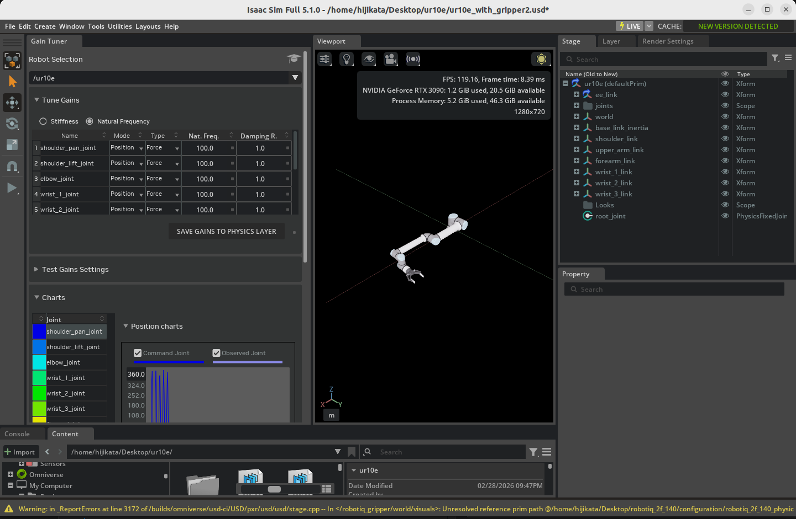
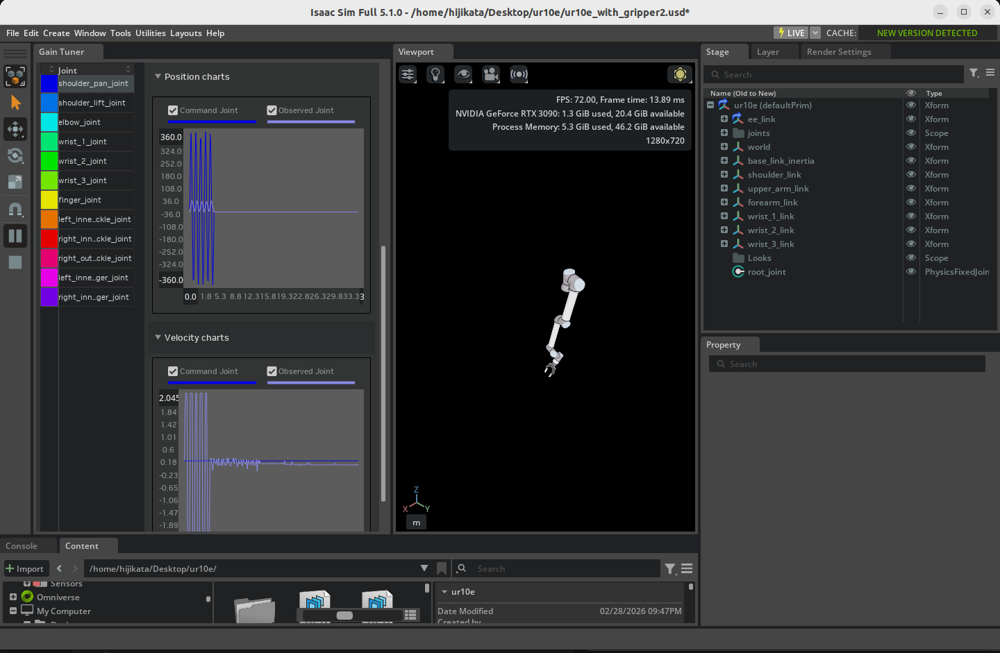

# Tuning Joint Drive Gains

## Learning Objectives

After completing this tutorial, you will have learned:

- How to launch the **Gain Tuner extension** and use its UI
- How to tune **position drive** gains
- How to configure velocity limits to emulate **industrial robots**
- How to tune **velocity drive** gains
- How to save tuned gains back into the asset (USD file)
- How to visualize and evaluate the result with plots

## Getting Started

### Prerequisites

- Complete [Tutorial 7: Configure a Manipulator](07_configure_manipulator.md) before starting this tutorial.
- Your robot asset must have the following two applied (**both are applied automatically for robots imported from URDF**):
    - **Robot Schema** (Robot API): required for the Gain Tuner to recognize the robot
    - **Articulation Root**: required for the asset to behave as a single articulation in the physics simulation

!!! note "Relationship Between the Gain Tuner and Robot Schema"
    The Gain Tuner uses the **Robot Schema** (`IsaacRobotAPI`, `IsaacLinkAPI`, `IsaacJointAPI`) internally to understand the robot's structure. Specifically, the **Select Robot** dropdown lists **only prims that have Robot API applied**. Assets without the Robot Schema will be invisible to the Gain Tuner even when their articulation is enabled.

    When you import a robot from URDF in [Tutorial 6](06_setup_manipulator.md), the URDF importer applies the Robot Schema **automatically**. So as long as you stay on the URDF import path, no extra action is needed.

    For robots rigged manually as in [Tutorial 5](05_rig_mobile_robot.md), or for existing USD assets that did not come through URDF, you must apply the Robot Schema separately. See [Tutorial 5a: Applying the Robot Schema](05a_apply_robot_schema.md) for the procedure.

### Estimated Time

Approximately 15-20 minutes.

### Overview

To get a robot to behave correctly in Isaac Sim, you need to tune each joint's **drive gains** (the parameters of its PD control). If gains are too low, the robot cannot follow target positions; if they are too high, it oscillates or becomes unstable.

In [Tutorial 7](07_configure_manipulator.md), you learned the basics of the Gain Tuner using the abstracted **Natural Frequency** and **Damping Ratio** parameters. In this tutorial, you will go further with direct **Stiffness / Damping** tuning, **velocity limits** for industrial robots, **velocity drive** tuning, and the **saving and visualization** of the tuned result. The flow is:

1. **Launch the Gain Tuner** — open the extension and load the robot
2. **Tune position drives** — adjust Stiffness and Damping
3. **Set velocity limits** — emulate the speed caps of industrial robots
4. **Tune velocity drives** — Damping in velocity-control mode
5. **Save the gains** — write them back into the asset's physics layer
6. **Visualize the result** — evaluate behavior on the commanded vs. measured plots
7. **Validate with test modes** — confirm the gains with Snap-to-Limits and the Stress Test (Isaac Sim 6.0)

!!! note "Restructuring of the official tutorial in Isaac Sim 6.0"
    The official Isaac Sim 6.0 tutorial (Tutorial 11) was rewritten: starting from a **zero-gain UR10** imported from URDF, it diagnoses insufficient gains with the **Snap-to-Limits test** and demonstrates the importance of velocity limits with the **Stress Test**. The tuning methodology covered in Steps 2-4 of this page is now organized in the "Tuning Workflow" section of the official Gain Tuner Extension reference. The new 6.0 test modes are covered in Step 7.

!!! note "What is a Joint Drive?"
    A joint drive in Isaac Sim is like a **virtual motor** built into each joint. When you give it a target (position or velocity), an internal **PD controller** (proportional-derivative control) computes the error against the target and produces torque to drive the joint.

    Two parameters matter most in PD control:

    - **Stiffness (P gain)**: the strength of the **spring** that pulls the joint back to the target position. Higher values reach the target faster, but excessive values cause overshoot or oscillation.
    - **Damping (D gain)**: the strength of the **friction** that suppresses motion proportional to velocity. It dampens oscillation, but excessive values make the response sluggish.

    A good gain set is one that **reaches the target quickly, with no oscillation and minimal overshoot**.

!!! note "Position Drive vs. Velocity Drive"
    Isaac Sim joint drives have two modes:

    | Mode | Control Target | Primary Parameters | Use Cases |
    |---|---|---|---|
    | **Position Drive** | Target position | Stiffness + Damping | Trajectory tracking and pose holding for manipulators |
    | **Velocity Drive** | Target velocity | Damping only (Stiffness=0) | Gripper grasping, wheel rotation |

    Which mode to use depends on the role of the joint. This tutorial covers tuning for both.

## Step 1: Launching the Gain Tuner Extension

### 1-1. Open the Robot Asset

Open the robot you want to tune (e.g., the UR10e you configured in Tutorial 7) in Isaac Sim.

!!! warning "Verify That the Robot Schema and Articulation Are Applied"
    These are applied automatically for robots imported via URDF, but it is worth verifying:

    1. Select the robot's root prim (e.g., `/World/ur10e`) in the Stage panel.
    2. In the search field next to the **Add** button or in **Raw USD Properties** in the Properties panel, confirm the following are applied:
        - **IsaacRobotAPI** (Robot Schema): required for the Gain Tuner dropdown to list the robot
        - **PhysicsArticulationRootAPI** (with **Articulation Enabled** on): required for the robot to be driven as an articulation

    If either is missing, redo the URDF import from [Tutorial 6](06_setup_manipulator.md), or follow [Step 1 of Tutorial 7](07_configure_manipulator.md) to set up the articulation.

### 1-2. Open the Gain Tuner

From the menu, click in the following order to open the Gain Tuner window:

**Tools > Robotics > Asset Editors > Gain Tuner**

Use the **Select Robot** dropdown at the top of the window to pick the robot to tune. Assets with the Robot Schema applied are listed automatically.

After selection, the joint list on the left shows every joint of the selected robot.

!!! tip "If the Gain Tuner Extension Is Not Available"
    It is enabled by default, but if it does not appear in the menu, open **Window > Extensions** and search for `isaacsim.robot_setup.gain_tuner` to enable it.

### 1-3. UI Layout

The Gain Tuner window is divided into three main areas:

| Area | Role |
|---|---|
| **Joint List** (left) | Lists all joints of the robot. Selecting a joint targets it for parameter editing and result visualization |
| **Parameters** (center) | Edit **Stiffness**, **Damping**, **Max Joint Velocity**, etc., for the selected joint(s) |
| **Plots** (right / bottom) | After running a test, shows comparison plots of commanded vs. measured values |

!!! tip "Selecting Multiple Joints"
    The joint list on the left supports multi-selection:

    - **Ctrl + Click**: toggle the clicked joint
    - **Shift + Click**: range-select from the first selected joint to the current one

    With multiple joints selected, you can set gains in bulk or compare plots side by side.

## Step 2: Tuning Position Drive Gains

A position drive uses PD control to drive a joint toward a target angle (or position). The goal is to balance **Stiffness** and **Damping**.

### 2-1. The Tuning Strategy

Tune in the following order:

1. **Set Damping to zero** — observe the response with only the proportional term (Stiffness)
2. **Increase Stiffness** — find a value at which the joint converges near the target
3. **Drop Stiffness by one order of magnitude** — leave headroom for overshoot
4. **Add Damping** — start at one order of magnitude below Stiffness
5. **Fine tune** — adjust both while watching stability, response speed, and overshoot

!!! note "Why This Order?"
    If you adjust Stiffness with Damping already engaged, you cannot tell whether oscillation is being suppressed or whether the response is genuinely good. **Find the "barely converges" point with Stiffness alone**, then drop it by one order of magnitude to leave headroom before adding Damping. This is the safe way to converge on good gains.

### 2-2. Set Damping to Zero

1. Select the joint(s) to tune in the joint list on the left (multi-selection supported).
2. Enter `0` in the **Damping** field in the center.
3. Set **Stiffness** to a starting value (e.g., `100`).

### 2-3. Increase Stiffness Step by Step

Run the simulation (click **Play** in the timeline) and observe whether the joint converges to the target position.

- If it does not converge, **multiply Stiffness by 10** and re-run (e.g., 100 → 1,000 → 10,000).
- If it oscillates or runs away near the target, that value is the upper limit guide.

Once Stiffness is high enough that the joint **roughly converges** near the target, **drop it by one order of magnitude (about 1/10)** to leave stability headroom.

### 2-4. Add Damping

Once Stiffness is set, enter **about 1/10 of that Stiffness** as the starting **Damping** value.

Example: with Stiffness = 1,000, start at Damping = 100.

Run the simulation again and evaluate using these criteria:

| Aspect | Good State | Bad State and Action |
|---|---|---|
| **Settling speed** | Reaches the target quickly | Too slow → raise Stiffness |
| **Overshoot** | Ideally **within 1%** of the target | Large → raise Damping |
| **Oscillation** | Monotonic, no oscillation | Oscillating → raise Damping |
| **Sluggishness** | Not over-damped | Sluggish → lower Damping |

!!! tip "Recommended Performance Target"
    The Isaac Sim official guide recommends **keeping the error from the target (including overshoot) within 1%**. For applications with looser accuracy requirements, more relaxed criteria are usually fine in practice.

### 2-5. For Robots With Built-In Gravity Compensation

Robots like the UR10e and Franka are designed to be used with **gravity compensation** in their controller. It is common to also disable gravity inside Isaac Sim so the joints do not need to fight gravity:

1. Select each link (Rigid Body) in the Stage panel.
2. Open the **Physics > Rigid Body** section in the Properties panel.
3. Check **Disable Gravity**.

This removes the need for the drive to produce gravity-compensating torque, letting you focus tuning on tracking accuracy.

!!! note "Tuning With Gravity On"
    If you do not compensate for gravity, Stiffness must be high enough that the joint can resist gravity. Since the required value depends on link mass and pose, **test in the pose with maximum gravity load** (e.g., the base of an arm extended horizontally) to obtain conservative gains.

### 2-6. Joint Grouping Strategy

For robots like humanoids whose **arms and legs move independently**, tuning every joint at once is impractical. The efficient approach is to **group joints by function**, tune each group separately, then test all together at the end.

Example for a humanoid:

- Group 1: 7 joints of the right arm
- Group 2: 7 joints of the left arm
- Group 3: both legs (synchronized for walking)
- Final: move all joints to check for cross-group interference

## Step 3: Velocity Limits and Industrial Robots

Many industrial robots (UR, ABB, KUKA, etc.) come with **PD control pre-tuned by the manufacturer**, plus **per-joint velocity caps**. To replicate this behavior in Isaac Sim, set a **maximum joint velocity** in addition to the gains.

### 3-1. Strengthen Stiffness

To emulate an industrial robot, **roughly double the Stiffness** you obtained in Step 2. This makes the joint reach the velocity cap quickly and travel at full speed toward the target.

Example: ordinary Stiffness = 1,000 → industrial-style Stiffness = 2,000.

### 3-2. Set the Maximum Joint Velocity

Set a velocity cap on each joint:

1. Select the target joint in the Stage panel.
2. Expand the **Joint > Advanced** section in the Properties panel.
3. Enter the per-axis maximum speed (rad/s or deg/s) in **Maximum Joint Velocity**.

Refer to the manufacturer's datasheet for each axis's maximum angular velocity.

!!! tip "USD Defaults Tend to Be Too High"
    USD's default values are often well above what real systems use. Lowering them to the **operational limits of the actual hardware** is recommended. This benefits both safety and simulation stability.

### 3-3. Verify the Velocity Cap

Run the simulation and check the Gain Tuner plots to ensure **joint velocity does not exceed the configured cap**. If it does, lower Stiffness; if it never reaches the cap, raise Stiffness, until it **just barely reaches** the cap.

## Step 4: Tuning Velocity Drive Gains

A velocity drive controls the joint to follow a target **velocity**. It is used for gripper grasping and wheel rotation (also used in [Tutorial 10: Rig Closed-Loop Structures](10_closed_loop_structures.md)).

### 4-1. Set Stiffness to Zero

Velocity drives ignore the position target and use only the velocity target:

1. Select the target joint(s) in the Joint List.
2. Enter `0` for **Stiffness**.
3. Set **Damping** to a starting value (e.g., `100`).

!!! note "Why Stiffness=0 Means 'Velocity Control'"
    Internally, an Isaac Sim joint drive is always a PD controller, but **setting Stiffness to 0 removes the proportional (position-error) term, leaving only Damping to determine torque**. Damping produces torque proportional to velocity error, so the result is a controller that tracks the target velocity.

### 4-2. Increase Damping Step by Step

Run the simulation and increase Damping until the joint reaches the target velocity:

1. Set the target velocity (**Target Velocity**).
2. Run the simulation.
3. **Multiply Damping by 10** until the measured velocity reaches the target on the plot.
4. Stop just where it nearly reaches the target.

### 4-3. Accommodating Payload Variation

If the load is expected to vary (grasped objects, transported items), setting Damping **about 10% higher** helps maintain target velocity under load.

Example: Damping = 5,000 unloaded → 5,500 with payload.

### 4-4. Setting Output Limits

Velocity drives let you cap the output via **Maximum Joint Velocity** or **Maximum Joint Force**:

| Limit | Where to Set | Effect |
|---|---|---|
| **Maximum Joint Velocity** | Joint > Advanced | Caps speed |
| **Maximum Joint Force** | Drive > Max Force | Caps drive force |

For grasping, lowering **Max Force** prevents excessive force on the grasped object (see Step 5-6 of [Tutorial 10](10_closed_loop_structures.md)).

## Step 5: Saving Gains to the Asset

Save the tuned gains to a USD file so they persist across sessions.

### 5-1. Save Gains to Physics Layer

Click the **Save Gains to Physics Layer** button in the Gain Tuner window.

Following the recommended robot asset structure ([Asset Structure Guidelines](https://docs.isaacsim.omniverse.nvidia.com/latest/robot_setup/asset_structure.html)), this button automatically locates the **layer that holds the physics configuration** and writes the new gains there.

!!! note "Why Save to a Dedicated Layer"
    Isaac Sim robot assets are recommended to **separate USD layers by role** — meshes, physics, sensors, and so on (see the layer editing workflow in [Tutorial 10](10_closed_loop_structures.md)). Centralizing physics parameters in the physics layer means tuning is preserved across mesh updates.

### 5-2. When You Cannot or Do Not Want to Save There

If you do not have write permission, or you do not want to alter the original robot asset, record the gain change as an override **in a separate scene file**. The most explicit and safe approach is to use **`File > Save As`** to save under a new file name (e.g., `my_robot_with_tuned_gains.usd`). This way:

- The original robot USD file is left untouched
- The new file references / sublayers the robot asset and writes the gain overrides on top of it
- Opening the new file shows the tuned gains; opening the original asset shows the pre-tuning state

!!! warning "`File > Save` Overwrites the Root Layer"
    `File > Save` overwrites the **Root Layer** of the currently open stage as-is. As a result, **if you have the robot's USD file itself open and run `File > Save`, you will overwrite the original robot whenever you have write permission**.

    Using `Save` thinking it will "create a local override" is dangerous. To avoid changing the robot itself, always use **`Save As`** to save into a separate file, or open your own scene file that already references the robot (Reference / Payload) before tuning.

!!! tip "Which Save Method to Use"
    | Situation | Recommended Save Method |
    |---|---|
    | Persist gains as part of the original asset | **Save Gains to Physics Layer** (5-1) |
    | Leave the original asset alone and create a variant for your use | **File > Save As** to a separate file |
    | You already have your own scene file that references the robot | **File > Save** (changes are written only to the scene file) |

## Step 6: Visualizing the Result

### 6-1. Reading the Plots

After running a test, the Gain Tuner plot area shows the following:

| Element | Meaning |
|---|---|
| **Solid (saturated) line** | Commanded value (Commanded Position / Commanded Velocity) |
| **Faded line** | Measured value (the actual joint position / velocity) |
| **Color coding** | One color per joint |

In an ideally tuned state, the faded line (measured) **overlaps the solid line (commanded) without delay**.

### 6-2. What to Read From the Plots

| Plot Shape | Diagnosis | Fix |
|---|---|---|
| Measured oscillates before reaching the command | Stiffness too high | Lower Stiffness or raise Damping |
| Measured cannot catch up to the command | Stiffness too low | Raise Stiffness |
| Overshoots the target and bounces back | Overshoot (not enough Damping) | Raise Damping |
| Smooth but slow response | Over-damped | Lower Damping |
| Plateaus at the velocity cap | Limited by Maximum Joint Velocity (normal for industrial-style setups) | Revisit the cap if needed |

### 6-3. Per-Joint Evaluation

Clicking an individual joint in the Joint List on the left shows that joint's plot in detail. With multiple joints selected (Ctrl/Shift click), you can view multiple plots side by side for comparison.

!!! tip "Test Results Show Up Only After the Test Finishes"
    Plots may not update in real time during simulation. **Stop the simulation first**, then check the plots.

## Step 7: Validation with Test Modes (Isaac Sim 6.0)

The Isaac Sim 6.0 Gain Tuner offers test modes for systematically validating gains:

| Test mode | Description | Purpose |
|---|---|---|
| **Snap-to-Limits** (default) | Drives each joint to its lower and upper limits | Verify that gains are strong enough to cover the full range of motion, and that limits, gains, and collision geometry are mutually consistent |
| **Sinusoidal** | Drives joints with continuous sinusoidal trajectories | Evaluate tracking of smooth motion and identify under/overdamping |
| **Step Function** | Drives joints with step changes in the target | Evaluate step response (rise time, overshoot) |
| **Stress Test** | Drives joints with extreme random commands | Confirm stability under the harsh commands typical of reinforcement learning (Isaac Lab) |

### 7-1. Snap-to-Limits Test

In the official tutorial, the freshly imported UR10 (all joint gains at zero) is diagnosed as follows:

1. Set the Stiffness of all joints to a small value (e.g., `10`) and Damping to `0`
2. Select the **Snap-to-Limits** test mode and enable the **Test** checkbox for all joints
3. Press **Play**, then **Run Test**

With insufficient stiffness, `shoulder_lift_joint` and `elbow_joint`, which bear the full weight of the arm, will **Fail** (unable to reach the ends of their range of motion).

!!! tip "Distinguishing Fail from Blocked"
    A joint reported as **Blocked** may be prevented from reaching its limit by the collision geometry. Re-run with **Disable Self-Collisions** enabled; if the joint then passes, the cause is a joint limit that extends beyond what the collision geometry allows. In that case, tighten the joint limit in USD rather than adjusting gains.

Example gains from the official tutorial that let the UR10 pass Snap-to-Limits:

| Joint | Stiffness | Damping |
|---|---|---|
| shoulder_pan_joint | 500000 | 50 |
| shoulder_lift_joint | 500000 | 50 |
| elbow_joint | 50000 | 50 |
| wrist_1_joint | 500 | 0.5 |
| wrist_2_joint | 500 | 0.5 |
| wrist_3_joint | 50 | 0.0 |

!!! warning "Also watch the Max Force (maximum torque)"
    The UR10's URDF defines per-joint max effort values (330 Nm for the shoulders, 150 Nm for the elbow, 56 Nm for the wrists), which are imported as the joint **Max Force** in USD. If a joint still fails after increasing stiffness, set **Joint > Advanced > Maximum Force** in the Properties panel to a higher value or `inf` (infinite). For the UR10, `shoulder_pan_joint` and `shoulder_lift_joint` require infinite max force to pass.

### 7-2. Stress Test

Once the tuned gains are applied, use the **Stress Test** to verify stability under the extreme commands typical of reinforcement learning training:

1. Select **Stress Test** mode and choose the **Random Walk** sub-mode
2. Set **Sequence** for all joints to `1` (tested in parallel)
3. Leave **Disable Velocity Limits** off (the default), then **Play → Run Test**
4. Confirm all joints report **Stable**

Next, enable **Disable Velocity Limits** and re-run: some joints will now report **Unstable**. Without velocity limits, the PD controller responds to large position errors by generating forces that accelerate joints to extreme speeds within a single timestep, and the discrete-time solver can fail to converge, leading to energy blowup or NaN values.

!!! note "The two roles of velocity limits"
    - **Physical fidelity** — real actuators have manufacturer-specified maximum speeds (the UR10's URDF specifies roughly 2-3 rad/s per joint). Setting them in simulation reproduces the real robot's motion envelope.
    - **Solver stability** — capping joint speed keeps per-step displacements within the range where the PhysX implicit integrator remains numerically stable.

    If your application requires higher velocity limits, increase them incrementally and re-run the Stress Test after each change to confirm the solver remains stable. Repeat the comparison in the **Adversarial** sub-mode to also confirm stability under worst-case correlated configurations.

!!! tip "Interpreting Stable"
    A **Stable** result is meaningful only at the sigma and snap interval values used in the test. When assessing readiness for Isaac Lab training, record these parameters alongside the results.

## Troubleshooting

| Symptom | Cause | Resolution |
|---|---|---|
| The robot does not appear in the Gain Tuner dropdown | **Robot Schema (IsaacRobotAPI)** is not applied | If imported from URDF, this should be automatic. For manually built assets, apply the Robot Schema or re-import via URDF |
| After selection, joints cannot be retrieved or an error occurs | Articulation is not configured | Check that the **Articulation Root API** is applied to the root joint and **Articulation Enabled** is on (see [Step 1 of Tutorial 7](07_configure_manipulator.md)) |
| The joint does not converge to the target | Stiffness too low / no gravity compensation | Multiply Stiffness by 10, or enable Disable Gravity |
| The simulation diverges immediately on start | Stiffness too high | Reduce Stiffness to 1/10 |
| Fine oscillation | Damping too low | Multiply Damping by 2-10 |
| Sluggish or slow response | Damping too high | Halve Damping |
| Joint exceeds the industrial maximum velocity | Maximum Joint Velocity not set | Set it for each axis under Joint > Advanced |
| Warning: `Stiffness attribute is unsupported for articulation joints` | Stiffness was set on the joint itself | Use the **Drive-side** Stiffness on that joint instead (see Step 5-3 of [Tutorial 10](10_closed_loop_structures.md)) |
| Saved, but gains revert on next launch | Failed to write to the physics layer | Check the layer's write permission, or save the stage manually |

## Summary

This tutorial covered the following topics:

1. **Launching the Gain Tuner extension** and its UI layout (Joint List / Parameters / Plots)
2. **Tuning position drives** (start at Damping=0, find the convergence point with Stiffness, then suppress oscillation with Damping)
3. **Emulating industrial robots** (stronger Stiffness plus Maximum Joint Velocity caps)
4. **Tuning velocity drives** (Stiffness=0, track the target with Damping alone)
5. **Saving gains to the asset** (writing to the physics layer with Save Gains to Physics Layer)
6. **Plot-based evaluation** (commanded vs. measured)
7. **Validation with the Snap-to-Limits test and the Stress Test** (distinguishing Fail from Blocked, velocity limits and solver stability)

With these adjustments in place, the robot will move stably and responsively, providing a solid foundation for higher-level control algorithms to behave as expected.

!!! tip "Going Deeper"
    For the mathematical background of the Gain Tuner and PD control theory, refer to the Isaac Sim official documentation: [Gain Tuner Extension](https://docs.isaacsim.omniverse.nvidia.com/latest/robot_setup/ext_isaacsim_robot_setup_gain_tuner.html). To implement a custom controller that writes torque commands directly, this site's [Adding a Controller](../core_api/03_adding_a_controller.md) tutorial is a useful reference (the corresponding official tutorial was removed in 6.0).

## Next Steps

Proceed to the next tutorial, "[Asset Optimization](12_asset_optimization.md)", to learn performance optimization techniques for robot assets.
