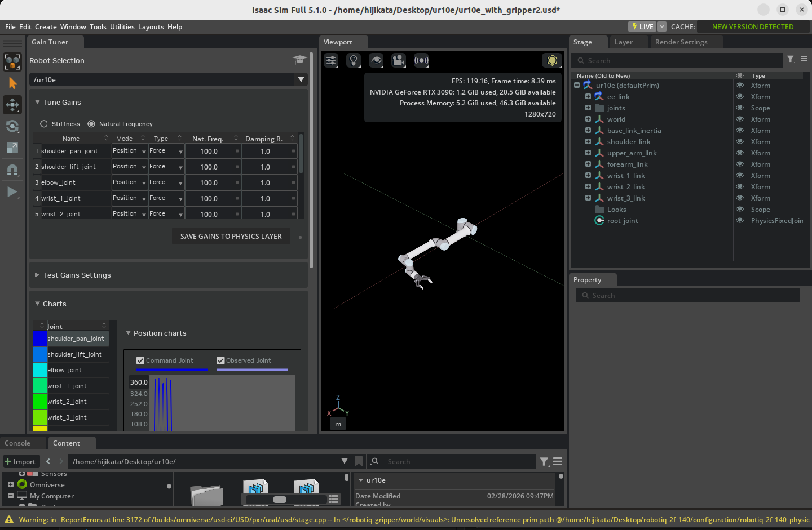
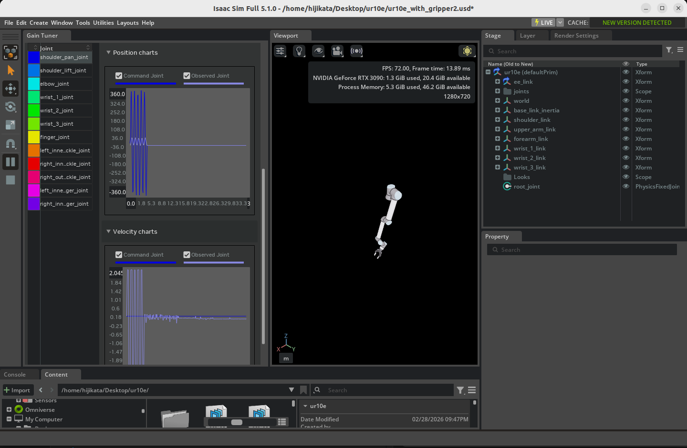

# ジョイントドライブゲインの調整

## 学習目標

このチュートリアルを修了すると、以下の内容を習得できます：

- **Gain Tuner エクステンション**の起動方法と UI の使い方
- **ポジションドライブ**（位置制御）のゲイン調整手順
- **産業用ロボット**を想定した速度制限の設定方法
- **ベロシティドライブ**（速度制御）のゲイン調整手順
- 調整したゲインをアセット（USD ファイル）に保存する方法
- 調整結果のプロットによる可視化と評価方法

## はじめに

### 前提条件

- [チュートリアル 7: マニピュレータの設定](07_configure_manipulator.md) を完了していること
- ロボットアセットに以下の 2 つが適用されていること（**URDF からインポートしたロボットでは両方とも自動的に適用されます**）：
    - **Robot Schema**（Robot API）：Gain Tuner がロボットを認識するために必須
    - **アーティキュレーションルート（Articulation Root）**：物理的にアーティキュレーションとして駆動するために必須

!!! note "Gain Tuner と Robot Schema の関係"
    Isaac Sim 5.1 の Gain Tuner は、内部的に **Robot Schema**（`IsaacRobotAPI`、`IsaacLinkAPI`、`IsaacJointAPI`）を使用してロボットの構造を把握します。具体的には、Gain Tuner ウィンドウの **Select Robot** ドロップダウンには **Robot API が適用されたプリムだけ**が表示される実装になっています。そのため Robot Schema が適用されていないアセットは、たとえアーティキュレーションが有効でも Gain Tuner からは見えません。

    [チュートリアル 6](06_setup_manipulator.md) で URDF からロボットをインポートする際、URDF インポーターが Robot Schema を**自動的に**適用します。したがって、URDF 経由でインポートしたロボットを使い続けている限り、追加の操作は不要です。

    [チュートリアル 5](05_rig_mobile_robot.md) のように手動リギングしたロボットや、URDF を経由していない既存の USD アセットを使う場合は、別途 Robot Schema を適用する必要があります。手順は[チュートリアル 5a: Robot Schema の適用](05a_apply_robot_schema.md) を参照してください。

### 所要時間

約 15〜20 分

### 概要

ロボットを Isaac Sim 上で正しく動かすためには、各ジョイントの**ドライブゲイン**（PD 制御のパラメータ）を適切に調整する必要があります。ゲインが小さすぎるとロボットが目標位置に追従できず、大きすぎると振動したり不安定になったりします。

[チュートリアル 7](07_configure_manipulator.md) では、**Natural Frequency（固有振動数）** と **Damping Ratio（減衰比）** という抽象化されたパラメータで Gain Tuner の基本的な使い方を学びました。本チュートリアルでは、より直接的な **Stiffness / Damping** の調整手順と、産業用ロボットで重要となる**速度制限**、**ベロシティドライブ**の調整、調整結果の**保存と可視化**まで踏み込んで学びます。具体的には以下の流れで進めます：

1. **Gain Tuner の起動** — エクステンションを開いてロボットを読み込む
2. **ポジションドライブの調整** — Stiffness（剛性）と Damping（ダンピング）の調整
3. **速度制限の設定** — 産業用ロボットを想定した速度上限の組み込み
4. **ベロシティドライブの調整** — 速度制御モードでの Damping 調整
5. **ゲインの保存** — 調整結果をアセットの物理レイヤーに書き戻す
6. **結果の可視化** — 指令値と計測値のプロットで挙動を評価

!!! note "ジョイントドライブとは"
    Isaac Sim のジョイントドライブは、各ジョイントに組み込まれた**仮想モーター**のようなものです。目標値（位置または速度）を与えると、内部の **PD 制御**（比例・微分制御）が目標との差を計算してトルクを発生させ、ジョイントを駆動します。

    PD 制御では 2 つのパラメータが重要になります：

    - **Stiffness（剛性、P ゲイン）**: 目標位置に引き戻す**ばね**の強さ。大きいほど素早く目標に到達するが、大きすぎると行き過ぎ（オーバーシュート）や振動が発生する。
    - **Damping（ダンピング、D ゲイン）**: 速度に応じて運動を抑える**摩擦**の強さ。振動を抑える役割を果たすが、大きすぎると応答が鈍くなる。

    良いゲインとは、「目標値に素早く到達し、振動せず、行き過ぎが小さい」状態を実現する組み合わせです。

!!! note "ポジションドライブとベロシティドライブ"
    Isaac Sim のジョイントドライブには 2 つのモードがあります：

    | モード | 制御目標 | 主に使うパラメータ | 用途 |
    |---|---|---|---|
    | **ポジションドライブ** | 目標位置 | Stiffness + Damping | マニピュレータの軌道追従、姿勢保持 |
    | **ベロシティドライブ** | 目標速度 | Damping のみ（Stiffness=0） | グリッパーの把持、車輪の回転 |

    どちらのモードを使うべきかは、対象ジョイントの役割で決まります。本チュートリアルでは両方の調整方法を扱います。

## ステップ 1：Gain Tuner エクステンションの起動

### 1-1. ロボットアセットを開く

調整したいロボット（例：チュートリアル 7 で設定した UR10e）を Isaac Sim で開きます。

!!! warning "Robot Schema とアーティキュレーションが適用されていることを確認"
    URDF インポート経由のロボットであれば自動的に適用されていますが、念のため確認しておきます：

    1. Stage パネルでロボットのルートプリム（例：`/World/ur10e`）を選択
    2. Properties パネルの **Add** ボタン横の検索欄や **Raw USD Properties** で、以下が適用されているか確認：
        - **IsaacRobotAPI**（Robot Schema）：Gain Tuner のドロップダウンに表示されるための必須条件
        - **PhysicsArticulationRootAPI**（**Articulation Enabled** が有効）：物理シミュレーションのアーティキュレーションとして動作するための必須条件

    未設定の場合は[チュートリアル 6](06_setup_manipulator.md) の URDF インポートからやり直すか、[チュートリアル 7 のステップ 1](07_configure_manipulator.md) を参照してアーティキュレーションを設定してください。

### 1-2. Gain Tuner を開く

メニューから次の順にクリックして Gain Tuner ウィンドウを開きます：

**Tools > Robotics > Asset Editors > Gain Tuner**

ウィンドウ上部の **Select Robot** ドロップダウンから、調整したいロボットを選択します。Robot Schema が適用されたアセットが自動的に候補に表示されます。

選択すると、左側のジョイントリストに対象ロボットの全ジョイントが一覧表示されます。

!!! tip "Gain Tuner エクステンションが見つからない場合"
    既定では有効になっていますが、メニューに表示されない場合は **Window > Extensions** を開き、`omni.isaac.gain_tuner` を検索して有効化してください。

### 1-3. UI の構成

Gain Tuner のウィンドウは、大きく 3 つの領域に分かれています：

| 領域 | 役割 |
|---|---|
| **Joint List**（左側） | ロボットの全ジョイントを一覧表示。クリックして選択するとパラメータ編集と結果表示の対象になる |
| **Parameters**（中央） | 選択中ジョイントの **Stiffness**、**Damping**、**Max Joint Velocity** などを編集 |
| **Plots**（右側／下部） | テスト実行後、指令値と計測値の比較プロットを表示 |

!!! tip "複数ジョイントの選択"
    左側の Joint List では複数選択が可能です：

    - **Ctrl + クリック**: クリックしたジョイントを選択／選択解除
    - **Shift + クリック**: 最初に選択したジョイントから現在のジョイントまでを範囲選択

    複数選択しておくと、まとめてゲインを設定したり、複数ジョイントのプロットを並べて比較したりできます。

## ステップ 2：ポジションドライブのゲイン調整

ポジションドライブは、ジョイントを目標角度（または目標位置）に近づけるよう PD 制御で駆動します。**Stiffness** と **Damping** の 2 つのパラメータをバランス良く設定するのが目的です。

### 2-1. 調整の基本方針

ゲイン調整は次の順序で進めます：

1. **Damping をゼロにする** — まずは比例項（Stiffness）のみで応答を見る
2. **Stiffness を増やしていく** — 目標位置に収束する値を見つける
3. **Stiffness を 1 桁下げる** — オーバーシュートに余裕を持たせる
4. **Damping を加える** — Stiffness より 1 桁小さい値から開始
5. **微調整する** — 安定性、応答速度、オーバーシュートを見ながら値を詰める

!!! note "なぜこの順序なのか"
    Damping を入れたまま Stiffness を調整すると、振動が抑えられているのか、本当に応答が良いのか判別しにくくなります。**まず Stiffness 単独で「ぎりぎり収束する」点を探し**、そこから 1 桁下げて余裕を作ったうえで Damping を加えるのが、安全に追い込むコツです。

### 2-2. Damping をゼロに設定

1. 左側の Joint List で調整するジョイントを選択（複数選択可）
2. 中央の **Damping** フィールドに `0` を入力
3. **Stiffness** を初期値（例：`100`）に設定

### 2-3. Stiffness を段階的に増やす

シミュレーションを実行（タイムラインの **Play** をクリック）し、ジョイントが目標位置に収束するかを観察します。

- 収束しなければ **Stiffness を 10 倍**にして再実行（例：100 → 1,000 → 10,000）
- 目標位置付近で振動・暴走するようであれば、その値が上限の目安

目標値付近に**おおよそ収束する**ところまで Stiffness を上げたら、その値から **1 桁（約 1/10）下げ**て、安定に余裕を持たせます。

### 2-4. Damping を加える

Stiffness が決まったら、その値の **約 1/10** を初期値として **Damping** に入力します。

例：Stiffness = 1,000 の場合、Damping = 100 から開始

再度シミュレーションを実行し、以下のポイントで評価します：

| 観点 | 良い状態 | 悪い状態と対処 |
|---|---|---|
| **収束速度** | 短時間で目標値に到達 | 遅すぎる場合は Stiffness を上げる |
| **オーバーシュート** | 目標値の **1% 以内**を理想とする | 大きい場合は Damping を上げる |
| **振動** | 振動なく単調に収束 | 振動する場合は Damping を上げる |
| **応答の鈍さ** | 過剰な減衰でない | 鈍い場合は Damping を下げる |

!!! tip "推奨される性能目標"
    Isaac Sim の公式ガイドでは、**目標値からの誤差（オーバーシュート含む）を 1% 以内に収める**ことを推奨しています。シビアな精度が求められない用途であれば、もう少し緩い基準でも実用上問題ありません。

### 2-5. 重力補償が組み込まれているロボットの場合

UR10e や Franka など、コントローラ側で**重力補償**を行うことを前提に設計されたロボットでは、Isaac Sim 内でも重力の影響をジョイントが負わないように設定するのが一般的です。

1. 各リンク（Rigid Body）を Stage パネルで選択
2. Properties パネルの **Physics > Rigid Body** セクションを開く
3. **Disable Gravity** にチェックを入れる

これにより、ジョイントドライブは重力に逆らうトルクを発生させる必要がなくなり、ゲインの調整が「位置追従の精度」に集中できます。

!!! note "重力をオンにしたまま調整する場合"
    重力補償を行わない場合は、ジョイントが重力に負けないだけの Stiffness が必要になります。リンクの質量や姿勢に依存するため、**最も重力負荷がかかる姿勢**（例：水平に伸ばした腕の根本）でテストすると安全側のゲインが得られます。

### 2-6. ジョイントごとのグルーピング戦略

ヒューマノイドロボットのように**腕と脚が独立して動く**機体では、すべてのジョイントを同時に動かしてゲイン調整するのは大変です。**機能ごとにジョイントをグループ化**して個別に調整したうえで、最後に全体テストを行うのが効率的です。

例：ヒューマノイドの場合
- グループ 1：右腕の 7 ジョイント
- グループ 2：左腕の 7 ジョイント
- グループ 3：両脚（同期させて歩行する）
- 最後：全ジョイントを動かして相互干渉を確認

## ステップ 3：速度制限と産業用ロボット

産業用ロボット（UR、ABB、KUKA など）の多くは、メーカー側で**事前に PD 制御がチューニングされており**、加えて**ジョイントごとの速度上限**が設けられています。Isaac Sim でこれを再現するには、ゲインに加えて**最大ジョイント速度**を設定します。

### 3-1. Stiffness を強めにする

産業用ロボットを再現する場合、ステップ 2 で得た Stiffness を**約 2 倍**に強化します。これにより、目標位置への追従が速度上限まで素早くフルスピードで近づくようになります。

例：通常時 Stiffness = 1,000 → 産業用想定 Stiffness = 2,000

### 3-2. 最大ジョイント速度の設定

各ジョイントに速度上限を設定します：

1. Stage パネルで対象のジョイントを選択
2. Properties パネルで **Joint > Advanced** セクションを展開
3. **Maximum Joint Velocity** に各ジョイントの最大速度（rad/s または deg/s）を入力

メーカーのデータシートに記載された各軸の最大角速度を参考にしてください。

!!! tip "シミュレーション中のデフォルト値は大きすぎる傾向がある"
    USD のデフォルト値は実用範囲を大きく超えていることが多いため、**実機の運用上限**に合わせて下げることを推奨します。これは安全性とシミュレーション安定性の両方に効きます。

### 3-3. 速度上限の確認

シミュレーションを実行し、Gain Tuner のプロットで**ジョイント速度が指定した上限を超えていないか**確認します。超えてしまう場合は Stiffness を下げ、上限に届かない場合は Stiffness を上げて、目標速度に**ぎりぎり到達できる**ように微調整します。

## ステップ 4：ベロシティドライブのゲイン調整

ベロシティドライブは、ジョイントを目標**速度**に追従させる制御モードです。グリッパーの把持や車輪の回転制御で使われます（[チュートリアル 10: 閉ループ構造のリギング](10_closed_loop_structures.md) でも使用しました）。

### 4-1. Stiffness をゼロに設定

ベロシティドライブでは位置目標を無視し、速度目標のみを使用します：

1. 対象ジョイントを Joint List で選択
2. **Stiffness** に `0` を入力
3. **Damping** を初期値（例：`100`）に設定

!!! note "Stiffness=0 が「速度制御」を意味する理由"
    Isaac Sim のジョイントドライブは内部的には常に PD 制御として動きますが、**Stiffness を 0 にすると比例項（位置誤差）が消え、Damping のみで駆動トルクが決まります**。Damping は速度誤差に応じてトルクを発生させるため、結果として目標速度に追従する制御になります。

### 4-2. Damping を段階的に増やす

シミュレーションを実行し、ジョイントが目標速度に到達するまで Damping を上げていきます：

1. 目標速度（**Target Velocity**）を設定
2. シミュレーション実行
3. プロットで実速度が目標速度に到達するまで **Damping を 10 倍ずつ増やす**
4. 目標速度にほぼ到達するところで停止

### 4-3. ペイロード変動への対応

把持物や搬送物などで**負荷が変動**することが想定される場合、Damping を**約 10% 増し**に設定すると、負荷時にも目標速度を維持しやすくなります。

例：無負荷で Damping = 5,000 → 負荷想定で Damping = 5,500

### 4-4. 出力上限の設定

ベロシティドライブでは、**Maximum Joint Velocity** または **Maximum Joint Force** で出力を制限できます：

| 制限項目 | 設定場所 | 効果 |
|---|---|---|
| **Maximum Joint Velocity** | Joint > Advanced | 速度の上限 |
| **Maximum Joint Force** | Drive > Max Force | 駆動力の上限 |

把持動作では、**Max Force** を絞ることで把持物に過大な力をかけずに済みます（[チュートリアル 10](10_closed_loop_structures.md) のステップ 5-6 を参照）。

## ステップ 5：ゲインのアセットへの保存

調整したゲインを USD ファイルに保存して、次回以降の起動時にも反映されるようにします。

### 5-1. Save Gains to Physics Layer

Gain Tuner ウィンドウの **Save Gains to Physics Layer** ボタンをクリックします。

このボタンは、ロボットアセットの推奨構造（[アセット構造ガイドライン](https://docs.isaacsim.omniverse.nvidia.com/5.1.0/robot_setup/asset_structure.html)）に従って、**物理設定を記録するレイヤー**を自動的に検出し、そのレイヤーに新しいゲインを書き込みます。

!!! note "なぜ専用レイヤーに保存するのか"
    Isaac Sim のロボットアセットは、メッシュ・物理・センサーといった**役割ごとに USD レイヤーが分かれている**ことが推奨されています（[チュートリアル 10](10_closed_loop_structures.md) のレイヤー編集ワークフローを参照）。物理パラメータを物理レイヤーに集約しておくことで、メッシュ更新時にもゲイン調整を失わずに済みます。

### 5-2. 保存できない／したくない場合

書き込み権限がない、あるいは元のロボットアセットを変更したくない場合は、ゲインの変更を**別のシーンファイル**にオーバーライドとして記録します。**`File > Save As`** で新しいファイル名（例：`my_robot_with_tuned_gains.usd`）として保存するのが、最も明示的で安全な方法です。これにより：

- 元のロボット USD ファイルは一切変更されない
- 新しく作ったファイルがロボットアセットを参照／サブレイヤーとして取り込み、その上にゲインのオーバーライドが書き込まれる
- そのファイルを開けば調整済みのゲインが反映され、元アセットを開けば調整前の状態に戻る

!!! warning "`File > Save` は Root Layer を上書きする"
    `File > Save` は現在開いているステージの **Root Layer をそのまま上書き**します。そのため、**ロボット本体の USD ファイルを直接開いた状態で `File > Save` をすると、書き込み権限がある場合は元のロボットを上書きしてしまいます**。

    「ローカルオーバーライドにしたい」つもりで `Save` を使うのは危険です。ロボット本体を変更したくない場合は、必ず **`Save As`** で別ファイルとして保存するか、最初からロボットを参照（Reference／Payload）した自前のシーンファイルを開いて作業してください。

!!! tip "どちらの保存先にすべきか"
    | 状況 | 推奨される保存方法 |
    |---|---|
    | 元アセットの一部としてゲインを永続化したい | **Save Gains to Physics Layer**（5-1） |
    | 元アセットを変更せず、自分の用途用のバリアントを作りたい | **File > Save As** で別ファイル化 |
    | すでにロボットを参照する自前のシーンを開いている | **File > Save**（変更はシーンファイルにのみ書き込まれる） |

## ステップ 6：結果の可視化

### 6-1. プロットの読み方

Gain Tuner のプロット領域には、テスト実行後に以下が表示されます：

| 表示要素 | 意味 |
|---|---|
| **濃い色のライン** | 指令値（Commanded Position / Commanded Velocity） |
| **薄い色（フェード）のライン** | 計測値（実際のジョイント位置・速度） |
| **色分け** | ジョイントごとに別の色で表示 |

理想的な調整状態では、薄い線（計測値）が濃い線（指令値）に**遅延なくぴったり重なる**形になります。

### 6-2. プロットからの読み取りポイント

| プロットの形 | 状態 | 対処 |
|---|---|---|
| 計測値が指令値の到達前に振動 | Stiffness が高すぎる | Stiffness を下げるか Damping を上げる |
| 計測値が指令値に追いつかない | Stiffness が低すぎる | Stiffness を上げる |
| 目標値を行き過ぎて戻る | オーバーシュート（Damping 不足） | Damping を上げる |
| 応答が滑らかだが遅い | Damping 過多 | Damping を下げる |
| 目標速度の上限で頭打ちになる | Maximum Joint Velocity による制限（産業用想定では正常） | 必要に応じて上限を見直す |

### 6-3. ジョイント単位の評価

左側の Joint List で個別のジョイントをクリックすると、そのジョイントのプロットだけを大きく表示できます。複数選択した状態（Ctrl/Shift クリック）で複数プロットを並べて比較することもできます。

!!! tip "テスト結果はテスト完了後にのみ表示される"
    シミュレーション実行中はリアルタイムにプロットが更新されないことがあります。**シミュレーションを停止した後**にプロットを確認してください。

## トラブルシューティング

| 症状 | 原因 | 解決方法 |
|---|---|---|
| Gain Tuner のドロップダウンにロボットが表示されない | **Robot Schema（IsaacRobotAPI）** が適用されていない | URDF からインポートしていれば自動適用されるはず。手動アセットの場合は Robot Schema を適用するか、URDF 経由でインポートし直す |
| Gain Tuner で選択後、ジョイントが取得できない／エラーが出る | アーティキュレーションが未設定 | ルートジョイントに **Articulation Root API** が適用され、**Articulation Enabled** がオンになっているか確認（[チュートリアル 7 のステップ 1](07_configure_manipulator.md) 参照） |
| ジョイントが目標位置に収束しない | Stiffness が小さすぎる／重力補償未設定 | Stiffness を 10 倍に増やす、または Disable Gravity を有効化 |
| シミュレーション開始直後に発散する | Stiffness が大きすぎる | Stiffness を 1/10 に下げる |
| 細かく振動する | Damping 不足 | Damping を 2〜10 倍に増やす |
| 応答が鈍い／追従が遅い | Damping 過多 | Damping を 1/2 に下げる |
| 産業用ロボットの最大速度を超えてしまう | Maximum Joint Velocity 未設定 | Joint > Advanced で各軸に設定 |
| `Stiffness attribute is unsupported for articulation joints` 警告 | ジョイント自体の Stiffness 属性に値を設定 | 該当ジョイントの **Drive 側** の Stiffness を使用（[チュートリアル 10](10_closed_loop_structures.md) のステップ 5-3 参照） |
| 保存しても次回起動時にゲインが戻る | 物理レイヤーへの書き込み失敗 | レイヤーの書き込み権限を確認、またはステージとして手動保存 |

## まとめ

このチュートリアルでは以下のトピックを扱いました：

1. **Gain Tuner エクステンション** の起動と UI 構成（Joint List / Parameters / Plots）
2. **ポジションドライブの調整手順**（Damping=0 から始め、Stiffness で収束点を探し、Damping で振動を抑える）
3. **産業用ロボットの再現**（Stiffness の強化と Maximum Joint Velocity による速度制限）
4. **ベロシティドライブの調整手順**（Stiffness=0、Damping のみで速度追従）
5. **ゲインのアセットへの保存**（Save Gains to Physics Layer による物理レイヤーへの書き込み）
6. **プロットによる結果の可視化と評価**（指令値と計測値の比較）

これらの調整により、ロボットが安定かつ応答性良く動作するようになり、上位の制御アルゴリズムが期待通りに振る舞う土台が整います。

!!! tip "より深く学ぶには"
    Gain Tuner の数学的背景や PD 制御の理論については、Isaac Sim 公式ドキュメントの [Gain Tuner Extension](https://docs.isaacsim.omniverse.nvidia.com/5.1.0/robot_setup/ext_isaacsim_robot_setup_gain_tuner.html) を参照してください。また、トルク指令を直接書き込むカスタムコントローラを実装したい場合は、公式の "Adding a Controller" チュートリアルが参考になります。

## 次のステップ

次のチュートリアル「[アセット最適化](12_asset_optimization.md)」に進み、ロボットアセットのパフォーマンス最適化手法を学びましょう。
