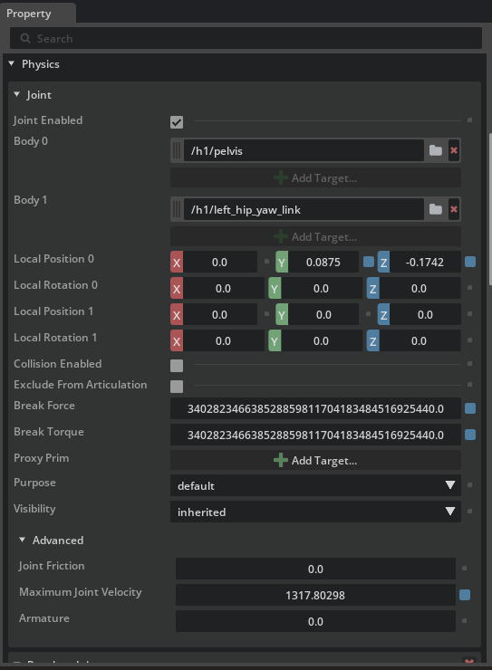

# 脚ロボットのリギング

## 学習目標

このチュートリアルを修了すると、以下の内容を習得できます：

- **ロコモーションポリシー**（歩行・走行を制御する強化学習ポリシー）の仕様に合わせた**初期姿勢**の設定方法
- **Joint State API** と **Angular Drive API** の追加とジョイント駆動の準備
- ジョイント設定（**スティフネス**、**ダンピング**、**力制限**、**アーマチュア**、**最大速度**）の意味と設定方法
- **ラジアンと度の単位変換**を意識した USD 値の入力
- Python の**検証スクリプト**でジョイントプロパティを一括チェックする方法

## はじめに

### 前提条件

- [チュートリアル 3: 基本ロボットのアーティキュレーション](03_articulate_robot.md) を完了していること
- できれば [チュートリアル 11: ジョイントドライブゲインの調整](11_joint_tuning.md) を一読しておくこと（スティフネス／ダンピングの基本概念が登場するため）

### 使用するアセット

このチュートリアルでは、Isaac Sim に同梱されている **Unitree H1** ヒューマノイドのサンプルアセットを使用します：

| ファイル | 用途 |
|---|---|
| `Isaac/Robots/Unitree/H1/h1.usd` | リギング前の H1（**作業用にローカルへコピーして使用**） |
| `Isaac/Samples/Rigging/H1/h1_rigged.usd` | リギング済みの参考アセット（**完成形の確認用**） |

サンプル領域は書き込み禁止のため、`h1.usd` を作業用フォルダにコピーしてから開いてください。途中で詰まった場合は、参考アセット `h1_rigged.usd` を開いて期待される設定値と見比べると効率よく確認できます。

### 所要時間

約 20〜30 分

### 概要

脚ロボット（脚式移動ロボット）は、車輪ロボットと違って**接地状態が常に変わる**ため、強化学習で得られた**ロコモーションポリシー**（歩行・走行を制御するニューラルネットワーク）で制御するのが一般的です。ポリシーは「ある初期姿勢」と「あるジョイント特性」を前提に学習されているため、**シミュレータ側の設定がポリシー仕様と一致していないと、まともに歩けません**。

このチュートリアルでは、Unitree の **H1 ヒューマノイドロボット**を題材に、ロコモーションポリシーの仕様に合わせて脚ロボットをリギングする手順を学びます。具体的には次の流れで進めます：

1. **初期姿勢の設定** — ポリシーが期待する関節角度に合わせる
2. **ジョイント設定の構成** — スティフネス・ダンピング・力制限などポリシー仕様の数値を入力
3. **検証スクリプトでの確認** — Python から実際の USD プロパティを読み出して値を確認

!!! note "ロコモーションポリシーとは"
    脚ロボットの歩行は、**「各ジョイントを次の瞬間にどれだけ動かすか」**を毎フレーム決める高速な制御問題です。事前に手で設計するのは難しいため、Isaac Lab などの強化学習環境で**ポリシー（方策）**として学習されることが一般的です。学習時には「ロボットの初期立ち姿勢」「PD ゲイン」「力制限」などが**シミュレータ設定として固定**されており、推論時にもこれらが一致していることが暗黙の前提になります。

!!! note "ラジアンと度の単位の食い違い"
    強化学習側の設定ファイル（Isaac Lab の `env_cfg`）では、ジョイント角度・角速度・ゲインは**ラジアン基準**で記述されます。一方、USD のジョイントプロパティは**度（degree）基準**です。リギング時はこの単位変換が**最大の落とし穴**なので、本チュートリアル中でも繰り返し言及します。

    | 量 | ラジアン → 度の変換 |
    |---|---|
    | 角度（target position） | ×180/π |
    | 角速度（max velocity） | ×180/π |
    | スティフネス（stiffness） | ×π/180 |
    | ダンピング（damping） | ×π/180 |

    なぜスティフネスとダンピングだけ逆向きの変換になるのかは、ステップ 2 のコラムで説明します。

## ステップ 1：初期姿勢の設定

H1 のロコモーションポリシーは、**膝を軽く曲げ、股関節を少し前傾させた姿勢**を初期状態として学習されています。まずはこの姿勢に合わせて各ジョイントの目標位置を設定します。

### 1-1. アセットを開く

1. 任意の作業用フォルダを作成し、`Isaac/Robots/Unitree/H1/h1.usd` を**ローカルにコピー**します。
2. **File > Open** からコピーした `h1.usd` を開きます。
3. ビューポート上で、両腕を前方に伸ばした「前倣え」のような姿勢で立った H1 が表示されることを確認します（ロコモーション学習前のデフォルト姿勢のため、まだ各関節は目標位置に駆動されていません）。

!!! tip "サンプルアセットを直接開かない"
    サンプル領域は書き込み禁止のため、直接開いて編集すると保存できません。必ず作業用フォルダにコピーしてから作業を始めてください。

### 1-2. ジョイントだけを抽出する

H1 にはリンク・ジョイント・メッシュなど多数のプリムが含まれています。ジョイントだけに絞り込んで一括選択しやすくしましょう：

1. **Stage** パネル右上の **じょうご（Filter）アイコン**をクリック
2. メニューから **Type Filters > Physics Joints** を選択

これで Stage パネルにはジョイント（`PhysicsRevoluteJoint` など）のみが表示されます。

### 1-3. すべてのジョイントを選択して API を追加

1. 一覧の先頭のジョイント（例：`left_hip_yaw`）をクリック
2. 一覧の末尾のジョイント（例：`right_elbow`）を **Shift + クリック**して、間のすべてのジョイントを選択
3. 選択したまま右クリック > **Add > Physics > Joint State Angular** を選択
4. 続けて右クリック > **Add > Physics > Angular Drive** を選択

   

これにより、すべてのジョイントに次の 2 つの API が適用されます：

| API | 役割 |
|---|---|
| **Joint State Angular API** | ジョイントの**現在位置と速度**を読み出すためのインターフェイス。ポリシーへの観測値供給に使う |
| **Angular Drive API** | ジョイントを**目標位置・目標速度に向けて駆動**するための PD コントローラを有効化 |

!!! note "Joint State API は何のためにあるのか"
    USD のジョイントは「物理的な接続」を表しているだけで、それ単体では「現在この関節は何度ですか？」を外から読み取る標準的な経路がありません。**Joint State Angular API** を適用すると、`state:angular:physics:position`（位置）と `state:angular:physics:velocity`（速度）という属性が公開され、Python やポリシーから観測値として参照できるようになります。脚ロボットのポリシーは関節状態を観測して次の動作を決めるため、この API は必須です。

### 1-4. 各ジョイントの目標位置を入力する

H1 のロコモーションポリシーが期待する**初期姿勢**は次の通りです（ラジアン基準）：

| ジョイント名（パターン） | 目標位置 [rad] | 目標位置 [deg] |
|---|---|---|
| `*_hip_yaw` | 0.0 | 0.0 |
| `*_hip_roll` | 0.0 | 0.0 |
| `*_hip_pitch` | **-0.28** | **約 -16.04** |
| `*_knee` | **0.79** | **約 45.26** |
| `*_ankle` | **-0.52** | **約 -29.79** |
| `torso` | 0.0 | 0.0 |
| `*_shoulder_pitch` | **0.28** | **約 16.04** |
| `*_shoulder_roll` | 0.0 | 0.0 |
| `*_shoulder_yaw` | 0.0 | 0.0 |
| `*_elbow` | **0.52** | **約 29.79** |

`*` は左右両側（`left_` / `right_`）を意味します。すべての**目標速度**は **0.0** です。

設定手順：

1. Stage パネルで設定したいジョイントを 1 つ選択（例：`left_hip_pitch`）
2. **Properties** パネルで **Angular Drive** セクションを開く
3. **Target Position** に**度に変換した値**を入力（例：`-0.28 × 180/π ≈ -16.04`）
4. **Target Velocity** に **0.0** を入力
5. すべてのジョイントについて同様に繰り返す

!!! warning "USD は度、ポリシー設定はラジアン"
    Isaac Lab の `env_cfg.scene.robot.init_state.joint_pos` などはラジアンで書かれていますが、USD の Drive API は度を期待します。**`× 180 / π`** を必ず通して入力してください。Python の電卓モードでも構いません：

    ```python
    >>> import math
    >>> -0.28 * 180 / math.pi
    -16.040706...
    ```

!!! tip "左右対称ジョイントはまとめて選択して入力"
    `left_hip_pitch` と `right_hip_pitch` のように同じ値を入れるジョイントは、**Ctrl + クリック**でまとめて選択してから Properties パネルで値を入力すると、複数ジョイントに同時反映されて作業が早くなります。

### 1-5. シミュレーションリセット時に値を保持する設定

Isaac Sim は既定で「Stop ボタンを押すと初期状態にリセット」されますが、リセット時に Drive API のターゲット値もリセットされてしまうことがあります。これを防ぎます：

1. **Edit > Preferences** を開く
2. 左ペインから **Physics** を選択
3. **Reset Simulation on Stop** のチェックを**外す**

これで、シミュレーションを停止しても入力した目標位置がそのまま保持されます。

### 1-6. 初期姿勢の確認 — Fixed Joint で落下を防ぐ

このまま Play すると、H1 は**重力でその場に崩れ落ちます**（まだ空中に固定されていないため）。初期姿勢を目視確認するために、一時的に **Fixed Joint** で胴体をワールドに固定します：

1. Stage パネルで `/h1/torso_link` を右クリック
2. **Create > Physics > Joint > Fixed Joint** を選択
3. ビューポートで **Play** ボタンを押す

   

ロボットがまっすぐ立った状態で、設定した目標位置（軽く膝を曲げた構え）に各ジョイントが収束していくのが見えれば成功です。

確認が終わったら：

4. **Stop** を押す
5. 作成した Fixed Joint を**削除**（リギング後の本番では不要です）
6. **Ctrl + S** で保存
7. （任意）**Edit > Preferences > Physics > Reset Simulation on Stop** のチェックを**戻して**おく

!!! note "なぜわざわざ Fixed Joint を作るのか"
    H1 の足裏はまだ正しい接地条件・摩擦設定が入っていない状態です。そのまま Play すると倒れたり滑ったりして「ターゲット姿勢に収束したか」が判定できません。Fixed Joint で胴体を空中に固定することで、**ジョイント駆動だけの動作**を切り出して目視確認できます。

## ステップ 2：ジョイント設定の構成

ポリシーが学習時に前提としていた**ジョイントの動的特性**（PD ゲイン、トルク・速度の上限、アーマチュア、摩擦）をシミュレータに反映します。これらが大きくズレるとポリシーは破綻します。

### 2-1. H1 のアクチュエータ仕様

Isaac Lab の H1 設定（`scene.robot.actuators`）から、本チュートリアルで使う代表的な値は次の通りです（USDに入力するのはdegなので、次節での説明に従って変換して入力してください）：

**脚＋胴体（legs グループ）**

| ジョイント | スティフネス [rad] | ダンピング [rad] |
|---|---|---|
| `*_hip_yaw` | 150.0 | 5.0 |
| `*_hip_roll` | 150.0 | 5.0 |
| `*_hip_pitch` | 200.0 | 5.0 |
| `*_knee` | 200.0 | 5.0 |
| `torso` | 200.0 | 5.0 |

- **力制限（Effort Limit）**：300 N·m
- **速度制限（Velocity Limit）**：100.0 rad/s

**腕（arms グループ）**

| ジョイント | スティフネス [rad] | ダンピング [rad] |
|---|---|---|
| `*_shoulder_pitch` | 40.0 | 10.0 |
| `*_shoulder_roll` | 40.0 | 10.0 |
| `*_shoulder_yaw` | 40.0 | 10.0 |
| `*_elbow` | 40.0 | 10.0 |

腕の力・速度制限は脚と区別されている場合が多いので、お使いのポリシーの設定ファイルで実際の数値を確認してください。

### 2-2. 単位変換のポイント

USD のスティフネス・ダンピングは「**1 度ずれたときに発生するトルク／1 deg/s ずれたときに発生するトルク**」、つまり**度ベース**で定義されています。一方、Isaac Lab はラジアンベースで記述されているため、次の式で変換します：

| 量 | ポリシー値 [rad] | USD に入力する値 [deg] |
|---|---|---|
| **Stiffness** | `S_rad` | `S_rad × π/180` |
| **Damping** | `D_rad` | `D_rad × π/180` |
| **Max Joint Velocity** | `ω_rad` [rad/s] | `ω_rad × 180/π` [deg/s] |
| **Effort Limit** | そのまま [N·m] | そのまま [N·m] |

!!! note "なぜスティフネスは π/180 を掛けるのか"
    PD 制御のトルクは τ = K × Δθ で表されます。**Δθ の単位を度にしたとき、ラジアン基準と同じトルクを出す K** はラジアン基準のものより小さくする必要があります（角度 1 rad ≈ 57.3°）。具体的には、`S [N·m/rad] × 1 [rad] = S × (π/180) [N·m/deg] × 1 [deg]` という対応になり、結果として **`S_deg = S_rad × π/180`** になります。ダンピングも同じ理由で `× π/180` です。逆に**速度の単位を度に増やす**ときは値が大きくなるので `× 180/π` になります。

例として：

- `Hip pitch` のスティフネス：`200.0 × π/180 ≈ 3.4907`
- `Hip pitch` のダンピング：`5.0 × π/180 ≈ 0.0873`
- 最大ジョイント速度：`100.0 × 180/π ≈ 5729.578`

### 2-3. プロパティの入力

各ジョイントについて、Properties パネルで次の値を入力します：

1. Stage で対象のジョイント（または同じグループのジョイント群）を選択
2. **Angular Drive** セクション：
    - **Stiffness** に `S_rad × π/180` の値
    - **Damping** に `D_rad × π/180` の値
    - **Max Force** に力制限（300 N·m など）
3. **Joint** セクション：
    - **Maximum Joint Velocity** に `ω_rad × 180/π` の値（例：5729.578）

   

### 2-4. アーマチュアと摩擦の設定（Raw USD Properties）

**アーマチュア（armature）** はモーターのロータ慣性を表すパラメータで、シミュレーション安定性のために**実機の換算慣性を加える**役割があります。**ジョイント摩擦（joint friction）** は名前の通り、関節摺動の摩擦トルクです。これらは Properties パネルの通常表示に出ないことがあるので、**Raw USD Properties** から直接入力します：

1. 対象ジョイントを選択
2. Properties の **Physics** の **Joint** セクションにある **Advanced** を展開する
3. **`Armature`** にポリシー設定値（H1 の場合は **0.0** または未設定）
4. **`Joint Friction`** にポリシー設定値（H1 の場合は **0.0** または未設定）



!!! tip "H1 はアーマチュア・摩擦ともに 0"
    Isaac Lab の標準 H1 設定ではアーマチュアと摩擦はいずれも 0（未設定相当）です。値を入れない場合でも `dof_properties` の出力にはデフォルト値が含まれます（次のステップで確認）。実機ロボットを扱う場合は、データシートやアクチュエータ仕様書から正確な値を取得してください。

### 2-5. 保存

すべての値を入力したら **Ctrl + S** で保存します。

## ステップ 3：ジョイント設定の検証

GUI で値を 1 つずつ確認するのは大変なので、**Python スクリプト**で全ジョイントのプロパティを一括で読み出して仕様と突き合わせます。

### 3-1. Script Editor を開く

1. メニューから **Window > Script Editor** を選択
2. 下部のエディタ領域に次のスクリプトを貼り付けます：

```python
from isaacsim.core.prims import SingleArticulation

prim_path = "/h1"
prim = SingleArticulation(prim_path=prim_path, name="h1")
print(prim.dof_names)
print(prim.dof_properties)
```

### 3-2. 実行と出力の読み方

3. シミュレーションを **Play** で開始します（`SingleArticulation` は物理初期化後でないと内部値を読めないため）
4. Script Editor の **Run** ボタン（または Ctrl + Enter）でスクリプトを実行
5. 下部のコンソールに次の 2 種類の出力が現れます：

   

- **`dof_names`**：自由度（DOF）に対応するジョイント名の一覧
- **`dof_properties`**：各 DOF のプロパティをまとめた配列。1 行が 1 ジョイントに対応し、各列はおおむね次の意味です：

    `(type, hasLimits, lower, upper, drive_mode, maxVelocity, maxEffort, stiffness, damping)`

### 3-3. チェックリスト

出力に対して、次を順に確認してください：

- [ ] `dof_names` に H1 のすべてのジョイントが含まれる（hip / knee / ankle / torso / shoulder / elbow が左右ともに）
- [ ] **maxVelocity** が脚で `100.0`（USD の度ベースから内部的にラジアンに戻された値）
- [ ] **maxEffort** が脚で `300.0`
- [ ] **stiffness** が `hip_yaw / hip_roll = 150.0`、`hip_pitch / knee / torso = 200.0`、腕は `40.0`
- [ ] **damping** が脚で `5.0`、腕で `10.0`

!!! warning "出力はラジアン基準で表示される"
    `dof_properties` の値は**ラジアン基準**に正規化されて表示されます。USD には度ベースで入力していたとしても、ここではポリシー設定ファイル（Isaac Lab の `env_cfg`）の値とそのまま比較できるようになっています。一致しない場合は、ステップ 2-2 の単位変換が間違っていないかを最初に疑ってください。

## トラブルシューティング

| 症状 | 原因 | 解決方法 |
|---|---|---|
| Play するとロボットが崩れ落ちる | 接地・摩擦が未設定で、Fixed Joint も外れている | ステップ 1-6 のように、姿勢確認時は一時的に `torso_link` に **Fixed Joint** を作成 |
| 目標姿勢と全然違うところで止まる | スティフネス／ダンピングが小さすぎる、または単位変換ミス | ステップ 2-2 の `× π/180` を確認。指数的に値がズレやすい |
| ジョイントがブルブル振動する | スティフネスが大きすぎ、ダンピングが小さすぎ | ポリシー仕様の値を再確認。実機の数値そのままで安定するはず |
| Drive プロパティに値を入れても無視される | Joint State / Drive API がそのジョイントに適用されていない | Stage パネルで対象ジョイントを選び、**Add > Physics > Angular Drive** を再適用 |
| `SingleArticulation` の作成でエラー | シミュレーション未実行 | **Play** を押してから Script Editor を実行 |
| `dof_properties` の値がポリシー仕様と乖離 | 度⇄ラジアンの変換間違い、または別グループの値を入れている | ステップ 2-1 の表と照合し、グループごとに入力値を確認 |
| Stop でターゲット値がリセットされる | **Reset Simulation on Stop** が ON | **Edit > Preferences > Physics** で OFF（チュートリアル中だけでも） |

## まとめ

このチュートリアルでは以下のトピックを扱いました：

1. **初期姿勢の設定** — Joint State / Angular Drive API の追加と、ラジアン→度の変換を経たターゲット位置の入力
2. **Fixed Joint による姿勢確認** — リギング途中に `torso_link` を一時固定して、駆動だけの挙動を可視化
3. **ジョイント設定の構成** — スティフネス・ダンピング（`× π/180`）、Max Force（そのまま）、Max Joint Velocity（`× 180/π`）、アーマチュア・摩擦の入力
4. **検証スクリプト** — `SingleArticulation.dof_properties` で全ジョイントを一括確認

H1 は脚ロボットの代表例ですが、**「ポリシー仕様の数値を、単位変換しながら USD に転記する」**という作業の流れは、四足歩行ロボット（ANYmal、A1 など）や別のヒューマノイドでも全く同じです。今回の手順をテンプレートとして、自分のロボットや別のポリシーに合わせて値を差し替えてみてください。

!!! tip "完成形のサンプルファイル"
    `Isaac/Samples/Rigging/H1/h1_rigged.usd` がリギング済みの完成形です。値の入れ方や Raw USD Properties の状態を見比べるときに参照してください。

## 次のステップ

これでロボットセットアップチュートリアルシリーズは完了です。学習したロコモーションリギングを基に、Isaac Lab で実際にポリシーを学習させたり、実機にデプロイしたりするフェーズに進めます。お疲れさまでした！
